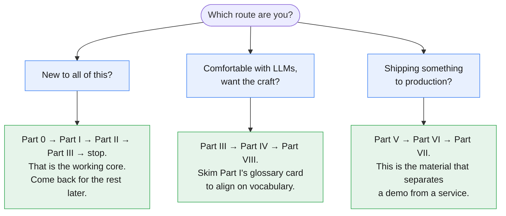

# Blueprint 1 — The Smart Intern

### A Working Knowledge Base for Prompt Engineering

*Companion chapter to "Beyond the Chatbox: The 5 Architecture Blueprints of Modern AI"
from the newsletter **The AI Agent Blueprint**.*

---

## Why this chapter exists

The parent article defined the Smart Intern in one sentence:

> Think of this as delegating a quick, isolated task to a highly capable digital intern.
> You pass in a set of instructions along with an input payload, and the AI answers or
> organizes it in one single turn.

That sentence hides the hard part.

In every other blueprint, something catches your mistakes. The Fixed Assembly Line
re-validates between stages. The Intelligent Library retrieves facts you forgot to
supply. The Autopilot Worker observes a bad outcome and loops. The Connected Boardroom
routes around a confused specialist.

The Smart Intern has none of that. One prompt in, one response out. No retry, no tool,
no memory, no second opinion.

**The prompt is the entire system.** That is not a limitation to work around — it is the
thing that makes prompt engineering a real engineering discipline rather than a bag of
tricks. Everything in this chapter follows from that single constraint.

---

## The three tasks we keep coming back to

The parent article named three jobs the Smart Intern is good at:

> **Best used for:** Instantly rewriting error messages, basic text classifications,
> or summarizing brief documents.

Rather than invent new examples, every technique in this chapter is applied to those
same three. You will see the same stack trace rewritten a dozen different ways, and by
the end you will have a strong intuition for which changes actually moved the needle.

| # | Task | Why it earns its place |
|---|---|---|
| 1 | **Error-message rewriter** | Free-form in, free-form out. Tests instruction quality. |
| 2 | **Support-ticket classifier** | Constrained output. Tests structure and determinism. |
| 3 | **Document summarizer** | Long input. Tests grounding, cost, and context handling. |

---

## How to read this

You do not have to read it in order. Three routes:

---

## Contents

### [Part 0 — Setup](./00-setup.md)

Everything you need to run one line of code, copy-pasteable.

0.1 Prerequisites · 0.2 Virtual environment · 0.3 Installing packages ·
0.4 Getting a `GEMINI_API_KEY` · 0.5 Setting the environment variable ·
0.6 The `.env` approach · 0.7 Auth keys vs Standard keys ·
0.8 `hello_gemini.py` · 0.9 Rate limits and troubleshooting

### [Part I — Vocabulary, With One Example](./01-terminology.md)

Every term defined against a single running example, with real numbers.

1.1 The worked example · 1.2 Token · 1.3 Tokenization · 1.4 Context window ·
1.5 Input vs output tokens · 1.6 Prompt, completion, turn ·
1.7 System instruction vs user content · 1.8 Temperature, top-p, top-k ·
1.9 Thinking tokens · 1.10 Latency and TTFT · 1.11 Hallucination and grounding ·
1.12 Zero-shot and few-shot · 1.13 Glossary card

### [Part II — Foundations](./02-foundations.md)

2.1 What the Smart Intern actually is · 2.2 Best used for / Avoid when, made testable ·
2.3 How Gemini reads your prompt · 2.4 The generation config knobs ·
2.5 Anatomy of a prompt

### [Part III — Core Techniques](./03-core-techniques.md)

3.1 Specificity · 3.2 Role and persona · 3.3 Few-shot ·
3.4 Structured output · 3.5 Reasoning · 3.6 Constraints

### [Part IV — Reliability](./04-reliability.md)

4.1 Grounding without retrieval · 4.2 Designing for bad input ·
4.3 Determinism and reproducibility

### [Part V — Reusable Artifacts](./05-reusable-artifacts.md)

5.1 System instructions · 5.2 Prompt files · 5.3 Skills · 5.4 Context files ·
5.5 Files API · 5.6 Caching · 5.7 Config and secrets · 5.8 Reference repo layout

### [Part VI — Production Discipline](./06-production.md)

6.1 Prompts as code · 6.2 Token cost · 6.3 Latency · 6.4 Evaluation

### [Part VII — Advanced](./07-advanced.md)

7.1 Meta-prompting · 7.2 Prompt injection · 7.3 Long context and multimodal

### [Part VIII — Practice](./08-practice.md)

8.1 Pattern library · 8.2 Anti-patterns · 8.3 Cheat sheet ·
8.4 When the Intern needs a promotion · 8.5 Exercises

---

## A note on the code

**One API, one model, one runnable sequence.** That is the whole convention.

- Every call uses the **Interactions API** — `client.interactions.create(...)`. This went
  generally available in June 2026 and is Google's recommended interface.
- Every call runs on **`gemini-3.5-flash`**, pinned once as `MODEL` in §0.10. Inline blocks
  use `model=MODEL`. The few blocks presented as standalone files (`promptkit.py`,
  `evals/judge.py`) re-declare it at the top, as a real file would.
- **Every code block is cumulatively runnable.** Run §0.10's session preamble once, then
  paste blocks in the order they appear and they will work. Nothing references a variable
  that has not already been defined above it.

If you followed earlier episodes of the newsletter, two things changed underneath us. The
parent article used `gemini-2.5-flash` with the older `generateContent` interface. Google
now labels `generateContent` legacy and steers new projects to the Interactions API, and
the Flash line has moved on two generations. Your existing code is not broken —
`generateContent` remains fully supported and `gemini-2.5-flash` is still available. But
there is no reason to learn the old shape now, so this chapter does not teach it.

Migrating is mostly mechanical: `client.models.generate_content(contents=...)` becomes
`client.interactions.create(input=...)`, `response.text` becomes
`interaction.output_text`, and settings that lived inside a config object become
top-level parameters or entries in `generation_config`. Google's
[migration guide](https://ai.google.dev/gemini-api/docs/migrate-to-interactions) has the
full mapping.

---

## Supporting files

| Path | What's in it |
|---|---|
| `examples/` | Runnable `.py` for every technique |
| `prompts/` | Externalized prompt files |
| `skills/` | An example `SKILL.md` package |
| `requirements.txt` | Pinned dependencies |
| `.env.example` | Copy to `.env`, add your key |

---

## Verification status

Every API claim in this chapter was checked against Google's live documentation on
**1 August 2026**. Where the documentation is silent or self-contradictory, the text
says so rather than guessing. Two known cases:

1. Google no longer publishes per-model free-tier RPM/RPD figures. The rate-limits page
   directs you to your own AI Studio dashboard. This chapter does the same rather than
   printing numbers that may be wrong for your account.
2. The Interactions API "supported models" table does not list `gemini-3.5-flash`, but
   Google's own quickstart and thinking guides use `gemini-3.5-flash` with that API
   throughout. The table appears stale. If a call fails with a model-not-found error,
   fall back to `gemini-2.5-flash`, which is explicitly listed.

APIs move. Re-check before you rely on anything here in production.

---

*Next in the series: Blueprint 2 — The Fixed Assembly Line.*
