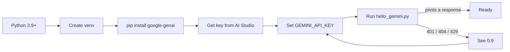
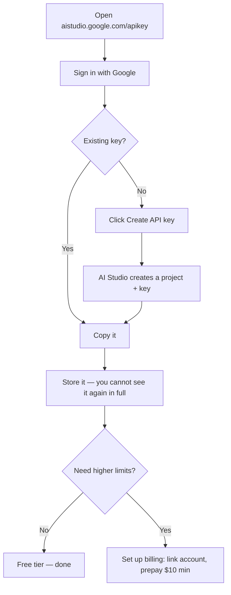

# Part 0 — Setup

*Everything here is copy-pasteable. If a command fails, §0.9 has the fix.*

Budget about ten minutes. At the end you will have run a real API call and seen a real
token count.

---

## The whole setup in one picture



Five steps. The only one that reliably goes wrong is step 5, and it is almost always the
environment variable.

---

## 0.1 Prerequisites

| Need | Version | Check with |
|---|---|---|
| Python | 3.9 or newer | `python3 --version` |
| pip | any recent | `python3 -m pip --version` |
| A Google account | — | for AI Studio |

If `python3 --version` prints 3.8 or lower, install a newer Python before continuing.
The `google-genai` SDK requires 3.9+.

> **Windows note:** use `python` instead of `python3` throughout, unless you installed
> Python from the Microsoft Store, in which case `python3` works too.

---

## 0.2 Create a virtual environment

A virtual environment keeps this project's packages separate from everything else on your
machine. Skip it and you will eventually break an unrelated project.

**macOS / Linux**

```bash
mkdir smart-intern && cd smart-intern
python3 -m venv .venv
source .venv/bin/activate
```

**Windows (PowerShell)**

```powershell
mkdir smart-intern; cd smart-intern
python -m venv .venv
.\.venv\Scripts\Activate.ps1
```

**Windows (Command Prompt)**

```cmd
mkdir smart-intern && cd smart-intern
python -m venv .venv
.venv\Scripts\activate.bat
```

Your prompt should now start with `(.venv)`. That is how you know it worked.

> **PowerShell blocks the activate script?** Run this once, then retry:
> `Set-ExecutionPolicy -ExecutionPolicy RemoteSigned -Scope CurrentUser`

To leave the environment later: `deactivate`.

---

## 0.3 Install the packages

```bash
pip install -U google-genai python-dotenv pydantic
```

That is the whole list. Three packages:

| Package | Why you need it |
|---|---|
| `google-genai` | The official Google Gen AI SDK. Everything in this chapter uses it. |
| `python-dotenv` | Loads your API key from a `.env` file so you never hardcode it. |
| `pydantic` | Defines and validates schemas for structured output (Part III). |

**Version requirement worth knowing:** the Interactions API needs `google-genai` **1.55.0
or newer**. The `-U` flag above gets you the latest. Verify:

```bash
python3 -c "import google.genai as g; print(g.__version__)"
```

If that prints something below 1.55.0, run `pip install -U google-genai` again, and check
you are inside the virtual environment.

Save the list for later:

```bash
pip freeze > requirements.txt
```

---

## 0.4 Get a `GEMINI_API_KEY`



Step by step:

1. Go to **https://aistudio.google.com/apikey**
2. Sign in with your Google account.
3. If you are new, AI Studio creates a project and a key for you automatically — just copy
   it. Otherwise click **Create API key** and follow the dialog.
4. Copy the key somewhere safe *now*. Treat it like a password.

**A key is a credential.** It is tied to a billing-capable project. Anyone who has it can
spend on your account. Never commit it, never paste it into a chat window, never put it in
a URL. §0.6 shows the safe way to store it.

If you need higher rate limits later, click **Set up billing** on the AI Studio API keys
page, link a Cloud Billing account, and prepay a minimum of $10 in credits. You do not need
this to work through the chapter.

---

## 0.5 Set the environment variable

The SDK looks for an environment variable called `GEMINI_API_KEY` and picks it up
automatically. If it is set, `genai.Client()` needs no arguments at all.

### For the current terminal session only

**macOS / Linux (bash or zsh)**

```bash
export GEMINI_API_KEY="paste-your-key-here"
```

**Windows PowerShell**

```powershell
$env:GEMINI_API_KEY = "paste-your-key-here"
```

**Windows Command Prompt**

```cmd
set GEMINI_API_KEY=paste-your-key-here
```

This lasts until you close the terminal. Good for a quick test, annoying for daily work.

### Permanently

**macOS / Linux** — append to your shell profile, then reload:

```bash
# zsh (default on macOS)
echo 'export GEMINI_API_KEY="paste-your-key-here"' >> ~/.zshrc
source ~/.zshrc

# bash
echo 'export GEMINI_API_KEY="paste-your-key-here"' >> ~/.bashrc
source ~/.bashrc
```

**Windows** — persist it for your user account:

```powershell
[Environment]::SetEnvironmentVariable("GEMINI_API_KEY", "paste-your-key-here", "User")
```

Then **close and reopen** PowerShell. The change does not apply to already-open windows.

Or use the GUI: Start → "Edit environment variables for your account" → **New** →
name `GEMINI_API_KEY`, value your key → OK.

### Verify it is set

```bash
# macOS / Linux
echo $GEMINI_API_KEY

# PowerShell
echo $env:GEMINI_API_KEY
```

If that prints nothing, it is not set in *this* terminal. That is the single most common
cause of a 401.

---

## 0.6 The `.env` approach (recommended)

Shell profiles are fine for one key. Once you have several projects, a per-project `.env`
file is cleaner and much harder to leak by accident.

Create `.env` in your project folder:

```bash
GEMINI_API_KEY=paste-your-key-here
```

Create `.gitignore` in the same folder — **before** your first commit:

```gitignore
.env
.venv/
__pycache__/
*.pyc
```

Commit a `.env.example` instead, so collaborators know what to fill in:

```bash
GEMINI_API_KEY=your-key-here
```

Then load it at the top of your Python:

```python
from dotenv import load_dotenv
load_dotenv()          # reads .env into the environment

from google import genai
client = genai.Client()   # picks up GEMINI_API_KEY automatically
```

Order matters: `load_dotenv()` must run before `genai.Client()`.

> **If you ever commit a key by accident:** rotate it immediately in AI Studio. Deleting
> the commit is not enough — assume anything pushed to a remote is compromised. Create a
> new key, delete the old one, update `.env`.

---

## 0.7 Auth keys vs Standard keys — a deadline worth knowing

Google changed how API keys work in 2026.

- Every new key created in AI Studio is now an **auth key**.
- From **September 2026**, the Gemini API will **reject requests from older Standard
  keys**.

If you created your key today, you are fine — nothing to do. If you are reusing a key from
an older project, check it in AI Studio and migrate before September, or your service will
start failing.

This is exactly the kind of thing that takes down a production system on a quiet Tuesday.
Put a calendar reminder on it.

---

## 0.8 Verify the whole chain

Create `hello_gemini.py`:

```python
"""Verify that Python, the SDK, and your API key all work together."""

import os
import sys

from dotenv import load_dotenv

load_dotenv()

MODEL = "gemini-3.5-flash"


def main() -> int:
    if not os.environ.get("GEMINI_API_KEY"):
        print("FAIL: GEMINI_API_KEY is not set in this shell.")
        print("      See section 0.5 or 0.6.")
        return 1

    try:
        from google import genai
    except ImportError:
        print("FAIL: google-genai is not installed.")
        print("      Run: pip install -U google-genai")
        return 1

    client = genai.Client()

    # 1. Count tokens before sending anything.
    prompt = "Explain what a stack trace is, in one sentence."
    counted = client.models.count_tokens(model=MODEL, contents=prompt)
    print(f"Input tokens (counted before sending): {counted.total_tokens}")

    # 2. Make the actual call.
    interaction = client.interactions.create(
        model=MODEL,
        input=prompt,
        store=False,          # single-shot: nothing to remember
    )

    print("\n--- Response ---")
    print(interaction.output_text)

    # 3. Show what it cost, in tokens.
    u = interaction.usage
    print("\n--- Usage ---")
    print(f"input:    {u.total_input_tokens}")
    print(f"output:   {u.total_output_tokens}")
    print(f"thinking: {getattr(u, 'total_thought_tokens', 0)}")
    print(f"total:    {u.total_tokens}")

    return 0


if __name__ == "__main__":
    sys.exit(main())
```

Run it:

```bash
python3 hello_gemini.py
```

You should see a token count, a sentence about stack traces, and a usage breakdown.

Three things just got proved at once: your Python works, the SDK is installed, and your key
is valid. If any of those were broken you would have seen an error instead.

**Why `store=False`?** By default the Interactions API stores your interaction server-side
so you can chain turns with `previous_interaction_id`. A Smart Intern has no next turn, so
there is nothing to chain. Setting `store=False` opts out of retention entirely. Retention
when you leave it on: **55 days** on paid tier, **1 day** on free tier. For anything
touching customer data, `store=False` should be your default and you should be able to
explain that choice to whoever owns privacy at your company.

---

## 0.9 Rate limits and troubleshooting

### Rate limits, honestly

Rate limits apply across three dimensions:

| Dimension | Meaning |
|---|---|
| **RPM** | Requests per minute |
| **TPM** | Input tokens per minute |
| **RPD** | Requests per day (resets midnight Pacific) |

Exceeding **any one** of them triggers an error, even if you are well under the others.
Limits are applied **per project**, not per API key — creating a second key does not give
you more quota.

Tiers, and how you move between them:

| Tier | How you qualify |
|---|---|
| Free | Active project |
| Tier 1 | Link an active Cloud Billing account |
| Tier 2 | Paid $100, plus 3 days since first successful payment |
| Tier 3 | Paid $1,000, plus 30 days since first successful payment |

**On the specific free-tier numbers:** Google no longer publishes per-model RPM/RPD figures
on the rate-limits page — it directs you to your own dashboard instead, because limits vary
by account and change over time. So rather than print numbers that may be wrong for you:

> Check your actual limits at **https://aistudio.google.com/rate-limit**

The parent article chose `gemini-2.5-flash` partly for its generous free daily limits. That
reasoning still holds for the Flash-class models generally — they are the cheap, fast tier —
but verify against your own dashboard before designing around a specific number.

### Troubleshooting table

| Symptom | Most likely cause | Fix |
|---|---|---|
| `401` / `PERMISSION_DENIED` | Key not set in *this* shell | `echo $GEMINI_API_KEY`. If empty, re-do §0.5. Reopen the terminal after a permanent set. |
| `401` on an old key | Standard key, post-deadline | Create a new auth key in AI Studio (§0.7) |
| `404` / model not found | Model name typo, or model unavailable to you | Check spelling. Try `gemini-2.5-flash`. See the models page. |
| `429 RESOURCE_EXHAUSTED` | Rate or spend limit hit | Wait and retry with backoff. Check your dashboard. Reduce request rate or output size. |
| `ImportError: google.genai` | Not installed, or wrong venv | Confirm `(.venv)` in your prompt, then `pip install -U google-genai` |
| `AttributeError: ... 'interactions'` | SDK older than 1.55.0 | `pip install -U google-genai` |
| Key works in terminal, fails in IDE | IDE started before you set the variable | Restart the IDE, or use the `.env` approach (§0.6) |
| Response is empty | Content filtered, or output token limit hit | Inspect `interaction.steps`. Check safety settings. Raise `max_output_tokens`. |

### When you are genuinely stuck

- API status: **https://aistudio.google.com/status**
- Error reference: **https://ai.google.dev/gemini-api/docs/api-errors**
- Community forum: **https://discuss.ai.google.dev/c/gemini-api/**

---

## 0.10 The session preamble

Everything after this point assumes the block below has already run. It is the only setup
code in the chapter — every later example builds on these names and never redefines them.

**Copy this once. Keep it at the top of whatever file or notebook you work in.**

```python
"""Session preamble — every example in this chapter assumes these names exist."""

import json
import time

from dotenv import load_dotenv
from google import genai

load_dotenv()

client = genai.Client()
MODEL = "gemini-3.5-flash"

# ---------------------------------------------------------------------------
# Canonical fixture 1 — the stack trace behind the error-message rewriter
# ---------------------------------------------------------------------------
stack_trace = """Traceback (most recent call last):
  File "/app/services/billing.py", line 214, in charge_customer
    response = gateway.submit(payload, timeout=self.timeout)
  File "/app/vendor/paygate/client.py", line 88, in submit
    raise GatewayTimeout(f"no response in {timeout}s")
paygate.errors.GatewayTimeout: no response in 30s"""

# ---------------------------------------------------------------------------
# Canonical fixture 2 — a support ticket for the classifier
# ---------------------------------------------------------------------------
ticket_text = """Hi, I was charged twice for my October subscription. I can see two
identical GBP 49.00 charges on the same card, both dated 3 October. I have already
tried logging in to check my invoices but the billing page just spins forever.
Could someone refund the duplicate? This is the second month it has happened."""

# ---------------------------------------------------------------------------
# Canonical fixture 3 — a short document for the summarizer
# ---------------------------------------------------------------------------
document_text = """Post-incident review: payment gateway degradation, 3 October.

Between 02:11 and 03:47 UTC, the billing service returned elevated errors on card
charge attempts. The upstream payment provider acknowledged a partial outage in their
authorisation tier during the same window.

Impact: 1,842 charge attempts failed. 96 customers were charged twice because our
retry logic did not check for an existing authorisation before resubmitting. No card
data was exposed.

Root cause: the retry wrapper treated a gateway timeout as a definitive failure. A
timeout is ambiguous — the charge may or may not have completed. The wrapper had no
idempotency key, so the retry created a second authorisation.

Remediation: idempotency keys on all charge submissions, shipped 9 October. Timeout
handling now reconciles against the provider before retrying. Duplicate charges were
refunded within 48 hours. Outstanding: we still have no alert on duplicate-charge rate,
tracked as BILL-2291."""
```

Three notes on why it looks like this:

- **`client` and `MODEL` are defined once.** One place to change the model string. The
  chapter never hardcodes a model name anywhere else.
- **The three fixtures match the three canonical tasks** from the parent article. Reusing
  the same inputs across every technique is what lets you see which change actually helped.
- **`store=False` is passed per call, not set here.** It is a deliberate decision each
  time — see the note in §0.8.

> **Sanity check.** Run this before continuing:
>
> ```python
> print(MODEL, "|", client.models.count_tokens(model=MODEL, contents=stack_trace).total_tokens, "tokens in the trace")
> ```
>
> If that prints a model name and a number, you are ready.

---

## Checkpoint

Before moving on you should have:

- [ ] A virtual environment you can activate
- [ ] `google-genai` 1.55.0 or newer installed
- [ ] A key in `.env`, and `.env` in `.gitignore`
- [ ] `hello_gemini.py` printing a real response and a real token count
- [ ] The §0.10 session preamble run, and its sanity check printing a token count

That last one is the only test that matters. Everything from here assumes it passes.

---

**Next:** [Part I — Vocabulary, With One Example](./01-terminology.md)
