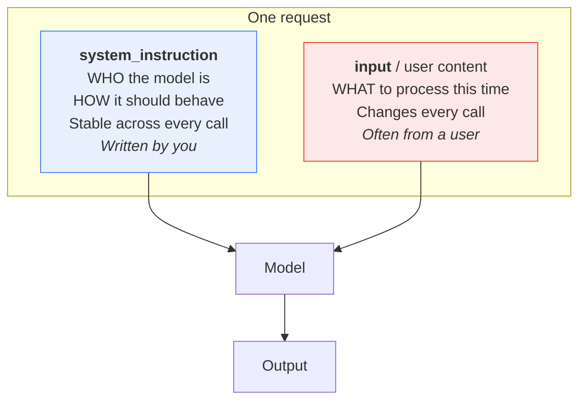
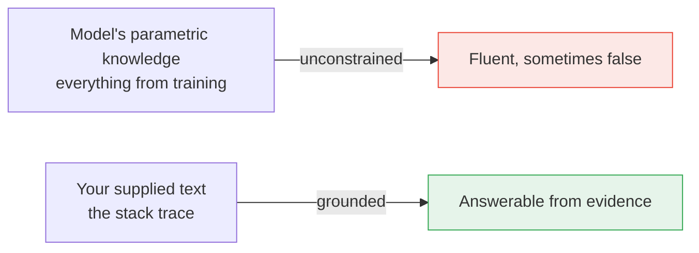

# Part I — Vocabulary, With One Example

Most glossaries define twenty terms with twenty unrelated examples, and you finish knowing
twenty definitions and zero intuitions.

This one uses **a single example** the whole way through. Same stack trace, same prompt,
every term. By the end you will have watched one small piece of text get measured, priced,
positioned, and reshaped — and the words will mean something concrete.

---

## 1.1 The worked example

A payment service throws this at 3am:

```
Traceback (most recent call last):
  File "/app/services/billing.py", line 214, in charge_customer
    response = gateway.submit(payload, timeout=self.timeout)
  File "/app/vendor/paygate/client.py", line 88, in submit
    raise GatewayTimeout(f"no response in {timeout}s")
paygate.errors.GatewayTimeout: no response in 30s
```

A support agent cannot read that. So we build the first of our three canonical tasks: an
**error-message rewriter**.

That exact trace is `stack_trace` in the §0.10 preamble, so it is already in scope.
Here is the complete request we will dissect:

```python
SYSTEM = """You rewrite developer error messages for non-technical support staff.
Always produce exactly three sections: What happened, What it means, What to do next.
Never invent a cause that is not evidenced in the trace."""

USER = f"""Rewrite this error for a support agent:

<error>
{stack_trace}
</error>"""
```

Every term below points at some part of that.

---

## 1.2 Token

**A token is the unit the model actually reads, writes, and bills.** Not a word, not a
character — something in between.

Google's own rule of thumb:

> A token is equivalent to about **4 characters**. **100 tokens ≈ 60–80 English words.**

Our stack trace is **324 characters** and **31 words**. So it is roughly **81 tokens**.

You do not have to estimate. Ask:

```python
# client, MODEL and stack_trace all come from the §0.10 session preamble
counted = client.models.count_tokens(model=MODEL, contents=stack_trace)
print(counted.total_tokens)     # the real number for this exact text
```

> **Why "roughly"?** The 4-characters rule is an average across ordinary English. Code and
> stack traces tokenize *worse* than prose — more punctuation, more odd identifiers, more
> splits. Estimate to plan; call `count_tokens` to know.

---

## 1.3 Tokenization

**Tokenization is the process of chopping text into tokens.** It is not chopping on spaces.

Take one line from our trace:

```
    raise GatewayTimeout(f"no response in {timeout}s")
```

A rough sense of how that fragments:

```
┌───────┬───────┬─────────┬─────────┬───┬───┬────┬─────┬──────────┬────┬───┬───┐
│ raise │ Gate  │ way     │ Timeout │ ( │ f │ "  │ no  │ response │ in │ { │...│
└───────┴───────┴─────────┴─────────┴───┴───┴────┴─────┴──────────┴────┴───┴───┘
  common  ← one rare identifier, three tokens →   each punctuation mark counts
```

Three things fall out of this, and they explain a lot of otherwise-baffling behaviour:

1. **Common words are cheap; rare identifiers are expensive.** `response` is likely one
   token. `GatewayTimeout` is several.
2. **Punctuation costs.** JSON and code are token-hungry because they are punctuation-dense.
   The same information as prose costs less.
3. **Whitespace is not free.** Those four leading spaces are real tokens. Pretty-printed
   JSON can cost meaningfully more than compact JSON at scale.

**Practical consequence:** if you are paying per token and shipping structured data, compact
JSON beats indented JSON, and prose often beats both.

---

## 1.4 Context window

**The context window is the maximum number of tokens the model can hold at once** — your
system instruction, your input, its thinking, and its output, all sharing one budget.

Think of it as a desk. Everything for the task has to fit on the desk at the same time.

```
CONTEXT WINDOW  (one shared budget)
┌────────────────────────────────────────────────────────────────────────┐
│ ██ system instruction (~53 tok)                                        │
│ ████ user prompt wrapper (~25 tok)                                     │
│ ██████ the stack trace (~81 tok)                                       │
│ ░░░░░░░░░░░ model's internal thinking (varies — you do not see it)     │
│ ▓▓▓▓▓▓▓▓▓▓▓▓▓▓ the response it writes back                             │
│                                                                        │
│ ..................... enormous amount of room left .................... │
└────────────────────────────────────────────────────────────────────────┘
```

Our entire request is around **160 tokens** before the model says anything. On a modern
Flash model that is a rounding error. This matters when you start feeding in whole
documents — the summarizer task in Part III — not when you rewrite one stack trace.

**Do not memorise a context-window number.** They change with every model release. Ask:

```python
info = client.models.get(model=MODEL)
print("input limit: ", info.input_token_limit)
print("output limit:", info.output_token_limit)
```

Note that input and output limits are separate. A model can accept far more than it will
write back in one response.

> **The trap nobody warns you about:** a huge context window does not mean the model uses
> all of it equally well. Attention is not uniform across position. More on this in §2.3.
> Bigger window ≠ better recall.

---

## 1.5 Input vs output tokens

They are counted separately, and on essentially every provider **output costs more than
input**. Input is read in parallel; output is generated one token at a time.

Make a call, then read the meter. `SYSTEM` and `stack_trace` come from §1.1 and §0.10:

```python
interaction = client.interactions.create(
    model=MODEL,
    system_instruction=SYSTEM,
    input=f"Rewrite this error for a support agent:\n\n<error>\n{stack_trace}\n</error>",
    store=False,
)

u = interaction.usage
print(u.total_input_tokens)                        # system instruction + prompt + files
print(u.total_output_tokens)                       # what the model wrote
print(getattr(u, "total_thought_tokens", 0))       # internal reasoning — billed, unseen
print(getattr(u, "total_cached_tokens", 0))        # input served from cache
print(getattr(u, "total_tool_use_tokens", 0))      # tool definitions
print(u.total_tokens)                              # the whole bill
```

> **Why `getattr` on four of the six?** Only `total_input_tokens`, `total_output_tokens`
> and `total_tokens` are always present. The rest appear when they apply. Reading them
> directly is a crash waiting for the simplest input you will ever send.

For our rewriter: ~160 tokens in, maybe 150 out. Roughly balanced.

For the **summarizer**, the shape inverts hard — 8,000 tokens in, 200 out. For a
**classifier**, more so — 300 in, 5 out.

**This shape determines your optimisation strategy**, and it is the first thing to look at
when a bill surprises you:

| Task shape | Where the money goes | What to optimise |
|---|---|---|
| Summarizer (long in, short out) | Input | Trim the input. Cache the stable prefix. |
| Classifier (short in, tiny out) | Per-request overhead | Batch. Cut the system instruction. |
| Generator (short in, long out) | Output | Cap `max_output_tokens`. Ask for less. |
| Reasoner (thinking-heavy) | Thinking tokens | Lower `thinking_level`. |

---

## 1.6 Prompt, completion, turn

Three words people use loosely. Precisely:

- **Prompt** — everything you send. System instruction plus user content plus files.
- **Completion** (or *response*, or *output*) — what the model sends back.
- **Turn** — one prompt/completion exchange.

**The Smart Intern is exactly one turn.** That is the definition of the blueprint. The
moment you need a second turn that depends on the first, you are building
[Blueprint 2](../README.md) and should know it.

---

## 1.7 System instruction vs user content

Both are text. Both cost input tokens. They are not interchangeable.



In our example the split is clean:

| Goes in `system_instruction` | Goes in `input` |
|---|---|
| "You rewrite developer error messages…" | The stack trace |
| "Always produce exactly three sections…" | |
| "Never invent a cause…" | |

```python
interaction = client.interactions.create(
    model=MODEL,
    system_instruction=SYSTEM,   # stable
    input=USER,                  # varies per call
    store=False,
)
```

Why the split matters, in order of importance:

1. **Security.** The system instruction is yours. User content may be hostile. Keeping them
   apart is the foundation of injection defence — see §7.2.
2. **Reuse.** The system instruction becomes a versioned artifact you test once and reuse
   everywhere. See Part V.
3. **Caching.** A stable prefix is what caching can exploit. A prompt that varies
   everywhere cannot be cached.

**System instruction tokens still count as input tokens.** It is not free just because it
is separate.

> **`system_instruction` is a top-level parameter**, a sibling of `input` — not something
> buried in a config object. That placement is deliberate: it is a different *kind* of
> content, not a different setting.

---

## 1.8 Temperature, top-p, top-k

At each step the model produces a probability distribution over possible next tokens. These
three knobs decide how to pick from it.

```
Next token after "The gateway timed out because the payment"

  provider     ████████████████████████  38%
  service      ██████████████            22%
  processor    █████████                 15%
  gateway      ██████                    10%
  system       ████                       7%
  vendor       ██                         4%
  ...tail...   █                          4%

  temperature ──> flattens or sharpens this whole curve
  top-k = 3   ──> only ever consider the first three bars
  top-p = 0.75──> consider bars until they sum to 75%, then stop
```

| Knob | What it does | Range |
|---|---|---|
| **temperature** | Flattens (high) or sharpens (low) the distribution | 0.0 – 2.0 |
| **top-p** | Keep the smallest set of tokens whose probabilities sum to *p* | 0.0 – 1.0 |
| **top-k** | Keep only the *k* most likely tokens | integer |

Low temperature → focused, repetitive, predictable. High temperature → varied, creative,
occasionally unhinged.

### The caveat that overturns the old advice

The classic guidance was "set temperature to 0 for anything factual." **That advice is
wrong for Gemini 3 models.** Google's documentation is explicit:

> When using Gemini 3 models, we strongly recommend keeping the `temperature` at its
> default value of **1.0**. Changing the temperature (setting it below 1.0) may lead to
> unexpected behavior, such as looping or degraded performance, particularly in complex
> mathematical or reasoning tasks.

So:

| If you are on… | Do this |
|---|---|
| Gemini 3 series (`gemini-3.x-*`) | **Leave temperature at 1.0.** Control variability through the prompt, not the knob. |
| Gemini 2.5 series | Classic advice still applies — lower temperature for extraction and classification. |

This is a good reminder that prompt-engineering folklore has a shelf life. Techniques that
were correct eighteen months ago can be actively harmful now. Check the docs for the model
you are on.

**Practical upshot for the Smart Intern:** if you need consistent output on a Gemini 3
model, get it from a rigid output schema (§3.4) and a tightly specified instruction (§3.1) —
not from turning temperature down.

---

## 1.9 Thinking tokens

Gemini 3 and 2.5 series models **reason internally before answering**. That reasoning is
made of tokens. Those tokens are billed. You mostly do not see them.

```
        YOU SEE                              YOU PAY FOR
┌──────────────────────┐            ┌──────────────────────────┐
│ input tokens         │            │ input tokens             │
│ output tokens        │            │ output tokens            │
│ thought SUMMARIES    │  ← only a  │ ALL thinking tokens      │  ← the full
│   (if you ask)       │    digest  │   (the complete reasoning)│    reasoning
└──────────────────────┘            └──────────────────────────┘
```

Google is explicit: pricing is based on the full thought tokens generated, even though only
the summary is returned.

Control it with `thinking_level`:

```python
interaction = client.interactions.create(
    model=MODEL,
    input=USER,
    generation_config={"thinking_level": "low"},
)
```

Verified defaults and supported levels:

| Model | Default | Levels available |
|---|---|---|
| `gemini-3.5-flash` | medium | minimal, low, medium, high |
| `gemini-3-flash-preview` | high | minimal, low, medium, high |
| `gemini-3.1-pro-preview` | high | low, medium, high |
| `gemini-2.5-flash` | on | low, medium, high |
| `gemini-2.5-flash-lite` | **off** | low, medium, high |

Google's own matching guidance:

- **minimal / low** — fact retrieval, classification. *Our ticket classifier lives here.*
- **default** — comparing concepts, ordinary reasoning. *Our error rewriter lives here.*
- **high** — advanced coding, mathematics, multi-step planning.

Want to see the reasoning? Ask for summaries — and always handle the case where there
aren't any:

```python
interaction = client.interactions.create(
    model=MODEL,
    input=USER,
    generation_config={"thinking_summaries": "auto"},
)

for step in interaction.steps:
    if step.type == "thought" and step.summary:
        for block in step.summary:
            if block.type == "text":
                print("[thinking]", block.text)
```

A thought step **always** carries a `signature`, but `summary` may be empty — on simple
requests, when summaries are disabled, or for non-text thought content. Code that assumes
a summary exists will crash in production on the easiest input you give it.

> **The bill-shock scenario:** you run a classifier over 100,000 tickets on default
> thinking. Every one of those trivial classifications quietly generated reasoning tokens
> you never saw. Setting `thinking_level: "minimal"` is often the single highest-leverage
> cost change available on a Smart Intern workload.

---

## 1.10 Latency and TTFT

Two different numbers, and confusing them leads to the wrong optimisation.

- **Total latency** — request sent to last token received.
- **TTFT (time to first token)** — request sent to *first* token received.

```
NON-STREAMING
send │████████████████████████████████████│ done
     └─────────── user stares at a spinner ─────────┘

STREAMING
send │███│ first token... text... text... text │ done
     └TTFT┘
          └──── user is already reading ────┘
```

Same total time. Completely different experience.

```python
stream = client.interactions.create(
    model=MODEL, input=USER, stream=True,
)
for event in stream:
    if event.event_type == "step.delta" and event.delta.type == "text":
        print(event.delta.text, end="", flush=True)
```

What actually drives each:

| Driver | Hurts TTFT | Hurts total |
|---|---|---|
| Large input | Yes | Yes |
| High `thinking_level` | **Yes, a lot** | Yes |
| Long output | No | **Yes, a lot** |
| Bigger model | Yes | Yes |

**Rule:** if a human is waiting, stream, and lower `thinking_level`. If a batch job is
waiting, ignore TTFT and optimise total tokens.

---

## 1.11 Hallucination and grounding

**Hallucination** is the model producing something fluent, confident, and false.

Ask our rewriter to explain the error and it might tell your support agent:

> "The payment gateway rejected the card because the billing address did not match."

Nothing in the trace says that. There is no card, no address, no rejection. The trace says
one thing: no response within 30 seconds. The model filled a plausible-sounding gap.

**Grounding** is constraining the model to a supplied source. Our system instruction already
attempts it:

> *Never invent a cause that is not evidenced in the trace.*

That helps. It is not sufficient — Part IV covers what actually works.



The honest boundary: a Smart Intern can only be grounded in **what you put in the prompt**.
It cannot look anything up. The moment you need it grounded in a knowledge base you did not
paste in, you need Blueprint 3 — The Intelligent Library.

---

## 1.12 Zero-shot and few-shot

**Shot** means *worked example provided in the prompt*.

- **Zero-shot** — instructions only. What we have been doing.
- **One-shot** — one example of input and desired output.
- **Few-shot** — several.

Zero-shot on our rewriter:

```
Rewrite this error for a support agent: <error>...</error>
```

One-shot:

```
Example
-------
Error:   ConnectionRefusedError: [Errno 111] Connection refused — redis:6379
Rewrite: What happened: The app could not reach its cache server.
         What it means: Requests will be slower; some may fail.
         What to do next: Check whether the cache service is running.

Now do the same for:
<error>...</error>
```

Examples teach *format and tone* far more efficiently than description ever does. Three good
examples routinely beat three paragraphs of instruction, and cost fewer tokens.

Full treatment — how many, how to choose them, where returns stop — in §3.3.

---

## 1.13 Glossary card

One page. Print it.

| Term | One line | Where you meet it |
|---|---|---|
| **Token** | ~4 characters; the billing unit | `usage.total_tokens` |
| **Tokenization** | Splitting text into tokens | Why code costs more than prose |
| **Context window** | Total token budget for one call | `models.get().input_token_limit` |
| **Input tokens** | Everything you send | `usage.total_input_tokens` |
| **Output tokens** | Everything it writes | `usage.total_output_tokens` |
| **Thinking tokens** | Internal reasoning; billed, unseen | `usage.total_thought_tokens` |
| **Prompt** | System instruction + user content | — |
| **Completion** | The response | `interaction.output_text` |
| **Turn** | One exchange. The Smart Intern is one. | — |
| **System instruction** | Stable "who and how" | `system_instruction=` |
| **User content** | Varying "what, this time" | `input=` |
| **Temperature** | Flattens/sharpens the distribution | Leave at 1.0 on Gemini 3 |
| **Top-p / top-k** | Truncate the candidate pool | `generation_config` |
| **`thinking_level`** | minimal / low / medium / high | `generation_config` |
| **TTFT** | Time to first token | Fix with `stream=True` |
| **Hallucination** | Fluent and false | Fix with grounding + evaluation |
| **Grounding** | Tying answers to supplied evidence | §4.1 |
| **Zero/few-shot** | Number of worked examples given | §3.3 |
| **RPM / TPM / RPD** | Requests-per-min / tokens-per-min / requests-per-day | Any of them can 429 you |

---

## The five things worth actually remembering

1. **Tokens are the currency.** Estimate with characters ÷ 4, confirm with `count_tokens`.
2. **The context window is one shared budget** — instruction, input, thinking, output.
3. **Thinking tokens are billed and invisible.** Check `total_thought_tokens` before you
   scale anything.
4. **Do not lower temperature on Gemini 3 models.** Get consistency from schema and
   specificity instead.
5. **The system/user split is a security boundary**, not a formatting preference.

---

**Next:** [Part II — Foundations](./02-foundations.md)
