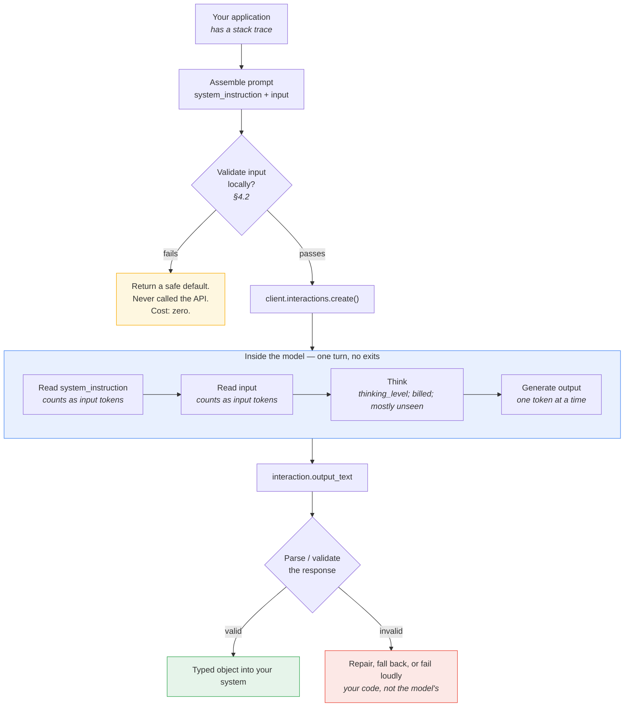
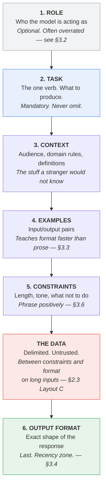

# Part II — Foundations

Part I gave you the vocabulary. This part gives you the model of the machine.

Four things are worth internalising before you write another prompt: **what the blueprint
actually forbids**, **when it is the wrong choice**, **how the model reads what you send**,
and **what the knobs really do**. Get those right and most prompt-engineering advice becomes
obvious. Get them wrong and no amount of clever phrasing saves you.

Same stack trace throughout.

---

## 2.1 What the Smart Intern actually is

### The analogy, stated fairly

The parent article's framing:

> Think of this as delegating a quick, isolated task to a highly capable digital intern.
> You pass in a set of instructions along with an input payload, and the AI answers or
> organizes it in one single turn.

That analogy earns its keep in three places:

1. **Capability is high, context is zero.** A good intern is smart and knows nothing about
   your company. You have to say what "urgent" means at your company, because they do not
   know.
2. **The quality of the output is bounded by the quality of the brief.** Vague brief, vague
   deliverable. This is the whole discipline in one line.
3. **You delegate a task, not a job.** "Rewrite this error message" is a task. "Own incident
   communications" is a job. The Smart Intern does tasks.

### Now push it until it breaks

The analogy is comfortable, which makes it dangerous. A real intern has four abilities this
architecture does not:

| A real intern… | The Smart Intern… |
|---|---|
| Asks a clarifying question when the brief is ambiguous | Guesses, confidently, and returns the guess as fact |
| Remembers what you told them on Tuesday | Starts from zero on every single call |
| Looks something up when they do not know | Cannot. No search, no database, no filesystem |
| Notices their own answer is wrong and redoes it | Emits the first answer and stops |

Every one of those gaps is a failure mode you have to engineer around, in the prompt, in
advance. The intern will not tell you the brief was ambiguous. It will produce something
fluent and plausible, and you will not know it was wrong until a support agent reads it to
a customer.

**The sharper analogy:** it is not an intern. It is a brilliant contractor who has agreed
to answer any question you ask, in one sealed envelope, having never met you, with no phone,
no internet, and no right of reply — and who is contractually forbidden from saying
"I'm not sure what you meant."

### The architectural constraint, precisely

Strip the metaphor and four properties define the blueprint:

```
                  THE SMART INTERN CONTRACT

   ┌──────────────────────────────────────────────────────┐
   │                                                      │
   │   NO RETRY        one response; nothing re-runs it   │
   │   NO TOOL         no search, no code, no API call    │
   │   NO MEMORY       no state carried between calls     │
   │   NO SECOND       no critic, no reviewer, no vote    │
   │      OPINION                                         │
   │                                                      │
   └──────────────────────────────────────────────────────┘

   Consequence:  THE PROMPT IS THE ENTIRE SYSTEM.
```

This is why prompt engineering is a real engineering discipline here and only a
nice-to-have elsewhere. In Blueprint 2 a bad stage output gets validated and re-run. In
Blueprint 4 the agent observes a failure and tries something else. Here, whatever comes out
of the single call is what ships.

> **Worth noticing:** the retry you can add in your own application code — catching an
> exception and calling again — is not a retry *inside* the blueprint. It re-runs the same
> prompt against the same model. It fixes network flakiness and 429s. It does not fix a
> prompt that was ambiguous, and it will happily produce a second confident wrong answer.
> Programmatic validate-and-repair (§3.4) is the honest version of this, and it is already
> one step toward Blueprint 2.

### The request lifecycle

Here is what one call actually does. The parent article's Figure 1 showed three boxes; this
is the version with the parts that cost you money and cause your bugs.



Two things to note, because they are where engineering effort actually pays:

- **The two decision diamonds are yours, not the model's.** Everything inside the blue box
  is one opaque forward pass. All the reliability you get comes from what you do on either
  side of it.
- **The cheapest call is the one you never make.** Local input validation catches empty
  payloads, oversized documents, and obvious junk for zero tokens and zero latency.

### The minimal complete call

```python
# client, MODEL and stack_trace all come from the §0.10 preamble — the call itself
# is everything below.

SYSTEM = """You rewrite developer error messages for non-technical support staff.
Always produce exactly three sections: What happened, What it means, What to do next.
Never invent a cause that is not evidenced in the trace."""

interaction = client.interactions.create(
    model=MODEL,
    system_instruction=SYSTEM,
    input=f"Rewrite this error for a support agent:\n\n<error>\n{stack_trace}\n</error>",
    generation_config={"thinking_level": "low"},
    store=False,                 # stateless task; opt out of server-side storage
)

print(interaction.output_text)
print("tokens:", interaction.usage.total_tokens)
```

`store=False` is the right default for a single-shot task: there is no follow-up turn, so
there is nothing to retain. Note that it is incompatible with `background=True` and it
blocks `previous_interaction_id` — neither of which a Smart Intern needs.

---

## 2.2 Best used for / Avoid when, made testable

The parent article's guidance is correct and unactionable:

> **Best used for:** Instantly rewriting error messages, basic text classifications, or
> summarizing brief documents.
>
> **Avoid when:** You require live external data access or multi-step programmatic
> execution.

"Brief documents" — how brief? "Multi-step" — is a two-part answer multi-step? A PM
scoping a feature cannot use that. So here is the same guidance turned into conditions you
can actually check before you build.

### The five-question gate

Answer all five. Any single **No** means the Smart Intern is the wrong blueprint.

| # | Question | Yes means | No means |
|---|---|---|---|
| 1 | **Is every fact needed to answer already in the prompt?** | Self-contained. Proceed. | You need retrieval → **Blueprint 3** |
| 2 | **Can it be answered without running, calling, or fetching anything?** | No tools needed. Proceed. | You need tools → **Blueprint 4** |
| 3 | **Is there exactly one deliverable, produced once?** | One turn. Proceed. | Sequential stages → **Blueprint 2** |
| 4 | **Would a competent stranger with no memory of your product produce an acceptable answer from this prompt alone?** | Brief is complete. Proceed. | Brief is under-specified → fix the prompt, re-test |
| 5 | **Can you tell a good output from a bad one automatically, or cheaply by eye?** | Evaluable. Proceed. | You cannot measure it → you cannot operate it |

Question 4 is the **competent stranger test** and it does most of the work. It reappears
throughout Part III because almost every prompt failure is a violation of it.

Question 5 is the one people skip and regret. If nobody can say what "correct" means for
this task, no blueprint will save you.

### Applied to the three canonical tasks

| | Error rewriter | Ticket classifier | Document summarizer |
|---|---|---|---|
| 1. Self-contained? | Yes — the trace is the input | Yes — the ticket text is the input | Yes, **if the document fits** |
| 2. No tools? | Yes | Yes | Yes |
| 3. One deliverable? | Yes | Yes | Yes |
| 4. Stranger test? | Only if you define the three sections and the audience | Only if you define every label | Only if you define length, audience, and what to omit |
| 5. Evaluable? | Partly — needs human review or a rubric | Yes — labelled set, measure accuracy | Hard — needs a rubric or pairwise comparison |
| **Verdict** | **Good fit** | **Best fit of the three** | **Fit, with a size ceiling** |

### The failure signatures

Rather than a hard token threshold, watch for these. Each maps to a specific escape hatch.

| Symptom in production | What it actually means | Where to go |
|---|---|---|
| Output cites facts that were never in the prompt | The task needs knowledge you did not supply | Blueprint 3 |
| You keep pasting bigger and bigger reference text to fix accuracy | You are hand-rolling retrieval, badly | Blueprint 3 |
| "…as of my last update" or hedged dates appear in output | The task needs live data | Blueprint 3 or 4 |
| The prompt contains the words "first… then… finally…" | You have a pipeline in a trench coat | Blueprint 2 |
| Output quality collapses when input gets long | Positional attention limits (§2.3) | Blueprint 2 (chunk) or 3 |
| You need arithmetic, code execution, or a live lookup to be right | Tools | Blueprint 4 |
| You are asking one prompt to hold three incompatible personas | One turn cannot be three specialists | Blueprint 5 |

> **The Golden Rule, restated.** The parent article says: always start with the simplest
> pattern that works. The operative word is *works*. Starting simple is not an excuse to
> ship a single-shot prompt for a job that needs retrieval — it is an instruction to
> **prove** the simple thing fails before you add a stage. Most teams get this backwards
> and build Blueprint 4 for a Blueprint 1 problem.

### Best used for / Avoid when — the tightened version

**Best used for:**

- Transformation of text you already have (rewrite, reformat, translate, restructure)
- Classification into a label set you can enumerate in the prompt
- Extraction into a schema you can define up front
- Summarisation of a document that fits comfortably in context and needs no outside facts
- Anything where a wrong answer is cheap to detect and cheap to fix

**Avoid when:**

- The answer depends on data that changes after the prompt is written
- Correctness requires arithmetic, execution, or verification against a system of record
- The task decomposes into stages with different success criteria
- A wrong answer is expensive, irreversible, or goes straight to a customer unreviewed
- You cannot define, even roughly, what a correct answer looks like

---

## 2.3 How Gemini reads your prompt

### It does not read like you do

You read a document top to bottom, and a well-argued point on page nine sticks. The model
processes the whole prompt at once through attention, and **attention is not uniform across
position**. That single fact explains a large fraction of "why did it ignore my
instruction" bugs.

Two empirically well-established effects:

- **Primacy** — content near the start of the prompt is weighted heavily.
- **Recency** — content near the end is weighted heavily, often most heavily of all.

And the consequence, documented across models and now common enough to have a name:

- **Lost in the middle** — material placed in the middle of a long prompt is recalled and
  followed measurably less reliably than the same material at either end.

```
INSTRUCTION FOLLOWING vs POSITION IN PROMPT
(illustrative shape — the curve is real, the exact numbers depend on model and task)

 reliably
 followed  ┤██                                                     ███
           ┤███                                                   ████
           ┤ ███                                                 ████
           ┤  ████                                             ████
           ┤    █████                                       █████
           ┤       ████████                           █████████
 sometimes ┤             ███████████████████████████████
 missed    ┤
           └────────────┬───────────────┬──────────────┬──────────┬──►
                      START           25%             75%        END
                        │                                          │
                  PRIMACY zone      "LOST IN THE MIDDLE"      RECENCY zone
                        │                                          │
              put the ROLE and                       put the OUTPUT FORMAT
              the CORE TASK here                     and FINAL CONSTRAINTS here
```

Two honest caveats about that diagram:

1. **It is a shape, not a measurement.** The severity depends on model, prompt length, and
   task. On a 200-token prompt it is barely detectable. On a 40,000-token document
   summarisation it is the dominant failure mode.
2. **Thinking models mitigate it, they do not eliminate it.** Higher `thinking_level`
   gives the model more opportunity to re-attend to the middle. It is a mitigation, not a
   fix.

> **The trap from §1.4, now explained.** A large context window tells you what *fits*. It
> tells you nothing about what gets *used well*. Treat every token in the middle of a long
> prompt as at risk, and design accordingly.

### Instructions before data, or after?

This is the most common concrete question, and it has a defensible answer.

```
        LAYOUT A                      LAYOUT B                 LAYOUT C
   instructions first             data first              instructions BOTH ends

  ┌────────────────────┐      ┌────────────────────┐    ┌────────────────────┐
  │ ROLE + TASK        │      │                    │    │ ROLE + TASK        │
  ├────────────────────┤      │   THE DOCUMENT     │    ├────────────────────┤
  │                    │      │   (40k tokens)     │    │                    │
  │   THE DOCUMENT     │      │                    │    │   THE DOCUMENT     │
  │   (40k tokens)     │      │                    │    │   (40k tokens)     │
  │                    │      ├────────────────────┤    │                    │
  │                    │      │ ROLE + TASK        │    ├────────────────────┤
  └────────────────────┘      └────────────────────┘    │ RESTATE: task +    │
                                                        │ output format      │
   Task sits in primacy.        Task sits in recency.   └────────────────────┘
   Risk: forgotten by the       Risk: the model read
   time it reaches the end.     40k tokens with no       Both zones used.
                                idea what it was for.    Costs a few dozen
                                                         extra tokens.
```

**What to actually do:**

| Prompt size | Layout | Reasoning |
|---|---|---|
| Short (a stack trace, a ticket) | A — instructions first | Position effects are negligible; readability wins |
| Medium | A, with output format restated last | Cheap insurance |
| Long (documents, transcripts) | **C — bookend it** | The single highest-value layout change available |

Layout C in practice, for the summarizer, using `document_text` from the §0.10 preamble:

```python
prompt = f"""You are summarising a document for an executive audience.
Produce exactly five bullet points. Use only facts stated in the document.

<document>
{document_text}
</document>

Reminder of the task: five bullet points, executive audience, facts from the
document only. If the document does not support five distinct points, produce
fewer and say so."""
```

That closing paragraph costs perhaps 40 tokens and is, in practice, one of the highest
return-per-token edits in this chapter.

**Never put the data first with no framing.** Layout B makes the model read your entire
document with no idea what it is looking for. It is the worst of the three and it is
surprisingly common, because it is what you get when you naively concatenate a template
onto a payload.

### Delimiters are structural, not decorative

The model has to know where your instructions end and untrusted content begins. Wrap
inputs. XML-style tags work well and read clearly:

```
<error>
...the stack trace...
</error>

<ticket>
...the customer's words...
</ticket>

<document>
...the document...
</document>
```

This buys you three things at once: the model knows the boundary, you get a natural hook
for "quote from `<document>` only" instructions, and you have the beginnings of an
injection defence (§7.2) because instruction-shaped text inside `<ticket>` is visibly
*data*.

---

## 2.4 The generation config knobs in practice

Part I defined these. Here is when to touch them and — mostly — when not to.

```python
interaction = client.interactions.create(
    model=MODEL,
    input=USER,
    generation_config={
        "thinking_level": "low",       # minimal | low | medium | high
        "thinking_summaries": "auto",  # auto | none
        "temperature": 1.0,            # leave alone on Gemini 3
    },
)
```

### The honest ranking

| Knob | How often you should touch it | Why |
|---|---|---|
| **`thinking_level`** | **Almost every production workload** | Largest single lever on both cost and latency |
| `max_output_tokens` | Whenever output length is bounded | Truncation guard and cost ceiling |
| `stop_sequences` | Occasionally | Useful with few-shot; mostly obsoleted by structured output |
| `temperature` | **Rarely, and not at all on Gemini 3** | See below |
| `top_p` / `top_k` | Almost never | If you are reaching for these, fix the prompt instead |

### `thinking_level` — the one that matters

Values are `minimal`, `low`, `medium`, `high`. On Gemini 3 this is **not** a numeric token
budget.

Verified defaults and supported levels:

| Model | Default | Levels available |
|---|---|---|
| `gemini-3.5-flash` | medium | minimal, low, medium, high |
| `gemini-3-flash-preview` | high | minimal, low, medium, high |
| `gemini-3.1-pro-preview` | high | low, medium, high |
| `gemini-2.5-flash` | on | low, medium, high |
| `gemini-2.5-flash-lite` | off | low, medium, high |

Google's guidance, mapped onto our three tasks:

| Task | Level | Why |
|---|---|---|
| **Ticket classifier** | `minimal` or `low` | Classification is fact retrieval against a fixed label set. Reasoning buys almost nothing and is billed. |
| **Error rewriter** | default (`medium` on 3.5-flash) | Requires reading a trace and inferring an audience-appropriate explanation. Some reasoning genuinely helps. |
| **Document summarizer** | `low` to `medium` | Depends on whether you want extraction (low) or synthesis and comparison (medium). |
| Advanced coding, maths, multi-step planning | `high` | Not typical Smart Intern territory — if you need `high`, ask whether you actually need Blueprint 4 |

**Billing reality:** response price is output tokens **plus** thinking tokens, and the full
thoughts are billed even though you only ever see summaries. A classifier left on default
thinking across 100,000 tickets is the most common avoidable bill in this blueprint.

Measure before you assume:

```python
for level in ("minimal", "low", "medium", "high"):
    r = client.interactions.create(
        model=MODEL,
        system_instruction=SYSTEM,
        input=USER,
        generation_config={"thinking_level": level},
        store=False,
    )
    u = r.usage
    print(f"{level:8} thought={u.total_thought_tokens:5}  "
          f"out={u.total_output_tokens:5}  total={u.total_tokens:5}")
```

Run that on twenty representative inputs and pick the cheapest level whose accuracy you can
live with. That is a twenty-minute experiment that frequently pays for itself in a day.

### `temperature` — the caveat that overturns the folklore

Google's documentation is explicit:

> When using Gemini 3 models, we strongly recommend keeping the temperature at its default
> value of **1.0**. Changing the temperature (setting it below 1.0) may lead to unexpected
> behavior, such as **looping or degraded performance**, particularly in complex
> mathematical or reasoning tasks.

| If you are on… | Do this |
|---|---|
| Gemini 3 series | **Leave `temperature` at 1.0.** Do not set it to 0 for "determinism." |
| Gemini 2.5 series | The classic advice still applies — lower temperature for extraction and classification |

This deserves emphasis because "set temperature to 0 for factual tasks" is repeated in
essentially every prompt-engineering guide written before 2026, including guides that are
otherwise excellent. On Gemini 3 it can actively hurt you.

**So where does consistency come from on Gemini 3?** Three places, in order of impact:

1. **A rigid output schema** (§3.4) — the model cannot vary a field it must emit
2. **A specific, unambiguous instruction** (§3.1) — no room to interpret
3. **Few-shot examples** (§3.3) — demonstrated format beats described format

Not from the temperature knob. §4.3 covers what reproducibility actually means here.

### `max_output_tokens`

Two jobs: a cost ceiling, and a bug detector.

```python
```

Set it slightly above your realistic maximum. If you start hitting it, that is signal:
either the model is rambling (fix the prompt) or your real outputs are longer than you
believed (fix the limit). Silent truncation mid-JSON is a nasty production bug — validate
the parse, do not trust the string.

### `stop_sequences`

A list of strings; generation halts when one is produced. Genuinely useful in two cases:

- **Few-shot prompts** where the model would otherwise cheerfully invent Example 5 after
  answering. Stop on `"\nExample"` or a sentinel like `"END"`.
- **Delimited output** where you want to cut cleanly at a marker.

Largely superseded by native structured output for anything JSON-shaped.

### `top_p` and `top_k`

They truncate the candidate pool before sampling. In practice, on a Smart Intern workload,
if you are tuning these you are almost certainly compensating for an under-specified
prompt. Fix the prompt. Treat
them as a last resort.

---

## 2.5 Anatomy of a prompt

### The six components

Every good single-shot prompt contains some subset of six things, and — because of §2.3 —
in roughly this order.



Only **Task** is mandatory. The rest earn their place by fixing an observed failure.

### Which goes in `system_instruction`, which goes in `input`

The §1.7 split, made concrete:

| Component | Usually lives in | Why |
|---|---|---|
| Role | `system_instruction` | Stable across every call |
| Task | `system_instruction` | Stable across every call |
| Context (domain rules, label definitions) | `system_instruction` | Stable; also the thing you version and test |
| Examples | `system_instruction` | Stable; and a stable prefix is what caching can exploit |
| Constraints | `system_instruction` | Stable |
| Output format | `system_instruction`, restated in `input` for long inputs | Recency |
| **The data** | **`input`, always** | Varies per call. **Untrusted.** |

The rule that matters: **nothing a user typed ever goes in `system_instruction`.** That is
the security boundary, not a style preference.

### The reusable skeleton

```
[ROLE]        You are <role>, working for <context of use>.

[TASK]        <One sentence. One imperative verb. What to produce.>

[CONTEXT]     Audience: <who reads the output and what they can be assumed to know>
              Definitions: <any term whose meaning is specific to your organisation>
              Domain rules: <the things a competent stranger could not guess>

[EXAMPLES]    <0-5 input/output pairs, covering the boundaries, not the easy middle>

[CONSTRAINTS] <Length. Tone. Reading level. What to do when the input is unusable —
               stated as a positive instruction, not a prohibition.>

[DATA]        <delimited>
              ...the varying payload...
              </delimited>

[FORMAT]      <Exact output shape. Field names. Types. What "empty" looks like.>
```

### Applied to the error rewriter

Start with what most people write:

**Before**

```
Explain this error in simple terms:

{stack_trace}
```

This fails the competent stranger test on every axis. Simple terms for whom? How long?
What if the trace is truncated? What structure?

**After**

```python
SYSTEM = """You are a support-engineering writer at a payments company.

TASK
Rewrite one developer error message so a non-technical support agent can act on it.

CONTEXT
Audience: first-line support agents. They can read a dashboard and escalate a ticket.
They cannot read Python, and they will often be reading your output aloud to a customer.
Domain: "gateway" means our third-party card processor. A timeout means we never heard
back, so the charge status is UNKNOWN, not failed.

CONSTRAINTS
Under 120 words total. Plain English. No stack frames, no file paths, no class names.
State only causes that are evidenced in the trace. Where the trace is ambiguous, say what
is unknown rather than choosing the most likely explanation.
If the input is not a recognisable error, return only: NOT_AN_ERROR

OUTPUT FORMAT
Exactly three sections, in this order, with these headings:

What happened: <one or two sentences>
What it means: <impact on the customer, in one or two sentences>
What to do next: <one concrete action the agent can take>"""

USER = f"""Rewrite this error for a support agent.

<error>
{stack_trace}
</error>

Reminder: three sections, under 120 words, no technical identifiers."""
```

**Why it worked**

| Change | Failure it prevents |
|---|---|
| Named the audience and their capability | "Simple terms" was meaningless; now it is testable |
| Defined "gateway" and what a timeout implies | The model was inventing declined-card explanations |
| "Charge status is UNKNOWN, not failed" | Prevents the single most damaging wrong answer this task can produce |
| Word ceiling | Output length was varying 40–400 words across calls |
| Banned identifiers explicitly | Stack frames were leaking into customer-facing text |
| "Say what is unknown" instead of "don't guess" | Positive instruction; gives the model something to *do* (§3.6) |
| `NOT_AN_ERROR` escape hatch | The empty/garbage input path now has a defined output (§4.2) |
| Restated format in `input` | Recency zone; survives longer traces |

Notice what is **not** in there: no "you are a world-class expert," no "think step by step,"
no "this is very important to my career." Those are §3.2 and §3.5 material, and they are
mostly cargo cult. What did the work was **specificity about audience, domain, and shape**.

### The same skeleton on the other two tasks

**Ticket classifier** — the components shift weight. Context becomes label definitions,
examples become boundary cases, output format becomes a schema:

```python
SYSTEM = """You classify inbound support tickets for a payments product.

TASK
Assign exactly one category and one urgency level to the ticket.

CONTEXT — label definitions
  billing        charges, refunds, invoices, disputed amounts
  auth           login, password, MFA, session, account lockout
  integration    API errors, webhooks, SDK problems, sandbox issues
  bug            product behaves incorrectly and it is not one of the above
  other          anything else, including feedback and sales enquiries

CONTEXT — urgency definitions
  1  informational, no customer impact
  2  degraded but working
  3  a customer-facing workflow is blocked
  4  money is at risk or already moved incorrectly

CONSTRAINTS
Choose the single best category. If two apply, prefer the one describing the customer's
goal, not the symptom. If the ticket is unintelligible or empty, use category "other"
and urgency 1.

OUTPUT FORMAT
JSON only, matching the supplied schema. No prose before or after."""
```

**Document summarizer** — context becomes the audience and the omission rules, and Layout C
matters because the input is long:

```python
SYSTEM = """You summarise internal documents for an executive audience.

TASK
Produce a five-bullet summary.

CONTEXT
Audience: executives who will not read the source. They need decisions, risks, and
numbers, not process narrative.

CONSTRAINTS
Each bullet under 25 words. Use only facts present in the document. Where the document
gives a figure, include the figure. If the document does not support five distinct
points, produce fewer and add a final line: "Source supports only N points."

OUTPUT FORMAT
Five lines, each starting with "- ". No preamble, no closing summary."""
```

Same skeleton. Different weights. That is the point of having one.

---

## The five things worth actually remembering

1. **No retry, no tool, no memory, no second opinion.** The prompt is the entire system,
   and every reliability feature you want must be built into it or around it.
2. **Run the five-question gate before you build.** Especially question 4, the competent
   stranger test, and question 5, can you tell good from bad.
3. **Attention is not uniform across position.** Instructions first, format last, and on
   long inputs bookend the task at both ends.
4. **`thinking_level` is the knob that matters.** `temperature` is the knob to leave alone
   on Gemini 3.
5. **Six components, one skeleton.** Role, task, context, examples, constraints, output
   format — and only *task* is mandatory. Everything else earns its place by fixing an
   observed failure.

---

**Next:** [Part III — Core Techniques](./03-core-techniques.md)
