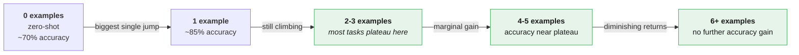
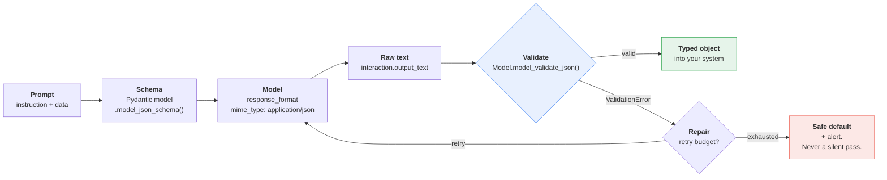
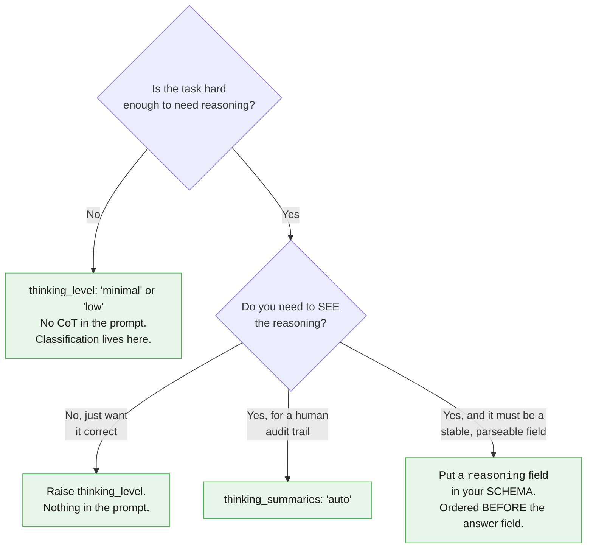
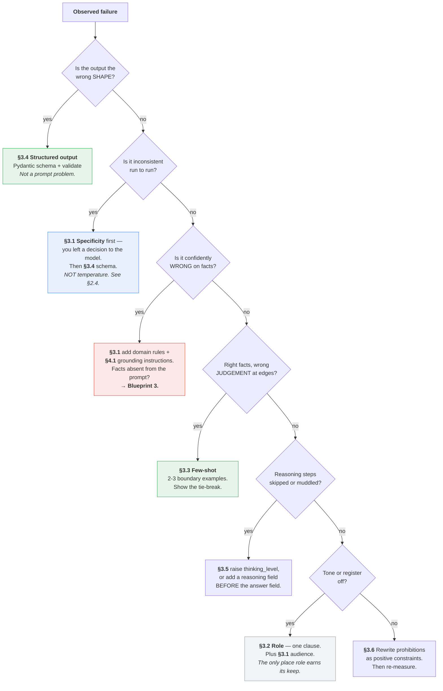

# Part III — Core Techniques

Six techniques. Each one is presented the same way: **Before**, **After**, **Why it
worked** — and each is applied to the three canonical tasks so you can see how the same
idea changes shape depending on whether the output is prose, a label, or a schema.

Two of these six are worth far more than the other four. Section 3.7 says which, and why
the popular ones are not the useful ones.

---

## 3.1 Specificity and instruction design

This is the highest-leverage technique in the chapter, and it is not a trick. It is just
saying what you mean.

### The competent stranger test

> **Hand your prompt to a competent stranger** — someone smart, literate, and completely
> unfamiliar with your product, your users, and your conventions. Give them nothing else.
> Could they produce an output you would accept?

Every ambiguity they would have to guess at is an ambiguity the model will also guess at.
The difference is that the stranger would email you a question. The model will not.

### Before → After: the error rewriter

**Before**

```
Explain this error in simple terms.

{stack_trace}
```

A representative output:

> The payment gateway timed out after 30 seconds while trying to charge the customer.
> This usually happens when the card issuer is slow to respond or the customer's bank is
> experiencing high load. The transaction was not completed, so the customer was not
> charged. You can ask the customer to try again.

Read that carefully. Four distinct problems:

1. **"the card issuer is slow"** — invented. Nothing in the trace mentions an issuer.
2. **"the customer was not charged"** — *actively wrong and dangerous*. A timeout means we
   never heard back. The charge may well have gone through.
3. **"ask the customer to try again"** — if the charge did land, this double-charges them.
4. It reads like documentation, not like something an agent says on a call.

The prompt did not cause these by being short. It caused them by leaving the model free to
fill gaps with plausible-sounding priors.

**After**

```python
SYSTEM = """You are a support-engineering writer at a payments company.

TASK
Rewrite one developer error message so a non-technical support agent can act on it.

CONTEXT
Audience: first-line support agents. They can read a dashboard and escalate a ticket.
They cannot read Python. They often read your output aloud to a customer.
Domain rule: "gateway" is our third-party card processor. A gateway timeout means we
never received a response, so the charge outcome is UNKNOWN. It is NOT a failure and it
is NOT a success. Never tell an agent the customer was or was not charged.

CONSTRAINTS
Under 120 words. Plain English. No file paths, class names, or stack frames.
State only causes evidenced in the trace. Where the trace is ambiguous, name the
unknown explicitly.
If the input is not a recognisable error, return only: NOT_AN_ERROR

OUTPUT FORMAT
What happened: <1-2 sentences>
What it means: <customer impact, 1-2 sentences>
What to do next: <one concrete action>"""
```

A representative output:

> **What happened:** Our system asked the card processor to take a payment and never got
> an answer back within 30 seconds.
>
> **What it means:** We do not know whether the customer was charged. The payment may have
> gone through, or it may not have. Do not assume either.
>
> **What to do next:** Check the payment status in the billing dashboard before telling the
> customer anything. Do not ask them to retry until you have confirmed the outcome.

**Why it worked**

| Change | What it fixed |
|---|---|
| Named the audience and their tools | "Simple terms" became testable; the output now tells them to check a dashboard they actually have |
| Encoded the domain rule about timeouts | Killed the single most damaging hallucination this task can produce |
| "Name the unknown explicitly" | Gave the model a positive action for the gap it previously filled with invention |
| Word ceiling and banned identifiers | Output stopped drifting between 40 and 400 words, and stopped leaking `billing.py:214` |
| `NOT_AN_ERROR` escape | The garbage-input path has a defined output instead of a creative one |

Note that the *cause* of the improvement is not the word "You are a support-engineering
writer." It is the three sentences of domain rule. That distinction is §3.2.

### The specificity checklist

Run these against any prompt. Each unanswered question is a place the model will improvise.

| Dimension | The question to answer in the prompt |
|---|---|
| **Audience** | Who reads this, and what can they be assumed to know? |
| **Length** | An explicit ceiling. "Concise" is not a length. |
| **Format** | Exact structure. Headings, fields, order. |
| **Tone** | Register, and whether it is spoken aloud or read. |
| **Scope** | What to include, and — more importantly — what to leave out. |
| **Vocabulary** | Terms with a meaning specific to your organisation. |
| **Edge behaviour** | What to output when the input is empty, truncated, or off-topic. |
| **Uncertainty** | What to do when the input does not support a confident answer. |

The last two are the ones people omit, and they are the ones that generate incidents.

### The same technique, other two tasks

**Ticket classifier.** Specificity means defining the labels, not listing them.

| Before | After |
|---|---|
| `Categories: billing, auth, integration, bug, other` | `billing — charges, refunds, invoices, disputed amounts` `auth — login, password, MFA, session, lockout` `integration — API errors, webhooks, SDK, sandbox` `bug — product behaves incorrectly and is none of the above` `other — anything else, including feedback and sales` |

Plus the tie-break rule, which is where most classifier disagreement actually lives:

```
If two categories apply, prefer the one describing the customer's GOAL, not the
symptom. "I can't log in to download my invoice" is auth, not billing.
```

One sentence. It resolves a whole class of inconsistency that no amount of temperature
tuning would have touched.

**Document summarizer.** Specificity means stating the omission rules.

```
Include: decisions made, risks named, numbers stated, owners assigned, dates committed.
Omit: meeting logistics, attendee lists, restatements of the agenda, process narrative.
```

"Summarise this" gives you a compression of the whole document, weighted by how much space
each topic occupied. That is almost never what anyone wants. Telling the model what to
*drop* is more effective than telling it what to keep.

---

## 3.2 Role and persona

### What it genuinely buys

Setting a role does two real things:

1. **Register and vocabulary.** "You are a support-engineering writer" measurably shifts
   word choice away from documentation-speak. That is worth something for prose tasks.
2. **Implied audience.** A role often smuggles in an audience assumption, which is useful —
   but you should just state the audience directly instead, because then it is explicit and
   testable.

### What it does not buy

It does not make the model more capable. There is no expert mode being unlocked. The
weights are the same weights.

**Be honest about this: role prompting is the most over-rated technique in common
circulation.** It is popular because it is easy to write and produces an immediately
noticeable stylistic change, which feels like improvement. It is a formatting hint that
people mistake for a capability switch.

### Before → After, and the honest ablation

**Before (cargo cult)**

```
You are a world-class, award-winning senior staff engineer with 20 years of experience
at FAANG companies. You are renowned for your ability to explain complex technical
concepts. Take a deep breath and think carefully. This is very important to my career.

Explain this error.
```

**After (does the same job in fewer tokens)**

```
You write for first-line support agents who cannot read code and will read your output
aloud to a customer.

Rewrite this error.
```

**Why it worked**

The "after" version is shorter, and every clause in it is a *constraint the output can be
checked against*. "Award-winning" cannot be checked. "Will read your output aloud" can —
it rules out stack frames, URLs, and anything with an underscore in it.

The superlatives, the "take a deep breath," and the emotional appeal contributed nothing
measurable. They also consumed tokens in the primacy zone (§2.3) — the most valuable real
estate in your prompt — to say nothing.

### The rule

| Use a role when | Skip it when |
|---|---|
| The task is prose and register matters | The output is a label, a JSON object, or an extraction |
| The role encodes real domain framing you would otherwise have to spell out | You are about to write "world-class" or "expert" |
| One short clause covers it | It takes more than two lines |

**Best used for:** tone control on free-form generation.
**Avoid when:** you are hoping it substitutes for saying what you actually want.

Our classifier prompt in §2.5 has no role line at all, and loses nothing. Our summarizer
has one clause: "You summarise internal documents for an executive audience." That clause
is doing audience work, not persona work.

> **Test it yourself.** Take your prompt, delete the role line, run both versions over
> twenty inputs, and look at the outputs side by side. On structured tasks you will
> usually see no difference. That five-minute test will save you from a lot of folklore.

---

## 3.3 Few-shot prompting

Examples teach format and boundary judgement more efficiently than description. This is the
second of the two techniques that genuinely earn their reputation.

### When few-shot beats instruction

| Situation | Better tool |
|---|---|
| The output format is unusual or hard to describe | **Examples** |
| The task involves a judgement call at a boundary | **Examples** |
| You want a specific tone you can demonstrate but not define | **Examples** |
| The rule is simple and statable | **Instruction** — cheaper, and easier to maintain |
| The output is a JSON schema | **Neither** — use native structured output (§3.4) |

The general heuristic: **if you find yourself writing a third paragraph trying to describe
the desired output, stop and show two examples instead.** It will be shorter and it will
work better.

### How many, and the shape of the returns

(shape is typical; the exact curve depends on task and model)



COST grows LINEARLY with every example, forever. ACCURACY plateaus, usually
between 3 and 5. Past the plateau you are paying full price for nothing.

Practical guidance:

| Examples | When |
|---|---|
| **0** | The rule is fully statable and the format is ordinary. Start here. |
| **1** | You need to pin an unusual output format. |
| **2–3** | Typical sweet spot for classification. Cover the boundaries. |
| **4–5** | Many labels, or several genuinely distinct edge cases. |
| **6+** | Rarely justified. If you need this many, consider whether the label definitions are wrong, or whether you should be fine-tuning. |

Every example is paid for **on every single call**, forever. Ten examples on a
high-volume classifier is a permanent tax. Measure the plateau; do not guess it.

### Selection: choose boundaries, not the easy middle

The instinct is to pick clear, representative examples. That is the wrong instinct — the
model already handles clear cases. Examples are most valuable where your own annotators
would have hesitated.

For the ticket classifier:

| Bad example choice | Good example choice | Why |
|---|---|---|
| "My card was declined" → `billing` | "I can't log in to download my invoice" → `auth` | Teaches the goal-not-symptom tie-break |
| "The API returns 500" → `integration` | "Your webhook fired twice and we charged twice" → `billing`, urgency 4 | Teaches that money outranks the surface symptom |
| "How much is the Pro plan?" → `other` | "" (empty) → `other`, urgency 1 | Teaches the degenerate-input path |

**Cover your label set.** If a label never appears in your examples, the model will
under-use it. If one label appears in four of five examples, the model will over-use it —
few-shot prompts leak their class balance into the output distribution. Keep the example
set roughly balanced, or deliberately unbalanced in a direction you have chosen.

### Ordering effects are real

Two documented effects worth designing around:

- **Recency bias.** The last example carries more weight than the first (§2.3). Do not put
  your most unusual edge case last unless you want it over-weighted.
- **Label-order bias.** If your examples are grouped by label — three `billing` then three
  `auth` — the model picks up on the grouping as a pattern. **Interleave them.**

A cheap and effective discipline: shuffle your examples once, fix that order, and version
it with the prompt. Do not re-shuffle per call — that reintroduces variance you cannot
reproduce (§4.3).

### Before → After: the classifier

**Before (zero-shot, definitions only)**

```
Classify this ticket: billing, auth, integration, bug, other.

Ticket: "I can't log in to download my invoice"
```

Output: `billing` — wrong under our tie-break rule, and inconsistently wrong across runs.

**After (three interleaved boundary examples)**

```
Classify each ticket into exactly one category.

Ticket: "I can't log in to download my invoice"
Category: auth
Reason: the blocker is login. Prefer the customer's goal-blocking issue.

Ticket: "Your webhook fired twice and we charged the customer twice"
Category: billing
Reason: money moved incorrectly. Money outranks the surface symptom.

Ticket: "Sandbox returns 500 on POST /charges"
Category: integration
Reason: developer-facing API problem, no live customer money involved.

Ticket: "{ticket_text}"
Category:
```

**Why it worked**

| Change | Effect |
|---|---|
| Showed the tie-break instead of describing it | The `auth` vs `billing` boundary is now demonstrated, not inferred |
| Included a one-line `Reason:` per example | Cheap, and it makes the decision rule legible to the model *and* to the humans maintaining the prompt |
| Interleaved labels | No positional label pattern to latch onto |
| Trailing `Category:` | The completion has exactly one place to go |

Note the trailing `Category:` — that is a prefix-completion pattern, and it pairs naturally
with `stop_sequences=["\nTicket:"]` to stop the model inventing a fourth example.

> **Few-shot and structured output are complementary, not alternatives.** The schema
> guarantees the *shape*. The examples teach the *judgement*. On the classifier you want
> both — schema for the field names and enum, examples for the tie-breaks.

---

## 3.4 Structured output

Prose is for humans. If the output feeds code, it should be a typed object, and there are
three levels of rigour. Use the highest one available to you.



### Level 1 — delimiters and tags

The floor. Costs nothing, works everywhere, and is what you fall back on when a schema is
not available (free-form prose with embedded structure, for instance).

```
Return your answer inside these tags, and nothing outside them:

<category>one of: billing, auth, integration, bug, other</category>
<urgency>an integer 1-4</urgency>
<rationale>one sentence</rationale>
```

Parse with a regex or an XML parser. It is fragile — the model can omit a tag, nest badly,
or add prose outside — but it is better than asking for "JSON" in prose and hoping.

**Best used for:** mixed prose-and-fields output, or models/APIs without native schema
support.
**Avoid when:** native structured output is available. Which, here, it is.

### Level 2 — native structured output with Pydantic

Define the contract once, in Python, and hand the JSON Schema to the API.

```python
from enum import Enum
from pydantic import BaseModel, Field

# client, MODEL and ticket_text come from the §0.10 preamble.
# The classifier system prompt is the §2.5 skeleton, named once so every later
# example reuses the same contract instead of paraphrasing it.
CLASSIFIER_SYSTEM = """You classify inbound support tickets for a payments product.

TASK
Assign exactly one category and one urgency level to the ticket.

CONTEXT — label definitions
  billing        charges, refunds, invoices, disputed amounts
  auth           login, password, MFA, session, account lockout
  integration    API errors, webhooks, SDK problems, sandbox issues
  bug            product behaves incorrectly and it is not one of the above
  other          anything else, including feedback and sales enquiries

CONTEXT — urgency definitions
  1  informational, no customer impact
  2  degraded but working
  3  a customer-facing workflow is blocked
  4  money is at risk or already moved incorrectly

CONSTRAINTS
Choose the single best category. If two apply, prefer the one describing the customer's
goal, not the symptom. If the ticket is unintelligible or empty, use category "other"
and urgency 1.

OUTPUT FORMAT
JSON only, matching the supplied schema. No prose before or after."""


class Category(str, Enum):
    billing = "billing"
    auth = "auth"
    integration = "integration"
    bug = "bug"
    other = "other"


class TicketLabel(BaseModel):
    category: Category = Field(
        description="Single best category. Prefer the customer's goal over the symptom."
    )
    urgency: int = Field(
        ge=1, le=4,
        description="1 informational, 2 degraded, 3 workflow blocked, 4 money at risk",
    )
    rationale: str = Field(
        description="One sentence, under 20 words, citing the phrase that decided it."
    )


interaction = client.interactions.create(
    model=MODEL,
    system_instruction=CLASSIFIER_SYSTEM,     # defined above, from §2.5
    input=f"<ticket>\n{ticket_text}\n</ticket>",
    generation_config={"thinking_level": "minimal"},
    response_format={
        "type": "text",
        "mime_type": "application/json",
        "schema": TicketLabel.model_json_schema(),
    },
    store=False,
)

label = TicketLabel.model_validate_json(interaction.output_text)
print(label.category, label.urgency, label.rationale)
```

Three things this buys you beyond "it returns JSON":

1. **The enum is enforced at the schema level.** No more `"Billing"`, `"billing "`, or
   `"billing/auth"`.
2. **`Field(description=...)` is prompt surface.** Those descriptions reach the model. This
   is the cleanest place to put per-field instructions, because the instruction sits
   directly next to the field it governs — immune to the positional effects of §2.3.
3. **One source of truth.** The schema your code validates against is the schema the model
   was given. They cannot drift.

> **This is where consistency comes from on Gemini 3.** Not from `temperature=0` (§1.8,
> §2.4). A field that must be one of five enum values cannot drift into a sixth.

### Level 3 — validate, then repair

**Schema-constrained decoding makes malformed output unlikely. It does not make it
impossible, and it does nothing about output that is well-formed but wrong.** Always parse
defensively.

```python
import json
import logging
from pydantic import ValidationError

log = logging.getLogger(__name__)

FALLBACK = TicketLabel(category=Category.other, urgency=1,
                       rationale="Automatic classification failed; needs human review.")


def classify(ticket_text: str, max_attempts: int = 2) -> tuple[TicketLabel, bool]:
    """Returns (label, is_trustworthy). Never raises on model output."""
    last_error = None
    last_raw = None

    for attempt in range(max_attempts):
        repair_note = ""
        if last_error is not None:
            repair_note = (
                f"\n\nYour previous response was rejected by the schema validator.\n"
                f"Error: {last_error}\n"
                f"Return only valid JSON matching the schema."
            )

        interaction = client.interactions.create(
            model=MODEL,
            system_instruction=CLASSIFIER_SYSTEM,
            input=f"<ticket>\n{ticket_text}\n</ticket>{repair_note}",
            generation_config={"thinking_level": "minimal"},
            response_format={
                "type": "text",
                "mime_type": "application/json",
                "schema": TicketLabel.model_json_schema(),
            },
            store=False,
        )

        last_raw = interaction.output_text
        try:
            return TicketLabel.model_validate_json(last_raw), True
        except (ValidationError, json.JSONDecodeError) as exc:
            last_error = str(exc)[:400]
            log.warning("schema validation failed (attempt %d/%d): %s",
                        attempt + 1, max_attempts, last_error)

    log.error("classification unrecoverable; raw=%r", last_raw)
    return FALLBACK, False
```

Four properties of that function worth copying:

| Property | Why |
|---|---|
| Returns a **trust flag**, not just a value | Downstream code can route untrusted labels to a human queue |
| **Bounded** retry budget | A repair loop with no ceiling is an unbounded bill |
| Feeds the **validator's error** back in | Far more effective than "try again" |
| **Logs the raw output** on final failure | The only way you will ever debug this |

**A repair loop is already Blueprint 2.** It is a second turn conditioned on the first. It
is a perfectly reasonable thing to build, but be honest with yourself that you have left
pure single-shot territory — and if you find yourself at three or four repair stages, you
should be designing a pipeline deliberately rather than accreting one.

### Structured output on the other two tasks

| Task | Schema? | Notes |
|---|---|---|
| **Classifier** | Yes, always | The canonical case. Enum + int + short rationale. |
| **Summarizer** | Yes, usually | `list[str]` of bullets beats free prose if anything downstream consumes it. Add `points_supported: int` so the model can honestly say it found fewer than five. |
| **Error rewriter** | Sometimes | If a human reads it, prose with fixed headings is fine. If it populates three UI fields, use a three-field schema — it removes all heading-parsing fragility. |

```python
class ErrorExplanation(BaseModel):
    what_happened: str = Field(description="1-2 sentences, plain English, no identifiers")
    what_it_means: str = Field(description="Customer impact. Never assert charge success or failure.")
    what_to_do_next: str = Field(description="One concrete action the agent can take now")
    is_recognisable_error: bool = Field(description="False if the input was not an error")
```

That last field is the `NOT_AN_ERROR` escape hatch from §2.5, promoted into the type system
where your code can actually branch on it.

---

## 3.5 Reasoning

### The classic techniques

**Chain-of-thought** — instruct the model to reason before answering. **Step-by-step
scaffolds** — supply the steps rather than leaving it to invent them.
**Self-consistency** — sample several times and take the majority answer.

```mermaid
flowchart TB
    subgraph DA["Direct Answer"]
        DAP["<b>Prompt</b><br/>Classify this ticket.<br/>'Webhook fired twice and we<br/>charged the customer twice'"] --> DAO["<b>Output</b><br/>integration<br/><br/><i>Fast. Cheap. Latched onto the<br/>salient token \"webhook\".</i>"]
    end
    subgraph COT["Chain of Thought"]
        COP["<b>Prompt</b><br/>Classify this ticket. First identify<br/>what the customer is trying to do, then<br/>what is blocking them, then whether<br/>money moved. Then give the category."] --> COO["<b>Output</b><br/>The customer is reporting a duplicate<br/>charge. The webhook is the mechanism,<br/>but the harm is a double charge, so<br/>money has moved incorrectly.<br/>Category: billing, urgency 4<br/><br/><i>Slower. More output tokens. Correct.<br/>The intermediate text is also a<br/>free audit trail.</i>"]
    end

    classDef fast fill:#fef7e0,stroke:#f9ab00,color:#1a1a1a
    classDef correct fill:#e6f4ea,stroke:#34a853,color:#1a1a1a
    class DAO fast
    class COO correct
```

The mechanism is not mysterious: generated reasoning tokens become part of the context the
final answer attends to. The model is, quite literally, giving itself better input.

### And then thinking models happened

Gemini 3 and 2.5 models reason internally before answering, controlled by `thinking_level`
(§1.9, §2.4). **This makes a great deal of chain-of-thought prompting redundant, and it is
worth saying so plainly** because "add *think step by step* to every prompt" is still
extremely common advice.

| Technique | Status on a thinking model |
|---|---|
| "Think step by step" | **Largely redundant.** The model is already thinking. You are paying for output tokens to duplicate it. |
| "Take a deep breath" / motivational preamble | **Never did anything measurable.** Delete. |
| Domain-specific step scaffolds | **Still valuable.** You are supplying *which* steps, and that is information the model does not have. |
| "Show your reasoning" for auditability | **Still valuable — but consider `thinking_summaries` instead.** |
| Self-consistency | **Still works, still expensive.** Now competing against simply raising `thinking_level`. |

### The decision that replaces "should I add CoT?"



That last option is the one to reach for on structured tasks, and the field order is
load-bearing:

```python
class ReasonedLabel(BaseModel):
    # Declared FIRST so it is GENERATED first — the answer attends to it.
    reasoning: str = Field(
        description="Two sentences. What the customer wants, what blocks them, "
                    "whether money moved incorrectly."
    )
    category: Category
    urgency: int = Field(ge=1, le=4)
```

**Field order in the schema is generation order.** Put `reasoning` after `category` and you
get a post-hoc rationalisation of an answer already committed to — which is worse than
useless, because it looks like justification while providing none.

### Thought summaries — the auditable middle path

```python
interaction = client.interactions.create(
    model=MODEL,
    system_instruction=SYSTEM,
    input=USER,
    generation_config={"thinking_level": "medium", "thinking_summaries": "auto"},
    store=False,
)

print(interaction.output_text)

for step in interaction.steps:
    if step.type == "thought" and step.summary:
        for block in step.summary:
            if block.type == "text":
                print("[thinking]", block.text)
```

Handle the empty case. A thought step **always** has a `signature`; `summary` may be absent
or empty on simple requests. Code that assumes otherwise crashes on the easiest input you
ever send it.

Also note: summaries are a **digest**, not the reasoning itself. You are billed for the
full thoughts (`usage.total_thought_tokens`) regardless. Do not treat a summary as a
complete audit record — it is a useful signal, not evidence.

### Self-consistency, honestly

Sample N times, take the majority. It works. It costs N times as much and takes N times as
long, and on a thinking model you are frequently better off spending that budget on a
higher `thinking_level` in one call.

**Best used for:** offline evaluation, high-stakes low-volume decisions, and measuring how
unstable a prompt actually is.
**Avoid when:** you are in a request path, or at volume. Fix the prompt instead.

There is one excellent diagnostic use: run the same input five times and count distinct
answers. If you get five different answers, your prompt is under-specified — that is a
§3.1 problem, and no amount of sampling will fix it.

---

## 3.6 Constraints and negative instruction

### Why "don't do X" underperforms

Three compounding reasons:

1. **A prohibition names the thing.** "Do not mention the file path" puts *file path* in
   the prompt, in an attention-worthy position. You have raised its salience while asking
   for its absence.
2. **A prohibition leaves the alternative unspecified.** "Don't guess the cause" tells the
   model what not to write. It does not tell it what to write instead. So it improvises the
   substitute, and the improvisation is the new failure.
3. **Prohibitions compose badly.** Ten "do not" rules form a minefield with no map. The
   model is navigating away from things rather than toward anything.

This is not a claim that negation is impossible — modern models handle it far better than
they did. It is a claim that the positive formulation is **more reliable, shorter, and
easier to evaluate**, and those three together decide it.

### Before → After: the rewrite table

| Before (negative) | After (positive) |
|---|---|
| Don't be too technical | Write at a level a first-line support agent can read aloud to a customer |
| Don't make it too long | Under 120 words |
| Don't guess the cause | State only causes evidenced in the trace. Where the trace is ambiguous, name the unknown: "the trace does not say why" |
| Don't include file paths or class names | Describe systems by their business name: "the card processor", "the billing service" |
| Don't say the customer was charged | Report the charge outcome as UNKNOWN unless the trace states it |
| Don't return anything except JSON | Return a single JSON object matching the schema |
| Don't hallucinate | Answer only from `<document>`. If the document does not contain the answer, return exactly: `Data unavailable` |
| Don't make up categories | `category` must be one of: billing, auth, integration, bug, other |

Read the right-hand column as a whole. Every line is **checkable** — you can write an
assertion for it. That is not a coincidence; it is the same property that makes the
instruction followable. **A constraint you cannot write a test for is a constraint the
model cannot reliably satisfy.**

### The three constraints worth writing for every task

Whatever the task, these three earn their tokens:

1. **A hard output ceiling.** Words, bullets, characters, or `max_output_tokens`. Prevents
   drift and caps cost.
2. **A defined uncertainty output.** The exact string or field value to emit when the input
   does not support an answer. `Data unavailable`, `NOT_AN_ERROR`, `category: other`. Pick
   one and be literal about it.
3. **A defined degenerate-input output.** What to emit for empty, truncated, or off-topic
   input. See §4.2.

Without 2 and 3, the model's fallback behaviour is *whatever seems plausible* — which is
precisely the failure mode you are trying to eliminate.

### When negation is the right tool

There is a legitimate use: **a short, closed list of specific, high-salience prohibitions**,
placed at the very end of the prompt where recency works for you.

```
Never state or imply that the customer was successfully charged.
Never include a file path, line number, or Python class name.
```

Two lines. Specific. Consequential. Positioned in the recency zone. That works. Fifteen
lines of assorted "avoid" bullets in the middle of a long prompt does not.

---

## 3.7 Which technique for which symptom

You have six tools. Here is how to pick, starting from what you actually observe.



And the same thing as a lookup table, because you will want to paste this somewhere:

| Symptom | First move | Second move |
|---|---|---|
| Output shape varies | §3.4 schema | §3.6 positive format constraint |
| Same input, different answers | §3.1 specificity | §3.4 schema + enum |
| Invents facts | §3.1 domain rules | §4.1 grounding; then Blueprint 3 |
| Wrong on edge cases only | §3.3 boundary examples | §3.1 tie-break rule |
| Ignores an instruction | §2.3 move it to start or end | §3.6 make it checkable |
| Too long / too short | §3.6 hard numeric ceiling | `max_output_tokens` |
| Skips reasoning steps | §3.5 raise `thinking_level` | §3.5 reasoning field, ordered first |
| Wrong tone | §3.2 one role clause | §3.1 name the audience |
| Too expensive | §2.4 lower `thinking_level` | §3.3 cut examples to the plateau |
| Too slow | stream + lower `thinking_level` | cap `max_output_tokens` |

### The honest ranking of the six

| Rank | Technique | Why |
|---|---|---|
| 1 | **§3.1 Specificity** | Fixes more failures than the other five combined. Costs nothing. |
| 2 | **§3.4 Structured output** | Turns a class of bugs into a compile-time-ish contract. |
| 3 | **§3.3 Few-shot** | Genuinely powerful for boundary judgement. Has an ongoing cost. |
| 4 | **§3.6 Positive constraints** | A rewriting discipline more than a technique, but it compounds. |
| 5 | **§3.5 Reasoning** | Mostly subsumed by `thinking_level` now. The schema-field trick survives. |
| 6 | **§3.2 Role** | Real but small. The most over-used technique in circulation. |

If you only ever do two things from this part: **say exactly what you want (§3.1)** and
**make the output a typed object (§3.4)**.

---

## The five things worth actually remembering

1. **Specificity beats everything.** Run the competent stranger test on every prompt.
2. **Role prompting is over-rated.** One clause for tone, then move on.
3. **Few-shot plateaus around 3–5 examples; cost never plateaus.** Choose boundary cases,
   interleave labels, fix the order and version it.
4. **Schema first, then validate, then a bounded repair loop with a trust flag.** This is
   where Gemini 3 consistency comes from — not from temperature.
5. **"Think step by step" is largely redundant on thinking models.** Raise `thinking_level`
   instead, or put a `reasoning` field before the answer field in your schema.

---

**Next:** [Part IV — Reliability](./04-reliability.md)
