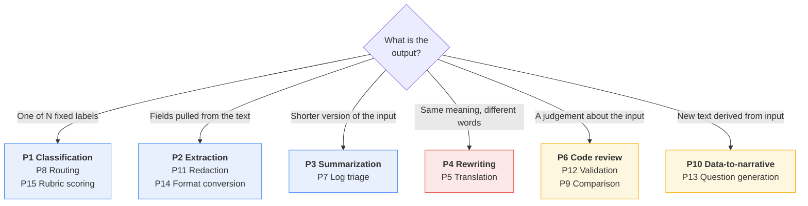
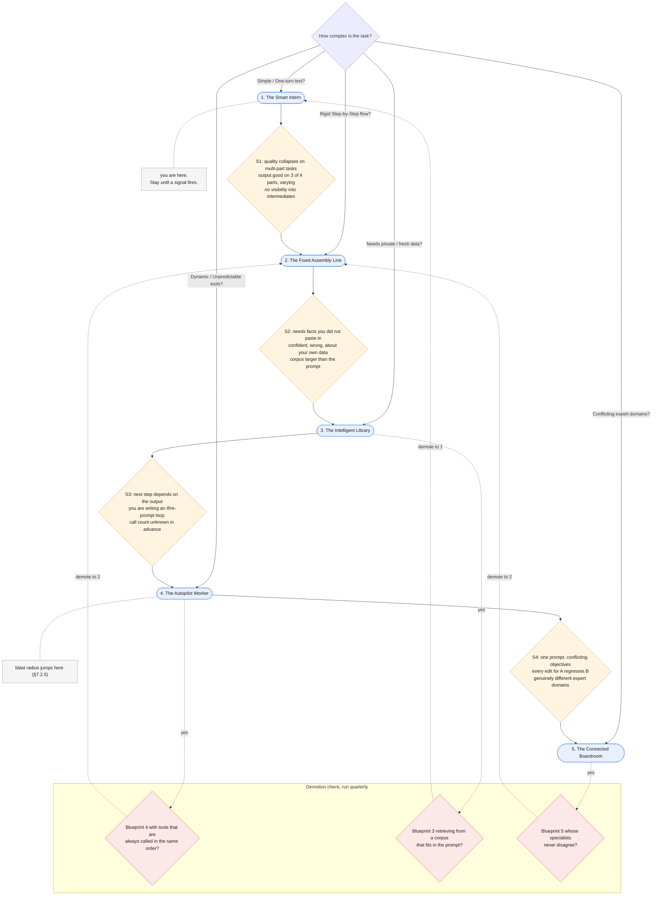

# Part VIII — Practice

Everything before this was explanation. This part is what you keep open in a second tab.

Fifteen templates you can paste and adapt, twelve ways to ruin them, one page of
compressed rules, and the diagnostic that tells you when the Smart Intern has run out of
room and needs a bigger blueprint.

---

## 8.1 Pattern library

Every snippet below uses one shared helper. Define it once.

```python
"""patterns.py — shared runner for every template in §8.1."""

from typing import Literal
from google import genai
from pydantic import BaseModel, Field

client = genai.Client()
MODEL = "gemini-3.5-flash"

def ask(system: str, user: str, schema=None, thinking: str = "low"):
    kwargs = {
        "model": MODEL,
        "system_instruction": system,
        "input": user,
        "generation_config": {"thinking_level": thinking},
        "store": False,
    }
    if schema is not None:
        kwargs["response_format"] = {
            "type": "text",
            "mime_type": "application/json",
            "schema": schema.model_json_schema(),
        }
    out = client.interactions.create(**kwargs)
    return schema.model_validate_json(out.output_text) if schema else out.output_text
```

Two conventions used throughout: untrusted content always goes inside XML tags (§7.2), and
anything a machine will parse always carries a Pydantic schema (§3.4).

### Choosing a pattern



Rule of thumb from the colours: blue patterns are **cheap and testable** (exact-match
evals, `thinking_level: "minimal"`). Red are **subjective** (rubric evals, human review).
Amber are **reasoning-heavy** (higher thinking, higher cost, check the bill).

### P1 — Classification

**When:** you need exactly one label from a fixed, closed set. The ticket classifier.

```
Classify the <ticket> into exactly one category.
- billing   : charges, invoices, refunds, payment methods
- technical : errors, outages, performance, integrations
- account   : login, permissions, profile, cancellation
- other     : anything that fits none of the above
If two apply, choose the one the customer would pick.
If the ticket is empty or unintelligible, choose "other".

<ticket>{ticket}</ticket>
```

```python
CLASSIFY_SYSTEM = """Classify the <ticket> into exactly one category.
- billing   : charges, invoices, refunds, payment methods
- technical : errors, outages, performance, integrations
- account   : login, permissions, profile, cancellation
- other     : anything that fits none of the above
If two apply, choose the one the customer would pick.
If the ticket is empty or unintelligible, choose "other"."""

class Label(BaseModel):
    category: Literal["billing", "technical", "account", "other"]
    confidence: float = Field(ge=0, le=1)

def route_to_human(text: str) -> None:
    """Stands in for your own escalation code."""
    print("ESCALATE:", text[:60])

ticket = ticket_text                      # canonical fixture from the preamble (§0.10)

out = ask(CLASSIFY_SYSTEM, f"<ticket>{ticket}</ticket>", Label, thinking="minimal")
if out.confidence < 0.7:
    route_to_human(ticket)
```

**Gotcha:** an `Enum`/`Literal` in the schema is what actually constrains the label. Listing
categories in prose alone still yields `"Billing"`, `"billing/technical"`, and
`"technical (probably)"` at scale. Also: always include an escape category, or the model
will force a bad fit rather than say nothing.

### P2 — Extraction

**When:** pulling structured fields out of unstructured text. Invoices, resumes, emails.

```
Extract the listed fields from <document>.
- Copy values verbatim. Do not normalise, reformat, or correct them.
- If a field is absent, return null. Never guess or infer.
- If a field appears twice with different values, return the first.

<document>{doc}</document>
```

```python
EXTRACT_SYSTEM = """Extract the listed fields from <document>.
- Copy values verbatim. Do not normalise, reformat, or correct them.
- If a field is absent, return null. Never guess or infer.
- If a field appears twice with different values, return the first."""

class Invoice(BaseModel):
    invoice_number: str | None
    total_amount: str | None = Field(description="Verbatim, including currency symbol")
    due_date: str | None = Field(description="Verbatim as written, do not reformat")
    vendor_name: str | None

# The canonical memo (§0.10) contains none of these fields, so every one should come back
# null. That is the test worth running first — see the gotcha below.
doc = document_text

inv = ask(EXTRACT_SYSTEM, f"<document>{doc}</document>", Invoice, thinking="low")
```

**Gotcha:** make every field nullable. A non-nullable field is an instruction to hallucinate
— the model must produce *something*, so it produces a plausible invoice number. Normalise
dates and amounts in Python afterwards, where it is deterministic and testable.

### P3 — Summarization

**When:** long in, short out. The document summarizer.

```
Summarise <document> for {audience}. Output exactly:
- One sentence: what this document is.
- {n} bullets, each under 25 words.
- "Open questions:" followed by anything material left undefined.
Every claim traceable to the text. State no number the document does not state.
Hard limit {limit} words. No preamble.

<document>{doc}</document>

Reminder: {n} bullets, under {limit} words, grounded only in the text above.
```

```python
SUMMARY_SYSTEM = """Summarise <document> for a support team lead. Output exactly:
- One sentence: what this document is.
- 3 bullets, each under 25 words.
- "Open questions:" followed by anything material left undefined.
Every claim traceable to the text. State no number the document does not state.
Hard limit 120 words. No preamble."""

def build_sandwich(text: str) -> str:
    """Stands in for your own template code — instruction, data, restatement (§7.3.2)."""
    return (
        f"<document>{text}</document>\n\n"
        "Reminder: 3 bullets, under 120 words, grounded only in the text above."
    )

doc = document_text                       # canonical fixture from the preamble (§0.10)

summary = ask(SUMMARY_SYSTEM, build_sandwich(doc), thinking="medium")
```

**Gotcha:** "concise" and "brief" are not limits. Give a number, put it in both the
instruction and the restatement (§7.3.2), and assert it in your eval. Length is the single
most commonly violated instruction in long-context prompts.

### P4 — Rewriting / tone shift

**When:** same information, different register. The error-message rewriter.

```
Rewrite <text> for {audience}.
Preserve: every fact, every number, every named entity.
Change:   vocabulary, sentence length, tone.
Do not add: causes, reassurance, apologies, or next steps not in the source.
Target register: {register}. Target length: {length}.

<text>{text}</text>
```

```python
REWRITE_SYSTEM = """Rewrite <trace> for a support agent who cannot read code.
Preserve: every fact, every number, every named entity.
Change:   vocabulary, sentence length, tone.
Do not add: causes, reassurance, apologies, or next steps not in the source.
Target register: plain, calm, factual. Target length: three short paragraphs."""

class Rewrite(BaseModel):
    what_happened: str = Field(max_length=300)
    what_it_means: str = Field(max_length=300)
    what_to_do_next: str = Field(max_length=300)

# build_input() is the sandwich helper from §7.2.4; stack_trace is the preamble fixture.
out = ask(REWRITE_SYSTEM, build_input(stack_trace), Rewrite)
```

**Gotcha:** rewriting is where invention creeps in, because "make it friendlier" implicitly
licenses adding comfort. The explicit *do not add* list is load-bearing. Test it with a
trace that has no known cause and assert the output does not supply one.

### P5 — Translation

**When:** language conversion where terminology consistency matters.

```
Translate <source> from {src} to {tgt}.
Do not translate any term inside <glossary>; reproduce those exactly as given.
Preserve all markdown, placeholders like {name}, and code spans unchanged.
Match the source register: {register}. If a passage is already in {tgt}, leave it.

<glossary>{terms}</glossary>
<source>{text}</source>
```

```python
TRANSLATE_SYSTEM = """Translate <source> from English to French.
Do not translate any term inside <glossary>; reproduce those exactly as given.
Preserve all markdown, placeholders like {name}, and code spans unchanged.
Match the source register: plain support English. If a passage is already in French,
leave it."""

class Translation(BaseModel):
    text: str
    untranslated_terms: list[str] = Field(description="Glossary terms left as-is")
    notes: list[str] = Field(description="Ambiguities the translator had to resolve")

GLOSSARY = ["GatewayTimeout", "idempotency key", "authorisation tier"]
source_text = (
    "We could not confirm your payment because the gateway did not respond. "
    "Nothing has been charged to {card_label}. Please try again in a few minutes."
)
payload = (
    "<glossary>" + ", ".join(GLOSSARY) + "</glossary>\n"
    f"<source>{source_text}</source>"
)

t = ask(TRANSLATE_SYSTEM, payload, Translation, thinking="medium")
```

**Gotcha:** interpolation placeholders (`{name}`, `%s`, `{{count}}`) get "translated" or
silently reordered, and your string formatting breaks in production in a language nobody on
the team reads. Assert placeholder set equality between source and output in code.

### P6 — Code review

**When:** a diff or a file in, structured findings out.

```
Review the code in <diff>.
Report only defects visible in this diff. Do not speculate about code you cannot see.
Do not comment on style unless it causes a bug.
For each finding: file, line, severity (blocker/major/minor), the problem in one
sentence, and a concrete replacement.
If there are no defects, return an empty list. Do not invent findings to seem useful.

<diff>{diff}</diff>
```

```python
REVIEW_SYSTEM = """Review the code in <diff>.
Report only defects visible in this diff. Do not speculate about code you cannot see.
Do not comment on style unless it causes a bug.
For each finding: file, line, severity (blocker/major/minor), the problem in one
sentence, and a concrete replacement.
If there are no defects, return an empty list. Do not invent findings to seem useful."""

class Finding(BaseModel):
    file: str
    line: int
    severity: Literal["blocker", "major", "minor"]
    problem: str
    suggested_fix: str

class Review(BaseModel):
    findings: list[Finding]

# The change that caused the duplicate charges in the canonical incident.
diff = """--- a/app/services/billing.py
+++ b/app/services/billing.py
@@ -211,7 +211,11 @@ def charge_customer(self, payload):
-        response = gateway.submit(payload, timeout=self.timeout)
+        for _ in range(3):
+            try:
+                response = gateway.submit(payload, timeout=self.timeout)
+                break
+            except GatewayTimeout:
+                continue
         return response"""

r = ask(REVIEW_SYSTEM, f"<diff>{diff}</diff>", Review, thinking="high")
```

**Gotcha:** "return an empty list" needs saying explicitly, and needs testing on a clean
diff. Without it a reviewer that finds nothing will manufacture a nitpick, and your team
learns to ignore it within a week.

### P7 — Log triage

**When:** a stack trace or log burst in, an actionable disposition out.

```
Triage the incident in <log>. Decide: severity, the most likely failing component,
and whether this needs a human now.
Base every conclusion on evidence in the log. Quote the line you based it on.
If the log is insufficient to decide, set severity to "unknown" and say what is missing.

<log>{log}</log>

Reminder: quote your evidence. Do not name a cause the log does not support.
```

```python
TRIAGE_SYSTEM = """Triage the incident in <log>. Decide: severity, the most likely failing
component, and whether this needs a human now.
Base every conclusion on evidence in the log. Quote the line you based it on.
If the log is insufficient to decide, set severity to "unknown" and say what is
missing."""

class Triage(BaseModel):
    severity: Literal["p1", "p2", "p3", "unknown"]
    component: str
    evidence_line: str = Field(description="Verbatim line the decision rests on")
    page_human_now: bool
    missing_context: list[str]

t = ask(TRIAGE_SYSTEM, f"<log>{stack_trace}</log>", Triage, thinking="medium")
```

**Gotcha:** requiring a verbatim evidence quote is the cheapest hallucination check you can
buy — you can assert in code that `t.evidence_line in stack_trace`. If it is not, the triage is
fabricated and you reject it without a human ever seeing it.

### P8 — Routing

**When:** deciding which downstream system, team, or prompt handles this next.

```
Route <request> to exactly one destination.
- {dest_a} : {description_a}
- {dest_b} : {description_b}
- human    : anything ambiguous, hostile, or outside the list
Return destination, confidence 0-1, and a one-line reason.
Prefer "human" over a low-confidence guess.

<request>{request}</request>
```

```python
ROUTE_SYSTEM = """Route <request> to exactly one destination.
- refunds     : duplicate charges, invoice corrections, money back
- engineering : errors, outages, broken pages, integrations
- sales       : pricing, upgrades, extra seats, contracts
- human       : anything ambiguous, hostile, or outside the list
Return destination, confidence 0-1, and a one-line reason.
Prefer "human" over a low-confidence guess."""

class Route(BaseModel):
    destination: Literal["refunds", "engineering", "sales", "human"]
    confidence: float = Field(ge=0, le=1)
    reason: str = Field(max_length=140)

req = ticket_text                         # canonical fixture from the preamble (§0.10)

r = ask(ROUTE_SYSTEM, f"<request>{req}</request>", Route, thinking="minimal")
dest = r.destination if r.confidence >= 0.8 else "human"
```

**Gotcha:** the confidence number is a model-generated string of digits, not a calibrated
probability. It is useful as a *relative* signal — tune the threshold against your eval set
— and worthless as an absolute one. Never report it to a user as a percentage.

### P9 — Comparison

**When:** two documents, two versions, two vendors — what differs and does it matter.

```
Compare <a> and <b> on exactly these dimensions: {dimensions}.
For each: A's position, B's position, and whether the difference is material.
If a document is silent on a dimension, say "not stated" — do not infer.
Do not declare a winner unless asked.

<a>{a}</a>
<b>{b}</b>
```

```python
COMPARE_SYSTEM = """Compare <a> and <b> on exactly these dimensions: timeout behaviour,
idempotency support, refund window.
For each: A's position, B's position, and whether the difference is material.
If a document is silent on a dimension, say "not stated" — do not infer.
Do not declare a winner unless asked."""

class Row(BaseModel):
    dimension: str
    a_position: str
    b_position: str
    material: bool

class Comparison(BaseModel):
    rows: list[Row]
    dimensions_not_covered: list[str]

vendor_a = """Paygate: charge requests time out after 30s. A timed-out charge may or may
not have completed. Idempotency keys are accepted on every charge endpoint. Refunds may be
issued within 180 days."""
vendor_b = """Cardline: charge requests time out after 10s and are rolled back before the
timeout is returned to the caller. Refunds may be issued within 90 days."""
payload = f"<a>{vendor_a}</a>\n<b>{vendor_b}</b>"

c = ask(COMPARE_SYSTEM, payload, Comparison, thinking="high")
```

**Gotcha:** without a fixed dimension list the model picks its own, and two runs over the
same pair produce non-comparable tables. Fix the dimensions in the prompt; that is what
makes the output aggregatable across many comparisons.

### P10 — Data-to-narrative

**When:** rows, metrics or a chart series in, readable prose out.

```
Write a narrative summary of <data> for {audience}.
- Every number you state must appear in the data. Never compute a missing figure.
- Describe direction and magnitude. Do not attribute causes; the data contains none.
- {n} sentences maximum. No bullet points.

<data>{csv}</data>
```

```python
NARRATIVE_SYSTEM = """Write a narrative summary of <data> for a support team lead.
- Every number you state must appear in the data. Never compute a missing figure.
- Describe direction and magnitude. Do not attribute causes; the data contains none.
- 4 sentences maximum. No bullet points."""

# Named csv_text, not csv: `csv` is a standard-library module.
csv_text = """date,failed_charges,duplicate_charges,refunds_issued
2025-10-01,14,0,0
2025-10-02,17,0,0
2025-10-03,1842,96,96
2025-10-04,21,0,0"""

narrative = ask(NARRATIVE_SYSTEM, f"<data>{csv_text}</data>", thinking="medium")
for n in re.findall(r"\d[\d,\.]*", narrative):     # cheap arithmetic guard
    assert n.replace(",", "") in csv_text.replace(",", ""), f"invented figure: {n}"
```

**Gotcha:** models will happily compute a percentage change, and will sometimes compute it
wrong. Either pre-compute every derived figure in Python and put it in the data, or forbid
arithmetic outright. Do not let the model do maths you are going to publish.

### P11 — Redaction

**When:** stripping identifiers before text goes anywhere else.

```
Return <text> with every instance of the listed categories replaced by a placeholder.
Categories: names, emails, phone numbers, postal addresses, account numbers, IP
addresses, dates of birth -> [NAME] [EMAIL] [PHONE] [ADDRESS] [ACCOUNT] [IP] [DOB].
Change nothing else. Preserve all formatting, whitespace and line breaks exactly.
If unsure whether something is identifying, redact it.

<text>{text}</text>
```

```python
REDACT_SYSTEM = """Return <text> with every instance of the listed categories replaced by a
placeholder.
Categories: names, emails, phone numbers, postal addresses, account numbers, IP
addresses, dates of birth -> [NAME] [EMAIL] [PHONE] [ADDRESS] [ACCOUNT] [IP] [DOB].
Change nothing else. Preserve all formatting, whitespace and line breaks exactly.
If unsure whether something is identifying, redact it."""

class Redacted(BaseModel):
    text: str
    redaction_count: int
    categories_found: list[str]

# Synthetic sample only — reserved example domain, reserved phone range, TEST-NET-3 address.
text = """Call notes: A. Nkemelu (a.nkemelu@example.com, +44 7700 900412) reports two
GBP 49.00 charges on account 88231-04, seen from 203.0.113.44 on 3 October."""

r = ask(REDACT_SYSTEM, f"<text>{text}</text>", Redacted, thinking="medium")
```

**Gotcha:** this is the pattern most likely to be misused. An LLM redactor has a non-zero
miss rate, and *you have already sent the raw text to the API to get it redacted*. Use
deterministic regex/NER for known formats first; use the model only as a second pass for
free-text names. Never present it as a compliance control on its own.

### P12 — Validation / checking

**When:** does this artifact satisfy this rule? A verdict plus evidence.

```
Check whether <artifact> satisfies every rule in <rules>.
For each rule return: rule id, pass/fail/not-applicable, and the exact span of the
artifact that decides it. If you cannot locate a deciding span, the result is
"insufficient-evidence", not "pass".

<rules>{rules}</rules>
<artifact>{artifact}</artifact>
```

```python
CHECK_SYSTEM = """Check whether <artifact> satisfies every rule in <rules>.
For each rule return: rule id, pass/fail/not-applicable, and the exact span of the
artifact that decides it. If you cannot locate a deciding span, the result is
"insufficient-evidence", not "pass"."""

class Check(BaseModel):
    rule_id: str
    result: Literal["pass", "fail", "not-applicable", "insufficient-evidence"]
    evidence: str

class Report(BaseModel):
    checks: list[Check]

RULES = [
    ("R1", "Says what happened without naming a cause the trace does not support."),
    ("R2", "Tells the reader exactly what to do next."),
    ("R3", "Mentions no card, billing address or payment-method detail."),
]
artifact = """We could not confirm your payment because the payment provider did not
respond in time. Nothing has been charged yet. Please try again in a few minutes; if you
see two charges, contact support and we will refund the duplicate."""
payload = (
    "<rules>\n"
    + "\n".join(f"{rid}: {body}" for rid, body in RULES)
    + f"\n</rules>\n<artifact>{artifact}</artifact>"
)

rep = ask(CHECK_SYSTEM, payload, Report, thinking="high")
assert len(rep.checks) == len(RULES), "model dropped a rule"
```

**Gotcha:** the model silently drops rules from long rule lists. Assert the count in code
and re-run the missing ones individually. Also: an "insufficient-evidence" option is what
stops absence of a violation being reported as compliance.

### P13 — Question generation

**When:** producing comprehension questions, interview prompts, or eval cases from a source.

```
Generate {n} questions answerable solely from <source>. Each must:
- be answerable from the source alone, with the answer span present in the text;
- have exactly one correct answer;
- not be answerable from general knowledge without the source.
Return the question, the verbatim answer span, and a difficulty of easy/medium/hard.

<source>{source}</source>
```

```python
QGEN_SYSTEM = """Generate 5 questions answerable solely from <source>. Each must:
- be answerable from the source alone, with the answer span present in the text;
- have exactly one correct answer;
- not be answerable from general knowledge without the source.
Return the question, the verbatim answer span, and a difficulty of easy/medium/hard."""

class QA(BaseModel):
    question: str
    answer_span: str = Field(description="Verbatim from source")
    difficulty: Literal["easy", "medium", "hard"]

class QuestionSet(BaseModel):     # wrap the list: schemas need a model, not list[QA]
    questions: list[QA]

src = document_text                       # canonical fixture from the preamble (§0.10)

qs = ask(QGEN_SYSTEM, f"<source>{src}</source>", QuestionSet, thinking="high").questions
```

**Gotcha:** most generated questions are answerable without the source ("What is a payment
gateway?"). The "not answerable from general knowledge" clause helps; verifying it does not
is better — run each question with no source and discard any the model answers correctly.

### P14 — Format conversion

**When:** prose to JSON, markdown to CSV, one schema to another.

```
Convert <input> from {from_format} to {to_format}.
Preserve all information. Invent nothing. If a required target field has no source
value, use null and list it under "lossy".
Output only the converted content. No commentary, no code fences.

<input>{content}</input>
```

```python
CONVERT_SYSTEM = """Convert <input> from prose to JSON with the keys invoice_number,
issue_date, vendor, total, payment_terms.
Preserve all information. Invent nothing. If a required target field has no source
value, use null and list it under "lossy".
Output only the converted content. No commentary, no code fences."""

class Converted(BaseModel):
    result: str
    lossy: list[str] = Field(description="Target fields with no source value")

content = """Invoice 2025-10-118 from Paygate Ltd, dated 3 October 2025. Total GBP 98.00,
covering two duplicate subscription charges. Terms: net 30."""

c = ask(CONVERT_SYSTEM, f"<input>{content}</input>", Converted, thinking="low")
```

**Gotcha:** asking for JSON in prose gets you JSON wrapped in ```` ```json ```` fences about
a third of the time, and your parser breaks intermittently. Use `response_format` with a
schema — then the fences cannot happen. See anti-pattern A8.

### P15 — Rubric scoring

**When:** scoring free-text output against a rubric — the backbone of your eval set (§6.4).

```
Score <response> against the rubric. Do not rewrite it, do not improve it, score it.
1. {criterion_1} — 0 (absent) / 1 (partial) / 2 (fully met)
2. {criterion_2} — 0 / 1 / 2
For each criterion give the score and quote the span that justifies it.
Do not award a score you cannot quote evidence for.

<response>{response}</response>
```

```python
RUBRIC_SYSTEM = """Score <response> against the rubric. Do not rewrite it, do not improve
it, score it.
1. Says what happened without inventing a cause — 0 (absent) / 1 (partial) / 2 (fully met)
2. Tells the reader what to do next — 0 / 1 / 2
For each criterion give the score and quote the span that justifies it.
Do not award a score you cannot quote evidence for."""

class Score(BaseModel):
    criterion: str
    score: Literal[0, 1, 2]
    evidence: str

class Scorecard(BaseModel):
    scores: list[Score]
    total: int

resp = """The payment provider did not respond in time, so we could not confirm your
payment. Nothing has been charged. Please try again in a few minutes."""

card = ask(RUBRIC_SYSTEM, f"<response>{resp}</response>", Scorecard, thinking="high")
```

**Gotcha:** LLM judges are lenient and drift toward the middle. Calibrate against 20
human-scored examples before trusting the judge, re-calibrate on every model change, and
never use the same model to both generate and score without at least spot-checking.

---

## 8.2 Twelve anti-patterns

| # | Anti-pattern | Why it is tempting | What it costs | The fix |
|---|---|---|---|---|
| **A1** | **Politeness padding** — "please", "thank you so much", "if you don't mind" | It is how we talk to people, and it feels like it should help | Tokens on every call, forever. No measurable quality gain. At 1M calls/month the padding alone is a real line item | Write imperatives. "Classify the ticket." Save the manners for humans |
| **A2** | **"Act as a world-class expert"** | Feels like it unlocks a better model | Nothing testable changes. It displaces the specific constraints you should have written in that space | Replace the adjective with the behaviour: not "expert summariser" but "three bullets, under 25 words each, grounded in the text" (§3.2) |
| **A3** | **Stacking contradictory constraints** — "comprehensive but brief", "detailed yet concise" | Each constraint sounds good written alone | The model silently picks one, and which one varies per call. Your output length is now random | Pick one and quantify it. "Under 120 words." Contradictions are resolved by whichever survives; make it deterministic |
| **A4** | **Negative-only instruction** — "don't be verbose, don't use jargon, don't speculate" | It is how you noticed the problem | Defines an infinite space of not-that. The model has no target to aim at, and negations are weakly attended | State the positive. "Use words a non-technical reader knows. Maximum 120 words." Keep negatives only for genuine prohibitions ("never invent a cause") |
| **A5** | **No output schema on machine-consumed output** | It worked in the notebook | Format drifts across model versions, prompt edits, and unusual inputs. Your parser fails at 3am on input #40,000 | `response_format` with a Pydantic schema on every parsed output. Non-negotiable (§3.4) |
| **A6** | **Examples that contradict the instruction** | Examples get pasted in from an older prompt and never re-read | Examples win. Silently. You debug the instruction for an hour while the example overrides it | Diff every example against every instruction when either changes. Assert the invariant in your eval set (§3.3) |
| **A7** | **Burying the instruction mid-document** | It reads naturally to a human | Middle positions are the weakest (§7.3.1). With long input the instruction is effectively invisible | Instruction first, data in the middle, instruction restated last |
| **A8** | **Asking for JSON in prose** — "respond in JSON format" | It usually works | "Usually" is ~70-95%. The rest is markdown fences, a preamble sentence, or a trailing explanation. Intermittent parse failures are the worst kind of bug | Use the structured-output API. If you must parse free text, strip fences defensively and validate |
| **A9** | **Unbounded output** | You did not think about length | The model fills space. Costs scale with output, which is the expensive direction (§1.5). Latency scales with it too | Bound it two ways: a word limit in the instruction, and `max_length` on the schema field |
| **A10** | **Temperature fiddling on Gemini 3** — setting `temperature=0` for determinism | Fifteen years of folklore, and it was correct on older models | Google explicitly warns it can cause looping and degraded reasoning on Gemini 3. You trade a real capability for determinism you do not get | Leave it at 1.0 on Gemini 3. Get consistency from schema and specificity (§1.8). Classic advice still holds on 2.5-series |
| **A11** | **A single-shot call where a pipeline belongs** — "read this 200-page contract, extract every clause, cross-reference them, and write the risk memo" | One call is simpler to write | Quality collapses on the hardest sub-task and takes the whole output with it. You cannot tell which stage failed, because there are no stages | Decompose. Extract, then check, then narrate — three prompts, three eval sets. That is Blueprint 2 (§8.4) |
| **A12** | **Shipping without an eval set** | The demo worked. Everyone was impressed | You have no idea whether your next prompt edit helps or hurts. Every change is a coin flip you cannot observe. Regressions are found by customers | Twenty labelled cases before launch, including empty, malformed and hostile input. Run them on every prompt change (§6.4). It is the highest-return hour in this chapter |

Three of these are worth an extra sentence because they are the ones people argue about:

- **A2 is not "personas never work."** A role that carries genuine information — "You are
  reviewing this for a support agent who cannot read code" — encodes an audience and does
  work. "World-class expert" encodes nothing. The test: does the phrase change what a
  careful writer would produce? If not, delete it.
- **A10 is model-specific, not universal.** If you are on `gemini-2.5-flash`, lowering
  temperature for extraction is still correct. The failure is applying either rule without
  checking which model you are on.
- **A12 is the only one that is fatal.** Every other anti-pattern here is discoverable *by
  an eval set*. Without one, you cannot find any of them.

---

## 8.3 One-page cheat sheet

> Print this. Everything else in the chapter is elaboration on it.

**Call shape**

```python
from google import genai
client = genai.Client()                       # reads GEMINI_API_KEY
MODEL = "gemini-3.5-flash"                    # fallback: gemini-2.5-flash

class Rewritten(BaseModel):                   # any Pydantic model describing the output
    what_happened: str
    what_to_do_next: str

out = client.interactions.create(
    model=MODEL,
    system_instruction=SYSTEM,                # stable: who + how
    input=USER,                               # varying: what, this time
    generation_config={"thinking_level": "low"},
    response_format={"type": "text", "mime_type": "application/json",
                     "schema": Rewritten.model_json_schema()},
    store=False,                              # stateless single-shot default
)
# read: out.output_text | out.usage.total_tokens | out.steps
```

**Prompt skeleton** — in this order, every time

| Slot | Contains |
|---|---|
| 1. Role | Only if it encodes real information (audience, constraint) |
| 2. Task | One imperative sentence |
| 3. Rules | Positive statements. Numbers, not adjectives |
| 4. Format | Exhaustive. Plus a schema if parsed |
| 5. Examples | 2–5, consistent with rules 3 and 4 |
| 6. Data | Inside XML tags. Untrusted |
| 7. Restated task | The last word is yours |

**Settings**

| Knob | Set it to | Why |
|---|---|---|
| `temperature` | **1.0 on Gemini 3** | Lower values risk looping/degradation |
| `thinking_level` | `minimal`/`low` classify & extract · `medium` compare & summarise · `high` review, plan, judge | Thought tokens are billed |
| `store` | `False` for stateless | Paid tier retains 55 days; free tier 1 day |
| `stream` | `True` if a human waits | Fixes TTFT, not total latency |
| output length | Bound in instruction **and** schema | Output is the expensive direction |

**Token facts**

| | |
|---|---|
| Text | ~4 chars/token · 100 tok ≈ 60–80 words |
| Image ≤384px | 258 tokens flat |
| Image larger | 768×768 tiles, 258 tokens each |
| Audio | 32 tokens/second |
| Video | 263 tokens/second |
| Truth | `client.models.count_tokens(...)` — input only |
| Limits | `client.models.get(model=MODEL).input_token_limit` |

**Debug ladder** — in this order

| Symptom | First thing to try |
|---|---|
| Wrong format | Add a schema. Stop asking in prose |
| Too long | Numeric limit in instruction + `max_length` in schema |
| Invents facts | "State nothing the source does not state" + require a verbatim evidence quote |
| Inconsistent across runs | More specificity + tighter schema. **Not** lower temperature |
| Ignores an instruction | Move it to the front, restate it at the end |
| Ignores it in a long doc | Instruction sandwich (§7.3.2) |
| Fails only on edge cases | Define empty/malformed/hostile behaviour explicitly |
| Costs too much | Check `total_thought_tokens` first. Then trim input. Then cap output |
| Slow for a user | `stream=True`, lower `thinking_level` |
| Fails and you can't tell why | You need an eval set, not a prompt edit |

**Never**

Secrets in the system instruction · untrusted text outside tags · unvalidated output into
automation · a tool bolted onto a Smart Intern (that is Blueprint 4) · `temperature=0` on
Gemini 3 · shipping without 20 labelled cases.

---

## 8.4 When the Intern needs a promotion

The parent article's Golden Rule:

> **Always start with the simplest pattern that works. Only upgrade your complexity tier
> when your requirements absolutely force you to.**

"Absolutely force you to" needs a definition, or it becomes an excuse in both directions.
Here are the four signals. Each is observable, not a matter of taste.

| # | Failure signal | What you observe | Root cause | Promote to |
|---|---|---|---|---|
| **S1** | **Quality collapses on multi-part tasks** | The prompt does four things; output is good on three and wrong on the fourth, and *which* one varies. Adding instructions makes a different part worse | One turn cannot allocate effort per sub-task, and you cannot inspect intermediates | **Blueprint 2 — The Fixed Assembly Line.** Split into stages, eval each, validate between them |
| **S2** | **It needs facts you did not paste in** | Confident answers about your product, policies, prices — and they are wrong. Grounding language does not help, because there is nothing to ground *in* | A Smart Intern can only be grounded in what is in the prompt (§1.11). The corpus is bigger than the prompt | **Blueprint 3 — The Intelligent Library.** Retrieve the relevant passages, then prompt |
| **S3** | **The next step depends on the output** | You are writing `if "refund" in response:` and re-prompting. The number of calls is not knowable in advance. You are building a loop in application code, badly | The task requires acting, observing, and deciding — that is a loop, not a turn | **Blueprint 4 — The Autopilot Worker.** Give it tools and let it loop. Accept the blast radius (§7.2.5) |
| **S4** | **One prompt is serving conflicting objectives** | The instruction has grown to 900 words containing "be legally cautious" and "be commercially persuasive". Every edit for one constituency regresses the other | Genuinely conflicting expert domains cannot be optimised in a single objective | **Blueprint 5 — The Connected Boardroom.** Separate specialists, a supervisor to reconcile |

**Before you promote, check it is not one of these instead** — each looks like a signal and
is not:

| Looks like | Actually is | Do this |
|---|---|---|
| S1 | No output schema; you are seeing format drift, not capability limits | A5 |
| S2 | The facts *were* in the prompt, buried mid-document | A7 / §7.3.2 |
| S3 | Plain conditional logic. Two branches, both known in advance | Write the `if`. It is cheaper, faster, and testable |
| S4 | Two adjectives, not two domains | A3 — quantify and pick |

### The extended decision tree

The article's tree told you where to start. This one adds the diagnostics that tell you
when to leave.



That last block is the half of the Golden Rule nobody applies. Complexity ratchets upward
by default because every increment has a local justification. **Schedule the demotion
review, or you will be running a Boardroom to rewrite error messages.**

---

## 8.5 Hands-on exercises for this week

Four exercises. Each is 15–30 minutes with the code from this chapter. They build on each
other, so do them in order.

### Exercise 1 — Make the weak prompt fail on purpose

*Uses: §7.1.1, §3.1, §6.4*

1. Take `WEAK_PROMPT` from §7.1.1 and run it over the canonical `GatewayTimeout` trace
   **ten times**, saving each output. Count how many produce three sections, how many
   invent a cause not in the trace, and record the character length of each.
2. Run the prompt critic from §7.1.2 against it. Compare the critic's defect list to the
   failures you actually observed. Note which failures the critic predicted, and — more
   interesting — which observed failure it **missed**.
3. Apply only the critic's `blocker` rewrites. Re-run ten times. Report the before/after
   numbers for all three metrics.

**You should finish knowing:** how much variance a vague prompt has, and how much of it a
critic can find by reading alone.

### Exercise 2 — Break your own rewriter, then fix it

*Uses: §7.2.2, §7.2.4*

1. Append the injection payload from §7.2.2 to the canonical stack trace and run it through
   the **undefended** prompt. Record exactly what leaks. If nothing leaks on the first try,
   run it five more times and try one variation of the payload — this is probabilistic.
2. Run the same input through `hardened_rewriter.py` from §7.2.4. Then remove the defences
   one at a time — first the restatement, then the schema, then `sanitize()` — and record
   which single removal first lets something through.
3. Write down, in two sentences, what an attacker would actually gain from a successful
   injection against *your* deployment. Then list every additional thing they would gain if
   you gave this prompt one tool.

**You should finish knowing:** which defence is doing the most work in your setup, and what
your real blast radius is.

### Exercise 3 — Find where your long context sags

*Uses: §7.3.1, §7.3.2, §1.2*

1. Take a real document of 5,000+ words. Plant a distinctive sentence — an invented product
   codename and a specific number — at 10%, 50% and 90% depth, producing three variants.
   Confirm the token count of each with `count_tokens`.
2. Ask a direct question that only the planted sentence answers. Run each variant five
   times. Build a 3×5 hit/miss table. Then repeat with the instruction sandwich from
   §7.3.2 and add three more columns.
3. Convert the same document to a PDF, send it as a file payload instead of text, and
   compare `usage.total_input_tokens` against the text version. Calculate the multiplier.

**You should finish knowing:** where *your* documents sag, and what layout understanding
actually costs you in tokens.

### Exercise 4 — Build the eval set you keep postponing

*Uses: §8.1, §8.2 A12, §6.4, §7.1.4*

1. Pick one of the three canonical tasks. Write **twenty** labelled cases: twelve ordinary,
   four edge (empty input, truncated trace, wrong language, enormous input), two hostile
   (injection attempts), two that should be refused or escalated. Store them as JSON, in
   the repo, next to the prompt.
2. Write the scorer. Use assertions where you can (`must_contain`, `must_not_contain`,
   `max_chars`, schema validity, `evidence in source`) and the P15 rubric pattern only for
   what genuinely needs judgement. Score your current prompt. Write the number down.
3. Now run three prompt edits you have been meaning to make — one from the P-library, one
   from the anti-pattern list, one of your own. Score each. Keep only the ones that beat
   the baseline on the twelve ordinary cases **without** regressing the four edge cases.

**You should finish knowing:** your actual baseline number, and whether the changes you
were confident about were improvements at all.

---

**Post your Exercise 1 before-and-after numbers, or your Exercise 4 baseline score, in the
comments.** The interesting part is never the final number — it is the gap between the
failures you predicted and the ones you actually measured. I would like to know which
failure the critic missed for you.

---

## Where to go next

That is Blueprint 1 in full. One prompt in, one response out — and roughly two hundred
decisions hiding inside that sentence.

- **Back to the map:** [00-index.md](./00-index.md) — full contents and the three reading
  routes.
- **The one thing to do this week:** Exercise 4. If you do nothing else from this chapter,
  build the eval set. Every other technique here is unmeasurable without it.
- **Next in the series:** *Blueprint 2 — The Fixed Assembly Line.* When one turn is not
  enough, the next simplest thing is not an agent — it is a pipeline with validation between
  the stages. We take the tasks that failed signal **S1** above and decompose them properly,
  including the part everyone skips: what to do when stage 2 receives input that stage 1
  should never have produced.

*Everything in this chapter still applies there. A pipeline is four Smart Interns in a
trench coat, and every one of them still needs a schema, a delimiter, and an eval set.*
