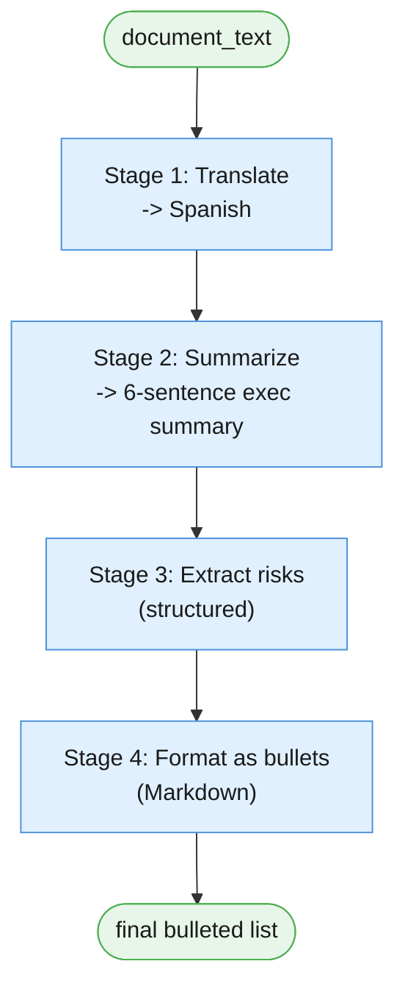
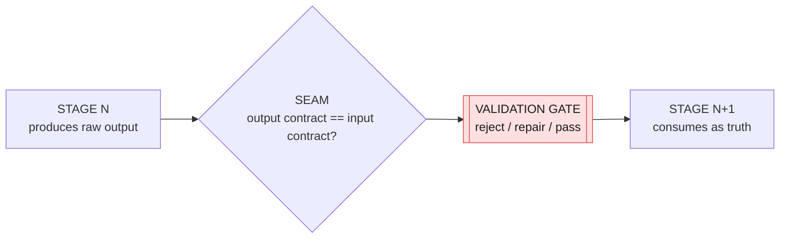
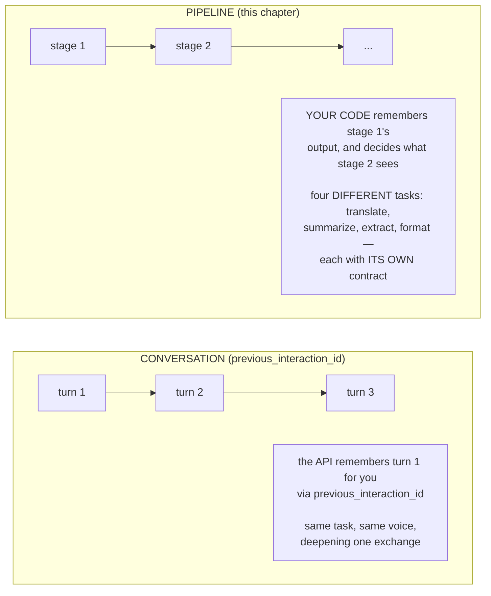
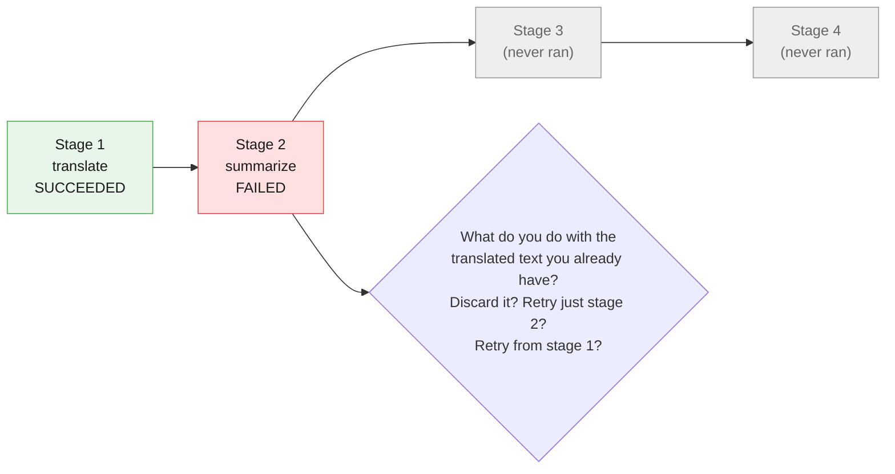

# Part I — Vocabulary of a Pipeline

Chapter 1 built its vocabulary around one call. This chapter builds its vocabulary around
one *chain* of calls — same worked example the whole way through, so every term lands on
something concrete instead of floating free.

The example is the article's own: the **Risk Report Pipeline**. Technical text in, bulleted
risk list out, four stages in between.

---

## 1.1 The worked example

`document_text` — the post-incident review memo from the session preamble — is our source.
The pipeline runs it through four fixed stages, in this order, always:



Before decomposing it, watch it run as a black box. This is real, runnable code — the full
build is in §2.5; here is the shape, so the vocabulary that follows has something to point
at:

```python
# client, MODEL and document_text come from the session preamble in 00-index.md.
# This is the black-box view: four client.interactions.create calls, chained by
# plain Python, nothing else. §2.5 builds this for real with validation at each seam.

translated = client.interactions.create(
    model=MODEL,
    system_instruction="Translate the input to Spanish. Return only the translation.",
    input=document_text,
    store=False,
).output_text

summary = client.interactions.create(
    model=MODEL,
    system_instruction=(
        "Summarise this document for an executive reader. Lead with the decision, "
        "risk or ask. Six sentences maximum. Ground every claim in the source."
    ),
    input=translated,
    store=False,
).output_text

risks_raw = client.interactions.create(
    model=MODEL,
    system_instruction="List every risk or issue mentioned, one per line, no commentary.",
    input=summary,
    store=False,
).output_text

bulleted = "\n".join(f"- {line.strip()}" for line in risks_raw.splitlines() if line.strip())
print(bulleted)
```

Four calls. Each one's output became the next one's input, verbatim, with no human in the
loop. That handoff — output of stage N becomes input of stage N+1, unattended — is the
entire mechanism this chapter names and hardens. Everything from here decomposes that block.

---

## 1.2 Stage

**A stage is a single unit of work with exactly one input contract and one output
contract.** Stage 1 above takes "document text" and produces "translated text." Stage 2
takes "translated text" and produces "executive summary." Nothing more is guaranteed and
nothing more should be assumed.

**A stage does not have to be a model call.** This is easy to miss and important enough
that Pipeline B (the Incident Response Pipeline, §2.5 in later parts) is built specifically
to make the point: its second stage is a plain Python `if` statement — no prompt, no model,
no tokens spent — and it is exactly as much "a stage" as the three model calls around it.
A stage is defined by its contract, not by what happens inside it.

| Property | Stage 1 (translate) | Stage 2 (summarize) |
|---|---|---|
| Input contract | Source-language prose | Translated prose |
| Output contract | Target-language prose | ≤6-sentence exec summary |
| Implementation | Model call | Model call |
| Could it be code instead? | No — translation needs the model | No — summarization needs the model |

---

## 1.3 Data contract / seam

**The seam is the boundary between two stages. The data contract is the schema both sides
must agree on at that seam.** Stage N's output contract and stage N+1's input contract are
not two documents — they should be the *same* document, or stage N+1 will silently consume
garbage.

Here is that seam breaking, concretely. Stage 1 is supposed to emit **translated text and
nothing else**. Suppose the system instruction is looser than it should be:

```python
# BROKEN CONTRACT — do not use. system_instruction invites prose framing
# instead of pure translated output.
loose_translate = client.interactions.create(
    model=MODEL,
    system_instruction="Please translate the following document into Spanish for me.",
    input=document_text,
    store=False,
).output_text

print(loose_translate[:80])
# Possible output: "Claro, aquí tienes la traducción del documento al español:\n\n..."
```

Stage 2 expects `translated` to be *only* translated document text — that is its input
contract. What it actually receives is a sentence of chat-assistant preamble glued onto the
front of the translation. Stage 2 will summarize the preamble along with the document,
possibly reporting "the assistant offered to help translate a document" as if it were
content from the incident memo. Nobody threw an exception. The pipeline kept running. The
output is just quietly wrong — which is worse than a crash, because a crash gets noticed.

The fix is not "hope the model behaves." It is: state the output contract in the prompt
(§2.4's job), and then check it in code before it crosses the seam (§1.4's job):

```python
def looks_like_pure_translation(text: str) -> bool:
    """A minimal seam gate: reject obvious chat-assistant framing before it
    reaches stage 2. Not a full grammar check — just a smell test."""
    banned_openers = ("claro,", "aquí tienes", "por supuesto", "here is", "sure,")
    return not text.strip().lower().startswith(banned_openers)


print(looks_like_pure_translation(loose_translate))   # False — caught at the seam
```



---

## 1.4 Step function

**A step function is the deterministic wrapper around one stage.** It is not the model
call itself — it is everything *around* the call that makes the stage trustworthy: validate
input, call the model (or don't), validate output, return a typed result.

Minimal shape, not a framework:

```python
def run_stage(
    stage_name: str,
    input_text: str,
    validate_input: "Callable[[str], bool]",
    call_model: "Callable[[str], str]",
    validate_output: "Callable[[str], bool]",
) -> str:
    """The generic shape every stage in this chapter follows. Not runnable as
    written — Callable needs importing from typing if you want to execute this
    exact signature. §2.5 gives you the concrete, working version per stage."""
    if not validate_input(input_text):
        raise ValueError(f"{stage_name}: input contract violated")
    output_text = call_model(input_text)
    if not validate_output(output_text):
        raise ValueError(f"{stage_name}: output contract violated")
    return output_text
```

Four moves, always in this order: **validate in → call → validate out → return.** Skip the
first validation and a stage silently processes garbage from an already-broken upstream
seam. Skip the second and a broken output propagates to the next stage looking legitimate.

---

## 1.5 Pipeline vs turn vs conversation

Chapter 1 defined a **turn** as one prompt/completion exchange. A **pipeline** is *not* a
longer turn, and it is not a **conversation** either — it is your own code calling the model
several separate times and doing the remembering itself.

This distinction is easy to get backwards, because the Interactions API has a real feature
for multi-turn state (`previous_interaction_id`), and it is tempting to reach for it here.
Don't. Here is why:



Every stage in this chapter is called with `store=False` and no `previous_interaction_id`.
Each stage is a fresh, single-shot call — a Smart Intern in its own right — and the model
that ran stage 1 has no memory of stage 1 by the time stage 2 runs. **The chaining lives in
your Python variables, not in the API.** `translated` is a Python string sitting in your
process; you choose to pass it as stage 2's `input`. If your process crashes between stage 1
and stage 2, that state is gone unless *you* persisted it — the API was never holding it.

This matters for a concrete reason: it means you can validate, log, cache, retry, or even
hand-edit any intermediate value between stages, because it is just data in your program.
A conversation's turn 1 is not similarly inspectable or interceptable from the outside.

---

## 1.6 Cost and latency composition

**Pipeline cost is the sum of stage costs. Pipeline latency is the sum of stage latencies.**
There is no discount for chaining four calls instead of making one — if anything there is a
small tax, because each stage repeats whatever framing text it needs.

Illustrative numbers for the Risk Report Pipeline (marked illustrative — get real numbers
for your own documents with `count_tokens` and by timing your own calls, exactly as §1.1
showed):

```mermaid
flowchart TD
    subgraph COST["Cost composition (illustrative token counts)"]
        direction LR
        C1["Stage 1: Translate<br/>~900 in / ~950 out"] --> C2["Stage 2: Summarize<br/>~950 in / ~180 out"] --> C3["Stage 3: Extract risks<br/>~180 in / ~120 out"] --> C4["Stage 4: Format bullets<br/>~120 in / ~90 out"] --> CT(["Pipeline total<br/>~2,150 in / ~1,340 out tokens"])
    end
    subgraph LAT["Latency composition (illustrative, sequential calls, no streaming)"]
        direction LR
        L1["Stage 1<br/>~2.1s"] --> L2["Stage 2<br/>~1.5s"] --> L3["Stage 3<br/>~0.9s"] --> L4["Stage 4<br/>~0.6s"] --> LT(["Pipeline total<br/>~5.1s"])
    end

    classDef terminal fill:#e8f5e9,stroke:#4caf50,color:#1a1a1a
    class CT,LT terminal
```



**One mega-prompt asking for translation, summary, risks, and bullets in a single call would
cost roughly one stage's worth of overhead instead of four** — one system instruction, one
round trip, one set of thinking tokens. That is the real tradeoff this chapter's whole
pattern is trading away: four sequential calls cost roughly 4x a single well-built prompt
and take roughly 4x as long, unless stages are streamed or pipelined across concurrent
requests (which does not shrink *total* work, only wall-clock time when stages don't depend
on each other — and here, by construction, each stage depends on the last, so even that
relief is limited).

What you buy with that 4x is the subject of the rest of this chapter: an independently
testable, independently retryable, independently swappable stage at each step, instead of
one prompt so dense that a failure anywhere in it is a failure everywhere in it. §6.2 goes
deeper into when that trade is worth it and how to measure it for your own pipeline.

---

## 1.7 Partial failure

Chapter 1 had one failure mode: the call worked, or it didn't, and you knew immediately.
A pipeline has a new one — **partial failure**: stage 1 succeeds, stage 2 fails. The
document is now translated but not summarized. That is a different state than "nothing
happened," and treating it as equivalent to total failure loses real, already-paid-for work.



The question a partial failure forces you to answer, every time: **do you retry the failed
stage alone, or the whole pipeline from the start?** Retrying only the failed stage is
cheaper and faster, but only safe if the failed stage is idempotent (§1.8) and its input —
the last-known-good output — was itself validated and saved somewhere. Part IV covers the
retry/quarantine/halt decision in full; the vocabulary you need here is just the concept:
failure is now a *position* in the pipeline, not a single bit.

---

## 1.8 Idempotency

**An operation is idempotent if running it twice with the same input produces the same
result as running it once**, with no extra side effects the second time.

Once you have four stages instead of one, idempotency stops being an academic concern and
becomes the thing that decides whether retrying stage 2 alone is safe. If stage 2
(summarize) is a pure function of its input text — same translated document in, same kind
of summary out, nothing written anywhere else — retrying it is free and safe. If stage 2
also, say, incremented a "summaries generated" counter in a database as a side effect, retry
it and you double-count.

| Stage | Idempotent? | Why |
|---|---|---|
| Translate | Yes | Pure text-in, text-out. No side effects. |
| Summarize | Yes | Same, as long as it does not also log/charge/notify. |
| Extract risks | Yes | Same reasoning. |
| Format bullets | Yes | Deterministic Python string formatting — no model call at all. |
| (Pipeline B) Route | Yes | Pure `if` on already-known fields — see §2.1. |
| (Pipeline B) Log summary | **Only if append is guarded** | Writing a log line twice on retry duplicates the log entry unless keyed by a request ID. |

The practical rule: **before you build a retry-just-this-stage mechanism, confirm the stage
has no side effect that a second run would repeat.** If it does, either make the side effect
itself idempotent (e.g., upsert by a request ID instead of append) or accept that a failure
there means restarting the whole pipeline.

---

## 1.9 Glossary card

| Term | One line | Where you meet it |
|---|---|---|
| **Stage** | One unit of work, one input contract, one output contract | §1.2 — need not be a model call |
| **Data contract / seam** | The schema both sides of a stage boundary must satisfy | §1.3 |
| **Validation gate** | Code that checks a contract before data crosses a seam | §1.3, §1.4 |
| **Step function** | validate-in → call → validate-out → return, wrapping one stage | §1.4 |
| **Pipeline** | A fixed sequence of stages, state held in your own code | §1.5 |
| **Turn** | One prompt/completion exchange (Chapter 1's unit) | §1.5 |
| **Conversation** | Multi-turn state held by the API via `previous_interaction_id` | §1.5 — pipelines do NOT use this for chaining |
| **Pipeline cost** | Sum of every stage's token cost | §1.6 |
| **Pipeline latency** | Sum of every stage's latency, absent concurrency | §1.6 |
| **Partial failure** | Stage N succeeds, stage N+1 fails; a position, not a bit | §1.7 |
| **Idempotency** | Re-running an operation is safe and repeats no side effect | §1.8 |
| **`store=False`** | Every stage call opts out of server-side storage — nothing to chain via the API | §1.5 |

---

## The five things worth actually remembering

1. **A stage is defined by its contract, not by whether it calls a model.** Some stages are
   plain Python.
2. **The seam is where pipelines actually break.** Validate at every seam, not just at the
   end.
3. **Your code holds the state between stages — the API does not.** `previous_interaction_id`
   is for one conversation, not for wiring stages together.
4. **N sequential stages cost roughly N times one call**, in both money and latency. That is
   the price of independently testable stages.
5. **Failure in a pipeline has a position.** Design for "stage 2 failed after stage 1
   succeeded," not just "it worked or it didn't."

---

**Next:** [Part II — Foundations](./02-foundations.md)
