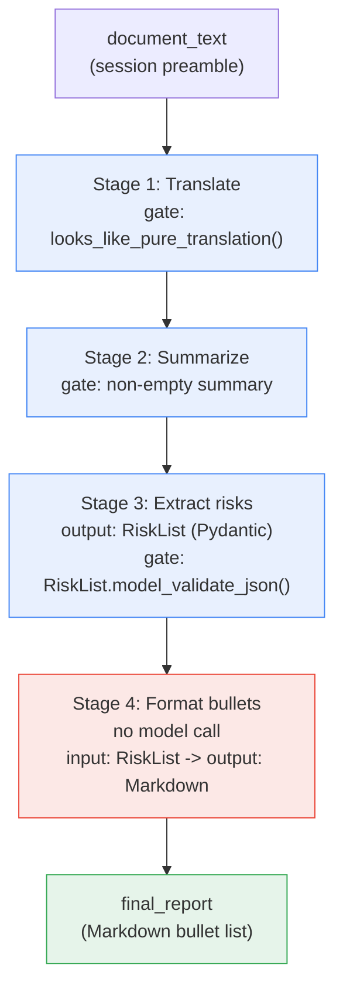

# Part II — Foundations

Part I gave you the vocabulary. This part builds the thing itself: what "fixed" actually
constrains, how to decide whether your task even needs more than one stage, and the first
complete, runnable Risk Report Pipeline.

---

## 2.1 What the Fixed Assembly Line actually is

The article's own analogy is a real factory assembly line, and it is worth pushing that
analogy until it breaks, because the break point *is* the architectural constraint.

A real assembly line bolts a door on at station 4 regardless of what happened at station 3,
because the sequence was decided when the factory was designed, not while the car is on the
belt. A station cannot look at the chassis and decide "actually, skip painting, this one
goes straight to upholstery" — the moment a station does that, it is no longer an assembly
line, it is something more like a router with judgment. That is a different machine, built
differently, inspected differently, and it is *not* what the term "assembly line" describes
anymore.

Same logic, software version:

```
FIXED ASSEMBLY LINE                         NOT AN ASSEMBLY LINE ANYMORE
(order decided at design time)              (order decided at run time, by a model)

┌───────┐                                   ┌───────┐
│Stage 1│                                   │Stage 1│
└───┬───┘                                   └───┬───┘
    ▼                                           ▼
┌───────┐                                   ┌─────────────────────┐
│Stage 2│  always runs, always next          │ Model reads Stage 1's│
└───┬───┘                                   │ OUTPUT and picks     │
    ▼                                           │ what runs next     │
┌───────┐                                   └──────────┬───────────┘
│Stage 3│  always runs, always next                     ▼
└───┬───┘                                       Stage 2A? Stage 2B?
    ▼                                           Skip to Stage 4?
┌───────┐                                       (decided by the model,
│Stage 4│  always runs, always last              not by you, not in advance)
└───────┘
= Blueprint 2                                  = Blueprint 4 (The Autopilot Worker)
```

**The core architectural constraint: order is fixed at design time, not decided at run
time.** You, the engineer, write down "stage 1 then stage 2 then stage 3 then stage 4"
before a single request ever runs. Nothing about the *data* changes that sequence — only
your next deployment can.

This does not mean the pipeline cannot skip a stage. It means *what it is allowed to
condition that skip on* is constrained — the subject of §2.2.

---

## 2.2 Best used for / Avoid when, made testable

The article's two lines:

> **Best used for:** Structured workflows with fixed steps.
>
> **Avoid when:** The software needs to dynamically evaluate intermediate outputs to decide
> its own next step.

Turned into a checklist a PM can actually apply, sitting in front of a real workflow:

**Use Blueprint 2 when all of these are true:**

- [ ] You can write the stage order on a whiteboard *before* seeing any real input, and it
      will not change.
- [ ] Every stage's job is nameable in one phrase ("translate," "summarize," "route").
- [ ] Any conditional skip in the flow is decided from information you have **before**
      calling any model — the input, a config flag, a user setting, a date, a feature flag.
- [ ] A failure in stage N should stop or quarantine the item, not have the software
      improvise a new path around it.

**Avoid Blueprint 2 — you actually need Blueprint 4 — when any of these are true:**

- [ ] The next stage to run depends on what a *model* said in a previous stage, not on the
      original input.
- [ ] You find yourself writing "if the classifier says X, do A; if it says Y, do B" where X
      and Y are the *model's own output*, not something you knew going in.
- [ ] The number of stages a given item passes through varies based on model judgment calls
      made mid-run.
- [ ] You want the system to try something, look at the result, and decide whether to try
      again differently.

### The distinction that trips people up most often

> Is a decision made on the **input**, before any model runs — still fine, still Blueprint 2.
> Is a decision made on a model's **intermediate output**, mid-chain — that's Blueprint 4.

Worked example of each, using the Risk Report Pipeline:

**Still Blueprint 2 — decision on the input:**

```python
# Decided BEFORE any model call, from a property of document_text itself
# (a real implementation would use a language-detection check; kept simple here).
def already_in_spanish(text: str) -> bool:
    """A stand-in for a real language check. §2.5 skips this step in the full
    pipeline; shown here only to illustrate the input-vs-output distinction."""
    spanish_markers = ("ción", "ñ", " el ", " la ")
    return any(marker in text.lower() for marker in spanish_markers)


needs_translation = not already_in_spanish(document_text)
print("translation needed:", needs_translation)
```

This is still a fixed assembly line. The decision to skip stage 1 was made from a property
of the *input* — before any model was invoked, using a rule you wrote and can test in
isolation. The order is still fixed at design time: "if input is already target-language,
skip stage 1; otherwise run it" is itself a fixed rule, not a run-time improvisation.

**No longer Blueprint 2 — decision on a model's intermediate output:**

```python
# NOT part of this chapter's pipelines — shown only as the contrast case.
# translated_summary here is a MODEL'S OUTPUT from an earlier stage.
translated_summary = "Se detectaron riesgos graves de cumplimiento en el proceso."

# The moment code branches on what the MODEL said mid-chain to decide which
# stage runs next, this is Blueprint 4 (The Autopilot Worker), not Blueprint 2.
if "riesgos graves" in translated_summary:
    next_stage = "escalate_to_legal_review"    # a stage that did not exist
else:                                           # in the original fixed plan
    next_stage = "extract_risks"

print(next_stage)
```

The difference is not stylistic. It changes what you can promise a reviewer: a Blueprint 2
pipeline's stage sequence is enumerable and testable ahead of time — you can list every path
an item can take before you ever run it. A Blueprint 4 system's sequence is only knowable by
running it, because the model itself is choosing the path. Neither is wrong; picking the
wrong one for your actual requirement is.

---

## 2.3 How many stages?

Not every multi-step task should become a multi-stage pipeline. Sometimes two stages secretly
belong back in one Chapter 1 call — the reverse mistake of under-splitting, and just as
common as over-splitting.

**Before — one Chapter 1-style call doing translate + summarize together:**

```python
combined_system = """Translate the input document to Spanish, then write a six-sentence
executive summary of the translation. Return only the summary, in Spanish."""

combined = client.interactions.create(
    model=MODEL,
    system_instruction=combined_system,
    input=document_text,
    store=False,
).output_text

print(combined)
```

**After — the same work as two Chapter 2 stages:**

```python
translate_only = client.interactions.create(
    model=MODEL,
    system_instruction="Translate the input to Spanish. Return only the translation.",
    input=document_text,
    store=False,
).output_text

summarize_only = client.interactions.create(
    model=MODEL,
    system_instruction=(
        "Summarise this document for an executive reader. Lead with the decision, "
        "risk or ask. Six sentences maximum. Ground every claim in the source."
    ),
    input=translate_only,
    store=False,
).output_text

print(summarize_only)
```

Both produce roughly the same final text. The honest tradeoff, not glossed over:

| | One combined call | Two separate stages |
|---|---|---|
| Round trips | 1 | 2 |
| Cost | ~1 stage's overhead | ~2 stages' overhead (see §1.6) |
| Can you inspect the translation alone? | No — it's baked into one response | Yes — `translate_only` is a real, checkable value |
| Can you swap just the summarizer prompt later? | No — touches the combined instruction | Yes — independently |
| Can a bug in translation be isolated from a bug in summarization? | No — one failure, ambiguous cause | Yes — each stage has its own validation gate |
| Debugging a bad result | Read one long response, guess which half went wrong | Read two shorter, separately-labeled results |

**Split into two stages when:** you need to inspect, cache, retry, or swap either half
independently, or when either half's prompt is complex enough to deserve its own eval set
(Chapter 1 §5's territory). **Keep it as one call when:** the two operations are always
consumed together, nobody downstream needs the intermediate result, and the combined prompt
is still simple enough to test as a single unit. When in doubt, start combined — it is
cheaper and simpler — and only split when you have a concrete reason (a bug you can't
isolate, a need to reuse the intermediate value, a stage that needs its own retry policy).

---

## 2.4 Anatomy of one stage

Every stage, model call or not, has the same four parts. Applied concretely to Stage 1
(translate) of the Risk Report Pipeline:

```
┌──────────────────────────────────────────────────────────────────────┐
│                         STAGE 1 — TRANSLATE                          │
│                                                                        │
│  INPUT CONTRACT                                                       │
│  ┌──────────────────────────────────────────────┐                    │
│  │ document_text: str                            │                    │
│  │ non-empty, English source prose                │                    │
│  └──────────────────────────────────────────────┘                    │
│                          │                                             │
│                          ▼                                             │
│  PROMPT                                                               │
│  ┌──────────────────────────────────────────────┐                    │
│  │ system_instruction: "Translate the input to    │                    │
│  │ Spanish. Return only the translation — no      │                    │
│  │ preamble, no framing, no commentary."          │                    │
│  │ input: document_text                            │                    │
│  └──────────────────────────────────────────────┘                    │
│                          │                                             │
│                          ▼                                             │
│  OUTPUT CONTRACT                                                      │
│  ┌──────────────────────────────────────────────┐                    │
│  │ str: Spanish-language prose ONLY, no English   │                    │
│  │ chat framing, non-empty                        │                    │
│  └──────────────────────────────────────────────┘                    │
│                          │                                             │
│                          ▼                                             │
│  VALIDATION GATE                                                      │
│  ┌──────────────────────────────────────────────┐                    │
│  │ looks_like_pure_translation(text) -> bool      │                    │
│  │ (§1.3) — reject chat-assistant preamble         │                    │
│  │ before this value crosses the seam into        │                    │
│  │ Stage 2                                         │                    │
│  └──────────────────────────────────────────────┘                    │
└──────────────────────────────────────────────────────────────────────┘
```

The prompt is the smallest part of this diagram, deliberately. Chapter 1 spent its whole
chapter on the prompt box; this chapter spends its effort on the two contract boxes and the
gate, because in a pipeline those are what actually determine whether the system stays
correct over time.

---

## 2.5 The whole pipeline, end to end

This is the chapter's first complete, runnable pipeline: all four stages of the Risk Report
Pipeline, each with a validation gate at its seam, translating `document_text` to Spanish,
summarizing it, extracting risks as structured data, and formatting the result as a final
bulleted Markdown list.

```python
from pydantic import BaseModel, Field, ValidationError


# ---------------------------------------------------------------------------
# Stage output contracts
# ---------------------------------------------------------------------------

class Risk(BaseModel):
    description: str = Field(description="One risk or issue, in one sentence.")
    severity: str = Field(description="One of: low, medium, high.")


class RiskList(BaseModel):
    risks: list[Risk] = Field(description="Every risk or issue found in the summary.")


# ---------------------------------------------------------------------------
# Stage 1 — Translate (document_text -> Spanish prose)
# ---------------------------------------------------------------------------

def stage1_translate(source_text: str) -> str:
    if not source_text.strip():
        raise ValueError("stage1_translate: empty input")

    interaction = client.interactions.create(
        model=MODEL,
        system_instruction=(
            "Translate the input to Spanish. Return only the translation — "
            "no preamble, no framing, no commentary."
        ),
        input=source_text,
        store=False,
    )
    translated_text = interaction.output_text

    if not looks_like_pure_translation(translated_text):
        raise ValueError("stage1_translate: output contract violated (chat framing detected)")
    return translated_text


# ---------------------------------------------------------------------------
# Stage 2 — Summarize (Spanish prose -> Spanish executive summary)
# ---------------------------------------------------------------------------

def stage2_summarize(translated_text: str) -> str:
    if not translated_text.strip():
        raise ValueError("stage2_summarize: empty input")

    interaction = client.interactions.create(
        model=MODEL,
        system_instruction=(
            "Summarise este documento para un lector ejecutivo. Comienza con la "
            "decision, riesgo o solicitud principal. Maximo seis oraciones. "
            "Fundamenta cada afirmacion unicamente en el documento fuente."
        ),
        input=translated_text,
        store=False,
    )
    summary_text = interaction.output_text

    if len(summary_text.strip()) == 0:
        raise ValueError("stage2_summarize: output contract violated (empty summary)")
    return summary_text


# ---------------------------------------------------------------------------
# Stage 3 — Extract risks (summary -> structured RiskList)
# ---------------------------------------------------------------------------

def stage3_extract_risks(summary_text: str) -> RiskList:
    if not summary_text.strip():
        raise ValueError("stage3_extract_risks: empty input")

    interaction = client.interactions.create(
        model=MODEL,
        system_instruction=(
            "Extrae cada riesgo o problema mencionado en el texto. Para cada uno, "
            "asigna una severidad (low, medium, high) basada solo en lo que el "
            "texto establece."
        ),
        input=summary_text,
        generation_config={"thinking_level": "low"},
        response_format={
            "type": "text",
            "mime_type": "application/json",
            "schema": RiskList.model_json_schema(),
        },
        store=False,
    )

    try:
        risk_list = RiskList.model_validate_json(interaction.output_text)
    except ValidationError as exc:
        raise ValueError(f"stage3_extract_risks: output contract violated: {exc}") from exc

    if len(risk_list.risks) == 0:
        raise ValueError("stage3_extract_risks: output contract violated (no risks found)")
    return risk_list


# ---------------------------------------------------------------------------
# Stage 4 — Format as bullets (RiskList -> Markdown, no model call)
# ---------------------------------------------------------------------------

def stage4_format_bullets(risk_list: RiskList) -> str:
    if len(risk_list.risks) == 0:
        raise ValueError("stage4_format_bullets: empty risk list")

    lines = [f"- **[{risk.severity.upper()}]** {risk.description}" for risk in risk_list.risks]
    return "\n".join(lines)


# ---------------------------------------------------------------------------
# The pipeline: four stages, fixed order, validated at every seam
# ---------------------------------------------------------------------------

def run_risk_report_pipeline(source_text: str) -> str:
    translated_text = stage1_translate(source_text)
    summary_text = stage2_summarize(translated_text)
    risk_list = stage3_extract_risks(summary_text)
    return stage4_format_bullets(risk_list)


final_report = run_risk_report_pipeline(document_text)
print(final_report)
```

Running this against `document_text` produces a Markdown bullet list — something along
these lines (the exact wording depends on the model's phrasing, but the shape is fixed by
the schema):

```
- **[HIGH]** 96 clientes fueron cobrados dos veces porque la logica de reintento no
  verificaba una autorizacion existente antes de reenviar el cargo.
- **[MEDIUM]** El envoltorio de reintentos trataba un tiempo de espera del proveedor
  como un fallo definitivo, aunque el resultado del cargo era ambiguo.
- **[LOW]** No existe todavia una alerta sobre la tasa de cargos duplicados,
  rastreada como BILL-2291.
```

Notice what each stage's validation gate is protecting: Stage 1's gate keeps chat framing
out of the Spanish text that Stage 2 reads as pure source. Stage 3's gate — the
`RiskList.model_validate_json` call — is the strongest one in the pipeline, because it is
backed by a schema, not a heuristic string check like Stage 1's; that asymmetry is normal.
Use a schema wherever the seam can bear one (§3.4's territory in the next part), and fall
back to a heuristic gate only where the contract really is "some prose, roughly like this."



Stage 4 is shaded differently on purpose — it is the pipeline's plain-Python stage, doing
zero model calls, same point Pipeline B makes with its routing stage in later parts of this
chapter. A fixed assembly line is not "four model calls in a row"; it is "four contracts in
a row," and some of those contracts are satisfied by ordinary code.

---

## The five things worth actually remembering

1. **Order is fixed at design time, not run time.** That is the entire architectural
   commitment you are making by choosing this blueprint.
2. **A skip decided on the input is still Blueprint 2. A skip decided on a model's output is
   Blueprint 4.** Confusing these is the most common misclassification in this pattern.
3. **Splitting a call into two stages is a cost you pay for independent inspection, retry,
   and reuse** — not a free refinement. Start combined; split for a concrete reason.
4. **Every stage has the same four parts:** input contract, prompt, output contract,
   validation gate. The prompt is usually the smallest of the four.
5. **A pipeline stage is a contract, not necessarily a model call.** Stage 4 above proves it
   inside this very pipeline.

---

**Next:** [Part III — Core Techniques](./03-core-techniques.md)
