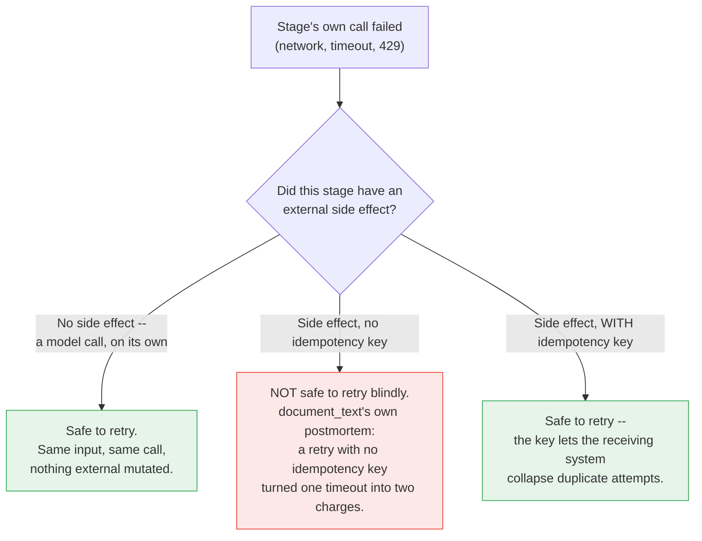

# Part IV — Reliability

Part III built a pipeline that works when everything goes right. This part is about
the three ways it does not: a stage produces output that is valid-shaped but wrong,
a stage's own call fails for reasons that have nothing to do with the input, and a
stage cannot be made to produce anything usable at all. Each has a different fix,
and conflating them is how a reliability effort ends up solving the wrong problem.

---

## 4.1 Partial failure — when the shape is right and the meaning is wrong

§3.2 covered *schema* failure: the model returns something that does not parse into
`TicketClassification` at all. This section is about a harder, quieter failure:
the model returns a perfectly valid `TicketClassification` — every field present,
every type correct, `urgency` between 1 and 5 — and it is simply **wrong**.

Walk through the concrete case. Recall the `ticket_text` fixture:

> "...I have already tried logging in to check my invoices but the billing page just
> spins forever. Could someone refund the duplicate?..."

This ticket genuinely straddles two categories. The classifier's own priority rule
(`account_access` > `billing`) exists precisely so a locked-out-of-billing complaint
resolves toward `account_access`. But priority rules are rules for a model to
*follow*, not guarantees it *will* follow them on every draw. Suppose, on some run,
the model instead returns:

```
category="billing", urgency=3, reason="customer wants a refund for a duplicate charge"
```

That value passes `TicketClassification.model_validate_json` without incident. The
schema has no way to know the priority rule was violated — "billing" is a completely
legal value for the `category` field. Stage 2 (ROUTE) then does exactly what it is
built to do: `urgency >= 4` is false, `category == "account_access"` is false, so it
returns `"continue_automated"`. A ticket that should have gone to a human — the
customer cannot even load the billing page to check the charge themselves — proceeds
through the automated path instead, because Stage 1 was confidently, validly, wrong.

**This is a harder problem than schema validation, and it does not have the same
kind of fix.** You cannot write a `pydantic.field_validator` that knows a ticket
"really" belongs to `account_access` — if you could express that rule in code, you
would not have needed a model to classify it in the first place. What you can build
are **confidence signals**: cheap, local checks that do not prove correctness but
flag the cases worth a second look.

```python
def classification_looks_suspicious(
    classification: TicketClassification, ticket_text: str
) -> list[str]:
    """Weak, local heuristics. None of these prove the classification is wrong;
    each is a cheap signal worth surfacing to a human reviewer or a sampling
    audit. Modeled on Ch1 §4.1's `not in document_text` grounding check, applied
    here to a category decision instead of a summary claim."""
    flags: list[str] = []

    ticket_lower = ticket_text.lower()
    login_signal_words = ("log in", "login", "locked out", "spins forever", "can't access")
    if classification.category != "account_access" and any(
        w in ticket_lower for w in login_signal_words
    ):
        flags.append(
            "ticket contains access-related language but was not classified as account_access"
        )

    reason_words = [w.strip(".,").lower() for w in classification.reason.split() if len(w) > 4]
    if reason_words and not any(w in ticket_lower for w in reason_words):
        flags.append("reason field does not obviously quote or paraphrase the ticket")

    if classification.category == "other" and classification.urgency >= 4:
        flags.append("category 'other' paired with high urgency is an unusual combination")

    return flags
```

Every check in `classification_looks_suspicious` is a heuristic, not a guarantee —
the function can return an empty list on a genuinely wrong classification, and it
can flag a genuinely correct one. That is the honest limit here, and it deserves
being stated without softening: **a Fixed Assembly Line has no mechanism, internal
to itself, for noticing that a stage's semantically-valid output is wrong.** A human
reviewer reading the same ticket would catch "billing page spins forever" as an
access problem in one glance. Nothing in Stage 2's `>=` comparison, and nothing in
Stage 1's schema validation, does that job. Confidence signals like the one above
can route a fraction of runs to a human queue for a second opinion; they do not
close the gap. Closing it — a stage evaluating another stage's output and changing
what runs next based on that evaluation — is Blueprint 4 territory, not this one,
and the honest thing to do here is say so rather than paper over it with a heuristic
dressed up as a solution.

---

## 4.2 Retries and idempotency across stages

There are two entirely different failures hiding under the word "retry," and this
pipeline needs a different answer for each.

**A stage's own call can fail** — a dropped connection, a request timeout, a 429
(`RESOURCE_EXHAUSTED`, per the API facts) — for reasons that have nothing to do with
the ticket, the prompt, or anything this pipeline controls. This is §3.2's territory
turned inside out: there, the *call succeeded* and the *output* failed validation.
Here, the *call itself* never completed.

That distinction matters because the safe response is different. A model call, on
its own, has no side effects beyond the response it returns — retrying it with the
exact same input is safe, because nothing external was mutated by the failed
attempt. A generic retry helper for exactly that case:

```python
import time


class TransientAPIError(Exception):
    """Raised when a stage's own call failed for reasons unrelated to the
    input -- a dropped connection, a timeout, a 429. Retrying is safe here
    because a model call, on its own, mutates nothing outside the response it
    returns."""


def create_interaction_with_retries(max_attempts: int = 3, base_delay: float = 1.0, **kwargs):
    """Wraps client.interactions.create with bounded exponential backoff.

    The SDK's exact exception hierarchy for 429s, 5xxs, and timeouts is not
    pinned in this chapter -- check the docs (linked from 00-index.md) for the
    current typed exceptions and narrow the except clause below in production
    rather than relying on this broad catch.
    """
    last_exc: Exception | None = None
    for attempt in range(max_attempts):
        try:
            return client.interactions.create(**kwargs)
        except Exception as exc:
            last_exc = exc
            log.warning(
                "stage call failed (attempt %d/%d): %s", attempt + 1, max_attempts, exc
            )
            if attempt < max_attempts - 1:
                time.sleep(base_delay * (2 ** attempt))
    raise TransientAPIError(f"exhausted {max_attempts} attempts") from last_exc
```

Now contrast that with **Stage 2**. Today, in this chapter, ROUTE has no side
effect at all — it returns a string, nothing more, and retrying it is trivially
safe because there is nothing to retry; it cannot fail in the way a network call
can. But it is easy to imagine the natural next version of this pipeline, where
`"escalate_to_human"` actually pages someone or opens a ticket in another system.
The instant a stage does that, retrying it after an ambiguous failure — did the
page go out, or didn't it? — stops being free.

This is not a hypothetical for this chapter specifically. **`document_text`, the
fixture this whole book keeps returning to, is a postmortem about exactly this
failure mode:**

> "The retry wrapper treated a gateway timeout as a definitive failure. A timeout is
> ambiguous — the charge may or may not have completed. The wrapper had no
> idempotency key, so the retry created a second authorisation."

Read that with "charge" replaced by "escalation page" and it is the same bug. A
side-effecting stage retried without an idempotency key does not recover from
failure — it doubles the side effect on top of an ambiguous first attempt. The fix
is the same one `document_text`'s own remediation section names: an idempotency key
on the side-effecting call, checked by the receiving system before it acts, so a
retried call collapses into the original instead of stacking on top of it.

```python
def escalate_to_human(
    classification: TicketClassification, ticket_text: str, idempotency_key: str
) -> None:
    """A hypothetical evolution of Stage 2, once ROUTE stops being side-effect
    free. Illustrative only -- there is no paging or ticketing system wired up
    in this chapter. The point is the signature: any side-effecting stage in
    this pipeline must carry an idempotency_key, keyed so the receiving system
    can recognize and collapse a retried call, exactly as document_text's own
    remediation ("idempotency keys on all charge submissions") did after the
    3 October incident.
    """
    raise NotImplementedError(
        "wire this to your paging or ticketing system, keyed on idempotency_key "
        "so a retried escalation cannot create a second one"
    )
```

The rule this pipeline follows, stated once so it generalizes past Stage 2: **retry
freely at any stage with no external side effect; never retry a side-effecting
stage without an idempotency key**, and the two failure modes — "the call didn't
land" and "the output isn't trustworthy" — are handled by different mechanisms
(`create_interaction_with_retries` here, the validation gate in §3.2) because they
are, in fact, different problems.



---

## 4.3 Quarantining poison input mid-chain

§3.2's `classify_ticket` already returns `is_trustworthy=False` when both attempts
in the repair budget fail. §3.5's `run_incident_pipeline` handled that case with a
`print` and an early `return` — good enough to demonstrate the gate, not good enough
to run unattended. A stage that cannot be made to produce valid output after its
retry budget is exhausted needs a real quarantine path: log it, halt that run, and
**do not force a best-effort guess downstream.**

```python
from datetime import datetime, timezone
from pathlib import Path

QUARANTINE_DIR = Path("quarantine")


class PipelineQuarantined(Exception):
    """Raised when a stage cannot be made to produce valid output after the
    bounded repair budget (§3.2) is exhausted. The pipeline halts; it does not
    guess on behalf of a stage that already failed twice."""


def quarantine_run(
    stage_name: str, ticket_text: str, raw_output: str | None, error: str | None
) -> Path:
    """Writes a quarantine record and returns its path. In production this
    would also emit a metric and page whoever owns this pipeline -- the file
    write here is the minimum durable trace, not the whole story."""
    QUARANTINE_DIR.mkdir(parents=True, exist_ok=True)
    timestamp = datetime.now(timezone.utc).strftime("%Y%m%dT%H%M%SZ")
    record_path = QUARANTINE_DIR / f"{timestamp}-{stage_name}.txt"
    record_path.write_text(
        f"stage: {stage_name}\n"
        f"ticket: {ticket_text}\n"
        f"raw_output: {raw_output!r}\n"
        f"error: {error}\n"
    )
    return record_path


def run_incident_pipeline_safe(ticket_text: str) -> None:
    """Same four stages as §3.5, except Stage 1's gate now quarantines and
    halts instead of printing a message and returning quietly. This is the
    version worth running unattended."""
    classification, trustworthy = classify_ticket(ticket_text)
    if not trustworthy:
        path = quarantine_run(
            "classify", ticket_text, None, "schema validation exhausted retry budget"
        )
        raise PipelineQuarantined(f"halted at Stage 1; quarantine record at {path}")

    routing_decision = route_ticket(classification)
    customer_message = rewrite_for_customer(ticket_text, classification)
    log_line = log_pipeline_run(ticket_text, classification, routing_decision, customer_message)
    print(log_line)


run_incident_pipeline_safe(ticket_text)
```

The discipline worth naming: quarantining is not a failure of the pipeline design —
it is the pipeline design working correctly. A Fixed Assembly Line's entire value
proposition is a predictable, auditable sequence; a run that cannot produce a
trustworthy Stage 1 output has no business proceeding to a stage that assumes one,
and halting loudly is strictly better than continuing on a fallback value that
looks like a real classification but was manufactured by this code, not decided by
anything resembling triage.

**Schema failure versus semantic failure, side by side**, since the two are handled
by different mechanisms and it is worth being explicit about which is which:

| | Schema failure (§3.2) | Semantic failure (§4.1) |
|---|---|---|
| What breaks | The response does not parse into `TicketClassification` at all | The response parses cleanly, but the value is wrong |
| Detected by | `pydantic.ValidationError` / `json.JSONDecodeError` | Nothing, reliably — only weak heuristics (§4.1) |
| Fixed by | Bounded repair, then halt and quarantine (§3.2, §4.3) | Not fixed within this pipeline — flagged for human sampling at best |
| Honest status | Solved, mechanically | An open limitation of this architecture, stated plainly |

---

## 4.4 Versioning a whole pipeline, not just one prompt

Chapter 1 versioned individual prompts — `ticket_classifier` at `2.0.1`,
`error_rewriter` at `1.2.0`, `summarizer` at `1.1.0`, each in its own frontmatter.
A pipeline breaks that model, because **the pipeline's behavior is the product of
all of its stage prompts' versions together.** Bump only Stage 3's prompt — tighten
the rewriter's word limit, say — and the Incident Response Pipeline as a whole
produces different output than it did a moment ago, even though Stage 1, Stage 2,
and Stage 4 did not change at all. Calling that "still pipeline version 1.0.0"
because "only one prompt changed" hides the fact that anyone debugging a log entry
from last week needs to know the exact combination of stage versions that produced
it, not just the one that changed.

The minimum viable fix is a manifest: one identifier for the pipeline, mapping to
the exact version of every stage that ran. This is a preview of the fuller
packaging system Part V builds — here, just the shape of the problem and a small
illustration, not the whole system:

```python
from dataclasses import dataclass


@dataclass
class PipelineManifest:
    """One version identifier for the whole pipeline, plus the exact version of
    every stage it depends on. Changing any one stage's prompt version means
    minting a new pipeline_version, even if the other stages are untouched."""

    pipeline_name: str
    pipeline_version: str
    stage_prompt_versions: dict[str, str]


INCIDENT_RESPONSE_PIPELINE_MANIFEST = PipelineManifest(
    pipeline_name="incident_response_pipeline",
    pipeline_version="1.0.0",
    stage_prompt_versions={
        "classify": "ticket_classifier@2.0.1",
        "route": "no prompt -- plain Python, versioned as code, not as a prompt",
        "rewrite": "error_rewriter@1.2.0",
        "log_summary": "summarizer@1.1.0",
    },
)
```

Two things worth doing with a manifest like this once it exists, both left for
Part V to build out fully: attach `pipeline_version` to every log line and
quarantine record this pipeline produces, so a run from three weeks ago can be
traced back to the exact stage-prompt combination that produced it; and treat
`stage_prompt_versions` as the actual diff surface for change review — "what
changed in this release" is a question about the manifest, not about any single
prompt file in isolation.

---

**Next:** [Part V — Reusable Artifacts](./05-reusable-artifacts.md)
