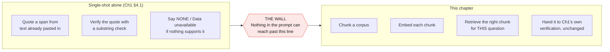
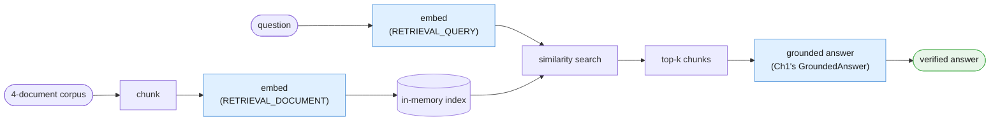
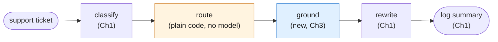
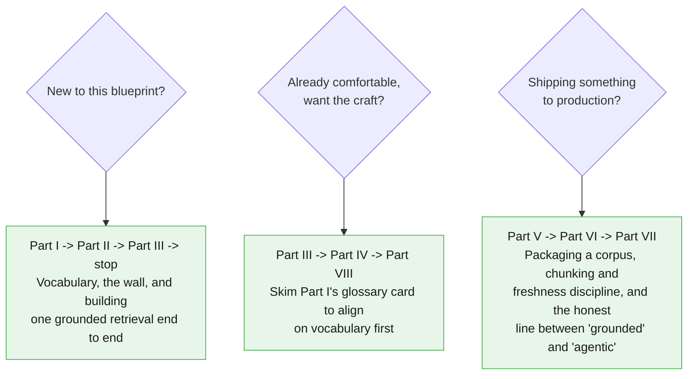

# Blueprint 3 — The Intelligent Library

## A Working Knowledge Base for Grounded Context

*Companion chapter to "Beyond the Chatbox: The 5 Architecture Blueprints of Modern AI"
from the newsletter **The AI Agent Blueprint**, and the direct sequel to
[Blueprint 2 — The Fixed Assembly Line](../02-fixed-assembly-line-sequential-pipelines/00-index.md).*

---

## Why this chapter exists

The parent article defines the Intelligent Library in one paragraph:

> AI models are completely isolated from the outside world; they only know what was
> in their training data. To connect them to private information, you give the AI a
> digital library and an automated librarian. When a user queries the system, a
> search engine pulls relevant snippets from your private manuals or databases first,
> feeds them directly into the prompt context, and allows the model to give factual
> answers.

But this chapter actually starts one book back. Chapter 1 already drew this
boundary, in its own words:

> Everything on the left is worth doing, and doing well, before you build anything
> on the right. Most teams that "need RAG" need §4.1 and a bigger paste.

That's the honest starting point. Chapter 1's §4.1 taught you to ground an answer in
text you already pasted into the prompt, and to verify that grounding in your own
code with a plain substring check. None of that changes here. What Chapter 1
structurally could not do is decide *which* document belongs in that paste in the
first place, when there are too many documents to paste all of them. That one
problem — search, not verification — is this entire chapter.



**This pattern retrieves and grounds. It does not act.** The article is explicit:

> **Avoid when:** The system needs to proactively complete external actions, like
> modifying databases or sending outbound emails.

The moment a stage in this chapter starts writing to a database or sending an email
on its own initiative — instead of handing a drafted answer to a human, or to the
next fixed stage — the pattern has quietly become Blueprint 4. This chapter treats
that boundary the same way Chapter 2 treated its own: as a running theme, revisited
more than once, not a footnote.

---

## The two examples we keep coming back to

### Example A — The Ops Library

A small four-document corpus: the incident postmortem from Chapters 1-2, a refund
policy, an onboarding FAQ, and an API rate-limits reference. Chunked once, embedded
once, queried repeatedly — including one query the corpus flatly cannot answer, so
you can see Chapter 1's `NONE` / "Data unavailable" path survive contact with a real
retrieval layer instead of a single pasted document.



### Example B — Grounded Incident Response

This is where Chapter 2 stops being background reading. Its Incident Response
Pipeline gets exactly one new stage, inserted between ROUTE and REWRITE:



Chapter 1 gave this pipeline its prompts. Chapter 2 gave it structure and reuse
discipline. Chapter 3 gives it a memory it can look things up in: the rewrite stage's
customer-facing explanation now cites the actual refund policy, instead of the model
inventing plausible-sounding policy language from its own training data.

| # | Task | Why it earns its place |
|---|---|---|
| A | **The Ops Library** | Full RAG mechanics: chunk, embed, index, retrieve, ground, verify. Includes the unanswerable-question case. |
| B | **Grounded Incident Response** | Reuses Ch2's `Stage`/`Pipeline` classes and Ch1's three prompts. Tests retrieval as one stage among reused ones. |

---

## How to read this



---

## Contents

- [Part I — Vocabulary of Retrieval](./01-vocabulary.md)
- [Part II — Foundations](./02-foundations.md)
- [Part III — Core Techniques](./03-core-techniques.md)
- [Part IV — Reliability](./04-reliability.md)
- [Part V — Reusable Artifacts](./05-reusable-artifacts.md)
- [Part VI — Production Discipline](./06-production.md)
- [Part VII — Advanced](./07-advanced.md)
- [Part VIII — Practice](./08-practice.md)

---

## Before you start

This chapter assumes you already completed [Blueprint 1's setup](../SETUP.md) — same
Python 3.10+, same virtual environment, same `GEMINI_API_KEY`. **No new pip
dependency.** The `google-genai` package your `requirements.txt` already installs
exposes `client.models.embed_content` — embeddings are a different *model*, not a
different *library*. This chapter's own [`requirements.txt`](./requirements.txt)
lists the identical three packages Chapters 1-2 use.

If you're starting fresh at Chapter 3 without having done Chapters 1-2: go do
[the repo's `SETUP.md`](../SETUP.md) first, then at least skim
[Chapter 1's §4.1](../01-smart-intern-prompt-engineering/04-reliability.md) — this
chapter assumes you already know its `GroundedAnswer` pattern and reuses it verbatim.

---

## The session preamble

Every code block in every file below assumes this has already run. The two fixtures
carried over from Chapters 1-2 are **byte-identical** — same names, same text —
because Example B depends on it being the exact same ticket Chapter 2's pipeline
classified and routed.

```python
"""Session preamble — every example in this chapter assumes these names exist."""

from dotenv import load_dotenv
from google import genai

load_dotenv()

client = genai.Client()
MODEL = "gemini-3.5-flash"
EMBED_MODEL = "gemini-embedding-001"

# ---------------------------------------------------------------------------
# Fixtures reused verbatim from Chapters 1-2
# ---------------------------------------------------------------------------
document_text = """Post-incident review: payment gateway degradation, 3 October.

Between 02:11 and 03:47 UTC, the billing service returned elevated errors on card
charge attempts. The upstream payment provider acknowledged a partial outage in their
authorisation tier during the same window.

Impact: 1,842 charge attempts failed. 96 customers were charged twice because our
retry logic did not check for an existing authorisation before resubmitting. No card
data was exposed.

Root cause: the retry wrapper treated a gateway timeout as a definitive failure. A
timeout is ambiguous — the charge may or may not have completed. The wrapper had no
idempotency key, so the retry created a second authorisation.

Remediation: idempotency keys on all charge submissions, shipped 9 October. Timeout
handling now reconciles against the provider before retrying. Duplicate charges were
refunded within 48 hours. Outstanding: we still have no alert on duplicate-charge rate,
tracked as BILL-2291."""

ticket_text = """Hi, I was charged twice for my October subscription. I can see two
identical GBP 49.00 charges on the same card, both dated 3 October. I have already
tried logging in to check my invoices but the billing page just spins forever.
Could someone refund the duplicate? This is the second month it has happened."""

# ---------------------------------------------------------------------------
# New fixtures — the other three documents in this chapter's small library
# ---------------------------------------------------------------------------
doc_refund_policy = """Refund and Duplicate Charge Policy (Billing Handbook, Section 4)

Customers charged more than once for the same billing period due to a system error
are eligible for an automatic refund of the duplicate charge, no support ticket
required, once the duplicate is confirmed in the payment ledger. Confirmed duplicate
charges are refunded within 5-7 business days to the original payment method.

If a customer reports being charged twice in two or more consecutive billing cycles,
the account must be flagged for manual review by the billing operations team before
any further automatic refund is issued, since repeat duplication usually indicates a
deeper account or integration problem rather than a one-off system error.

Refunds for any other reason (dissatisfaction, accidental purchase, downgrade
requests) fall outside this section and are handled under the standard cancellation
policy instead."""

doc_onboarding_faq = """New Account Onboarding — Frequently Asked Questions

Q: How do I reset my password?
A: Use the "Forgot password" link on the sign-in page. Reset emails expire after 30
minutes.

Q: Can I change my billing email address without changing my login email?
A: Yes. Billing email and login email are separate fields, set independently from
Account Settings > Billing.

Q: How long does account verification take after signup?
A: Most accounts verify within a few minutes. If verification is still pending after
24 hours, contact support with your signup email address.

Q: Can I use the same account for multiple team workspaces?
A: Yes, one login can belong to multiple workspaces, and you can switch between them
from the workspace picker in the top navigation bar."""

doc_api_rate_limits = """Developer Reference — API Rate Limits

All API requests are counted per project, not per individual API key. Limits are
enforced across three dimensions: requests per minute, input tokens per minute, and
requests per day. Exceeding any one of the three dimensions returns an HTTP 429 with
a Retry-After header.

Rate limit tier is determined by billing status: free-tier projects share the lowest
limits; projects with billing enabled and a verified payment method move to a higher
tier automatically within a few minutes of enabling billing.

Rate limit errors are not billed. A request that fails with a 429 before the model
processes it does not count toward token usage for that billing period."""
```

> **Sanity check.** Run this before continuing:
>
> ```python
> probe = client.models.embed_content(model=EMBED_MODEL, contents="sanity check")
> print(EMBED_MODEL, "|", len(probe.embeddings[0].values), "dimensions")
> ```
>
> If that prints a model name and a positive integer, embeddings are working and
> you're ready.

---

## A note on the code

Same convention as Chapters 1-2: the **Interactions API** only
(`client.interactions.create`) for every generation call, model pinned once as
`MODEL`, Python 3.10+ style throughout. This chapter pins a **second** model constant,
`EMBED_MODEL`, because embedding text and generating text are different jobs done by
different models — conflating the two is an easy, avoidable mistake.

Chunking, embedding, and similarity search in this chapter are deliberately
dependency-free: no vector database, no numpy. A four-document corpus fits
comfortably in a plain Python list, searched with a plain-Python cosine similarity
function. This chapter is explicit, more than once, that this is a teaching-scale
stand-in for a real vector store or Google's own managed File Search API — not a
production recommendation to hand-roll your own at scale.

Every code block in this chapter is cumulatively runnable: paste them in order after
the preamble above, and nothing breaks.

---

## Supporting files

| Path | What's in it |
|---|---|
| `examples/` | Runnable `.py` for both examples and every technique |
| `prompts/` | Every stage's prompt as a versioned file, including Chapter 1's reused ones |
| `requirements.txt` | Same three packages as Chapters 1-2 — nothing new |

---

## Verification status

Every API claim in this chapter — including the embeddings section — was checked
against Google's live documentation before writing. Nothing here introduces an
unverified API surface.

---

*Next in the series: Blueprint 4 — The Autopilot Worker (The Tool-Using Loop).*
