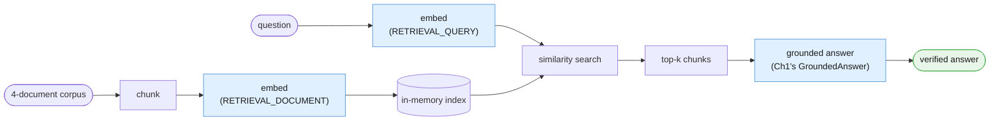

# Part I — Vocabulary of Retrieval

Chapter 1 built its vocabulary around one call, grounded in text you already pasted in.
Chapter 2 built its vocabulary around a chain of calls, each with its own contract. This
chapter builds its vocabulary around one new question neither of those could answer: *which*
document belongs in the prompt in the first place, when there are too many documents to
paste all of them. Same worked example the whole way through — Example A, "the Ops Library."

---

## 1.1 The worked example

Four documents: the incident postmortem (`document_text`) from Chapters 1-2, a refund
policy, an onboarding FAQ, and an API rate-limits reference. Chunked once, embedded once,
queried repeatedly. Before decomposing any of it, watch the whole pipeline run as a black
box — question in, grounded answer out:



```python
# client, MODEL, EMBED_MODEL, document_text, doc_refund_policy, doc_onboarding_faq,
# and doc_api_rate_limits all come from the session preamble in 00-index.md.
# This is the black-box view -- §1.2 to §1.5 build each labeled box for real.

corpus_documents = {
    "document_text": document_text,
    "doc_refund_policy": doc_refund_policy,
    "doc_onboarding_faq": doc_onboarding_faq,
    "doc_api_rate_limits": doc_api_rate_limits,
}

print(list(corpus_documents.keys()))
# ['document_text', 'doc_refund_policy', 'doc_onboarding_faq', 'doc_api_rate_limits']
```

Four documents in. Somewhere inside them is the one paragraph that answers a given question.
Nothing in Chapter 1 or 2 can find that paragraph for you — both assumed the right text was
already in the prompt. Everything below is the machinery that decides which paragraph gets
pasted in, before Chapter 1's own grounding technique ever runs.

---

## 1.2 Chunk

**A chunk is a retrievable unit of a document** — small enough that embedding it produces a
useful, specific vector, and small enough that pasting a handful of chunks into a prompt is
cheap. This chapter's chunking rule is intentionally the simplest one that works: split each
document on blank-line paragraph breaks. Every fixture in this chapter already has short,
distinct paragraphs, so this rule is not a hack for the example — it is a small, real, honest
version of the thing production chunkers do at scale (§1.4 names what production chunking
adds).

```python
def chunk_document(doc_name: str, text: str) -> list[dict]:
    """Split on blank-line paragraph breaks. Tag each chunk with its source
    document name and a chunk index, e.g. 'doc_refund_policy#0'."""
    paragraphs = [p.strip() for p in text.split("\n\n") if p.strip()]
    return [
        {"doc": doc_name, "chunk_id": f"{doc_name}#{i}", "text": paragraph}
        for i, paragraph in enumerate(paragraphs)
    ]


refund_chunks = chunk_document("doc_refund_policy", doc_refund_policy)
for chunk in refund_chunks:
    print(chunk["chunk_id"], "->", chunk["text"][:60].replace("\n", " "), "...")
# doc_refund_policy#0 -> Refund and Duplicate Charge Policy (Billing Handbook, ...
# doc_refund_policy#1 -> If a customer reports being charged twice in two or  ...
# doc_refund_policy#2 -> Refunds for any other reason (dissatisfaction, acci ...
```

`doc_refund_policy` has three blank-line-separated paragraphs, so it becomes exactly three
chunks: the automatic-refund rule, the manual-review escalation rule, and the out-of-scope
carve-out. Each one is independently retrievable — a question about the manual-review
condition can match `doc_refund_policy#1` without ever pulling in `#0` or `#2`.

---

## 1.3 Embedding

**An embedding turns a chunk of text into a vector** — a list of floating-point numbers
positioned so that texts with similar meaning sit close together in that space. You never
read an embedding; you only compare it to other embeddings. `client.models.embed_content`
produces one:

```python
from google.genai import types

sample = client.models.embed_content(
    model=EMBED_MODEL,
    contents=refund_chunks[0]["text"],
    config=types.EmbedContentConfig(
        task_type="RETRIEVAL_DOCUMENT",
        title="doc_refund_policy",
    ),
)
sample_vector = sample.embeddings[0].values
print(len(sample_vector), "dimensions")
```

Two details here are load-bearing, not decoration:

**`task_type` is not optional flavor text.** Corpus chunks -- the things you will search
*over* -- are embedded with `task_type="RETRIEVAL_DOCUMENT"`. The user's question -- the
thing you will search *with* -- is embedded separately, at query time, with
`task_type="RETRIEVAL_QUERY"`. These produce embeddings optimized for their respective sides
of a search: a document embedding is shaped to be found, a query embedding is shaped to find.
Google's own docs are explicit that mismatching these two measurably hurts retrieval
quality -- if you accidentally embed your corpus chunks with `RETRIEVAL_QUERY` or your
question with `RETRIEVAL_DOCUMENT`, retrieval still runs and returns *something*, silently
worse, with no error to tell you why.

**`title` is document-side only.** Setting `title` to the source document's name when
embedding a corpus chunk -- `"doc_refund_policy"`, `"document_text"`, and so on -- is
something Google's docs say improves retrieval quality for that chunk. It has no equivalent
on the query side; there is no "title" for a user's question.

```python
def embed_chunks(chunks: list[dict]) -> list[dict]:
    """Embed every chunk once, tagged RETRIEVAL_DOCUMENT with its source title."""
    texts = [chunk["text"] for chunk in chunks]
    result = client.models.embed_content(
        model=EMBED_MODEL,
        contents=texts,
        config=types.EmbedContentConfig(
            task_type="RETRIEVAL_DOCUMENT",
            title=chunks[0]["doc"] if chunks else None,
        ),
    )
    for chunk, embedding in zip(chunks, result.embeddings):
        chunk["vector"] = embedding.values
    return chunks


refund_chunks = embed_chunks(refund_chunks)
print(refund_chunks[0]["chunk_id"], "embedded:", len(refund_chunks[0]["vector"]), "dims")
```

```python
def embed_query(question: str) -> list[float]:
    """Embed the user's question once, tagged RETRIEVAL_QUERY -- never
    RETRIEVAL_DOCUMENT, and never given a title."""
    result = client.models.embed_content(
        model=EMBED_MODEL,
        contents=question,
        config=types.EmbedContentConfig(task_type="RETRIEVAL_QUERY"),
    )
    return result.embeddings[0].values


sample_query_vector = embed_query("Am I owed a refund for a duplicate charge?")
print(len(sample_query_vector), "dims")
```

Two model constants, two different jobs. `MODEL` generates text; `EMBED_MODEL` produces
vectors. Conflating them -- calling `embed_content` with `MODEL`, or `interactions.create`
with `EMBED_MODEL` -- is an easy mistake with no helpful error message, only quietly wrong
results.

---

## 1.4 Index

**The index is where embedded chunks live so they can be searched.** For this chapter's
four-document corpus, that is nothing more than a plain Python list of dicts, each shaped
`{"doc": ..., "chunk_id": ..., "text": ..., "vector": [...]}`:

```python
def build_index(documents: dict[str, str]) -> list[dict]:
    """Chunk and embed every document once. This list of dicts IS the search
    engine, at this corpus's scale."""
    index: list[dict] = []
    for doc_name, doc_text in documents.items():
        chunks = chunk_document(doc_name, doc_text)
        chunks = embed_chunks(chunks)
        index.extend(chunks)
    return index


ops_index = build_index(corpus_documents)
print(len(ops_index), "chunks indexed across", len(corpus_documents), "documents")
```

Name this plainly for what it is: **a teaching-scale stand-in, not a production
recommendation.** A plain Python list scanned end to end is fine for a dozen chunks and
would fall over long before a real corporate wiki's worth of documents. Two production paths
exist and are worth knowing by name, without building either here: a real vector database
(Pinecone, pgvector, Chroma, and similar) that indexes vectors for fast approximate nearest-
neighbor search at scale, or Google's own managed **File Search API**
(`file-search-stores` / `documents`, see
[the File Search docs](https://ai.google.dev/api/file-search/file-search-stores)), which
handles chunking, embedding, and storage for you server-side. This chapter hand-rolls the
simplest version so the mechanics are visible; it does not argue you should ship this list
in production.

---

## 1.5 Similarity search

**Similarity search ranks every chunk in the index by how close its vector is to the query
vector**, and returns the top few. Cosine similarity is the standard default for this kind
of comparison, implemented here in plain Python with no numpy dependency:

```python
import math


def cosine_similarity(vector_a: list[float], vector_b: list[float]) -> float:
    dot_product = sum(a * b for a, b in zip(vector_a, vector_b))
    norm_a = math.sqrt(sum(a * a for a in vector_a))
    norm_b = math.sqrt(sum(b * b for b in vector_b))
    if norm_a == 0 or norm_b == 0:
        return 0.0
    return dot_product / (norm_a * norm_b)


def search(index: list[dict], question: str, top_k: int = 3) -> list[dict]:
    """Embed the question as RETRIEVAL_QUERY, score every chunk in the index,
    and return the top_k highest-scoring chunks, descending."""
    query_vector = embed_query(question)
    scored = [
        {**chunk, "score": cosine_similarity(query_vector, chunk["vector"])}
        for chunk in index
    ]
    scored.sort(key=lambda c: c["score"], reverse=True)
    return scored[:top_k]


top_chunks = search(ops_index, "How many customers were charged twice in the October incident?")
for chunk in top_chunks:
    print(f"{chunk['score']:.3f}", chunk["chunk_id"])
```

`k=3` is a reasonable default at this corpus size: enough headroom to survive one imperfect
match without paying for the whole corpus on every question.

---

## 1.6 Retrieval vs. verification are different jobs

This is the chapter's single most important distinction, and it is easy to blur because both
jobs look like "checking the answer against a source."

**Retrieval decides *which* chunk gets pasted into the prompt.** That is everything §1.2
through §1.5 just built: chunk, embed, index, search. Retrieval can be wrong in a specific
way -- it can hand back a real, well-formed, topically-adjacent chunk that simply does not
answer the question, with a similarity score that looks perfectly confident.

**Verification decides whether the model's claim is actually supported *by the chunk it was
given*.** This is Chapter 1's job, completely unchanged. Reproduced verbatim, because nothing
about retrieval alters it:

```python
from pydantic import BaseModel, Field


class GroundedAnswer(BaseModel):
    supporting_quote: str = Field(
        description="Verbatim span copied from the source. If no span supports an "
                    "answer, use the exact string: NONE"
    )
    answer: str = Field(
        description="Answer derived only from supporting_quote. If supporting_quote "
                    "is NONE, use the exact string: Data unavailable"
    )
```

```python
def accept(result: GroundedAnswer) -> None:
    print("ACCEPTED:", result.answer)


def handle_unanswerable(result: GroundedAnswer) -> None:
    print("NO EVIDENCE IN SOURCE:", result.answer)


def route_to_human(result: GroundedAnswer) -> None:
    print("QUEUED FOR REVIEW:", result.answer)


def verify_against_chunk(result: GroundedAnswer, source_chunk_text: str) -> None:
    if result.supporting_quote == "NONE":
        handle_unanswerable(result)
    elif result.supporting_quote not in source_chunk_text:
        # quote was paraphrased or fabricated -- treat the whole answer as untrusted
        route_to_human(result)
    else:
        accept(result)
```

State the split plainly: **getting the right chunk and getting a faithful answer from that
chunk are two independent failure points.** Retrieval can succeed (the right chunk is in the
index and gets returned) while verification still catches a hallucinated quote inside it.
Retrieval can *fail* (the wrong chunk is returned) while verification passes cleanly, because
the model faithfully quoted the wrong-but-real chunk it was handed -- that quote really does
appear verbatim in the source it was given, it is just the source that was wrong. Chapter 1's
substring check has no way to know that; it only checks faithfulness to what it was handed,
never relevance of what it was handed. This chapter's pipeline has to get both right, and
§4 later in this chapter is where that gap gets its own honest treatment.

---

## 1.7 The wall, revisited

Chapter 1's §4.1 drew a wall between what single-shot grounding can do and what needs
retrieval. Redrawn here, fitted to this chapter's own flow, to make concrete exactly what
crossing it costs:


Crossing that wall is not free. It costs exactly three things, named plainly rather than
hand-waved: **an index** (§1.4 -- even the simplest one is state you now own and must keep
in sync with the corpus), **an embedding pipeline** (§1.3 -- a model call for every chunk,
paid once, plus one more model call per question), and **a retrieval step** (§1.5 -- a
ranking function that can be wrong in ways Chapter 1's verification cannot see, per §1.6).
Chapter 1 was right: most teams that "need RAG" need §4.1 and a bigger paste. This chapter
is for the teams whose corpus genuinely does not fit in one paste -- Part II makes that
decision testable instead of assumed.

---

## 1.8 Glossary card

| Term | One line | Where you meet it |
|---|---|---|
| **Chunk** | A retrievable unit of a document, tagged `doc_name#index` | §1.2 |
| **Embedding** | A vector representation of a chunk or a question, from `embed_content` | §1.3 |
| **`task_type`** | `RETRIEVAL_DOCUMENT` for corpus chunks, `RETRIEVAL_QUERY` for questions -- mismatching hurts quality | §1.3 |
| **`title`** | Source document name set on `RETRIEVAL_DOCUMENT` embeddings only, improves quality | §1.3 |
| **Index** | Where embedded chunks live to be searched; a plain list here, a vector DB or File Search API in production | §1.4 |
| **Similarity search** | Ranking chunks by cosine similarity to a query vector, taking top-k | §1.5 |
| **Retrieval** | Deciding WHICH chunk belongs in the prompt | §1.6 |
| **Grounding** | Deriving an answer only from the text supplied (Ch1) | §1.6 |
| **Verification** | Checking a model's quote is a real substring of the chunk it was given (Ch1, unchanged) | §1.6 |
| **The wall** | The boundary between "text already pasted in" and "text that must be found first" | §1.7 |

---

## The five things worth actually remembering

1. **A chunk is small and tagged with its source** -- `doc_refund_policy#1`, not just "some
   text."
2. **`task_type` has two correct values in this chapter and mixing them up is silent, not an
   error.** `RETRIEVAL_DOCUMENT` for the corpus, `RETRIEVAL_QUERY` for the question.
3. **The index in this chapter is a plain Python list on purpose.** Name Pinecone, pgvector,
   Chroma, or Google's File Search API as the production path; do not build one here.
4. **Retrieval and verification catch different failures.** The wrong chunk can pass
   verification perfectly. Keep both.
5. **Crossing the wall costs an index, an embedding pipeline, and a retrieval step.** That
   cost is the reason Chapter 1's §4.1 remains the right answer for most teams.

---

**Next:** [Part II — Foundations](./02-foundations.md)
