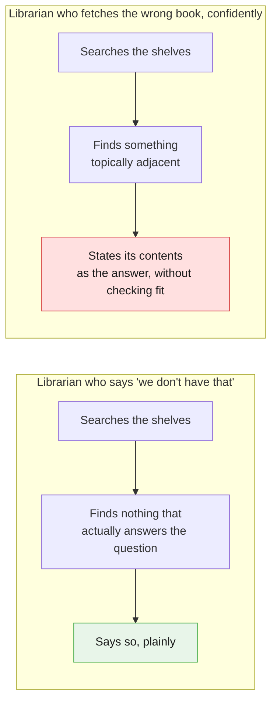
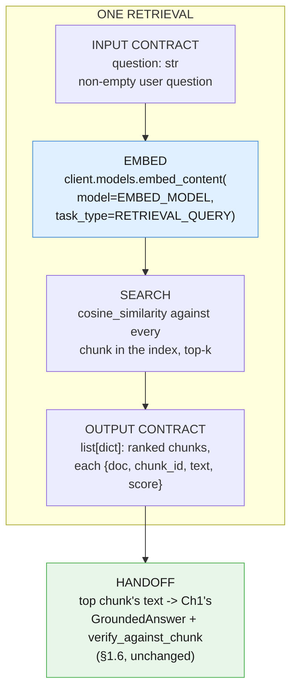
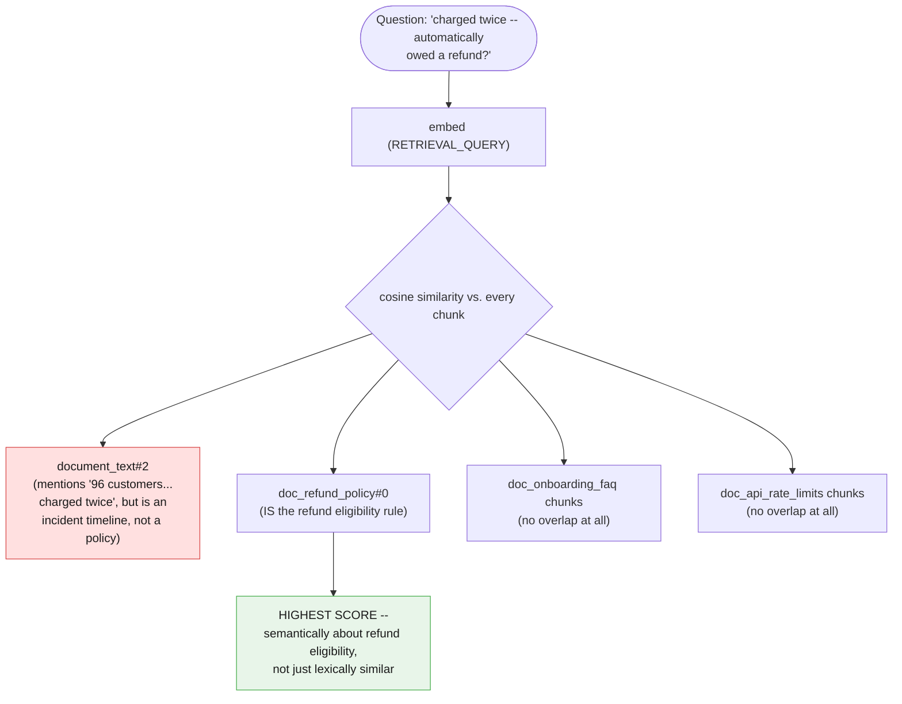
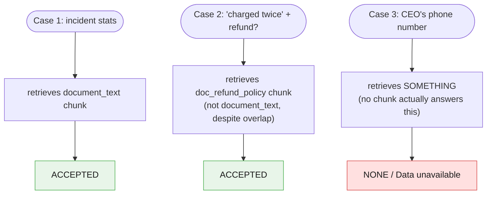

# Part II — Foundations

Part I gave you the vocabulary: chunk, embed, index, search, and the split between retrieval
and verification. This part builds the thing itself -- what the "Intelligent Library" analogy
actually commits you to, when to reach for it, when *not* to, and the first complete,
runnable retrieval pipeline over the full four-document corpus.

---

## 2.1 What the Intelligent Library actually is

The article's own analogy is a librarian, and it is worth pushing that analogy until it
breaks, because the break point *is* the architectural promise and its limit.

A good librarian, asked a question they cannot answer from the shelves, says "we don't have
that" and stops. A *bad* librarian, asked the same question, hands you a book that is close
enough in subject to feel relevant, and states its contents as fact without checking whether
it actually answers what you asked. The second librarian is worse than useless, because
their confidence is indistinguishable from correctness until you have already acted on what
they told you.



This chapter's whole pipeline is an attempt to build the first librarian and catch the
second one before it speaks. Chunking, embedding, and search (Part I) are how the system
finds candidate books. Chapter 1's `GroundedAnswer` and substring verification (§1.6) are how
it checks, per chunk, whether the book it found actually says what the answer claims. Neither
half alone is the good librarian; you need both.

**The core architectural promise, stated plainly:** this pattern extends what the model can
be grounded in, from "whatever fits in one prompt" to "whatever is in your corpus, found on
demand." **Its limit, stated just as plainly:** retrieval quality is now a first-class problem
*you* own. Nothing about adding an index makes the system incapable of confidently fetching
the wrong book -- it only gives it more books to potentially fetch wrong. §1.6's distinction
between retrieval and verification exists precisely because this promise and this limit
arrive together, not one after the other.

---

## 2.2 Best used for / Avoid when, made testable

The article's two lines:

> **Best used for:** Reliable Q&A search engines built over internal corporate wikis, fresh
> product catalogs, or private PDF operational runbooks.
>
> **Avoid when:** The system needs to proactively complete external actions, like modifying
> databases or sending outbound emails.

Turned into a checklist:

**Use Blueprint 3 when all of these are true:**

- [ ] The corpus is too large, too fresh-changing, or too numerous in documents to paste
      into a single prompt (Chapter 1's territory), but the *task* is still "answer a
      question from it," not "act on it."
- [ ] You can tolerate an index that must be rebuilt or incrementally updated as source
      documents change -- freshness is now your responsibility, not the model's.
- [ ] A wrong answer's worst consequence is a bad response a human or downstream stage can
      catch and correct -- not an irreversible side effect.
- [ ] You are willing to invest in retrieval quality (chunking strategy, `task_type`
      discipline, top-k tuning) as an ongoing concern, not a one-time setup.

**Avoid Blueprint 3 -- you actually need Blueprint 4 -- when any of these are true:**

- [ ] The system, after retrieving information, should go on to *change* something outside
      itself -- write a row, send an email, issue a refund -- without a human approving that
      step.
- [ ] "Look it up" is not the last verb in the workflow; "and then do it" is.

The "avoid when" line is the strict boundary with Blueprint 4, made concrete with one valid
example and one invalid one, both drawn from this chapter's own fixtures:

**Valid -- retrieve policy, draft a reply for a human to send:**

```python
# The GROUND stage retrieves doc_refund_policy's relevant chunk and hands it,
# alongside the ticket, to a REWRITE stage that drafts a customer-facing reply.
# A human (or Chapter 2's own ROUTE stage) still decides whether that reply goes out.
retrieved_policy_chunk = search(ops_index, ticket_text, top_k=1)[0]
print("Retrieved for drafting a reply:", retrieved_policy_chunk["chunk_id"])
# The reply is DRAFTED here. Nothing in this chapter sends it or issues a refund.
```

**Invalid -- retrieve policy, automatically issue the refund:**

```python
# NOT part of this chapter's pipeline -- shown only as the contrast case.
# The moment retrieval output drives an autonomous external action, this has
# quietly become Blueprint 4 (The Autopilot Worker), not Blueprint 3.
def issue_refund_automatically(ticket: str, policy_chunk: dict) -> None:
    """Illustrative only -- do not build this in a Blueprint 3 system."""
    raise NotImplementedError(
        "Retrieving policy text does not license writing to a payments system. "
        "That is Blueprint 4's territory, with its own approval and audit story."
    )
```

The difference is not the retrieval step -- both examples retrieve the same chunk from the
same index. The difference is what happens with the retrieved text afterward: handed to a
human or a fixed downstream stage for review (Blueprint 3), or used to drive an unattended
external action (Blueprint 4). Repeat this line as often as it takes: **this pattern
retrieves and grounds, it never acts.**

---

## 2.3 When you don't need this at all

Chapter 1's own closing line in §4.1, quoted here because Part II is where the chapter has
to take it seriously before building anything further:

> Everything on the left is worth doing, and doing well, before you build anything on the
> right. Most teams that "need RAG" need §4.1 and a bigger paste.

A concrete decision rule, not just a sentiment: **if your whole corpus fits in the model's
context window with room to spare, and it doesn't change often, you may not need retrieval
at all -- you need a bigger paste and Chapter 1's verification technique.**

Worked example, using this chapter's own four-document corpus, honestly:

```python
sizes = {name: len(text) for name, text in corpus_documents.items()}
total_chars = sum(sizes.values())
for name, size in sizes.items():
    print(f"{name}: {size} chars")
print("total:", total_chars, "chars, roughly", total_chars // 4, "tokens (Google's own ~4 chars/token rule of thumb)")
```

Four short documents, a postmortem and three reference pages, come to a few thousand
characters combined -- comfortably small enough to just paste all four into one prompt and
let Chapter 1's `GroundedAnswer` pattern quote from whichever one answers the question,
no index required:

```python
# The "just paste all four" alternative to everything Part I just built.
# Honest to consider before the rest of this chapter proceeds.
all_documents_pasted = "\n\n---\n\n".join(
    f"<document name=\"{name}\">\n{text}\n</document>"
    for name, text in corpus_documents.items()
)
print(len(all_documents_pasted), "chars if you just paste everything")
```

At this corpus's actual size, retrieval is arguably *overkill* -- Chapter 1's §4.1 technique
applied to `all_documents_pasted` would work about as well, with no index to build or keep
fresh. This chapter builds retrieval anyway, for teaching purposes, because a four-document
corpus is the smallest example that makes "which document" a real question -- but the honest
answer for a genuinely small, slow-changing corpus is: don't build this. The decision rule
that matters for a real system is not document count, it's **does the corpus, in full,
fit comfortably in context with room to spare, and does it change slowly enough that
re-pasting it every time is cheap?** If yes to both, Chapter 1 alone is the right
architecture. If either answer is no -- the corpus is large, or it changes constantly, or
there are too many candidate documents to know in advance which ones matter -- that is where
Part I's retrieval mechanics start earning their cost (§1.7's honest accounting of what that
cost is).

---

## 2.4 Anatomy of one retrieval

Every retrieval, model call or not, has the same shape: an input contract, an embed step, a
search step, an output contract, and a handoff to Chapter 1's grounded-answer stage.



Retrieval's output contract is deliberately narrow: a ranked list of chunks, nothing more. It
does not itself produce an answer, and it makes no claim about whether any returned chunk is
actually *good enough* -- that judgment belongs entirely to the verification stage that
receives it next, per §1.6.

---

## 2.5 The whole thing, end to end

The full Example A pipeline: chunk all four documents, embed all chunks once, then answer
three different questions against the same index -- one the corpus answers cleanly, one that
requires picking the right document among plausible distractors, and one the corpus cannot
answer at all.

```python
def ground_and_verify(question: str, index: list[dict], top_k: int = 1) -> None:
    """Retrieve the top chunk(s) for a question, then run Chapter 1's exact
    GroundedAnswer + substring verification against the top chunk's text."""
    top_chunks = search(index, question, top_k=top_k)
    print(f"\nQuestion: {question}")
    for chunk in top_chunks:
        print(f"  retrieved: {chunk['chunk_id']} (score={chunk['score']:.3f})")

    best_chunk = top_chunks[0]
    interaction = client.interactions.create(
        model=MODEL,
        system_instruction=(
            "Answer only from the text inside <chunk>. First copy the verbatim span "
            "that supports your answer into supporting_quote, then write the answer "
            "from that span alone. If nothing in <chunk> answers the question, set "
            "supporting_quote to NONE and answer to 'Data unavailable'."
        ),
        input=(
            f"<chunk source=\"{best_chunk['chunk_id']}\">\n{best_chunk['text']}\n</chunk>\n\n"
            f"Question: {question}"
        ),
        generation_config={"thinking_level": "low"},
        response_format={
            "type": "text",
            "mime_type": "application/json",
            "schema": GroundedAnswer.model_json_schema(),
        },
        store=False,
    )
    result = GroundedAnswer.model_validate_json(interaction.output_text)
    verify_against_chunk(result, best_chunk["text"])


# Case 1 -- the corpus answers cleanly from document_text.
ground_and_verify(
    "How many customers were charged twice in the October incident?",
    ops_index,
)

# Case 2 -- lexical overlap on "charged twice" with document_text, but the RIGHT
# answer lives in doc_refund_policy, not the postmortem.
ground_and_verify(
    "If a customer says they were charged twice, are they automatically owed a refund?",
    ops_index,
)

# Case 3 -- the corpus cannot answer this at all. Exercises Ch1's NONE /
# "Data unavailable" path even after a real retrieval layer sits in front of it.
ground_and_verify(
    "What is the CEO's direct phone number?",
    ops_index,
)
```

Case 2 is the one worth reading twice. Both `document_text` (the postmortem: "96 customers
were charged twice") and `doc_refund_policy` (the policy: eligibility rules for a refund on
a duplicate charge) contain the words "charged twice" -- a keyword search would have trouble
telling them apart, or would rank whichever document happens to repeat the phrase more times.
Cosine similarity over embeddings, by contrast, is comparing *meaning*: the question is about
refund eligibility, and `doc_refund_policy`'s chunks are semantically about refund
eligibility, while `document_text`'s chunk is semantically about an incident timeline that
happens to share two words with the question.



Case 3's question has no chunk anywhere in the corpus that supports it. `search` still
returns its top-k chunks -- similarity search always returns *something*, ranked, even when
nothing is actually relevant, which is exactly the failure mode §1.6 warned about. What saves
this case is not retrieval declining to answer; it is Chapter 1's verification stage,
unchanged, receiving a chunk about billing or onboarding or rate limits, finding no verbatim
span that supports "the CEO's direct phone number," and correctly emitting `NONE` / "Data
unavailable" instead of manufacturing a plausible-sounding answer.



Three questions, one shared index, three different outcomes -- each one exercising a
different piece of Part I's vocabulary: plain retrieval (Case 1), retrieval that has to beat
a lexical distractor (Case 2), and verification catching what retrieval could not (Case 3).

---

## The five things worth actually remembering

1. **A librarian who fetches the wrong book confidently is worse than one who says "we don't
   have that."** Retrieval quality is now a first-class problem you own, not a side effect of
   adding an index.
2. **"Avoid when" means never crossing into action.** Retrieve policy and draft a reply for a
   human -- fine. Retrieve policy and auto-issue a refund -- that's Blueprint 4.
3. **If your corpus fits in context with room to spare and rarely changes, you probably don't
   need this chapter at all.** Chapter 1's §4.1 and a bigger paste is the honest answer for
   most real workloads.
4. **One retrieval has the same four parts as one pipeline stage:** input contract, embed,
   search, output contract -- then a handoff to verification, never a shortcut around it.
5. **Semantic similarity, not keyword overlap, is what lets "charged twice" resolve to the
   right document.** That is the entire reason embeddings, not string matching, do the
   searching.

---

**Next:** [Part III — Core Techniques](./03-core-techniques.md)
