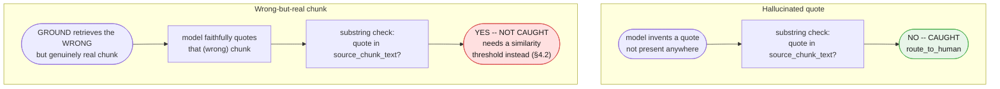
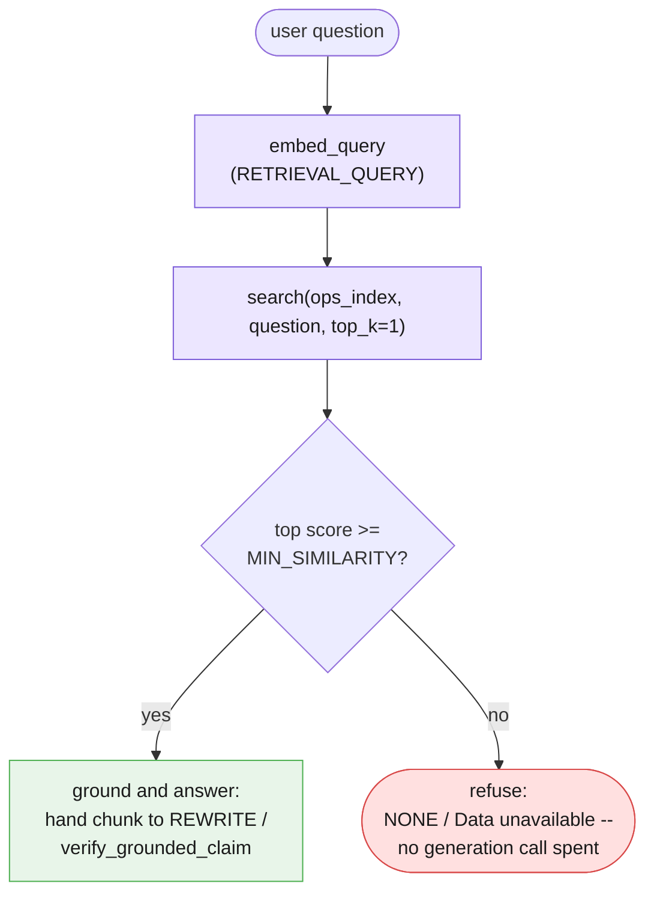

# Part IV — Reliability

Part III built the whole extended pipeline and showed it working when GROUND retrieves the
right chunk and REWRITE's claim survives substring verification. This part is about the ways
that story goes wrong — and the most important one is not a crash, a malformed response, or
even a hallucinated quote. It is a chunk that is completely real, faithfully quoted, and
answers the wrong question.

---

## 4.1 Retrieving the wrong chunk with total confidence

Chapter 1's substring check (§3.4) catches exactly one failure mode: a `supporting_quote`
that does not appear, verbatim, in the source it claims to come from. That check is
mechanical and reliable at the one job it does. It was never designed to catch a second,
harder failure mode, and it is worth being honest that nothing in this chapter's pipeline
catches it either: **a `supporting_quote` that is completely real, drawn faithfully from the
chunk GROUND retrieved — where the chunk itself is simply the wrong document for the
question.**

Construct both failures side by side, directly, so the contrast is exact rather than
something you have to take on faith:

```python
hallucinated_claim = GroundedAnswer(
    supporting_quote="Refunds are processed within 24 hours of any support request.",
    answer="Refunds are processed within 24 hours of any support request.",
)

wrong_chunk_claim = GroundedAnswer(
    supporting_quote=(
        "Yes, one login can belong to multiple workspaces, and you can switch between them\n"
        "from the workspace picker in the top navigation bar."
    ),
    answer="Yes, you can access multiple workspaces from one login.",
)


def passes_substring_check(result: GroundedAnswer, source_chunk_text: str) -> bool:
    """The same logic as §3.4's verify_against_chunk, returning a bool instead
    of routing to a print function, so the two cases below can be contrasted
    directly instead of read off two separate console lines."""
    if result.supporting_quote == "NONE":
        return False
    return result.supporting_quote in source_chunk_text


onboarding_workspace_chunk = doc_onboarding_faq.split("\n\n")[-1]

print(
    "Hallucinated quote, checked against doc_refund_policy — caught:",
    not passes_substring_check(hallucinated_claim, doc_refund_policy),
)
print(
    "Wrong-but-real chunk, checked against doc_onboarding_faq — caught:",
    not passes_substring_check(wrong_chunk_claim, onboarding_workspace_chunk),
)
```

The first line prints `True` — the hallucinated quote is not in `doc_refund_policy`
anywhere (the policy promises 5–7 business days, never 24 hours, and never frames itself as
"per support request"), so the substring check correctly rejects it. The second line prints
`False` — `wrong_chunk_claim`'s quote is copied character for character out of
`doc_onboarding_faq`'s own "multiple team workspaces" answer. The substring check has nothing
to object to. It was never told what question was being asked, only whether the words match
the source, and by that narrow measure the wrong-chunk answer is flawless.

Picture the concrete version of this inside the actual pipeline: a borderline ticket that
mentions "billing" and "my account" in the same sentence a genuine refund question would use.
GROUND embeds it, searches `ops_index`, and — on a bad day, for a genuinely ambiguous query —
returns a chunk from `doc_onboarding_faq` instead of `doc_refund_policy`, because the two
chunks sit closer together in embedding space than you'd like for this particular phrasing.
REWRITE is handed that chunk, faithfully paraphrases it, and Chapter 1's own verification
technique waves the result through — the quote really is in the chunk it claims to be in. The
customer receives a well-formed, perfectly grounded, completely irrelevant answer about
switching between workspaces, in response to a question about a duplicate charge.



**Say this plainly, the way Chapter 2 was plain about its own version of this gap (§4.1
there): this pipeline, as built across Part III, has no mechanism internal to itself for
noticing that GROUND's top match is confidently, faithfully, wrong.** Two real mitigations
exist, and neither is a rewrite of what Part III already built:

- **A minimum similarity-score threshold**, below which the pipeline refuses to ground an
  answer at all rather than trusting a weak match (§4.2 builds exactly this).
- **Routing low-confidence retrievals to a human** for a second opinion, the same discipline
  Chapter 2 §4.1 recommended for a semantically-wrong-but-schema-valid classification — a
  confidence signal that flags a fraction of runs for review, not a guarantee that catches
  every bad one.

Neither of these turns the substring check into something it was never designed to be. They
are separate controls, aimed at a separate failure mode, and naming them honestly here is
worth more than quietly hoping retrieval never returns the wrong document.

---

## 4.2 A similarity threshold as a refusal gate

Cosine similarity always returns a number — even a query about the CEO's phone number gets
scored against every chunk in `ops_index`, and `search()` happily hands back whichever chunk
scored *highest*, with no sense that "highest" might still mean "not actually relevant." A
threshold is the cheapest available fix: decide, in advance, a score below which the pipeline
refuses to attempt grounding at all.

```python
MIN_SIMILARITY = 0.5
# Chosen for this corpus and this embedding model, not a value Google's docs
# recommend -- GEMINI-API-FACTS confirms neither a universal threshold nor a
# preferred similarity metric for gemini-embedding-001. Treat this number as
# a starting point to calibrate against your own corpus and a labeled set of
# "should answer" / "should refuse" questions, not a fact to trust blindly.


def ground_with_threshold(question: str, index: list[dict]) -> dict | None:
    """Same retrieval as ground_step (§3.2), plus a refusal gate: if the top
    match's own score falls below MIN_SIMILARITY, return None immediately
    rather than handing a weak match to REWRITE or to verify_grounded_claim
    at all."""
    top_matches = search(index, question, top_k=1)
    top = top_matches[0]
    if top["score"] < MIN_SIMILARITY:
        return None
    return top


ceo_phone_question = "What is the CEO's direct phone number?"
gated_result = ground_with_threshold(ceo_phone_question, ops_index)

if gated_result is None:
    print(
        "supporting_quote=NONE, answer=Data unavailable -- refused before any "
        "generation call was made, purely on retrieval's own top score"
    )
else:
    print("retrieved:", gated_result["chunk_id"], gated_result["score"])
```

This is Part II's Case 3 (the unanswerable CEO-phone-number question) revisited with a
cheaper, earlier exit. Part II let retrieval return *something* and relied entirely on
Chapter 1's `GroundedAnswer` call to notice, after spending a generation call, that nothing
in the returned chunk actually answers the question. The threshold gate above reaches the
same `NONE` / `Data unavailable` outcome without spending that call at all — a cost and
latency win on top of a safety one, on exactly the questions the corpus has no business
answering.

Two honest limits belong right next to this gate, not left implicit: a score *above*
`MIN_SIMILARITY` still needs Chapter 1's substring verification — clearing the threshold is
not the same as being correct, only "worth attempting." And a score *below* the threshold can
occasionally be a real match the threshold was tuned too aggressively for, which is exactly
why this is framed as a calibration problem against a labeled question set, not a constant to
copy verbatim into a different corpus.



---

## 4.3 Freshness

Every fixture in this chapter is a string, defined once in the session preamble and never
touched again. A real corpus is not that well-behaved. If `doc_refund_policy` changes next
quarter — a new refund window, a new manual-review condition — every chunk that came from it
needs to be re-chunked, re-embedded, and swapped back into the index. Nothing about the query
side of this pipeline would notice if that never happened: `search()` has no way to know its
own index is stale, and a stale `doc_refund_policy#0` will keep answering questions about
refund eligibility with last quarter's rule, confidently and without error, for as long as
nobody rebuilds the index.

This is a production discipline problem, not a code problem this teaching chapter should
solve by building a re-indexing pipeline. Two concrete disciplines are worth naming, without
building either:

- **Version the corpus.** Every chunk in the index should be traceable to the exact version
  of the source document it came from, so "which policy version answered this ticket last
  Tuesday" is a lookup, not archaeology — the same discipline Chapter 2 §4.4 applied to
  pipeline manifests, one level down, applied here to corpus content instead of prompt
  content.
- **Track the embedding model version alongside every vector.** A chunk embedded with one
  version of `gemini-embedding-001` is not safely comparable, via cosine similarity, to a
  query embedded with a different embedding model or a different version of it — the two
  vectors may not even share a coordinate system. Nothing about `cosine_similarity`'s own math
  raises an error for this; it will happily compute a number for two vectors that were never
  meant to be compared, and that number will look exactly as trustworthy as one computed
  between two vectors from the same embedding space.

```python
def chunk_needs_reembedding(chunk: dict, current_embed_model: str) -> bool:
    """Illustrative only -- ops_index as built in §3.2 does not tag chunks
    with an embedding_model field, and this chapter does not build the
    re-indexing job that would consume this function. It exists to make the
    discipline concrete: a chunk's own dict is the natural place to carry the
    embedding-model version it was embedded with, right alongside its
    vector."""
    return chunk.get("embedding_model") != current_embed_model
```

Neither versioning scheme above ships in this chapter's `ops_index` — building a full
re-indexing pipeline, a corpus version store, and an embedding-model migration path is real
work that belongs to Part VI's production discipline, not to a teaching-scale four-document
corpus. The honest line to hold here is narrower: freshness is a cost this architecture
imposes that Chapter 1's single-shot grounding never had to pay, because Chapter 1 never
cached anything — it re-read whatever text you pasted, every single call. An index is a
cache, and every cache needs an invalidation story.

---

## 4.4 Partial failure in a retrieval pipeline

Chapter 2 §4.2 drew a sharp line between two kinds of "the call failed": a stage's own call
failing for reasons unrelated to the input (safe to retry) versus a stage's output being
untrustworthy for reasons the retry budget cannot fix (a different mechanism entirely). GROUND
extends that same line into a place Chapter 2 never had to look: retrieval has *two*
independent ways to go wrong, and they need two different fixes, not one.

**The embedding call itself can fail** — a dropped connection, a timeout, a 429
(`RESOURCE_EXHAUSTED`, per the API facts). This is Chapter 2's own retry territory, applied to
`embed_content` instead of `interactions.create`: the call never completed, nothing external
was mutated by the failed attempt, and retrying with the same input is safe.

```python
import logging
import time

log = logging.getLogger(__name__)


class TransientEmbeddingError(Exception):
    """Raised when GROUND's own embedding call fails for reasons unrelated to
    retrieval quality. Retrying is safe here for the same reason Chapter 2
    §4.2 called retrying a model call safe: embed_content, on its own,
    mutates nothing external."""


def embed_query_with_retries(
    question: str, max_attempts: int = 3, base_delay: float = 1.0
) -> list[float]:
    last_exc: Exception | None = None
    for attempt in range(max_attempts):
        try:
            return embed_query(question)
        except Exception as exc:
            last_exc = exc
            log.warning(
                "embed_query failed (attempt %d/%d): %s", attempt + 1, max_attempts, exc
            )
            if attempt < max_attempts - 1:
                time.sleep(base_delay * (2 ** attempt))
    raise TransientEmbeddingError(f"exhausted {max_attempts} attempts") from last_exc
```

**The embedding call can also succeed and still return a low-confidence match** — the network
worked fine, `search()` returned a ranked list exactly as designed, and the top score is
simply too low to trust. Retrying does nothing here: calling `embed_content` again on the same
ticket text against the same index produces, barring floating-point noise, the same score.
The fix for this failure is §4.2's threshold, not a retry loop — no number of additional
attempts turns a genuinely weak match into a strong one.

```python
def ground_step_safe(state: GroundedIncidentState) -> tuple[GroundedIncidentState, dict]:
    """GROUND, hardened with both fixes applied to the failure mode each one
    actually addresses: retry the embedding call itself (this section), then
    gate on similarity (§4.2) once a score is actually in hand. Neither fix
    substitutes for the other."""
    if state.route is None:
        raise ValueError("ground: upstream stages did not run")
    query_vector = embed_query_with_retries(state.ticket)
    scored = [
        {**chunk, "score": cosine_similarity(query_vector, chunk["vector"])}
        for chunk in ops_index
    ]
    scored.sort(key=lambda c: c["score"], reverse=True)
    top = scored[0]
    if top["score"] < MIN_SIMILARITY:
        state.retrieved_chunk = None
        return state, {}
    state.retrieved_chunk = top
    return state, {}
```

The table this section earns, alongside Chapter 2's own schema-versus-semantic table (§4.3
there):

| | Embedding call failed (network, 429) | Embedding call succeeded, low similarity |
|---|---|---|
| What broke | The request never completed | The request completed; the top match is weak |
| Detected by | An exception from `client.models.embed_content` | `top["score"] < MIN_SIMILARITY` |
| Fixed by | Bounded retry with backoff (this section) | The refusal gate (§4.2) |
| Retrying helps? | Yes — nothing external was mutated | No — the same input re-embeds to the same score |

Downstream of `ground_step_safe`, the rest of the pipeline needs exactly one more check before
it can run unattended: `rewrite_step` and `log_summary_step` both already raise a `ValueError`
if `state.retrieved_chunk is None`, and — per Chapter 2 §4.3's quarantine rule, reused
unchanged — that raised error is exactly what `Pipeline.run` catches and turns into a
`Quarantined` exception, halting the run rather than asking REWRITE to draft a customer
message grounded in nothing at all.

---

**Next:** [Part V — Reusable Artifacts](./05-reusable-artifacts.md)
