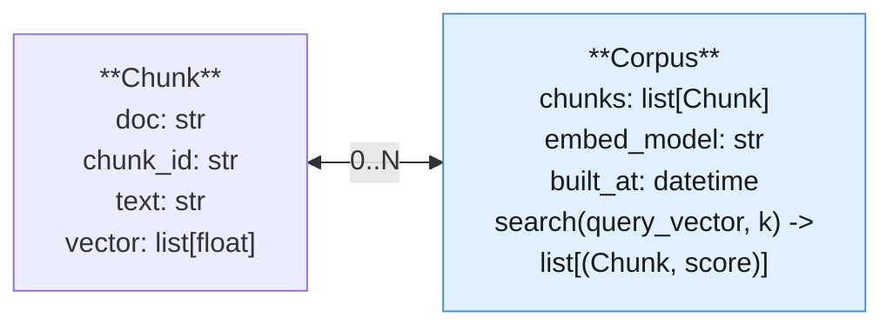
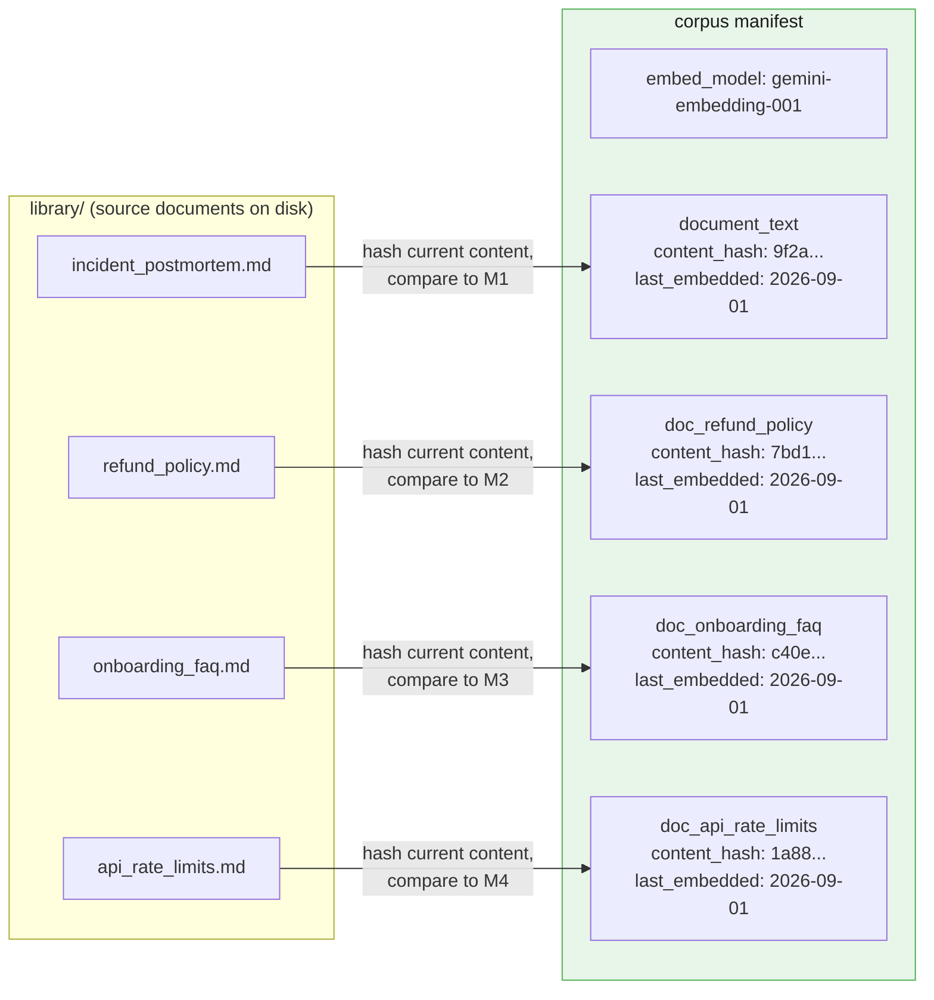
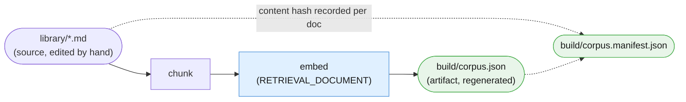

# Part V — Reusable Artifacts

Chapter 2's Part V asked what you save from a *pipeline*. This part asks the same
question for a *corpus*: what do you save from chunking four documents, embedding
every chunk, and searching that index repeatedly, so that six months from now someone
can answer "what is actually in this corpus, when was it last built, and has any
source document changed since?" without re-reading every file by hand.

Nothing below is a new orchestration idea. Retrieval is still a single-shot lookup —
embed a query, compare it against an index, take the top matches. What is new is the
scaffolding around that lookup: a small object to represent a searchable chunk, a
smaller object to hold a set of them, a manifest that pins the index to the documents
it came from, and a directory convention that keeps source documents and the index
built from them from ever being confused with each other.

---

## 5.1 The `Chunk` and `Corpus` abstraction

A chunk is the retrieval-layer's version of Chapter 2's `Stage`: the smallest unit
that carries everything a search needs and nothing it doesn't — which document it
came from, where in that document it sits, its text, and the vector Part III's
`embed_content` call turned that text into.



Part III already builds the chunker (split on blank-line paragraph breaks) and the
`embed_content` calls that turn a paragraph into a vector. Both are recapped here in
full, only because this section needs real chunks to hang a `Corpus` off of:

```python
import math

def chunk_paragraphs(doc_name: str, text: str) -> list[tuple[str, str]]:
    """Split a document into (chunk_id, chunk_text) pairs on blank-line paragraph
    breaks. Same chunker Part III teaches, same limitation: this is a simplification,
    not a production chunking strategy (§5.6 says more)."""
    paragraphs = [p.strip() for p in text.split("\n\n") if p.strip()]
    return [(f"{doc_name}#{i}", p) for i, p in enumerate(paragraphs)]


def cosine_similarity(a: list[float], b: list[float]) -> float:
    dot = sum(x * y for x, y in zip(a, b))
    norm_a = math.sqrt(sum(x * x for x in a))
    norm_b = math.sqrt(sum(y * y for y in b))
    return dot / (norm_a * norm_b)
```

`Chunk` and `Corpus` themselves are deliberately small — about the same restraint
Chapter 2 showed with `Stage` (§5.1 there): no base class, no plugin registry, one
method.

```python
from dataclasses import dataclass
import datetime as dt

@dataclass(frozen=True)
class Chunk:
    """One retrievable unit. Frozen because a chunk's text and vector never change
    in place — a changed source document produces a NEW chunk, built fresh (§5.3)."""
    doc: str
    chunk_id: str
    text: str
    vector: list[float]


@dataclass
class Corpus:
    """A searchable set of chunks, plus the two facts you need before trusting a
    search result: which embedding model produced these vectors, and when."""
    chunks: list[Chunk]
    embed_model: str
    built_at: dt.datetime

    def search(self, query_vector: list[float], k: int = 3) -> list[tuple["Chunk", float]]:
        scored = [(c, cosine_similarity(query_vector, c.vector)) for c in self.chunks]
        scored.sort(key=lambda pair: pair[1], reverse=True)
        return scored[:k]
```

Building the corpus is the whole "index build" step at this chapter's scale — chunk
every document, embed every chunk once with `RETRIEVAL_DOCUMENT`, and keep the result
in memory:

```python
from google.genai import types

LIBRARY_DOCS = {
    "document_text": document_text,
    "doc_refund_policy": doc_refund_policy,
    "doc_onboarding_faq": doc_onboarding_faq,
    "doc_api_rate_limits": doc_api_rate_limits,
}


def build_corpus(documents: dict[str, str]) -> Corpus:
    """Chunk every document, embed every chunk once with RETRIEVAL_DOCUMENT and a
    title set to the source doc name, and return a ready-to-search Corpus. §6.2 has
    more to say about what changes once this stops running in a few seconds."""
    all_chunks: list[Chunk] = []
    for doc_name, text in documents.items():
        for chunk_id, chunk_text in chunk_paragraphs(doc_name, text):
            result = client.models.embed_content(
                model=EMBED_MODEL,
                contents=chunk_text,
                config=types.EmbedContentConfig(task_type="RETRIEVAL_DOCUMENT", title=doc_name),
            )
            all_chunks.append(Chunk(doc=doc_name, chunk_id=chunk_id, text=chunk_text,
                                     vector=result.embeddings[0].values))
    return Corpus(chunks=all_chunks, embed_model=EMBED_MODEL,
                  built_at=dt.datetime.now(dt.timezone.utc))


ops_corpus = build_corpus(LIBRARY_DOCS)
print(len(ops_corpus.chunks), "chunks indexed from", len(LIBRARY_DOCS), "documents")
```

---

## 5.2 The `RetrievalStage` — one new stage, not a new concept

This chapter adds exactly one new kind of stage to Chapter 2's vocabulary. It does
not add a new orchestration concept, a new base class, or a new way for a pipeline to
decide what runs next. A `Stage` is still "name, optional prompt metadata, optional
model, and a step function" (Ch2 §5.1) — reproduced verbatim below so this file runs
standalone, unchanged in shape:

```python
from typing import Any

@dataclass(frozen=True)
class Stage:
    """Identical to Chapter 2 §5.1's Stage. A retrieval stage does not need a new
    field: `model` is already `str | None`, and EMBED_MODEL fits it exactly."""
    name: str
    prompt_name: str | None
    prompt_version: str | None
    model: str | None
    step: Any  # Callable[[Any], tuple[Any, dict[str, int]]]

    def run(self, validated_input: Any) -> tuple[Any, dict[str, int]]:
        return self.step(validated_input)
```

The GROUND stage from Part III, once you strip away the surrounding pipeline
plumbing, is nothing more than a `Stage` whose step function calls
`Corpus.search()` instead of `client.interactions.create()`:

```python
@dataclass
class GroundResult:
    query: str
    retrieved_chunk: Chunk | None
    score: float | None


def ground_step(query: str) -> tuple[GroundResult, dict[str, int]]:
    """The step-function contract is untouched: validate input -> call or don't call
    the model -> validate output (Ch1 §1.4, Ch2 §5.1). The only thing new is which
    call sits in the middle — embed_content plus Corpus.search(), not a prompt."""
    if not query.strip():
        raise ValueError("ground: empty query")
    result = client.models.embed_content(
        model=EMBED_MODEL,
        contents=query,
        config=types.EmbedContentConfig(task_type="RETRIEVAL_QUERY"),
    )
    top = ops_corpus.search(result.embeddings[0].values, k=1)
    if not top:
        return GroundResult(query=query, retrieved_chunk=None, score=None), {}
    chunk, score = top[0]
    return GroundResult(query=query, retrieved_chunk=chunk, score=score), {}


ground_stage = Stage(name="ground", prompt_name=None, prompt_version=None,
                      model=EMBED_MODEL, step=ground_step)

ground_result, _ = ground_stage.run(ticket_text)
print(ground_result.retrieved_chunk.doc, "|", round(ground_result.score, 3))
```

`prompt_name` and `prompt_version` are `None` here for the same reason Chapter 2's
ROUTE stage left them `None`: this stage has no prompt file, because it has no
prompt. It has a query, an index, and a similarity function. `model` is set to
`EMBED_MODEL` rather than `MODEL` — a small, deliberate signal in the manifest (§5.3)
that this stage's "model" is an embedding model, not a generation model, the same
distinction the chapter preamble draws by pinning two separate constants.

Slotted into Example B's pipeline, `ground_stage` sits between ROUTE and REWRITE
exactly as Part III describes, and a `Pipeline` (Ch2 §5.2, unchanged) threads its
`GroundResult` into REWRITE's input the same way it threads any other stage's output —
`Pipeline` does not need to know retrieval happened at all.

---

## 5.3 The corpus manifest

Chapter 2's pipeline manifest (§5.3 there) pinned down which prompt version each
stage used. A corpus manifest pins down the one thing a pipeline manifest cannot: not
which prompt built an answer, but which **source documents**, at which **content
hash**, built the **index** an answer was grounded in — plus the embedding model that
did the embedding, since changing either one invalidates the index just as surely.



The payoff of the content hash: you can tell "this document changed since it was last
embedded" with one cheap hash comparison per document, without re-embedding anything
to find out.

```python
import hashlib

def hash_text(text: str) -> str:
    return hashlib.sha256(text.encode("utf-8")).hexdigest()[:16]


def build_corpus_manifest(documents: dict[str, str], embed_model: str) -> dict:
    now = dt.datetime.now(dt.timezone.utc).isoformat()
    return {
        "embed_model": embed_model,
        "documents": {
            doc_name: {"content_hash": hash_text(text), "last_embedded": now}
            for doc_name, text in documents.items()
        },
    }


ops_manifest = build_corpus_manifest(LIBRARY_DOCS, EMBED_MODEL)


def find_stale_documents(manifest: dict, current_documents: dict[str, str]) -> list[str]:
    """A document is stale if its current content hash no longer matches the hash
    the manifest recorded at embedding time. That comparison is the entire freshness
    check — no re-embedding, no re-reading the index, just a hash per document."""
    stale = []
    for doc_name, text in current_documents.items():
        recorded = manifest["documents"].get(doc_name)
        if recorded is None or recorded["content_hash"] != hash_text(text):
            stale.append(doc_name)
    return stale


print(find_stale_documents(ops_manifest, LIBRARY_DOCS))  # [] -- nothing has changed yet
```

Edit `doc_refund_policy`'s text one paragraph and re-run `find_stale_documents` and it
prints `["doc_refund_policy"]` — the one document you need to re-embed, not all four.

---

## 5.4 Documents as files, chunks as a build artifact

Chapters 1 and 2 externalized prompts into files precisely so a prompt was never a
string buried inside application code (Ch1 §5.1, Ch2 §5.4). This chapter extends the
same convention one layer further: source documents live as files in a `library/`
directory, hand-written and version-controlled like any other project asset. The
embedded index — `Corpus.chunks`, one vector per chunk — is a **build artifact**
derived from those files, the same relationship compiled output has to source code.
You regenerate it; you do not hand-edit it.

```
project/
├── library/                        # SOURCE — hand-edited, reviewed, version controlled
│   ├── incident_postmortem.md
│   ├── refund_policy.md
│   ├── onboarding_faq.md
│   └── api_rate_limits.md
│
└── build/                          # ARTIFACT — generated, gitignored, never hand-edited
    ├── corpus.json                 # one row per chunk: doc, chunk_id, text, vector
    └── corpus.manifest.json        # §5.3: embed_model, per-doc content_hash, last_embedded
```



The failure mode this prevents is the same one untracked build output causes
anywhere else: someone edits `corpus.json` directly to "quickly fix" a bad chunk, the
next real rebuild silently overwrites the fix, and nobody can explain why the corpus
regressed. If a chunk is wrong, the fix belongs in `library/`, followed by a rebuild —
never in the artifact.

---

## 5.5 Reference layout

Everything above, assembled into one project — the corpus-side counterpart to
Chapter 2's §5.7.

```
intelligent-library/
│
├── library/                          # ── §5.4: source documents, hand-edited ──
│   ├── incident_postmortem.md
│   ├── refund_policy.md
│   ├── onboarding_faq.md
│   └── api_rate_limits.md
│
├── build/                            # ── §5.4: generated, gitignored ──
│   ├── corpus.json                   # Chunk rows: doc, chunk_id, text, vector
│   └── corpus.manifest.json          # §5.3: embed_model, content_hash, last_embedded
│
├── prompts/                          # ── Ch2 §5.4, unchanged ──
│   └── incident_response/
│       ├── 01_classify.system.md     # byte-identical to Ch1/Ch2
│       ├── 03_rewrite.system.md      # byte-identical to Ch1/Ch2
│       └── 04_log_summary.system.md  # byte-identical to Ch1/Ch2
│           # 02_route and 03_ground have no files -- plain code and no-prompt retrieval
│
├── src/
│   ├── pipeline.py                   # Stage, Pipeline, StageLog, Quarantined (Ch2 §5.1-5.2)
│   ├── retrieval.py                  # Chunk, Corpus, chunk_paragraphs, cosine_similarity (§5.1)
│   ├── corpus_manifest.py            # build_corpus_manifest(), find_stale_documents() (§5.3)
│   ├── build_corpus.py               # reads library/, writes build/corpus.json + manifest
│   └── incident_response.py          # step functions incl. ground_step, the wired pipeline
│
├── evals/
│   ├── golden/
│   │   ├── incident_response_e2e.jsonl
│   │   └── retrieval_precision.jsonl # ── §6.3: (query, expected_doc) pairs ──
│   └── run_retrieval_eval.py
│
└── logs/                             # gitignored; retrieved chunks + scores per query (§6.4)
```

One thing to notice: `library/` and `build/` are new top-level ideas Chapter 2 had no
reason to have. Everything else — `prompts/`, `src/`, `evals/`, `logs/` — is the same
shape Chapter 2 already established, extended rather than replaced.

---

## 5.6 What this chapter's reusable artifacts are NOT

Said plainly, the same way Chapter 2 drew its own skills boundary (§5.6 there):

- **A `Corpus` is not a production vector database.** It has no persistence, no
  concurrent-write handling, no approximate-nearest-neighbor index, and no way to
  update one chunk without holding the whole list in memory. It is a teaching-scale
  stand-in for Pinecone, pgvector, Chroma, or Google's own managed File Search API
  (named in §6.2) — useful for learning exactly what those systems do under the hood,
  not a thing to deploy as-is.
- **A `RetrievalStage` is not an agent that decides to search.** `ground_step` always
  embeds the query, always searches the same corpus, always returns the top-`k` and
  stops. It never notices a low similarity score and reformulates the query, never
  decides on its own to issue a second search against a different corpus, and never
  chooses whether to search at all based on what it sees. A stage that did any of
  that would be reading its own prior output and changing its own next action — the
  same line Chapter 2 drew for `Stage` gaining a `condition` field (§5.1 there). That
  adaptive, self-directed search loop is Blueprint 4 territory, named here as a
  forward pointer and deliberately not built in this chapter.

**Next:** [Part VI — Production Discipline](./06-production.md)
