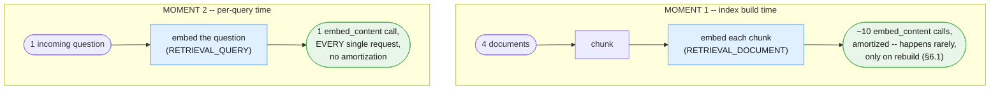
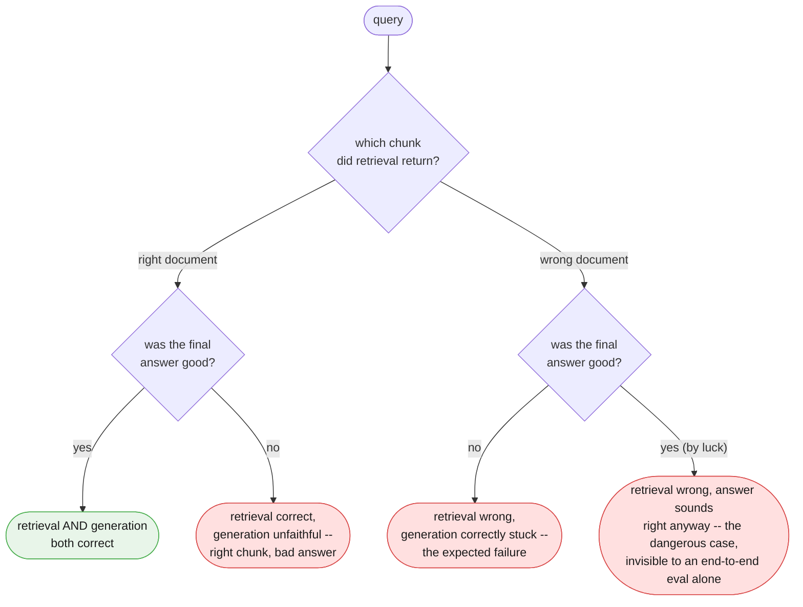
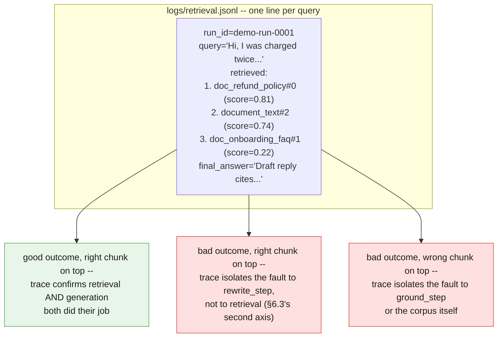

# Part VI — Production Discipline

Part V was what you save from a corpus. This part is what you do with it once real
queries are hitting a real index: versioning source documents and an embedding model
together, reasoning about where embedding cost actually lands, evaluating retrieval as
its own thing rather than folding it into "was the final answer right," and logging
enough about each retrieval to tell those two failure modes apart after the fact.

---

## 6.1 Corpora as code

Chapter 1 treated a prompt's version as part of its identity (§6.1 there). Chapter 2
extended that to a pipeline: a stage's prompt version is part of the *pipeline's* own
identity, and bumping one bumps the other (§6.1 there). A corpus extends the same
rule one level further, with one twist: a corpus has **two** things that define it,
not one.

> **A corpus's version is defined by its source documents AND its embedding model,
> together.** Changing either one means the corpus is no longer the same corpus, and
> its version should bump — the same way Chapter 2 treated a stage's prompt version
> as part of the pipeline's own identity, not a detail private to that stage.

Edit `doc_refund_policy` and re-embed it: the corpus version bumps, because the
vectors describe different text than before. Leave every document untouched but swap
`EMBED_MODEL` for a newer embedding model: the corpus version *still* bumps, because
every existing vector is now meaningless — a vector from one embedding model is not
comparable to a vector from another, even if the underlying text never changed.

```python
def bump_corpus_version(manifest: dict, reason: str) -> dict:
    """A corpus's identity is source content + embedding model, not source content
    alone (§6.1). Both kinds of change land in the same version field and the same
    changelog, because a consumer of the corpus needs to know its meaning changed —
    it does not need to know in advance which of the two reasons caused it."""
    major, minor, patch = (int(p) for p in manifest.get("version", "1.0.0").split("."))
    manifest["version"] = f"{major}.{minor + 1}.0"
    manifest.setdefault("changelog", []).append(reason)
    return manifest


ops_manifest["version"] = "1.0.0"
ops_manifest = bump_corpus_version(
    ops_manifest, "doc_refund_policy: section 4 clarified for repeat-duplicate wording"
)
print(ops_manifest["version"], ops_manifest["changelog"])
```

A corpus changelog entry needs one more field than Chapter 2's pipeline changelog
(§6.1 there): which kind of change triggered the bump, because "a document changed"
and "the embedding model changed" call for different remediation — re-embed one
document, or re-embed the whole corpus.

```markdown
## ops_corpus 1.1.0 — 2026-09-08 — @tmudgal
**Type:** MINOR — source document changed
**Change:** doc_refund_policy section 4 clarified for repeat-duplicate wording.
**Re-embed scope:** doc_refund_policy only (§5.3's content hash confirmed the other
three documents were untouched).
**Eval:** evals/golden/retrieval_precision.jsonl — 4/4 -> 4/4, no regression.

## ops_corpus 2.0.0 — 2026-09-10 — @tmudgal
**Type:** MAJOR — embedding model changed
**Change:** EMBED_MODEL swapped to a newer embedding model release.
**Re-embed scope:** ALL four documents — every existing vector is now meaningless,
regardless of whether its source text changed.
**Eval:** evals/golden/retrieval_precision.jsonl — re-run in full before shipping.
```

---

## 6.2 The cost of a retrieval pipeline

A generation call costs tokens once, at the moment it runs (Ch1 §6.2). Embedding
costs tokens **twice**, at two different moments with two very different frequencies,
and conflating them is the easiest mistake to make when estimating what a retrieval
pipeline actually costs to run.



At this chapter's four-document scale, the two moments are comparable in absolute
call count — a handful of chunks embedded once versus a handful of test queries
embedded during development. That comparability is an artifact of small scale, not a
general rule:

```python
def estimate_embedding_calls(n_documents: int, avg_chunks_per_doc: int, n_queries: int) -> dict[str, int]:
    """Embedding happens at two moments with two frequencies. Index-build cost is
    paid once per document (and again only for documents §5.3's content hash flags
    as changed). Query cost is paid on every single request, with no equivalent
    amortization -- 50 queries against a four-document corpus already outweighs the
    one-time cost of building that corpus in the first place."""
    return {
        "index_build_calls": n_documents * avg_chunks_per_doc,
        "per_query_calls": n_queries,
    }


print(estimate_embedding_calls(n_documents=4, avg_chunks_per_doc=3, n_queries=1))
print(estimate_embedding_calls(n_documents=4, avg_chunks_per_doc=3, n_queries=500))
```

At 1 query, index-build dominates. At 500 queries against the same four-document
corpus, per-query cost dominates by roughly two orders of magnitude — the index was
paid for once; the queries are paid for on every single request, forever, for as
long as the corpus is in service. **Query volume, not corpus size, is usually the
line item worth watching first.**

What changes at real scale — thousands of documents rather than four:

- **Index-build cost stops being negligible.** Chunking and embedding ten thousand
  documents is not a "run it once and forget it" operation the way four documents
  are; it is a job worth its own pipeline, its own retry logic, and its own cost
  line, especially the first time a corpus is built or a migration to a new
  `EMBED_MODEL` forces a full re-embed (§6.1).
- **Linear cosine-similarity search stops being fast enough.** `Corpus.search()`
  compares a query vector against every single chunk, in Python, one at a time. That
  is fine for a few dozen chunks and increasingly not fine for tens of thousands. This
  is exactly where a real vector database's *approximate* nearest-neighbor search
  earns its keep — trading a small amount of recall for search that stays fast as the
  corpus grows, the production alternative named but not built in §5.6.

---

## 6.3 Evaluating retrieval quality specifically

Chapter 2's eval split was per-stage versus end-to-end (§6.3 there): does one stage's
output match, and separately, does the whole chain's final output match. Retrieval
needs a third, orthogonal question that neither of those two catches on its own: **did
the corpus surface the right source document**, independent of whether a downstream
model went on to write a good answer from it.

The two failure modes an end-to-end eval alone cannot tell apart:



A retrieval-only eval needs a golden set of `(query, expected_source_document)`
pairs — no expected answer text, just which document should have been found — checked
against `Corpus.search()` directly, with no generation call in the loop at all:

```python
RETRIEVAL_GOLDEN = [
    {"query": "How many customers were charged twice in the October incident?",
     "expected_doc": "document_text"},
    {"query": "If a customer says they were charged twice, are they automatically owed a refund?",
     "expected_doc": "doc_refund_policy"},
    {"query": "How do I reset my password?",
     "expected_doc": "doc_onboarding_faq"},
    {"query": "What happens if I exceed my API rate limit?",
     "expected_doc": "doc_api_rate_limits"},
]


def run_retrieval_eval(corpus: Corpus, golden: list[dict]) -> float:
    """Retrieval precision, isolated from generation entirely: did the TOP result
    come from the expected document. This is the eval that catches 'wrong chunk,
    right-sounding answer' (§6.3) before it ever reaches a customer -- a property
    Chapter 2's end-to-end eval (§6.3 there) has no way to check on its own, because
    it only ever sees the final generated text, never which chunk produced it."""
    correct = 0
    for case in golden:
        result = client.models.embed_content(
            model=EMBED_MODEL,
            contents=case["query"],
            config=types.EmbedContentConfig(task_type="RETRIEVAL_QUERY"),
        )
        top_chunk, score = corpus.search(result.embeddings[0].values, k=1)[0]
        ok = top_chunk.doc == case["expected_doc"]
        correct += ok
        if not ok:
            print(f"MISS: {case['query'][:48]!r} -> got {top_chunk.doc}, "
                  f"expected {case['expected_doc']} (score={score:.3f})")
    precision = correct / len(golden)
    print(f"retrieval precision: {correct}/{len(golden)} = {precision:.2f}")
    return precision


run_retrieval_eval(ops_corpus, RETRIEVAL_GOLDEN)
```

Run this against `ops_corpus` and the second case is the one worth watching: both
`document_text` and `doc_refund_policy` mention "charged twice," so a keyword search
would have a real chance of preferring the wrong one. A retrieval eval that passes
here is evidence the corpus is matching on meaning, not on shared vocabulary — which
is precisely what Part IV's retrieval-quality diagram sets out to demonstrate.

A pipeline can pass this eval at 4/4 and still produce a bad customer-facing answer
if `rewrite_step` mishandles a correctly-retrieved chunk — that failure belongs to
Chapter 2's end-to-end eval, not this one. The two evals check different things on
purpose, and a corpus needs both.

---

## 6.4 Observability for a retrieval stage

Chapter 2 logged one line per stage: `run_id`, `prompt_version`, tokens, latency
(§6.4 there). A retrieval stage needs one more thing in that line that no generation
stage has: **which chunks it retrieved, and their similarity scores** — not just
whether the stage ran, but what it found.

```python
import logging
import json

retrieval_log = logging.getLogger("retrieval")


def log_retrieval(run_id: str, query: str, results: list[tuple[Chunk, float]], final_answer: str) -> None:
    """Extends Chapter 2's run-ID/structured-logging pattern (§6.4 there): every
    retrieved chunk and its score, logged alongside the final answer, under the same
    run_id. Without this line, a bad answer only tells you the pipeline failed
    somewhere -- WITH it, a bad answer is traceable to 'wrong chunk retrieved' versus
    'right chunk, unfaithful answer', the same two failure modes §6.3 evaluates for."""
    record = {
        "run_id": run_id,
        "query": query,
        "retrieved": [
            {"doc": chunk.doc, "chunk_id": chunk.chunk_id, "score": round(score, 4)}
            for chunk, score in results
        ],
        "final_answer": final_answer,
    }
    retrieval_log.info("retrieval_trace", extra=record)
    print(json.dumps(record))  # illustrative here; production emits via `log` only


demo_query_vector = client.models.embed_content(
    model=EMBED_MODEL,
    contents=ticket_text,
    config=types.EmbedContentConfig(task_type="RETRIEVAL_QUERY"),
).embeddings[0].values
demo_results = ops_corpus.search(demo_query_vector, k=3)
log_retrieval(
    run_id="demo-run-0001",
    query=ticket_text,
    results=demo_results,
    final_answer="Draft reply cites doc_refund_policy section 4 on automatic refunds.",
)
```



One `run_id`, joined the same way Chapter 2 joins `StageLog` rows (§6.4 there) — the
only difference is that a retrieval stage's log line carries a small ranked list
instead of a token count, because for this stage, *what it found* is the fact worth
keeping.

---

## Four things worth actually remembering

1. **A corpus's version is source content plus embedding model, together.** Either
   one changing invalidates the index; the manifest's version bump does not need to
   say which — it needs to say that something did.
2. **Embedding cost is paid at two moments with two frequencies.** Index-build is
   rare and amortized; per-query is constant and unavoidable. At small scale they
   look comparable; at real scale, query volume dominates, and linear search itself
   stops being fast enough long before that.
3. **Retrieval precision is its own eval, not a proxy for answer quality.** A golden
   set of `(query, expected_document)` pairs, checked with no generation call at
   all, is the only thing that catches "wrong chunk, right-sounding answer" before a
   customer does.
4. **Log the chunks, not just the answer.** A `run_id`-keyed trace with every
   retrieved chunk and score turns "the answer was wrong" into "the answer was wrong
   because retrieval picked the wrong document" or "because generation was
   unfaithful to the right one" — two different bugs with two different fixes.

**Next:** [Part VII — Advanced](./07-advanced.md)
