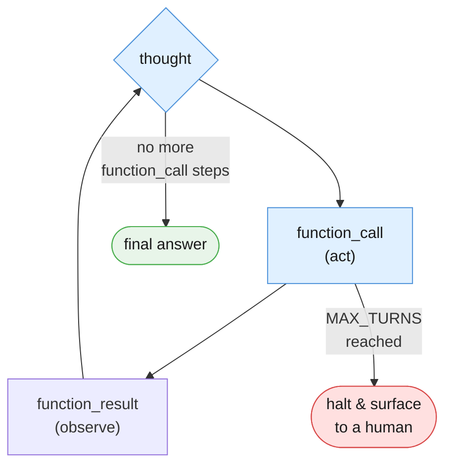
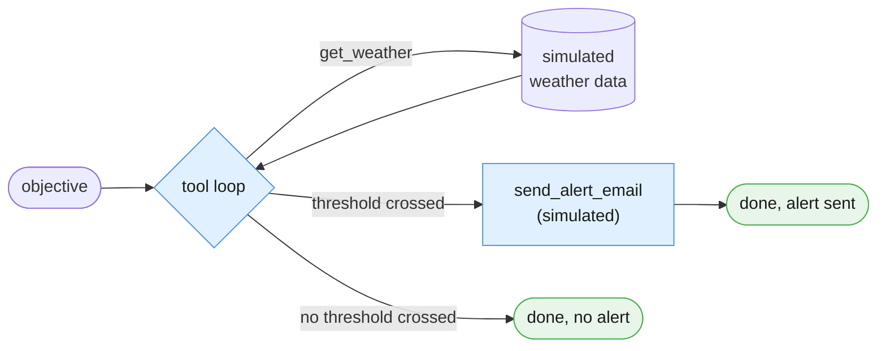
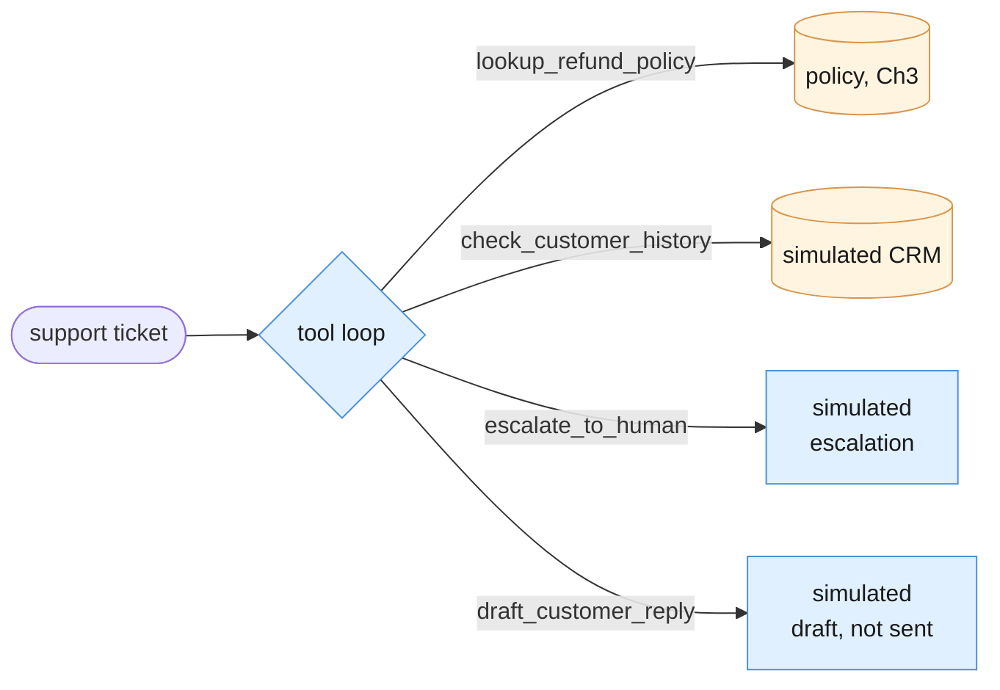
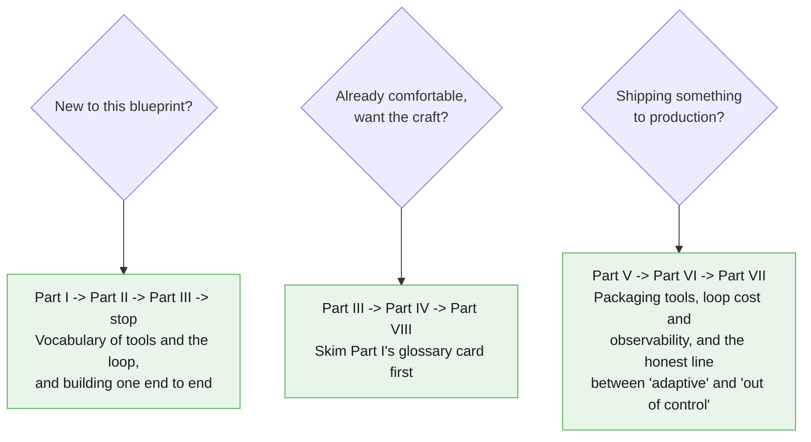

# Blueprint 4 — The Autopilot Worker

## A Working Knowledge Base for the Tool-Using Loop

*Companion chapter to "Beyond the Chatbox: The 5 Architecture Blueprints of Modern AI"
from the newsletter **The AI Agent Blueprint**, and the direct sequel to
[Blueprint 3 — The Intelligent Library](../03-intelligent-library-grounded-context/00-index.md).*

---

## Why this chapter exists

The parent article defines the Autopilot Worker in one paragraph:

> Instead of following a rigid, hardcoded track, this blueprint gives the AI
> programmatic tools and lets it run in a continuous evaluation loop. The system
> analyzes the user's objective, chooses a tool (like an API or a database query
> script), executes it, observes the real outcome, and loops until the goal is
> completed.

Both previous chapters spent real effort warning you away from this. Chapter 2's
§7.1: the moment a stage's *output* decides which stage runs next, you've quietly
built Blueprint 4. Chapter 3's §7.1: the moment retrieval decides on its own to
search again differently, same thing. This chapter is where that warning becomes a
promise kept on purpose: everything those two chapters told you not to stumble
into, this chapter builds deliberately — with a loop budget, a fixed tool
allowlist, and a human-approval gate around anything irreversible, before turning
it loose.



**This pattern earns its keep only when the steps genuinely can't be known in
advance.** The article is explicit about where it ends:

> **Avoid when:** The task can be perfectly handled by standard, predictable
> conditional code.

Chapter 2's own ROUTE stage — a one-line `if urgency >= 4` — is the running example
of exactly the kind of decision that needs neither a model nor a loop. This chapter
treats that boundary as a running theme, the same way Chapters 2 and 3 treated
theirs.

---

## The two examples we keep coming back to

### Example A — The Weather Alert Worker

Straight from the article's own example. The model is given two tools —
`get_weather(city)` and `send_alert_email(...)` — and one objective: check three
cities, and email an alert if any of them crosses a wind or storm threshold. How
many times it calls `get_weather`, and whether it calls `send_alert_email` at all,
is not scripted. That's the entire point.



### Example B — The Support Ticket Autopilot

This is where Chapters 1–3 stop being background reading. The same `ticket_text`
that Chapter 1 classified, Chapter 2 routed, and Chapter 3 grounded now gets handed
to a model with *tools* instead of a *fixed pipeline*: look up policy, check
customer history, escalate to a human, or draft a reply — in whatever order the
model decides it needs them.



Nothing in Example B actually sends an email, issues a refund, or writes to a real
system. Every action-shaped tool is simulated — it prints what it would do and
returns a fake confirmation. Wiring any of this to a real integration is a
deployment decision with its own review, and sits outside what a teaching chapter
should demonstrate.

| # | Task | Why it earns its place |
|---|---|---|
| A | **Weather Alert Worker** | The article's own example, built literally. Tests a genuine unbounded-count tool loop. |
| B | **Support Ticket Autopilot** | Reuses Ch1-3's fixtures and policy. Tests a loop choosing among multiple tools, including a human-approval gate. |

---

## How to read this



---

## Contents

- [Part I — Vocabulary of the Loop](./01-vocabulary.md)
- [Part II — Foundations](./02-foundations.md)
- [Part III — Core Techniques](./03-core-techniques.md)
- [Part IV — Reliability](./04-reliability.md)
- [Part V — Reusable Artifacts](./05-reusable-artifacts.md)
- [Part VI — Production Discipline](./06-production.md)
- [Part VII — Advanced](./07-advanced.md)
- [Part VIII — Practice](./08-practice.md)

---

## Before you start

This chapter assumes you already completed [Blueprint 1's setup](../SETUP.md) — same
Python 3.10+, same virtual environment, same `GEMINI_API_KEY`. **No new pip
dependency.** Tool calling is a parameter on the same `client.interactions.create`
call you already know, not a new library. This chapter's own
[`requirements.txt`](./requirements.txt) lists the identical three packages
Chapters 1-3 use.

If you're starting fresh at Chapter 4: go do [the repo's `SETUP.md`](../SETUP.md)
first, then at least skim
[Chapter 2's §7.1](../02-fixed-assembly-line-sequential-pipelines/07-advanced.md)
and [Chapter 3's §7.1](../03-intelligent-library-grounded-context/07-advanced.md) —
this chapter assumes you already understand the boundary they both warned about,
because this chapter is what's on the other side of it.

---

## The session preamble

Every code block in every file below assumes this has already run.

```python
"""Session preamble — every example in this chapter assumes these names exist."""

from dotenv import load_dotenv
from google import genai

load_dotenv()

client = genai.Client()
MODEL = "gemini-3.5-flash"

# ---------------------------------------------------------------------------
# Fixtures reused verbatim from Chapters 1-3
# ---------------------------------------------------------------------------
ticket_text = """Hi, I was charged twice for my October subscription. I can see two
identical GBP 49.00 charges on the same card, both dated 3 October. I have already
tried logging in to check my invoices but the billing page just spins forever.
Could someone refund the duplicate? This is the second month it has happened."""

doc_refund_policy = """Refund and Duplicate Charge Policy (Billing Handbook, Section 4)

Customers charged more than once for the same billing period due to a system error
are eligible for an automatic refund of the duplicate charge, no support ticket
required, once the duplicate is confirmed in the payment ledger. Confirmed duplicate
charges are refunded within 5-7 business days to the original payment method.

If a customer reports being charged twice in two or more consecutive billing cycles,
the account must be flagged for manual review by the billing operations team before
any further automatic refund is issued, since repeat duplication usually indicates a
deeper account or integration problem rather than a one-off system error.

Refunds for any other reason (dissatisfaction, accidental purchase, downgrade
requests) fall outside this section and are handled under the standard cancellation
policy instead."""

# ---------------------------------------------------------------------------
# New fixtures — simulated external systems this chapter's tools read from.
# These stand in for a real weather API and a real CRM. No example in this
# chapter calls a real external service.
# ---------------------------------------------------------------------------
WEATHER_DATA = {
    "London": {"condition": "heavy rain", "wind_kph": 42, "temp_c": 11},
    "Phoenix": {"condition": "clear", "wind_kph": 8, "temp_c": 39},
    "Chicago": {"condition": "thunderstorm", "wind_kph": 55, "temp_c": 24},
}

CUSTOMER_HISTORY = {
    "cust_4471": {"name": "J. Alvarez", "duplicate_charges_this_year": 2,
                  "account_standing": "good"},
}
```

> **Sanity check.** Run this before continuing:
>
> ```python
> probe = client.interactions.create(
>     model=MODEL,
>     input="Reply with exactly one word: ready.",
>     store=False,
> )
> print(probe.output_text)
> ```
>
> If that prints "ready" (or close to it), you're set.

---

## A note on the code

Same convention as Chapters 1-3: the **Interactions API** only
(`client.interactions.create`), model pinned once as `MODEL`, Python 3.10+ style
throughout. One deliberate departure: this chapter defaults to `store=True` with
`previous_interaction_id` for its tool loops, instead of Chapters 1-3's
`store=False`. A tool loop can run for several turns, and replaying the entire
growing conversation on every turn — the usual `store=False` alternative — is
exactly what `previous_interaction_id` exists to avoid. §1.5 explains this in
full.

There is **no automatic function calling** in this SDK. You always inspect
`interaction.steps` for a `function_call` step yourself, run the matching Python
function yourself, and send a `function_result` step back. Every loop in this
chapter has a hard `MAX_TURNS` cap — an unbounded `while True` with no escape hatch
is treated as a bug, not a simplification, from the very first example.

Every code block in this chapter is cumulatively runnable: paste them in order
after the preamble above, and nothing breaks.

---

## Supporting files

| Path | What's in it |
|---|---|
| `examples/` | Runnable `.py` for both examples and every technique |
| `prompts/` | System instructions and tool declarations used in this chapter |
| `requirements.txt` | Same three packages as Chapters 1-3 — nothing new |

---

## Verification status

Every API claim in this chapter — including the function-calling/tools section —
was checked against Google's live documentation before writing, including a known
current limitation around mixing built-in tools with custom functions (see §1.5 and
the facts sheet).

---

*Next in the series: Blueprint 5 — The Connected Boardroom (Specialist Networks).*
