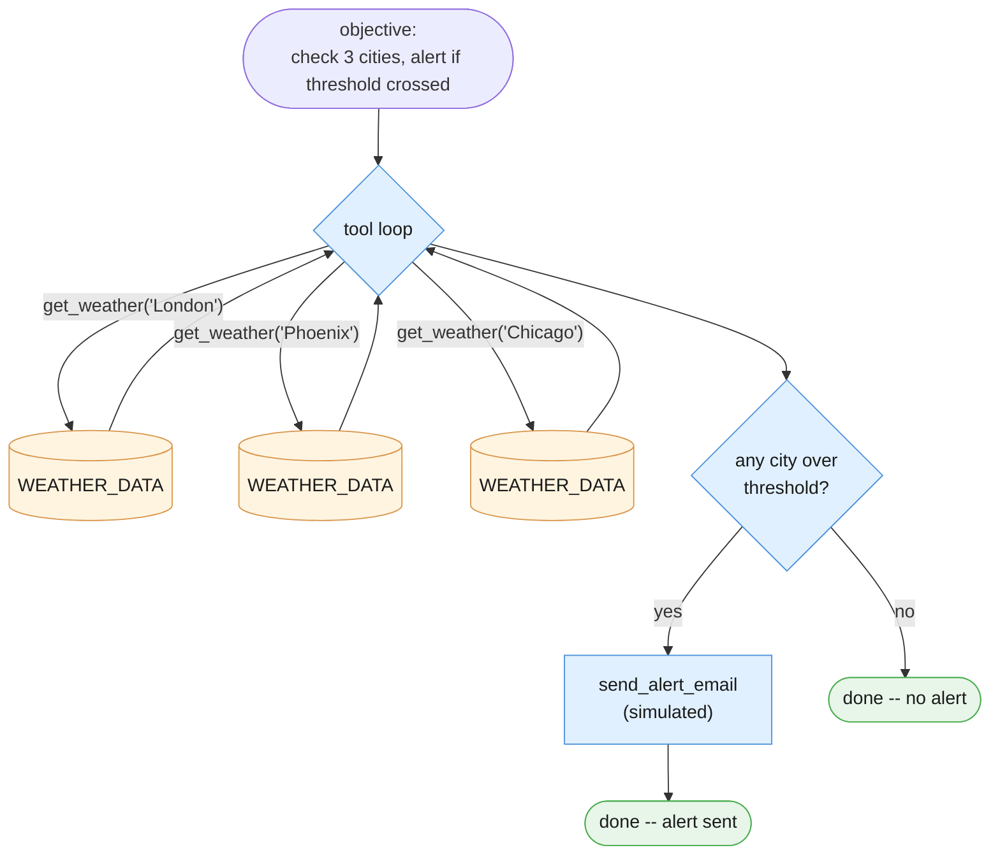
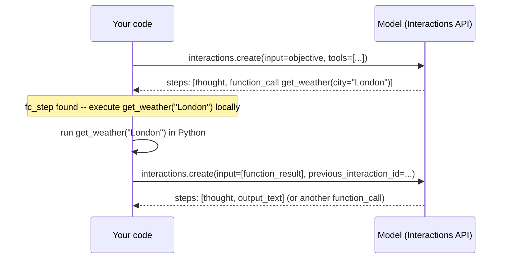
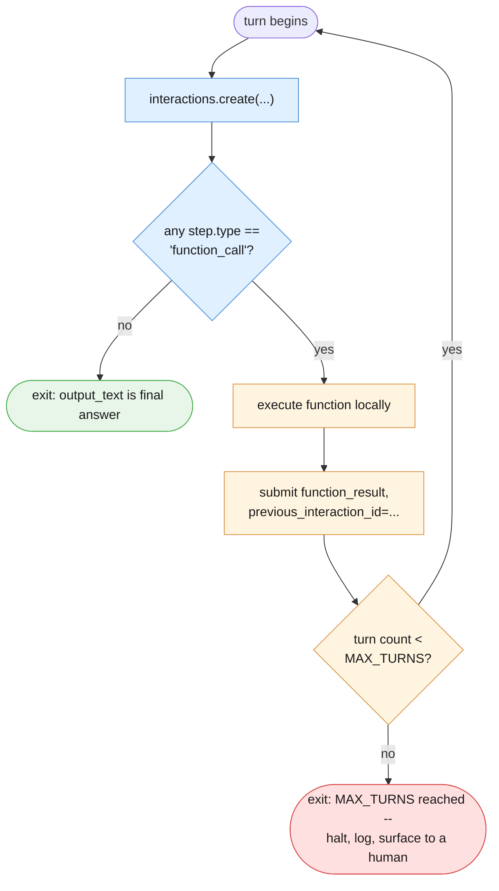

# Part I — Vocabulary of the Loop

Chapter 2 built its vocabulary around a fixed chain of stages. Chapter 3 built its around a
grounded, single-shot retrieval call. This chapter's vocabulary is built around something
neither of those had: a call that can decide, on its own, to make another call, and another,
until *it* — not your code — believes the objective is done. Same worked example the whole
way through: the article's own **Weather Alert Worker**.

---

## 1.1 The worked example

The objective, in plain language, is exactly what we hand the model as `input`:

> Check the weather in London, Phoenix, and Chicago. If any city has wind above 40 kph or a
> thunderstorm, send an alert email to ops@example.com summarizing which cities are affected
> and why.

Two tools make this possible: `get_weather(city)` reads a simulated weather table, and
`send_alert_email(...)` is a **simulated** send — it prints what it would do and returns a
fake confirmation. It never contacts a real mail server. Nothing here decides in advance how
many times `get_weather` gets called or whether `send_alert_email` gets called at all — that
is the model's call, turn by turn, which is the entire point of this blueprint.

Before decomposing it, run the whole thing as a black box: objective in, final summary out,
every tool call printed as it happens.

```python
# client, MODEL, WEATHER_DATA come from the session preamble in 00-index.md.
import json

get_weather_declaration = {
    "type": "function",
    "name": "get_weather",
    "description": "Get current simulated weather conditions for a named city.",
    "parameters": {
        "type": "object",
        "properties": {
            "city": {"type": "string", "description": "City name, e.g. 'London'"},
        },
        "required": ["city"],
    },
}

def get_weather(city: str) -> dict:
    """Reads from the simulated WEATHER_DATA table. Never calls a real weather API."""
    return WEATHER_DATA.get(city, {"condition": "unknown", "wind_kph": 0, "temp_c": None})

send_alert_email_declaration = {
    "type": "function",
    "name": "send_alert_email",
    "description": (
        "Send an alert email summarizing which cities crossed a weather threshold "
        "and why. SIMULATED ONLY -- never sends a real email."
    ),
    "parameters": {
        "type": "object",
        "properties": {
            "to": {"type": "string", "description": "Recipient email address"},
            "subject": {"type": "string"},
            "body": {"type": "string"},
        },
        "required": ["to", "subject", "body"],
    },
}

def send_alert_email(to: str, subject: str, body: str) -> dict:
    """SIMULATED. Prints what a real send would look like and returns a fake
    confirmation. No real email is ever sent by this function."""
    print(f"[SIMULATED EMAIL] to={to} subject={subject!r}\n{body}")
    return {"status": "simulated_sent", "to": to}

WEATHER_TOOLS = [get_weather_declaration, send_alert_email_declaration]
TOOL_FUNCTIONS = {
    "get_weather": get_weather,
    "send_alert_email": send_alert_email,
}
MAX_TURNS = 6

def run_weather_worker(objective: str) -> str:
    interaction = client.interactions.create(
        model=MODEL,
        input=objective,
        tools=WEATHER_TOOLS,
        store=True,
    )
    for turn in range(MAX_TURNS):
        fc_step = next((s for s in interaction.steps if s.type == "function_call"), None)
        if fc_step is None:
            return interaction.output_text   # happy-path exit: model believes it's done

        print(f"[turn {turn + 1}] model called {fc_step.name}({fc_step.arguments})")
        func = TOOL_FUNCTIONS[fc_step.name]
        result = func(**fc_step.arguments)
        print(f"[turn {turn + 1}] result: {result}")

        interaction = client.interactions.create(
            model=MODEL,
            input=[{
                "type": "function_result",
                "name": fc_step.name,
                "call_id": fc_step.id,
                "result": [{"type": "text", "text": json.dumps(result)}],
            }],
            tools=WEATHER_TOOLS,
            previous_interaction_id=interaction.id,
        )

    # hard-cap exit: the system stops it, not the model
    print(f"[weather worker] MAX_TURNS ({MAX_TURNS}) reached -- halting, surfacing to a human.")
    return "INCOMPLETE: loop hit MAX_TURNS, needs human review."

objective_a = (
    "Check the weather in London, Phoenix, and Chicago. If any city has wind "
    "above 40 kph or a thunderstorm, send an alert email to ops@example.com "
    "summarizing which cities are affected and why."
)

final_summary = run_weather_worker(objective_a)
print("\nFINAL:", final_summary)
```

Watch the printed transcript: `get_weather` gets called three times (once per city, in
whatever order the model picks), London and Chicago both cross the threshold, and
`send_alert_email` fires once with a summary the model wrote itself. Nothing in the Python
above told it to check three cities in that order, or to send exactly one email — the model
inferred all of that from the objective text and the tool results it observed along the way.
Everything below decomposes this one block.



---

## 1.2 Tool / function declaration

**A tool (or function declaration) is a described capability the model may invoke — it is
not something it invokes automatically.** You hand the model a plain dict describing a
Python function's name, purpose, and argument shape; the model can choose to ask for it, but
your code always decides whether and how it actually runs.

`get_weather_declaration` above is the declaration; `get_weather` is the actual Python
function it maps to. They are two separate things joined only by matching `name` strings —
the model never sees `get_weather`'s source code, only its declared description and
parameter schema:

```python
print(get_weather_declaration["name"])         # "get_weather"
print(get_weather_declaration["parameters"])   # the JSON-schema-like dict above
```

Only a simple subset of schema features is supported for `parameters` — type, properties,
required, enum. Keep tool schemas plain; this is not the place to reach for deeply nested or
conditional JSON Schema.

---

## 1.3 The loop's step types

"Think → act → observe → repeat" is a nice mental model, but it is worth pinning it directly
onto the API's own vocabulary so it stops being a metaphor. Each turn of a tool loop can
produce a mix of these step types on `interaction.steps`:

| Cycle stage | Step type | What it is |
|---|---|---|
| Think | `thought` | The model's internal reasoning about what to do next |
| Act | `function_call` | The model's request to invoke one specific tool with specific arguments |
| Observe | `function_result` | The result your code submits back after running that function |

A fresh single-turn call makes this concrete:

```python
demo_interaction = client.interactions.create(
    model=MODEL,
    input="Check the weather in London.",
    tools=WEATHER_TOOLS,
    store=True,
)
for step in demo_interaction.steps:
    print(step.type)
```

The printed sequence will typically include a `thought` step (the model deciding it needs
`get_weather`), then a `function_call` step naming `get_weather` with `{"city": "London"}` as
its arguments. There is no `function_result` step yet at this point — that only appears
*after* your code runs the function and submits the result back, which is exactly what §1.4
walks through.

---

## 1.4 No automatic function calling

State this plainly, because readers coming from other SDKs may expect otherwise: **the
Python Interactions API never executes your function for you.** There is no mode where you
hand over a tool and the library quietly runs it in the background. You always do three
things yourself, every single turn:

1. Inspect `interaction.steps` for a `function_call` step.
2. Execute the matching Python function locally, with `**fc_step.arguments`.
3. Submit a `function_result` step back, tagged with `fc_step.id` as `call_id` and
   `previous_interaction_id=interaction.id` so the server knows which conversation this
   belongs to.

Continuing from `demo_interaction` above:

```python
fc_step = next((s for s in demo_interaction.steps if s.type == "function_call"), None)

if fc_step is not None:
    print(f"model wants to call {fc_step.name} with {fc_step.arguments}")
    tool_result = get_weather(**fc_step.arguments)

    followup = client.interactions.create(
        model=MODEL,
        input=[{
            "type": "function_result",
            "name": fc_step.name,
            "call_id": fc_step.id,
            "result": [{"type": "text", "text": json.dumps(tool_result)}],
        }],
        tools=WEATHER_TOOLS,
        previous_interaction_id=demo_interaction.id,
    )
    print(followup.output_text)
```

If `fc_step` had come back `None`, that would mean the model answered directly without
needing a tool — read `interaction.output_text` instead. Checking for that `None` case is the
first branch every loop must handle, and it is exactly the branch that determines whether
you're looking at a happy-path finish or another round of the loop.



---

## 1.5 Why `store=True` here, unlike Chapters 1–3

Chapters 1–3 stuck to `store=False`: each example was a single-shot call, and there was
nothing multi-turn worth remembering server-side. A tool loop breaks that assumption. It can
run for several turns before it's done, and each turn needs the previous turns' context to
make sense of the running `function_result`s.

In stateless mode (`store=False`) you would have to manually replay the *entire* growing
conversation on every single turn — the original input, every `thought` and `function_call`
step the model produced previously, and the new `function_result` — all over again, getting
longer each turn. `previous_interaction_id` exists precisely to avoid that: in stateful mode
(`store=True`, the API default), you pass only the new `function_result` as `input` plus
`previous_interaction_id=interaction.id`, and the server already has the rest. That is why
this chapter's tool loops default to `store=True` — a deliberate, named departure from
Chapters 1–3's single-shot convention, not an inconsistency.

**Known current limitation, stated honestly rather than glossed over:** combining a
built-in tool (for example, a web-search tool) with custom function declarations in the same
request can fail on some Gemini 3 models, because `interactions.create()` has no way to set
the server-side tool-invocation config that this combination needs (tracked as
googleapis/python-genai#2761 at the time of writing). Every tool loop in this chapter uses
only custom function declarations for exactly this reason — don't casually mix a built-in
tool into one of these examples without checking whether that issue still applies.

---

## 1.6 Termination condition

A tool loop ends one of two ways, and only one of them is the happy path:

1. **The model believes it's done.** A turn's steps contain no `function_call` step at all —
   just a `thought` and/or the final answer text. This is the exit you're hoping for.
2. **The hard cap is hit.** Your `MAX_TURNS` counter runs out before condition 1 happens. This
   is the system stopping the loop, not the model — and it must be treated as a real,
   handled outcome (log it, halt, surface to a human), never silently ignored.

`run_weather_worker` in §1.1 already implements both: the `for turn in range(MAX_TURNS)` loop
returns early the moment `fc_step is None`, and falls through to the `MAX_TURNS reached`
branch if it never does.



---

## 1.7 Tool allowlist

**The model can only call tools you explicitly registered in `tools=[...]`.** This is the
loop's primary safety boundary, and the nuance worth sitting with is this: the *set* of
possible actions is fixed at design time — you decided, before any call was made, that
`get_weather` and `send_alert_email` were the only two things this loop could ever do — but
the *sequence and count* through that set is not fixed at all. The model might call
`get_weather` zero, one, or three times, in any order, and call `send_alert_email` zero or
one times, and every one of those paths is still bounded by the same two-tool allowlist.

`TOOL_FUNCTIONS` from §1.1 *is* that allowlist in code form — dispatch only ever looks up
`fc_step.name` in that dict, so a tool the model was never given a declaration for cannot be
invoked no matter what a `function_call` step claims:

```python
print(sorted(TOOL_FUNCTIONS.keys()))   # ['get_weather', 'send_alert_email'] -- nothing else is reachable
```

An unpredictable sequence through a fixed, known set of actions is the safety story of this
entire blueprint in one sentence.

---

## 1.8 Glossary card

| Term | One line |
|---|---|
| **Tool / function declaration** | A described capability the model may invoke; not invoked automatically |
| **Loop (think → act → observe → repeat)** | The turn-by-turn cycle of `thought` → `function_call` → `function_result` |
| **`thought` step** | The model's reasoning about what to do next |
| **`function_call` step** | The model's request to invoke one tool with specific arguments; has `.name`, `.arguments`, `.id` |
| **`function_result` step** | What your code submits back after executing the function locally |
| **Termination condition** | No more `function_call` steps (happy path) OR `MAX_TURNS` hit (hard cap) |
| **Tool allowlist** | The fixed, design-time set of registered tools; the primary safety boundary |
| **`MAX_TURNS`** | A hard iteration cap on every loop; an unbounded `while True` is a bug, not a shortcut |
| **`store=True` / `previous_interaction_id`** | Stateful mode; avoids replaying growing history every turn in a multi-turn loop |

---

## The four things worth actually remembering

1. **A tool is a description, not an action.** The model asking for `get_weather` and your
   code running it are two separate, sequential things.
2. **`interaction.steps` is where the loop lives.** `thought`, `function_call`, and
   `function_result` are not a metaphor for think/act/observe — they are the literal API
   vocabulary for it.
3. **There is no automatic function calling.** You inspect, execute, and submit, every turn,
   yourself.
4. **A loop ends the happy way (no more `function_call`s) or the safe way (`MAX_TURNS`
   hit) — never neither.**

---

**Next:** [Part II — Foundations](./02-foundations.md)
