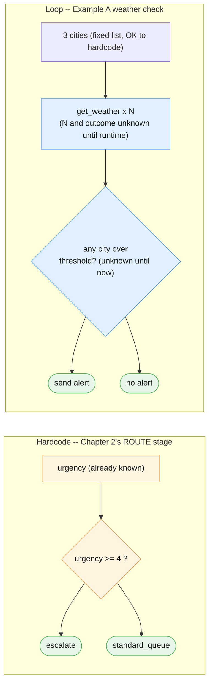
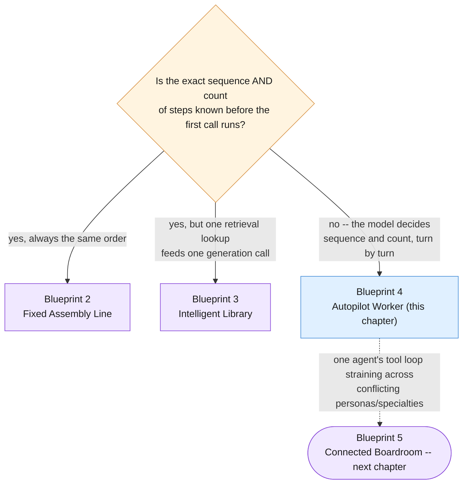
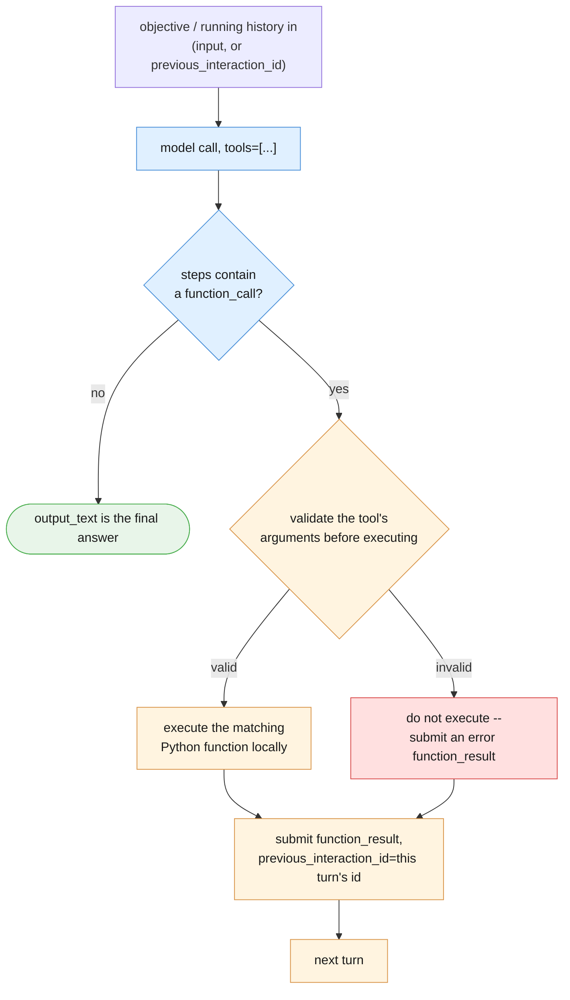

# Part II — Foundations

## 2.1 What the Autopilot Worker actually is

Every previous blueprint in this series fixed the sequence and count of steps at design
time. Chapter 2's pipeline always ran translate → summarize → extract → format, in that
order, every time. Chapter 3's grounded call always ran one retrieval lookup, then one
generation call. You, the developer, decided the shape of the whole run before a single
token was generated.

The Autopilot Worker breaks that assumption on purpose. **The sequence and count of steps is
decided by the model's own output, turn by turn, not fixed in advance.** Nobody wrote
"call `get_weather` three times" anywhere in §1.1's code — the model decided that, based on
how many cities the objective mentioned and what each city's weather turned out to be.

State this as plainly as the risk deserves: this is real power, and it is a real, new class
of risk. A pipeline that breaks, breaks once, loudly, at a known stage. **A loop that doesn't
stop is not a metaphor for a runaway problem — it is a literal runaway-cost and
runaway-time failure**, since every extra turn is another billed model call. Chapter 1's
§1.6 and §1.7 vocabulary (glossary cards, cost composition) already treated "how much does
this call cost" as first-class; this chapter adds "how do I know this will ever stop
calling" as an equally first-class design question, not an afterthought bolted on later.

---

## 2.2 Best used for / avoid when — made testable

The article states the boundary in two lines:

> **Best used for:** Dynamic workflows where the exact sequence or number of steps is
> unpredictable at the start, such as checking a fluctuating live weather status and
> automatically emailing an alert.
>
> **Avoid when:** The task can be perfectly handled by standard, predictable conditional
> code.

Turned into a checklist you can actually run against a task:

| Question | If "yes" | If "no" |
|---|---|---|
| Can you name, today, the exact sequence of steps and stop condition, with no dependency on live data the model hasn't seen yet? | Use Chapter 2's fixed pipeline instead | Keep reading |
| Does the NUMBER of actions depend on something that changes between runs (how many cities crossed a threshold, how many sources needed checking)? | This chapter's pattern earns its keep | A single fixed step probably suffices |
| Is the decision a simple, stable rule over already-known fields (`urgency >= 4`, `status == "open"`)? | Write the `if` statement, don't call a model | — |
| Would getting the sequence wrong at runtime be expensive, irreversible, or hard to detect? | You need a `MAX_TURNS` cap and a human-approval gate around anything irreversible before you ship this | — |

The concrete anti-pattern baseline, reused deliberately from Chapter 2's own ROUTE stage:

```python
# The anti-pattern-to-avoid baseline. This needs neither a model nor a loop --
# urgency is already a known field, and the rule is stable. Chapter 2's own
# example of a decision this chapter's mechanism should NOT be used for.
urgency = 5
route = "escalate" if urgency >= 4 else "standard_queue"
print(route)
```

One line, zero tokens spent, perfectly testable with a handful of unit tests over integer
inputs. Nothing about `urgency >= 4` changes between runs in a way that requires observing a
live system and deciding what to do next — it's a stable rule over a field you already have.

Contrast that with Example A's weather check. You *could* hardcode the three cities to check
— `["London", "Phoenix", "Chicago"]` is a fixed list, known in advance, and there is nothing
wrong with hardcoding *that* part. What you cannot hardcode is **whether wind crosses 40 kph
today** — that depends on live conditions nobody knows until `get_weather` actually runs, and
whether an alert fires depends on the *outcome* of up to three separate lookups whose results
aren't known until runtime. That is the genuinely unpredictable part, and it's exactly the
part `if urgency >= 4` does not have: a dependency on data that only exists once the loop
starts running.



---

## 2.3 The three-way boundary

Three blueprints, three different answers to "who decides what happens next, and when is
that decided":

| Blueprint | One-sentence test | Concrete example |
|---|---|---|
| **2 — Fixed Assembly Line** | The exact steps and their order are known *before* the first call runs | Ticket handling always runs classify → route → rewrite → log, in that order, every time |
| **3 — Intelligent Library** | Exactly one retrieval lookup happens, then exactly one generation call — the *sequence* is fixed even though the *content* found is not | `lookup_refund_policy`-style retrieval runs once against `doc_refund_policy`, then one answer is generated from what came back |
| **4 — Autopilot Worker (this chapter)** | The model itself decides the sequence and count of actions, turn by turn, based on what earlier actions returned | The weather worker decides how many cities to check and whether to alert; the ticket autopilot decides whether to check history, look up policy, both, or neither, before choosing to escalate or draft a reply |

The crossing point from 3 into 4 is retrying the same lookup differently based on how the
first one went — Chapter 3's own §7.1 named this directly: a fixed retrieval call that
occasionally decides, on its own, to search again with a different query has already become
this chapter's pattern, whether or not anyone meant it to. A tool-using loop can even
*include* a retrieval-shaped tool among several options — Part III's `lookup_refund_policy`
tool for the Support Ticket Autopilot is exactly that — without the whole system quietly
being "Blueprint 3," because it's the loop's own turn-by-turn decisions doing the
sequencing, not a single fixed retrieval-then-generate shape.



A single-agent tool loop starts to strain when the reasoning different tools need genuinely
conflicts — a strict, literal SQL-analyst voice and a loose, persuasive copywriter voice
stuffed into one system prompt fight each other. That strain is the forward signal toward
Blueprint 5, named here only as what's coming, not solved in this chapter.

---

## 2.4 Anatomy of one loop turn

Every turn of a tool loop, regardless of which example or how many tools are registered,
follows the same shape:



The validation step deserves its own line, because §1.1's `run_weather_worker` skipped it for
clarity and that omission does not belong in production code. A `function_call` step's
`.arguments` is whatever the model produced — treat it the same way you'd treat any other
model output that's about to cross a seam into code that actually does something: check it
before running it, not after. A minimal version, matching this chapter's two registered
tools:

```python
def validate_tool_call(name: str, arguments: dict) -> bool:
    """A minimal allowlist + shape check before executing any tool call -- the
    seam between 'the model decided to call X' and 'we actually ran X'."""
    if name not in TOOL_FUNCTIONS:
        return False
    if name == "get_weather":
        return isinstance(arguments.get("city"), str)
    if name == "send_alert_email":
        return all(isinstance(arguments.get(k), str) for k in ("to", "subject", "body"))
    return False
```

Rejecting an invalid call does not mean crashing the loop. It means submitting a
`function_result` that says so, in the same shape the model expects, so the model can react
(retry with different arguments, or give up on that tool) instead of your process throwing an
unhandled exception mid-loop.

---

## 2.5 The whole thing, end to end

Putting §2.2's testable boundary, §2.3's three-way distinction, and §2.4's validated turn
together, here is the full Weather Alert Worker: two tools, a validation gate, a `MAX_TURNS`
cap, every turn's tool call and result printed, and the final decision.

```python
def run_weather_worker_with_validation(objective: str) -> str:
    interaction = client.interactions.create(
        model=MODEL,
        input=objective,
        tools=WEATHER_TOOLS,
        store=True,
    )

    for turn in range(MAX_TURNS):
        fc_step = next((s for s in interaction.steps if s.type == "function_call"), None)
        if fc_step is None:
            return interaction.output_text   # happy path: model believes it's done

        print(f"[turn {turn + 1}] model wants to call {fc_step.name}({fc_step.arguments})")

        if not validate_tool_call(fc_step.name, fc_step.arguments):
            result = {"error": f"rejected: invalid arguments for {fc_step.name}"}
            print(f"[turn {turn + 1}] REJECTED at validation gate: {result}")
        else:
            func = TOOL_FUNCTIONS[fc_step.name]
            result = func(**fc_step.arguments)
            print(f"[turn {turn + 1}] result: {result}")

        interaction = client.interactions.create(
            model=MODEL,
            input=[{
                "type": "function_result",
                "name": fc_step.name,
                "call_id": fc_step.id,
                "result": [{"type": "text", "text": json.dumps(result)}],
            }],
            tools=WEATHER_TOOLS,
            previous_interaction_id=interaction.id,
        )

    print(f"[weather worker] MAX_TURNS ({MAX_TURNS}) reached -- halting, surfacing to a human.")
    return "INCOMPLETE: loop hit MAX_TURNS, needs human review."


objective_a_full = (
    "Check the weather in London, Phoenix, and Chicago. If any city has wind "
    "above 40 kph or a thunderstorm, send an alert email to ops@example.com "
    "summarizing which cities are affected and why."
)

final_result = run_weather_worker_with_validation(objective_a_full)
print("\nFINAL RESULT:")
print(final_result)
```

Run this against the session preamble's `WEATHER_DATA`, and the transcript should show three
`get_weather` calls (London, Phoenix, Chicago, in whatever order the model picks), a
threshold check against each result, and exactly one `send_alert_email` call — because
London's 42 kph wind and Chicago's thunderstorm-plus-55-kph both cross the stated 40 kph /
thunderstorm threshold, while Phoenix's clear, 8 kph conditions do not. The final printed
result is the loop's own summary of which cities triggered the alert and why — decided
entirely at runtime, from data the loop only had after it started running.

---

## The four things worth actually remembering

1. **The model decides the sequence and count now, not you.** That is the whole shift from
   every earlier blueprint in this series.
2. **A stable rule over already-known fields never needs a loop.** Chapter 2's
   `urgency >= 4` is the baseline to keep checking your own designs against.
3. **Three blueprints, three different "who decides, and when":** fixed order (2), one fixed
   retrieval-then-generate shape (3), model decides turn by turn (4).
4. **Validate a tool's arguments before executing them, every turn.** A `function_call`
   step's arguments are model output crossing a seam, exactly like any other.

---

**Next:** [Part III — Core Techniques](./03-core-techniques.md)
