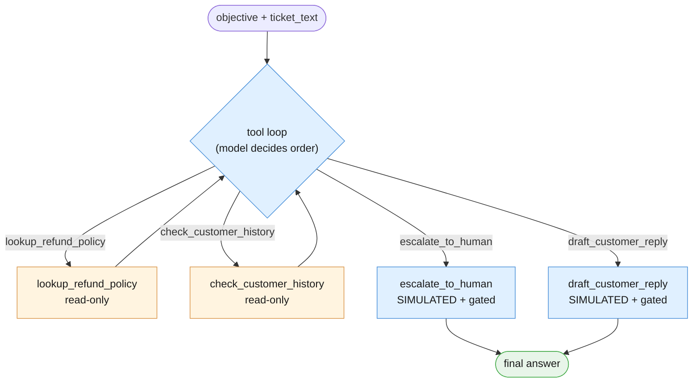
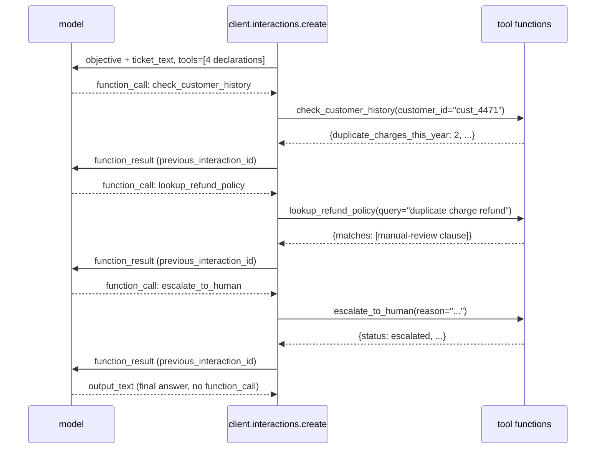
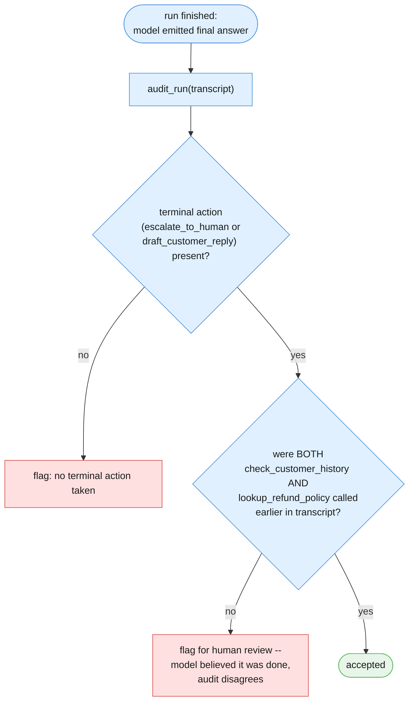

# Part III — Core Techniques

Part I gave you the vocabulary of the loop — tool, function declaration, thought /
function_call / function_result steps, termination condition, tool allowlist. Part
II built Example A, the Weather Alert Worker, end to end. This part builds
**Example B — the Support Ticket Autopilot** — the chapter's continuity centerpiece.
It takes the exact `ticket_text` and `doc_refund_policy` fixtures Chapters 1–3
already used and hands them to a model that decides its own sequence of steps,
instead of following one your code wrote in advance.

---

## 3.1 From fixed pipeline to tool loop

Chapters 1–3 handled `ticket_text` as an increasingly capable, but still **fixed**,
sequence: Chapter 1 classified it with a single model call; Chapter 2 wired
classify → route → rewrite → log into an ordered pipeline, with ROUTE as a plain
Python stage between two model calls; Chapter 3 inserted a fifth, retrieval-shaped
stage — GROUND — between ROUTE and REWRITE, so the rewrite could cite the actual
refund policy instead of guessing at it. In all three chapters, the *order* of
stages was decided once, by the person who wrote the pipeline, and never changed at
run time. A ticket could take a different *path* through the pipeline (ROUTE could
send it toward escalation or not), but it could never change *how many* stages ran,
or *which* stages ran, or *in what order* — the pipeline itself was always the same
five slots in the same sequence.

This chapter gives the model the same underlying capabilities Chapters 1–3 built —
look up the policy, check the account, decide on an outcome — as **tools** instead
of **fixed stages**, and lets the model decide the order and which ones to use.
Nothing about *what* the capabilities do is new. What is new is *who* decides when
each one runs.

---

## 3.2 The four tools

Four tools, each backed by a plain Python function. Two are read-only lookups. Two
are action-shaped, and both of those are explicitly simulated — neither one is
wired to a real system, and the code says so at the point where a reader might be
tempted to wire one up.

**`lookup_refund_policy`** — a simplified stand-in for Chapter 3's real,
embedding-based `search()`. This chapter's focus is the *loop*, not retrieval
quality, so a plain keyword/substring match against `doc_refund_policy` is
sufficient here. If you need real semantic retrieval over a larger corpus — ranking
chunks by cosine similarity instead of word overlap — that is Chapter 3's
technique, not this one; go back to Chapter 3 §3.2 for it.

```python
def lookup_refund_policy(query: str) -> dict:
    """A deliberately simplified retrieval stand-in. Chapter 3 built a real
    embedding-based search() over a multi-document corpus; this function does
    a plain substring/keyword match over one document, doc_refund_policy, and
    nothing more. That simplification is intentional -- this chapter is
    teaching the tool-using LOOP, not retrieval quality. For real semantic
    retrieval, see Chapter 3's chunk/embed/search pipeline."""
    paragraphs = [p.strip() for p in doc_refund_policy.split("\n\n") if p.strip()]
    query_words = [w.strip(".,").lower() for w in query.split() if len(w) > 3]
    matches = [p for p in paragraphs if any(w in p.lower() for w in query_words)]
    return {"query": query, "matches": matches or paragraphs[:1]}
```

**`check_customer_history`** — reads the `CUSTOMER_HISTORY` fixture from the
session preamble. Simulated: it stands in for a real CRM call, and never makes
one.

```python
def check_customer_history(customer_id: str) -> dict:
    """Simulated CRM lookup. Reads CUSTOMER_HISTORY from the session preamble;
    never calls a real account system."""
    record = CUSTOMER_HISTORY.get(customer_id)
    if record is None:
        return {"customer_id": customer_id, "found": False}
    return {"customer_id": customer_id, "found": True, **record}
```

**`escalate_to_human`** — SIMULATED. Prints what it would do and returns a fake
queue confirmation. This function never files a real ticket, never pages anyone,
and never touches a real escalation system.

```python
def escalate_to_human(reason: str) -> dict:
    """SIMULATED escalation. Prints what a real integration would do and
    returns a fake confirmation. No real ticketing or paging system is called
    anywhere in this chapter."""
    print(f"[ESCALATED] reason: {reason}")
    return {"status": "escalated", "queue": "billing_ops_manual_review", "reason": reason}
```

**`draft_customer_reply`** — SIMULATED. Prints the draft and returns it, marked
explicitly as **not sent**. Drafting text is not the same action as sending it, and
the return value says so on purpose, so nothing downstream can mistake a draft for
a delivered reply.

```python
def draft_customer_reply(explanation: str) -> dict:
    """SIMULATED draft. Prints the drafted reply and returns it with sent:
    False -- this function never sends an email or message to a customer."""
    print(f"[DRAFT REPLY - NOT SENT]\n{explanation}")
    return {"status": "draft_created", "sent": False, "body": explanation}
```

The tool declarations, one dict per function, following the same shape Part I/II
already established:

```python
LOOKUP_REFUND_POLICY_DECLARATION = {
    "type": "function",
    "name": "lookup_refund_policy",
    "description": (
        "Looks up relevant passages from the refund and duplicate-charge "
        "policy using a keyword match. Use this to find out what the policy "
        "says before deciding how to handle a billing ticket."
    ),
    "parameters": {
        "type": "object",
        "properties": {
            "query": {"type": "string", "description": "what to search the policy for"},
        },
        "required": ["query"],
    },
}

CHECK_CUSTOMER_HISTORY_DECLARATION = {
    "type": "function",
    "name": "check_customer_history",
    "description": (
        "Looks up a customer's account history, including how many duplicate "
        "charges they have reported this year and their account standing."
    ),
    "parameters": {
        "type": "object",
        "properties": {
            "customer_id": {"type": "string", "description": "the customer's account id"},
        },
        "required": ["customer_id"],
    },
}

ESCALATE_TO_HUMAN_DECLARATION = {
    "type": "function",
    "name": "escalate_to_human",
    "description": (
        "Flags this ticket for manual review by a human instead of resolving "
        "it automatically. Use this when policy or account history indicates "
        "the situation needs a person's judgment."
    ),
    "parameters": {
        "type": "object",
        "properties": {
            "reason": {"type": "string", "description": "why this needs a human"},
        },
        "required": ["reason"],
    },
}

DRAFT_CUSTOMER_REPLY_DECLARATION = {
    "type": "function",
    "name": "draft_customer_reply",
    "description": (
        "Drafts a reply to the customer for a human to review and send. This "
        "does NOT send anything -- it only produces a draft."
    ),
    "parameters": {
        "type": "object",
        "properties": {
            "explanation": {"type": "string", "description": "the drafted reply text"},
        },
        "required": ["explanation"],
    },
}

SUPPORT_TICKET_TOOLS = [
    LOOKUP_REFUND_POLICY_DECLARATION,
    CHECK_CUSTOMER_HISTORY_DECLARATION,
    ESCALATE_TO_HUMAN_DECLARATION,
    DRAFT_CUSTOMER_REPLY_DECLARATION,
]

SUPPORT_TICKET_FUNCTIONS = {
    "lookup_refund_policy": lookup_refund_policy,
    "check_customer_history": check_customer_history,
    "escalate_to_human": escalate_to_human,
    "draft_customer_reply": draft_customer_reply,
}
```

---

## 3.3 Registering the allowlist and giving the objective

The model is given plain-language intent, not a script:

```python
SUPPORT_TICKET_OBJECTIVE = """Handle this support ticket. Look up whatever policy or account information you
need, decide whether this should be escalated to a human or handled with a
drafted reply, and produce that outcome."""
```

Notice what is missing from that instruction: no mention of which tool to call
first, no required order, no "always check history before policy." The model
decides that. What is *not* missing, and what actually does the safety work here,
is the `tools=SUPPORT_TICKET_TOOLS` list passed to `client.interactions.create` —
these four function declarations, and only these four, are the complete set of
actions the model is physically capable of taking. It cannot invent a fifth tool,
cannot call a real refund API, cannot send a real email — those capabilities were
simply never registered. The **tool allowlist** is the safety boundary, precisely
because it is fixed at design time even though the model's path through it is not.
The set of *possible* actions is small, known, and reviewed in advance; only the
actual *sequence* through them is left open.



`lookup_refund_policy` and `check_customer_history` are styled as `noModelCall`
here in the sense that matters for safety: they read data and change nothing in
the world. `escalate_to_human` and `draft_customer_reply` are styled distinctly —
still tools the model calls, but each one is a simulated, gated action, not a live
side effect. §3.5 adds a second gate on top of the allowlist itself: even a call to
one of these two tools is not automatically treated as a trustworthy outcome.


**The four tools, by risk class** — worth a table before writing any loop code,
because it is the same table that should exist before registering any tool
allowlist in a real system:

| Tool | Reads or acts? | Real integration behind it? | Gate needed before trusting the outcome |
|---|---|---|---|
| `lookup_refund_policy` | Reads (simplified keyword match, §3.2) | None — local string match | None; a bad match just produces a weak answer, not a side effect |
| `check_customer_history` | Reads (simulated CRM) | None — reads `CUSTOMER_HISTORY` | None; same reasoning |
| `escalate_to_human` | Acts (SIMULATED) | None in this chapter — prints and returns a fake confirmation | §3.5's audit: was this call actually preceded by the lookups that justify it? |
| `draft_customer_reply` | Acts (SIMULATED, explicitly marked `sent: False`) | None in this chapter | Same audit as `escalate_to_human` |

The two read-only tools need no gate beyond the allowlist itself — there is nothing
for a bad call to do except return a bad answer, which the model itself has to work
with on its next turn. The two action-shaped tools are exactly where a real system
would add a human-approval step before anything with `escalate_to_human`'s or
`draft_customer_reply`'s *real* counterpart ever reached a customer or a queue — in
this chapter, the "approval step" is standing in for that as a print statement and
an explicit `sent: False`, not a live gate in front of a real system, because no
real system sits behind either tool here.

---

## 3.4 Running the loop

The loop shape is the one Part I/II already established: create an interaction
with `tools=`, inspect `interaction.steps` for a `function_call`, execute the
matching Python function yourself, submit a `function_result` with
`previous_interaction_id`, and repeat until a turn has no `function_call` step —
capped at `MAX_TURNS` so a run that never settles cannot run forever (Part IV
covers that failure mode in full).

```python
import json
from dataclasses import dataclass

MAX_TURNS = 6


@dataclass
class ToolCallRecord:
    """One row of a run's transcript: which turn, which tool, what arguments,
    what came back. This is the full loop trace mentioned in Part I/II --
    because the sequence isn't fixed, logging the whole transcript is what
    observability means for this pattern."""
    turn: int
    name: str
    arguments: dict
    result: dict


def run_support_ticket_loop(ticket_text: str, customer_id: str) -> tuple[str | None, list[ToolCallRecord]]:
    """The Support Ticket Autopilot's tool loop. Returns (final_text,
    transcript). final_text is None if MAX_TURNS was reached without the
    model producing a final answer -- a real outcome, handled in Part IV, not
    an exception."""
    transcript: list[ToolCallRecord] = []

    interaction = client.interactions.create(
        model=MODEL,
        system_instruction=SUPPORT_TICKET_OBJECTIVE,
        input=f'<ticket customer_id="{customer_id}">\n{ticket_text}\n</ticket>',
        tools=SUPPORT_TICKET_TOOLS,
        store=True,
    )

    for turn in range(1, MAX_TURNS + 1):
        fc_step = next((s for s in interaction.steps if s.type == "function_call"), None)
        if fc_step is None:
            return interaction.output_text, transcript

        function = SUPPORT_TICKET_FUNCTIONS[fc_step.name]
        result = function(**fc_step.arguments)
        transcript.append(ToolCallRecord(turn=turn, name=fc_step.name,
                                          arguments=fc_step.arguments, result=result))
        print(f"turn {turn}: {fc_step.name}({fc_step.arguments}) -> {result}")

        interaction = client.interactions.create(
            model=MODEL,
            input=[{
                "type": "function_result",
                "name": fc_step.name,
                "call_id": fc_step.id,
                "result": [{"type": "text", "text": json.dumps(result)}],
            }],
            tools=SUPPORT_TICKET_TOOLS,
            previous_interaction_id=interaction.id,
            store=True,
        )

    return None, transcript  # MAX_TURNS reached -- see Part IV §4.1


final_text, transcript = run_support_ticket_loop(ticket_text, "cust_4471")
print("Final answer:", final_text)
```

Because `ticket_text`'s customer has been charged twice for a second consecutive
month, and `doc_refund_policy`'s second paragraph explicitly requires manual
review at that point, the outcome we're hoping for is: the model calls
`check_customer_history` and sees `duplicate_charges_this_year: 2`, calls
`lookup_refund_policy` and sees the manual-review clause, and calls
`escalate_to_human` rather than confidently drafting an auto-refund reply. A
representative transcript looks like this:

```
turn 1: check_customer_history({'customer_id': 'cust_4471'}) -> {'customer_id': 'cust_4471', 'found': True, 'name': 'J. Alvarez', 'duplicate_charges_this_year': 2, 'account_standing': 'good'}
turn 2: lookup_refund_policy({'query': 'duplicate charge refund'}) -> {'query': 'duplicate charge refund', 'matches': [...]}
turn 3: escalate_to_human({'reason': 'Customer has 2 duplicate charges this year; policy requires manual review after repeat duplication.'}) -> {'status': 'escalated', 'queue': 'billing_ops_manual_review', ...}
Final answer: This ticket has been escalated to billing operations for manual review, ...
```

Be honest about what that transcript is: one *possible* outcome, not a scripted
one. This is a genuine test of the loop's judgment against a real prompt, not a
fixture with the answer baked in. §3.5 covers what to do when a run does *not*
reach it.



---

## 3.5 When the loop doesn't do what you expected

This is a real, first-class outcome of running Example B, not a footnote. The
model might instead call `draft_customer_reply` directly, on turn 1, without
having checked history or policy at all — it read "customer wants a refund for a
duplicate charge" and drafted an auto-refund reply without noticing this is the
*second* consecutive month, which is exactly the fact the policy conditions manual
review on.

Nothing in the tool allowlist prevents that: the allowlist only bounds *which*
tools exist, not what order they're used in. So a second, independent guard is
needed — one that audits not a single stage's output (Chapters 2/3's validation
gate), but the *sequence of steps that produced the outcome*, since in a loop the
steps themselves are what need auditing.

```python
REQUIRED_BEFORE_ACCEPT = {
    "escalate_to_human": {"check_customer_history", "lookup_refund_policy"},
    "draft_customer_reply": {"check_customer_history", "lookup_refund_policy"},
}


def audit_run(transcript: list[ToolCallRecord]) -> tuple[str, bool, str]:
    """Checks whether the run's terminal action (the last escalate_to_human or
    draft_customer_reply call) was preceded by BOTH required lookups
    somewhere earlier in the same transcript. This is Chapter 2/3's
    validation-gate idea, adapted to a loop: instead of checking one stage's
    output, it checks whether the right steps happened in the right order
    before the model believed it was done."""
    terminal_calls = [r.name for r in transcript if r.name in REQUIRED_BEFORE_ACCEPT]
    if not terminal_calls:
        return "no_terminal_action", False, "run ended without escalate_to_human or draft_customer_reply"

    terminal_action = terminal_calls[-1]
    terminal_index = max(i for i, r in enumerate(transcript) if r.name == terminal_action)
    seen_before = {r.name for r in transcript[:terminal_index]}
    missing = REQUIRED_BEFORE_ACCEPT[terminal_action] - seen_before
    if missing:
        return terminal_action, False, f"missing required lookups before {terminal_action}: {sorted(missing)}"
    return terminal_action, True, "accepted"


terminal_action, accepted, note = audit_run(transcript)
if not accepted:
    print(f"[FLAGGED FOR HUMAN REVIEW] {note}")
else:
    print(f"[ACCEPTED] {terminal_action}: {note}")
```

A run that calls `draft_customer_reply` on turn 1 fails this audit immediately —
`seen_before` is empty, so both required lookups are missing — and gets flagged
for human review *even though the model itself believed it was done*. That
distinction matters: the model's own termination (no more `function_call` steps)
means the model is finished acting, not that your system should treat the outcome
as trustworthy. Those are two different facts, exactly the way Chapter 2 §3.2 kept
"schema-valid" and "trustworthy" apart.



---

## 3.6 What changed and what didn't

The four underlying capabilities in this section — reading the refund policy,
reading account history, escalating, drafting a reply — are not new. Every one of
them is a small function Chapters 1–3 could have written as a pipeline stage, and
in spirit, some of them already existed there: Chapter 3's GROUND stage did a real
version of `lookup_refund_policy`; Chapter 2's ROUTE stage made a rule-based
version of the escalate-or-not decision this chapter leaves to the model.

What's new is who decides which capability runs, in what order, and how many
times. Chapters 1–3 answered that question once, at design time, in code. This
chapter answers it at run time, per ticket, inside the model — with the tool
allowlist bounding *what's possible* and the audit in §3.5 checking *whether the
path taken actually earns the outcome reached*. Part IV builds out what happens
when that path goes wrong in ways beyond a skipped lookup: a loop that never
stops, a malformed tool argument, a repeated side-effecting call, and a network
failure mid-run.

**A one-line recap against the two neighboring blueprints**, since this section's
whole point is what changed and what didn't:

| | Blueprint 2 (Fixed Assembly Line) | Blueprint 3 (Intelligent Library) | This chapter |
|---|---|---|---|
| Who decides the order of steps | The person who wrote the pipeline, at design time | Still fixed order; GROUND is one more fixed stage | The model, per run, inside `run_support_ticket_loop` |
| Can the number of steps vary per run? | No — always 4 stages | No — always 5 stages | Yes — §3.4's transcript can be 1 tool call or 4 |
| What bounds the risk | The stage sequence itself is the whole safety story | Same, plus retrieval quality | The tool allowlist (§3.3) + the audit in §3.5 |
| Where `ticket_text` sits | Runs through CLASSIFY → ROUTE → REWRITE → LOG | Same, with GROUND inserted before REWRITE | Available to the model as context; the model chooses what to look up and when |

The row worth sitting with: Blueprints 2 and 3 both put the entire safety story
into *the fixed sequence being correct*. This chapter can't do that, because the
sequence isn't fixed — which is exactly why §3.3's allowlist and §3.5's audit exist
as separate mechanisms, doing work the fixed pipelines never needed a mechanism
for at all.

**Next:** [Part IV — Reliability](./04-reliability.md)
