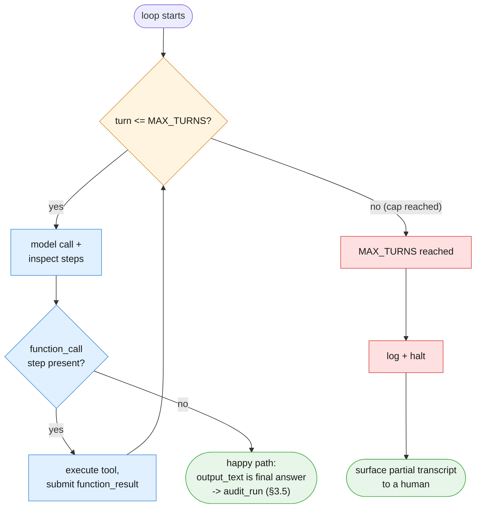
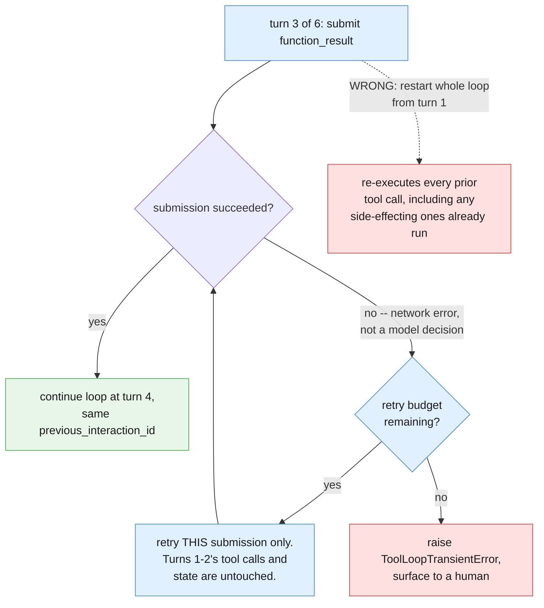

# Part IV — Reliability

Part III built a loop that works when the model checks the right things, calls the
right tools, and stops on its own. This part is about four ways that goes wrong,
each a genuinely different failure mode with a genuinely different fix: a loop
that never emits a final answer, a tool call with bad arguments, a side-effecting
tool called more than once, and a network failure that has nothing to do with the
model's decisions at all.

---

## 4.1 The loop that doesn't stop

This is the chapter's most important honesty section. A model can, in principle,
call tools indefinitely without ever emitting a final answer — repeating
`lookup_refund_policy` with slightly reworded queries, or oscillating between
`check_customer_history` and `lookup_refund_policy` without ever calling
`escalate_to_human` or `draft_customer_reply`. Without a hard cap, that is not a
hypothetical edge case to wave at — it is a literal runaway-cost and
runaway-latency bug: every extra turn is another `client.interactions.create`
call, another set of tokens billed, another few hundred milliseconds of latency,
with no guarantee any of it converges.

`MAX_TURNS` in §3.4's `run_support_ticket_loop` already caps this, and the
function already returns `(None, transcript)` when the cap is hit rather than
looping forever. What Part III didn't build is what a caller *does* with that
`None` — and "silently retry forever" is not an acceptable answer. The cap being
hit is a real failure mode: log it, halt, and surface the partial transcript to a
human.

```python
import logging

log = logging.getLogger(__name__)


def run_support_ticket_loop_guarded(ticket_text: str, customer_id: str) -> dict:
    """Wraps §3.4's run_support_ticket_loop and §3.5's audit_run into one
    outcome dict with three possible statuses. Never retries the whole loop on
    a MAX_TURNS cap -- that would just repeat whatever non-converging pattern
    caused the cap to be hit in the first place."""
    final_text, transcript = run_support_ticket_loop(ticket_text, customer_id)

    if final_text is None:
        log.error("MAX_TURNS (%d) reached without a final answer; halting", MAX_TURNS)
        print(f"[HALTED] MAX_TURNS ({MAX_TURNS}) reached. Surfacing partial transcript to a human.")
        return {"status": "halted_max_turns", "transcript": transcript}

    terminal_action, accepted, note = audit_run(transcript)
    if not accepted:
        print(f"[FLAGGED FOR REVIEW] {note}")
        return {"status": "flagged_for_review", "terminal_action": terminal_action,
                "note": note, "transcript": transcript}

    return {"status": "accepted", "terminal_action": terminal_action,
            "final_text": final_text, "transcript": transcript}


outcome = run_support_ticket_loop_guarded(ticket_text, "cust_4471")
print(outcome["status"])
```

Three exit states now exist, and only one of them is the happy path. Drawing the
cap and the happy path side by side, as two genuinely distinct ways out of the
loop, matters more than drawing either one alone:



Both exits are "the loop stopped." Only one of them means the model reached an
answer it believed in. Treating them the same — printing `output_text` either way
— would silently paper over a run that produced nothing at all.

---

## 4.2 Malformed or unsafe tool arguments

The model's `function_call.arguments` should never be trusted blindly before
you run it through your own function. `check_customer_history`'s `customer_id`
argument is a plain string as far as the tool declaration's JSON schema is
concerned — nothing in that schema stops the model from sending
`customer_id="cust_9999"`, a value that simply isn't in `CUSTOMER_HISTORY`, or
omitting the argument, or sending the wrong type entirely.

`check_customer_history` as written in §3.2 already handles an *unknown* customer
gracefully (`found: False`) — but that's a lookup miss, not argument validation.
Validating the argument itself, before executing anything, catches the case where
the value is missing or malformed, not just absent from the data:

```python
KNOWN_CUSTOMER_IDS = set(CUSTOMER_HISTORY)


def validate_tool_arguments(name: str, arguments: dict) -> str | None:
    """Returns None if arguments look well-formed for this tool, otherwise a
    short validation-failure reason. Runs BEFORE any tool function executes --
    the same discipline Chapters 2-3's validation gates applied to model
    output, applied here to model-generated tool arguments instead."""
    if name == "check_customer_history":
        customer_id = arguments.get("customer_id")
        if not isinstance(customer_id, str) or customer_id not in KNOWN_CUSTOMER_IDS:
            return f"customer_id {customer_id!r} is missing or not a known customer"
    elif name == "lookup_refund_policy":
        if not isinstance(arguments.get("query"), str) or not arguments["query"].strip():
            return "query is missing or empty"
    elif name == "escalate_to_human":
        if not isinstance(arguments.get("reason"), str) or not arguments["reason"].strip():
            return "reason is missing or empty"
    elif name == "draft_customer_reply":
        if not isinstance(arguments.get("explanation"), str) or not arguments["explanation"].strip():
            return "explanation is missing or empty"
    return None


def dispatch_tool_call(name: str, arguments: dict) -> dict:
    """The hardened version of §3.4's direct `function(**fc_step.arguments)`
    call. A validation failure is treated as exactly that -- a validation
    failure, fed back to the model as a function_result so it can retry with
    corrected arguments -- never a raw Python exception crashing the loop."""
    failure_reason = validate_tool_arguments(name, arguments)
    if failure_reason is not None:
        log.warning("rejected %s(%r): %s", name, arguments, failure_reason)
        print(f"[VALIDATION FAILURE] {name}({arguments}) rejected: {failure_reason}")
        return {"error": "invalid_arguments", "detail": failure_reason}

    function = SUPPORT_TICKET_FUNCTIONS[name]
    return function(**arguments)
```

The important discipline here is the same one Chapters 2–3 applied at a seam:
a malformed value is neither silently ignored nor allowed to crash the run. It
becomes a `function_result` the model can see and react to — `{"error":
"invalid_arguments", ...}` is a perfectly legitimate observation for the model's
next turn to reason about, in the same way a real API would reject a bad request
rather than pretend it succeeded.

---

## 4.3 Repeating an action safely

Suppose the model calls `escalate_to_human` once, isn't sure from the
`function_result` whether it "took," and calls it again a few turns later with a
similar reason. Is that safe?

In this teaching example: yes, harmlessly. `escalate_to_human` as built in §3.2
only prints a line and returns a fake confirmation — calling it twice produces two
print statements and two fake confirmations, nothing more. Nothing external was
ever mutated, because nothing external is wired up.

State plainly what changes the moment a real integration replaces it. Chapter 2
§4.2 built the same lesson around `document_text`'s own postmortem —

> "The retry wrapper treated a gateway timeout as a definitive failure...The
> wrapper had no idempotency key, so the retry created a second authorisation."

— and the tool loop makes that risk *more* likely to occur, not less: a loop can,
and will, retry things on its own initiative, not just after a network failure.
A model unsure whether its first `escalate_to_human` call landed has every reason
to call it again "just in case." A real escalation/ticketing integration behind
this tool needs the exact same idempotency-key discipline Chapter 2 taught, so a
retried call collapses into the original instead of opening a second ticket:

```python
def escalate_to_human_with_key(reason: str, idempotency_key: str) -> dict:
    """Illustrative only -- there is no real ticketing system wired up in this
    chapter. Shows the shape a real escalate_to_human would need: an
    idempotency_key derived from something stable about the run (e.g. a hash
    of customer_id + ticket_text), so the receiving system can recognize and
    collapse a retried call instead of opening a second ticket. Exactly Ch2
    §4.2's lesson, applied here because a loop -- unlike a single pipeline
    stage -- can retry an action on its own initiative, not only after a
    network failure."""
    raise NotImplementedError(
        "wire this to a real ticketing/paging system, keyed on idempotency_key "
        "so a retried escalation cannot create a second one"
    )
```

The rule, stated once so it generalizes past this one tool: a simulated
action-shaped tool is safe to repeat because it has no side effect to duplicate;
the moment it's wired to something real, it needs an idempotency key precisely
*because* it sits inside a loop that can and will call it more than once.

---

## 4.4 Partial failure in a loop

Turn 3 of 6 can fail for a reason that has nothing to do with the model's
decisions at all: a network error while submitting the `function_result` step —
a dropped connection, a timeout, a 429. This is a materially different failure
from the model choosing to stop, or from `MAX_TURNS` being reached, and it needs a
materially different fix: **retry the one submission that failed, never restart
the whole loop from turn 1.**

Restarting from turn 1 would waste every prior turn's cost — the
`check_customer_history` and `lookup_refund_policy` calls already made and paid
for — and, worse, in `store=True` stateful mode, resubmitting the whole
conversation risks the model repeating side-effecting tool calls it already made
once (an `escalate_to_human` call from turn 3 of the original attempt could get
issued a second time by a from-scratch retry that doesn't know it already ran).

```python
import time


class ToolLoopTransientError(Exception):
    """Raised when submitting a single function_result failed for reasons
    unrelated to the model's decisions -- a dropped connection, a timeout, a
    429. Retrying THIS submission is safe; restarting the whole loop is not,
    because it would re-execute every prior turn's side-effecting tool calls."""


def submit_function_result_with_retries(
    fc_step, result: dict, previous_interaction_id: str, max_attempts: int = 3, base_delay: float = 1.0,
):
    """Retries only the single function_result submission that failed, using
    the same previous_interaction_id the original attempt would have used --
    the server-side conversation state (turns 1-3's history) is untouched by
    this retry. The tool itself already ran and produced `result` before this
    function is called; this function only concerns itself with getting that
    result submitted."""
    last_exc: Exception | None = None
    for attempt in range(max_attempts):
        try:
            return client.interactions.create(
                model=MODEL,
                input=[{
                    "type": "function_result",
                    "name": fc_step.name,
                    "call_id": fc_step.id,
                    "result": [{"type": "text", "text": json.dumps(result)}],
                }],
                tools=SUPPORT_TICKET_TOOLS,
                previous_interaction_id=previous_interaction_id,
                store=True,
            )
        except Exception as exc:
            last_exc = exc
            log.warning("function_result submission failed (attempt %d/%d): %s",
                        attempt + 1, max_attempts, exc)
            if attempt < max_attempts - 1:
                time.sleep(base_delay * (2 ** attempt))
    raise ToolLoopTransientError(f"exhausted {max_attempts} attempts submitting function_result") from last_exc
```



The distinction to keep straight across all four sections of this part: the model
choosing to stop (happy path, or the audit in §3.5 flagging a bad path), the
system stopping it (`MAX_TURNS`, §4.1), a bad argument (§4.2), a repeated
side-effecting call (§4.3), and a network failure mid-submission (§4.4) are five
different problems. Each gets its own mechanism, in this chapter and in a real
system, because treating any pair of them as the same problem produces a fix that
solves the wrong one.

**The four failure modes, side by side**, since each is handled by a different
mechanism and it's worth being explicit about which is which — the same discipline
Chapter 2 §4.3 applied to schema-vs-semantic failure, extended here to a loop with
more ways to go wrong than a single stage ever had:

| | Detected by | Fixed by | Safe to retry the whole loop? |
|---|---|---|---|
| Loop never stops (§4.1) | `MAX_TURNS` cap reached | Halt, log, surface partial transcript to a human | No — would repeat the non-converging pattern |
| Malformed tool arguments (§4.2) | `validate_tool_arguments` before execution | Return a `function_result` describing the failure; let the model retry with corrected arguments | Not applicable — the loop itself continues, just with one rejected call |
| Repeated side-effecting call (§4.3) | Not detected automatically in this teaching example | Idempotency key on the real integration (illustrated, not built) | N/A here; harmless in this chapter because nothing real is wired up |
| Network failure mid-submission (§4.4) | Exception from `client.interactions.create` unrelated to model output | Retry that one `function_result` submission with the same `previous_interaction_id` | No — restarting from turn 1 would re-run every prior tool call |

Every row shares one property worth naming on its own: none of them are fixed by
"just retry the whole loop and hope." A tool-using loop has more state to lose on a
careless restart than a single-shot call or even a fixed pipeline ever did — every
turn already executed a real Python function (even if that function's own
integration is simulated), and a from-scratch retry cannot un-print an
`[ESCALATED]` line or un-draft a reply. Reliability here means matching the
granularity of the fix to the granularity of the failure, not reaching for the
biggest hammer available.

**Next:** [Part V — Reusable Artifacts](./05-reusable-artifacts.md)
