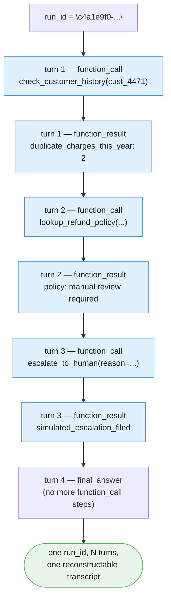

# Part V — Reusable Artifacts

Chapter 2's Part V asked what you save from a fixed pipeline — four stages, four
prompts, a manifest, a run ID. Chapter 3's Part V asked the same question for a
retrieval corpus — chunks, embeddings, a corpus manifest. This part asks it one more
time, for a tool-using loop, and the honest answer is: less of the "what" changes than
you'd expect, but the reason each artifact exists changes completely. A pipeline's
manifest reconstructs a fixed order. A loop's manifest has to reconstruct a *path* —
because the whole point of this blueprint, per Part I, is that the path was never fixed
to begin with.

Nothing below is a new kind of model call, either. Every turn of the loop is still one
`client.interactions.create` call, exactly as Parts II and III built it — no automatic
function calling, no hidden orchestration. What's new is the scaffolding around the
calls: a small object to represent one tool, a slightly bigger one to run the whole
turn-by-turn loop, a transcript that survives the run, and a convention for treating a
tool's own declaration as something worth reviewing, not just writing once and
forgetting.

---

## 5.1 The `Tool` abstraction

Part I already defined a tool as "a described capability the model may invoke, not
something it invokes automatically." `Tool` is just enough structure to keep that
description, the Python function that actually backs it, and one safety-relevant fact
about it — whether calling it for real would be irreversible — next to each other.

```mermaid
flowchart LR
    Tool["**Tool**<br/>declaration: dict[str, Any]<br/>fn: Any &#40;the backing function&#41;<br/>requires_human_review: bool<br/>.name -&gt; declaration['name']"]
    Loop["**AgentLoop**<br/>tools: list[Tool]<br/>max_turns: int<br/>.run&#40;objective&#41; -&gt;<br/>LoopResult&#40;run_id, transcript,<br/>final_answer, hit_cap&#41;"]
    Tool <-->|"1..N, dispatched<br/>by fc_step.name"| Loop

    classDef modelCall fill:#e0f0ff,stroke:#4a90d9,color:#1a1a1a
    class Tool,Loop modelCall
```



```python
from dataclasses import dataclass
from typing import Any


@dataclass(frozen=True)
class Tool:
    """One capability the loop MAY invoke — never automatically (§1.5, §2). The model
    only ever proposes a call; `AgentLoop` (§5.2) is what actually runs `fn`.

    `requires_human_review=True` marks a tool whose real-world version would be
    irreversible (an email, a refund, a ticket write) — this chapter's own
    escalate_to_human/draft_customer_reply-shaped tools set this True; a read-only
    lookup like get_weather or check_customer_history leaves it False.
    """
    declaration: dict[str, Any]
    fn: Any  # Callable[..., dict[str, Any]] — kept as Any, same restraint as Ch2's Stage.step
    requires_human_review: bool = False

    @property
    def name(self) -> str:
        return self.declaration["name"]
```

Twenty-some lines, no registry, no plugin system — the same restraint Chapter 2's
`Stage` and Chapter 3's `Corpus` both kept. Instantiating both examples' tools makes the
shape concrete:

```python
def get_weather(city: str) -> dict[str, Any]:
    """Reads WEATHER_DATA (chapter preamble) — a simulated weather lookup, never a
    real external call."""
    if city not in WEATHER_DATA:
        return {"error": f"no data for {city}"}
    return {"city": city, **WEATHER_DATA[city]}


def send_alert_email(to: str, subject: str, body: str) -> dict[str, Any]:
    """SIMULATED — prints what it would send. Never a real send (chapter boundary,
    restated per §00-index and again here because it is worth repeating)."""
    print(f"[SIMULATED EMAIL] to={to} subject={subject!r}\n{body}")
    return {"status": "simulated_sent", "to": to}


def lookup_refund_policy(query: str) -> dict[str, Any]:
    """A deliberately simplified keyword lookup over doc_refund_policy — a stand-in
    for Chapter 3's Corpus. This chapter's focus is the LOOP, not retrieval quality;
    see Chapter 3 for a real embedding-based search."""
    hits = [
        line for line in doc_refund_policy.splitlines()
        if line.strip() and any(word.lower() in line.lower() for word in query.split())
    ]
    return {"query": query, "matches": hits[:5] or ["no matching policy lines found"]}


def check_customer_history(customer_id: str) -> dict[str, Any]:
    """Reads CUSTOMER_HISTORY (chapter preamble) — a simulated CRM lookup."""
    return CUSTOMER_HISTORY.get(customer_id, {"error": f"unknown customer {customer_id}"})


def escalate_to_human(reason: str) -> dict[str, Any]:
    """SIMULATED — prints an escalation and returns a fake queue confirmation. Never
    files a real ticket."""
    print(f"[ESCALATED] reason={reason!r}")
    return {"status": "simulated_escalation_filed", "reason": reason}


def draft_customer_reply(explanation: str) -> dict[str, Any]:
    """SIMULATED — prints a draft reply awaiting human send. Producing a draft is
    explicitly NOT the same as sending it."""
    print(f"[DRAFT REPLY, NOT SENT]\n{explanation}")
    return {"status": "draft_only", "text": explanation}


GET_WEATHER_DECL = {
    "type": "function",
    "name": "get_weather",
    "description": "Look up current simulated weather conditions for a named city.",
    "parameters": {
        "type": "object",
        "properties": {"city": {"type": "string"}},
        "required": ["city"],
    },
}

SEND_ALERT_EMAIL_DECL = {
    "type": "function",
    "name": "send_alert_email",
    "description": (
        "Send an alert email summarizing which cities crossed a weather threshold "
        "and why. SIMULATED — prints the email content, never delivers it."
    ),
    "parameters": {
        "type": "object",
        "properties": {
            "to": {"type": "string"},
            "subject": {"type": "string"},
            "body": {"type": "string"},
        },
        "required": ["to", "subject", "body"],
    },
}

LOOKUP_REFUND_POLICY_DECL = {
    "type": "function",
    "name": "lookup_refund_policy",
    "description": (
        "Search the refund and duplicate-charge policy for text relevant to a "
        "query. Returns matching policy lines, not a summary — read them yourself."
    ),
    "parameters": {
        "type": "object",
        "properties": {"query": {"type": "string"}},
        "required": ["query"],
    },
}

CHECK_CUSTOMER_HISTORY_DECL = {
    "type": "function",
    "name": "check_customer_history",
    "description": "Look up a customer's account standing and prior duplicate-charge count by customer ID.",
    "parameters": {
        "type": "object",
        "properties": {"customer_id": {"type": "string"}},
        "required": ["customer_id"],
    },
}

ESCALATE_TO_HUMAN_DECL = {
    "type": "function",
    "name": "escalate_to_human",
    "description": (
        "Escalate this ticket to a human reviewer with a stated reason. Call this "
        "whenever policy requires manual review before any refund decision — do "
        "not draft an automatic reply in that case. SIMULATED — never files a real "
        "ticket."
    ),
    "parameters": {
        "type": "object",
        "properties": {"reason": {"type": "string"}},
        "required": ["reason"],
    },
}

DRAFT_CUSTOMER_REPLY_DECL = {
    "type": "function",
    "name": "draft_customer_reply",
    "description": (
        "Draft a customer-facing reply explaining the outcome. SIMULATED — produces "
        "a draft awaiting separate human send; this tool never sends anything."
    ),
    "parameters": {
        "type": "object",
        "properties": {"explanation": {"type": "string"}},
        "required": ["explanation"],
    },
}

get_weather_tool = Tool(declaration=GET_WEATHER_DECL, fn=get_weather, requires_human_review=False)
send_alert_email_tool = Tool(declaration=SEND_ALERT_EMAIL_DECL, fn=send_alert_email, requires_human_review=True)
lookup_refund_policy_tool = Tool(declaration=LOOKUP_REFUND_POLICY_DECL, fn=lookup_refund_policy, requires_human_review=False)
check_customer_history_tool = Tool(declaration=CHECK_CUSTOMER_HISTORY_DECL, fn=check_customer_history, requires_human_review=False)
escalate_to_human_tool = Tool(declaration=ESCALATE_TO_HUMAN_DECL, fn=escalate_to_human, requires_human_review=True)
draft_customer_reply_tool = Tool(declaration=DRAFT_CUSTOMER_REPLY_DECL, fn=draft_customer_reply, requires_human_review=True)

weather_tools = [get_weather_tool, send_alert_email_tool]
support_tools = [lookup_refund_policy_tool, check_customer_history_tool, escalate_to_human_tool, draft_customer_reply_tool]
```

Notice the pattern from Part III repeats here without needing restatement: two of these
six tools are plain reads (`get_weather`, `check_customer_history`), one is a deliberately
simplified stand-in for real retrieval (`lookup_refund_policy`), and three are
action-shaped and therefore `requires_human_review=True` (`send_alert_email`,
`escalate_to_human`, `draft_customer_reply`) — every one of them SIMULATED, per the
chapter's own boundary.

---

## 5.2 The `AgentLoop` runner

This is this chapter's equivalent of Chapter 2's `Pipeline` and Chapter 3's `Corpus`:
one reusable object that wraps a manual, turn-by-turn process instead of hand-rolling it
at every call site. Where `Pipeline.run` threads one stage's output into the next in a
FIXED order, `AgentLoop.run` repeats the SAME step — inspect steps for a
`function_call`, execute it, submit a `function_result`, repeat — until the model stops
asking for tools or the hard cap is hit. The order of tool calls is not fixed; the shape
of each turn is.

```python
import json
import time
import uuid

DEFAULT_MAX_TURNS = 6


@dataclass
class TranscriptEntry:
    """One line of a loop's trace — see §5.3, §6.4."""
    run_id: str
    turn: int
    step_type: str  # "function_call" | "function_result" | "final_answer" | "cap_reached"
    name: str | None
    payload: Any
    elapsed_ms: float


@dataclass
class LoopResult:
    run_id: str
    transcript: list[TranscriptEntry]
    final_answer: str | None
    hit_cap: bool


class AgentLoop:
    """Wraps the manual tool loop (§1.5-§3): create an interaction with tools ->
    check for a function_call step -> execute it locally -> submit a function_result
    with previous_interaction_id -> repeat, until a turn has no function_call step or
    max_turns is reached. Hitting the cap is a handled outcome (§4, §6.2), never a
    silent truncation."""

    def __init__(self, tools: list[Tool], max_turns: int = DEFAULT_MAX_TURNS):
        self.tools_by_name = {tool.name: tool for tool in tools}
        self.declarations = [tool.declaration for tool in tools]
        self.max_turns = max_turns

    def run(self, objective: str) -> LoopResult:
        run_id = str(uuid.uuid4())
        transcript: list[TranscriptEntry] = []

        interaction = client.interactions.create(
            model=MODEL,
            input=objective,
            tools=self.declarations,
            store=True,
        )

        for turn in range(1, self.max_turns + 1):
            fc_step = next((s for s in interaction.steps if s.type == "function_call"), None)
            if fc_step is None:
                transcript.append(TranscriptEntry(
                    run_id=run_id, turn=turn, step_type="final_answer",
                    name=None, payload=interaction.output_text, elapsed_ms=0.0,
                ))
                return LoopResult(run_id, transcript, interaction.output_text, hit_cap=False)

            transcript.append(TranscriptEntry(
                run_id=run_id, turn=turn, step_type="function_call",
                name=fc_step.name, payload=fc_step.arguments, elapsed_ms=0.0,
            ))

            tool = self.tools_by_name[fc_step.name]
            started = time.perf_counter()
            result = tool.fn(**fc_step.arguments)
            elapsed_ms = (time.perf_counter() - started) * 1000

            transcript.append(TranscriptEntry(
                run_id=run_id, turn=turn, step_type="function_result",
                name=fc_step.name, payload=result, elapsed_ms=elapsed_ms,
            ))

            interaction = client.interactions.create(
                model=MODEL,
                input=[{
                    "type": "function_result",
                    "name": fc_step.name,
                    "call_id": fc_step.id,
                    "result": [{"type": "text", "text": json.dumps(result)}],
                }],
                tools=self.declarations,
                previous_interaction_id=interaction.id,
                store=True,
            )

        transcript.append(TranscriptEntry(
            run_id=run_id, turn=self.max_turns, step_type="cap_reached",
            name=None, payload="MAX_TURNS reached without a final answer", elapsed_ms=0.0,
        ))
        return LoopResult(run_id, transcript, final_answer=None, hit_cap=True)
```

### Running both examples through it

```python
WEATHER_OBJECTIVE = (
    "Check the weather in London, Phoenix, and Chicago. If any city has wind above "
    "40 kph or a thunderstorm, send an alert email to ops@example.com summarizing "
    "which cities are affected and why."
)

weather_loop = AgentLoop(weather_tools, max_turns=8)
weather_result = weather_loop.run(WEATHER_OBJECTIVE)
print(weather_result.hit_cap, "|", weather_result.final_answer)
for entry in weather_result.transcript:
    print(entry.turn, entry.step_type, entry.name, entry.payload)


SUPPORT_OBJECTIVE = (
    f"Handle this support ticket for customer cust_4471: {ticket_text}\n\n"
    "Look up whatever policy or account information you need, decide whether this "
    "should be escalated to a human or handled with a drafted reply, and produce "
    "that outcome."
)

support_loop = AgentLoop(support_tools, max_turns=8)
support_result = support_loop.run(SUPPORT_OBJECTIVE)
print(support_result.hit_cap, "|", support_result.final_answer)
```

Same object, two entirely different tool allowlists and objectives — `AgentLoop` itself
knows nothing about weather or refunds. That separation is exactly why it earns the same
"reusable artifact" status as `Pipeline` and `Corpus`.

---

## 5.3 The run manifest — a transcript, not just a final answer

A `Pipeline` run's story is reconstructable from `N` `StageLog` lines because the stage
order was fixed — you always know which line comes from which stage. A loop's story
is NOT reconstructable that way, because the sequence itself is what varied. The
artifact worth keeping from a loop run is therefore the FULL ordered transcript — every
`function_call` and `function_result`, in order, tied to one `run_id` — not just
`final_answer`. Throw away the transcript and you cannot answer "what did it check, and
in what order, before deciding X" — only "what did it decide."



```python
def build_run_manifest(result: LoopResult, loop_name: str) -> dict[str, Any]:
    """Serialize a LoopResult into the one artifact worth keeping from a run: not
    the final answer alone, but the ordered transcript that produced it (§6.4)."""
    return {
        "loop": loop_name,
        "run_id": result.run_id,
        "hit_cap": result.hit_cap,
        "final_answer": result.final_answer,
        "turns": [
            {
                "turn": entry.turn,
                "step_type": entry.step_type,
                "name": entry.name,
                "payload": entry.payload,
            }
            for entry in result.transcript
        ],
    }


support_manifest = build_run_manifest(support_result, "support_ticket_autopilot")
print(json.dumps(support_manifest, indent=2, default=str))
```

The distinction from Chapter 2's `StageLog` is not cosmetic. A `StageLog` row records
"this stage ran, here's its cost" because you already know the order from the pipeline
definition. A `TranscriptEntry` has to carry `step_type` and `name` explicitly, because
without the full sequence of entries — not just the last one — there is no way to
answer "did it check history before it escalated, or after."

---

## 5.4 Tools as declared, reviewable artifacts

Chapters 1-3 externalized prompts into versioned files because a prompt is where the
system's behavior actually lives, not an implementation detail. A tool's declaration
deserves the same treatment, for a concrete reason: a badly worded `description`, or an
overly permissive `parameters` schema, is a real way this pattern misbehaves. Compare two
possible descriptions for `escalate_to_human`:

- *"Escalates a ticket."* — technically correct, and exactly the kind of description
  under which a model might reach for it too eagerly, or never reach for it at all,
  because nothing tells it WHEN escalation is the right call.
- The version actually used above: *"Call this whenever policy requires manual review
  before any refund decision — do not draft an automatic reply in that case."* — states
  the condition under which the tool exists, the same way a well-written prompt states
  its own boundaries (Chapter 1 §5).

The same is true of a schema that's too loose: a `parameters` object with no
`required` list, or a free-text field where an `enum` belongs, gives the model more room
to pass something you didn't intend to accept. Both failure modes are reviewable ONLY if
the declaration lives somewhere a human reads it on purpose — not buried inline in a
call site.

```markdown
---
name: escalate_to_human
version: 1.0.0
requires_human_review: true
owner: support-eng
updated: 2026-09-01
---
Escalate this ticket to a human reviewer with a stated reason. Call this whenever
policy requires manual review before any refund decision — do not draft an
automatic reply in that case. SIMULATED: prints the escalation and returns a fake
ticket-queue confirmation; never files a real ticket.
```

In production, this frontmatter is loaded the same way Chapter 1's `promptkit.load()`
loads a prompt file — a tool declaration IS a prompt, in every sense that matters for
review and versioning:

```python
import promptkit

escalate_declaration_doc = promptkit.load("blueprint4/escalate_to_human.tool.md")
print(escalate_declaration_doc.version, "|", escalate_declaration_doc.meta.get("requires_human_review"))
```

It's inlined as a Python dict earlier in this chapter (`ESCALATE_TO_HUMAN_DECL`) purely so
the examples run standalone — the loader call above is the shape a real project takes,
exactly as Chapter 2 §5.4 noted for its own prompt files.

---

## 5.5 Reference layout

```
autopilot-worker/
│
├── tools/                              # ── §5.4: one declaration file per tool ──
│   ├── get_weather.tool.md
│   ├── send_alert_email.tool.md        # requires_human_review: true
│   ├── lookup_refund_policy.tool.md
│   ├── check_customer_history.tool.md
│   ├── escalate_to_human.tool.md       # requires_human_review: true
│   └── draft_customer_reply.tool.md    # requires_human_review: true
│
├── allowlists/                         # ── §6.1: which loop may call which tools ──
│   ├── weather_alert_worker.yaml       # [get_weather, send_alert_email]
│   └── support_ticket_autopilot.yaml   # [lookup_refund_policy, check_customer_history,
│                                        #  escalate_to_human, draft_customer_reply]
│
├── src/
│   ├── tool.py                         # Tool, TranscriptEntry, LoopResult (§5.1, §5.2)
│   ├── agent_loop.py                   # AgentLoop (§5.2)
│   ├── weather_alert_worker.py         # weather tool fns + weather_tools + weather_loop
│   └── support_ticket_autopilot.py     # support tool fns + support_tools + support_loop
│
├── evals/                              # ── §6.3 ──
│   ├── golden/
│   │   └── support_ticket_trajectory.jsonl   # (scenario, expected_action, required_tools)
│   └── run_loop_evals.py
│
└── logs/                               # gitignored; one JSON line per TranscriptEntry (§6.4)
```

Two new top-level ideas next to Chapter 2's `prompts/`, `evals/`, `src/`: a `tools/`
directory (one declaration file per tool, reviewed like a prompt) and an `allowlists/`
directory (which fixed set of tools each named loop is permitted to call — §6.1 makes
the case for versioning these two together).

---

## 5.6 What this chapter's artifacts are NOT

Two honest boundaries, matching the callouts Chapters 2 and 3 both made about their own
core objects:

- **An `AgentLoop` is not a multi-agent orchestrator.** It runs ONE model identity
  against ONE fixed tool allowlist for ONE objective, turn after turn. The moment you
  need two genuinely different reasoning personas — a strict SQL analyst and a creative
  copywriter, say — coordinating with each other, you've left this chapter's territory
  for Blueprint 5 (The Connected Boardroom), named here as a forward pointer, not built
  in this chapter.
- **`Tool.requires_human_review` is a convention this chapter's own code enforces, not a
  guarantee the underlying API provides.** Nothing in the Interactions API stops a
  registered tool's `fn` from doing something irreversible the moment `AgentLoop.run`
  calls it — the flag is metadata `AgentLoop` could check before calling `fn` (and a real
  deployment should), not a safety rail Google's SDK enforces on your behalf. The safety
  in this chapter's examples comes from every action-shaped `fn` being a SIMULATION that
  prints instead of acting — from how the loop is built, not from anything the API
  guarantees.

---

## Five things worth actually remembering

1. **`Tool` is a declaration, a function, and one safety flag — nothing more.** The flag
   is a convention this chapter's code checks, not an API-enforced guarantee (§5.6).
2. **`AgentLoop` is this chapter's `Pipeline`/`Corpus`.** One reusable object wraps the
   manual inspect-execute-submit cycle; the tool allowlist and objective change per run,
   the loop mechanics don't.
3. **The transcript is the artifact, not the final answer.** Unlike a fixed pipeline's
   per-stage log line, a loop's sequence was never fixed — only the full ordered
   transcript can answer "what did it check, and when."
4. **A tool's declaration is a prompt.** Review it, version it, and watch for
   descriptions that are too vague or schemas that are too permissive — both are real
   ways this pattern misbehaves.
5. **Neither `AgentLoop` nor `Tool` is a safety mechanism by itself.** They're
   scaffolding; the safety comes from the allowlist being fixed, every irreversible
   action being simulated, and `MAX_TURNS` always being enforced (Part IV).

---

**Next:** [Part VI — Production Discipline](./06-production.md)
