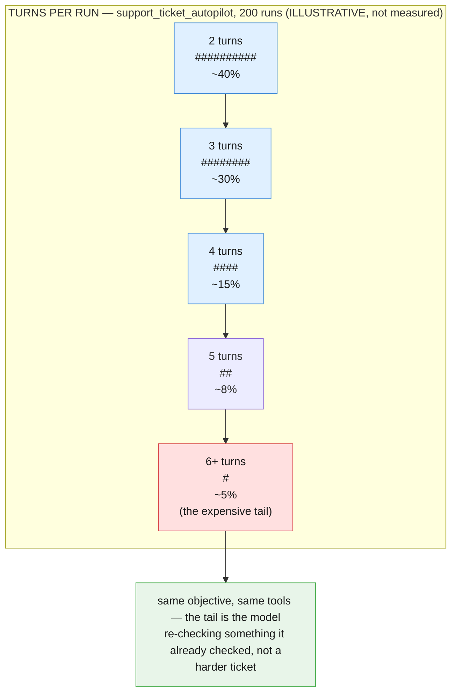
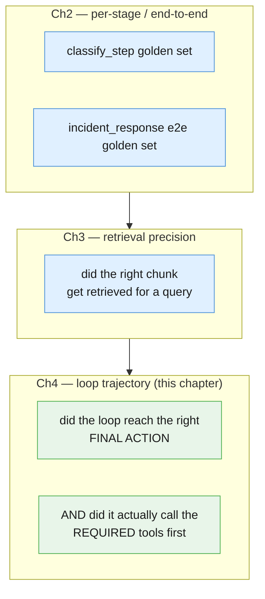
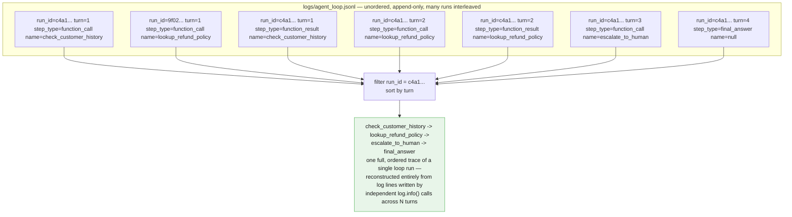

# Part VI — Production Discipline

Part V was what you save. This part is what you do with it once a loop is running
against real objectives — versioning a tool allowlist the way Chapter 2 versioned a
stage sequence, reasoning about a cost that is bounded only by `MAX_TURNS` instead of a
known sum of stages, catching the failure mode unique to a loop (the right final answer
for the wrong reasons), and logging enough that "what did it check, in what order" is
answerable after the fact.

---

## 6.1 Loops as code

Chapter 2 §6.1's rule: a stage's prompt version is part of the pipeline's own identity.
This chapter's version of that rule needs one more moving part, because a loop's
behavior envelope isn't defined by prompts alone — it's defined by TWO things together:
**the tool allowlist** (which tools exist at all) and **each tool's own declaration**
(what the model is told each one does). Change either one and you change what the loop
can do, even if you touch nothing else:

- Add `escalate_to_human` to `weather_tools` and the Weather Alert Worker can now do
  something it was never designed to do, whether or not the model ever calls it.
- Reword `lookup_refund_policy`'s description to say "returns the FULL policy text"
  instead of "returns matching lines" and the model may stop calling
  `check_customer_history` at all, trusting a policy summary it never actually got.

Both are behavior changes. Neither touches the loop's own code. That's why the
allowlist and the declarations have to be versioned TOGETHER, in one place, the same way
Chapter 2 refused to let a stage's prompt version drift independently of the pipeline's
own version.

```python
def bump_loop_version(allowlist: dict[str, Any], changed_tool: str, new_tool_version: str) -> dict[str, Any]:
    """A tool's declaration version is part of the LOOP's own identity — changing it
    always bumps the allowlist's version too, exactly as Ch2 §6.1 bumped a pipeline's
    manifest whenever one stage's prompt changed."""
    for entry in allowlist["tools"]:
        if entry["name"] == changed_tool:
            entry["tool_version"] = new_tool_version
    major, minor, patch = (int(part) for part in allowlist["version"].split("."))
    allowlist["version"] = f"{major}.{minor + 1}.0"
    return allowlist


support_ticket_allowlist = {
    "loop": "support_ticket_autopilot",
    "version": "1.0.0",
    "max_turns": 8,
    "tools": [
        {"name": "lookup_refund_policy", "tool_version": "1.0.0", "requires_human_review": False},
        {"name": "check_customer_history", "tool_version": "1.0.0", "requires_human_review": False},
        {"name": "escalate_to_human", "tool_version": "1.0.0", "requires_human_review": True},
        {"name": "draft_customer_reply", "tool_version": "1.0.0", "requires_human_review": True},
    ],
}

support_ticket_allowlist = bump_loop_version(support_ticket_allowlist, "escalate_to_human", "1.1.0")
print(support_ticket_allowlist["version"])
```

### Code review for a loop change

Chapter 2 §6.1's per-prompt checklist still applies to whichever declaration file
changed. One question is new, specific to this blueprint:

- [ ] Does adding, removing, or rewording ANY tool change what the loop is now capable
      of — not just how well it performs the task it already had?
- [ ] Does the allowlist file's own `version` reflect that, the same way the manifest
      rule required in Chapter 2 §5.3/§6.1?
- [ ] Did the loop-trajectory eval (§6.3) rerun against the new allowlist, not just the
      per-tool eval for whichever tool changed?

---

## 6.2 The cost of an unbounded loop

Chapter 1 gave the cost of one call. Chapter 2 gave the cost of a fixed pipeline: the sum
of N known stages, computed once, true on every run. Chapter 3 gave the cost of a single
retrieval: one embed plus one generation. This blueprint's cost model is qualitatively
different, and it's the sharpest lesson in the chapter: **a tool loop's cost is bounded
only by `MAX_TURNS`.** There is no "known sum" to compute in advance, because the number
of turns a given run actually takes is a decision the model makes, one turn at a time.

The consequence that matters in production: two runs against the SAME objective, with
the SAME tools, can cost 3x apart for the SAME outcome, if one run second-guesses itself
into extra turns the other one didn't need.



*Illustrative only — no run counts from this chapter's own examples are claimed as
measured data; the shape (a right-hand tail of expensive-but-not-more-correct runs) is
the point, not the exact percentages.*

### Monitoring average turns per run

`TranscriptEntry.turn` (§5.2, §5.3) already carries what this needs — no new
instrumentation, just a rollup over `LoopResult`s the same way Chapter 2 §6.2 rolled
`StageLog`s up into a per-run token total.

```python
def turns_used(result: LoopResult) -> int:
    return max(entry.turn for entry in result.transcript)


def average_turns(results: list[LoopResult]) -> float:
    if not results:
        return 0.0
    return sum(turns_used(r) for r in results) / len(results)


recent_support_runs = [support_result]  # in production: pulled from stored LoopResults
print(f"average turns/run: {average_turns(recent_support_runs):.1f}")
```

When that average creeps up over time with no change in the objective's difficulty, the
levers worth reaching for, roughly in order of how invasive they are:

| Lever | When it applies |
|---|---|
| **Tighten a tool's description** (§5.4, §6.1) | The model is calling the same read-only tool more than once per run because the first call's result wasn't clear enough to act on — a vaguer symptom of the same problem §5.4 named for `escalate_to_human`'s description. |
| **Simplify the objective** | The objective text itself asks for more decisions than the task needs — e.g. bundling "and also double-check X" into an objective that didn't require it. |
| **Lower `MAX_TURNS`** | The least targeted lever, and the last one to reach for: it caps the damage from a run that's already spiraling, but does nothing to stop the spiraling itself. Useful as a backstop, not a fix. |

---

## 6.3 Evaluating a tool loop

Chapter 2's per-stage/end-to-end split and Chapter 3's retrieval-precision eval both
assumed a fixed shape to score against. A loop needs a THIRD kind of eval, because the
question isn't "did stage N produce the right output" or "did retrieval find the right
chunk" — it's **did the loop use the RIGHT tools, in a reasonable order, to reach the
right final outcome.**



The failure mode this catches, concretely, in Example B: a run that calls
`escalate_to_human` WITHOUT ever calling `check_customer_history` first can still land on
the "right" final action by luck — the model might reason its way to escalation from the
ticket text alone, guessing correctly that this looks like a repeat case. That run passes
a "final action only" eval and should still fail a real one, because Part III's audit
guard exists precisely to check whether the required lookups actually happened before an
action is accepted — an eval that only checks the final label can't see that the audit
trail is missing.

```python
def final_action_tool(result: LoopResult) -> str | None:
    """The last action-shaped tool this run actually called, if any — the loop's
    'final action,' read off the transcript rather than off output_text alone."""
    action_calls = [
        entry.name for entry in result.transcript
        if entry.step_type == "function_call"
        and entry.name in {"escalate_to_human", "draft_customer_reply"}
    ]
    return action_calls[-1] if action_calls else None


def called_tools(result: LoopResult) -> set[str]:
    return {
        entry.name for entry in result.transcript
        if entry.step_type == "function_call"
    }


SUPPORT_TICKET_GOLDEN = [
    {
        "id": "st-001",
        "objective": SUPPORT_OBJECTIVE,
        "expected_action": "escalate_to_human",
        "required_tools": {"check_customer_history", "lookup_refund_policy"},
    },
    {
        "id": "st-002",
        "objective": (
            "Handle this support ticket for customer cust_9981: 'Hi, could I get a "
            "refund for my October order, I accidentally bought the wrong plan tier.' "
            "Look up whatever policy or account information you need, decide whether "
            "this should be escalated to a human or handled with a drafted reply, and "
            "produce that outcome."
        ),
        "expected_action": "draft_customer_reply",
        "required_tools": {"lookup_refund_policy"},
    },
]


def run_support_ticket_eval(loop: AgentLoop) -> float:
    """A loop-trajectory eval: checks the final action AND whether the required
    tools were actually called first (the audit guard from Part III), not the
    final action alone."""
    passed = 0
    for case in SUPPORT_TICKET_GOLDEN:
        result = loop.run(case["objective"])
        action_ok = final_action_tool(result) == case["expected_action"]
        audit_ok = case["required_tools"].issubset(called_tools(result))
        ok = action_ok and audit_ok
        passed += ok
        if not ok:
            print(
                f"FAIL {case['id']}: action_ok={action_ok} (expected "
                f"{case['expected_action']}, got {final_action_tool(result)}) "
                f"audit_ok={audit_ok} (required {case['required_tools']}, "
                f"called {called_tools(result)})"
            )
    print(f"support_ticket loop-trajectory eval: {passed}/{len(SUPPORT_TICKET_GOLDEN)}")
    return passed / len(SUPPORT_TICKET_GOLDEN)


run_support_ticket_eval(support_loop)
```

Two case-2 scenarios, `st-001` (repeat duplicate, must escalate) and `st-002` (single
accidental purchase, should draft), exercise both branches of the policy from Part III —
neither one is scoreable by "did output_text look reasonable" alone, only by reading the
transcript.

---

## 6.4 Observability for a loop

Chapter 2 §6.4 logged one JSON line per stage, correlated by `run_id`. A loop needs the
same correlation key, applied to something richer: one JSON line per `TranscriptEntry`
(§5.2, §5.3), because after-the-fact debugging here means answering "what did it check,
in what order, before deciding X" — and a single final-answer log line cannot answer
that question, no matter how much detail you cram into it.

```python
import logging

log = logging.getLogger("agent_loop")


def log_transcript(result: LoopResult, loop_name: str) -> None:
    for entry in result.transcript:
        record = {
            "loop": loop_name,
            "run_id": entry.run_id,
            "turn": entry.turn,
            "step_type": entry.step_type,
            "name": entry.name,
            "elapsed_ms": round(entry.elapsed_ms, 1),
        }
        log.info("loop_turn", extra=record)
        print(json.dumps(record))  # illustrative here; production emits via `log` only


log_transcript(support_result, "support_ticket_autopilot")
```

Redact ticket and customer text from `payload` before logging in a real deployment,
exactly as Chapter 1 §5.7 required for prompt inputs — the fields above are the metadata
worth keeping in every run's log line; the raw arguments and results belong in the
transcript artifact itself (§5.3), access-controlled separately from a general-purpose
log stream.



Same payoff Chapter 2 §6.4 found for `run_id`, one level richer: nothing about
`log_transcript` needs to know it's being called once per turn rather than once per run —
`run_id` and `turn` together are the only correlation keys a review, an incident, or a
loop-trajectory eval failure (§6.3) ever needs to reconstruct exactly what happened.

---

## Five things worth actually remembering

1. **A loop's behavior envelope is the allowlist PLUS every tool's declaration,
   together.** Changing either one changes what the loop can do — version them as one
   unit, not two.
2. **Cost is bounded only by `MAX_TURNS`, not by a known sum of stages.** The same
   objective can cost 3x across two runs with no change in outcome — average turns per
   run is the metric to watch, not any single run's cost.
3. **Tighten tool descriptions and simplify objectives before reaching for a lower
   `MAX_TURNS`.** The cap is a backstop against a spiral, not a fix for whatever's
   causing it.
4. **A loop-trajectory eval checks the final action AND the required tool calls, not
   the final action alone.** The right outcome by luck, without the audit guard's
   required lookups, is a real failure this eval exists to catch.
5. **Log every `TranscriptEntry`, correlated by `run_id` and `turn`.** A single
   final-answer log line cannot answer "what did it check, in what order" — only the
   full turn-by-turn trace can.

---

**Next:** [Part VII — Advanced](./07-advanced.md)
