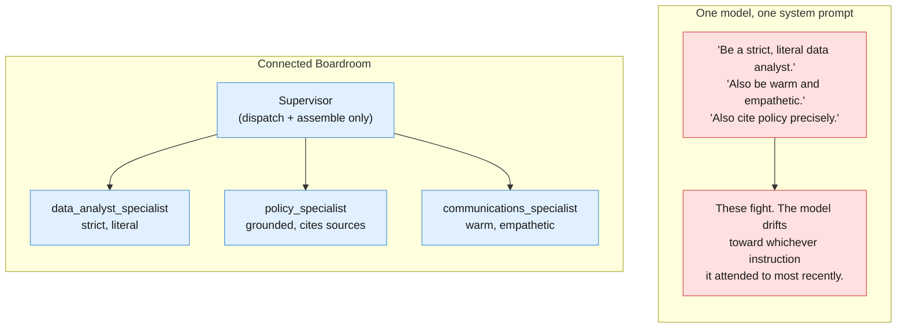
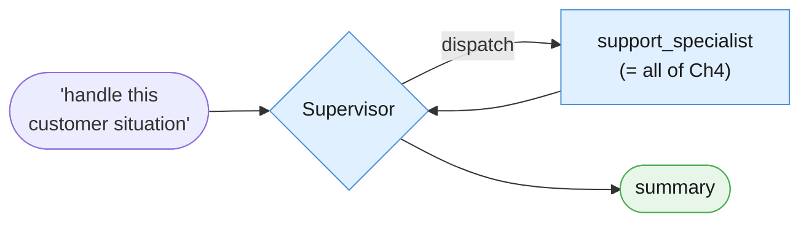
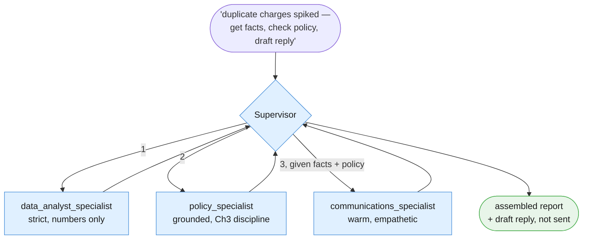
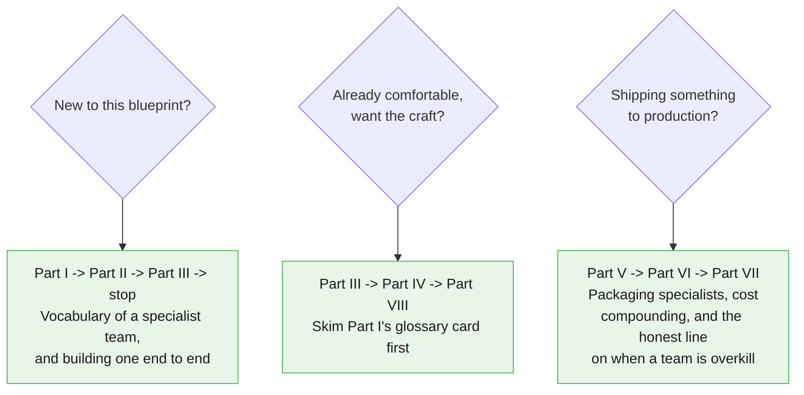

# Blueprint 5 — The Connected Boardroom

## A Working Knowledge Base for Collaborative Specialist Networks

*Companion chapter to "Beyond the Chatbox: The 5 Architecture Blueprints of Modern AI"
from the newsletter **The AI Agent Blueprint**, and the direct sequel to
[Blueprint 4 — The Autopilot Worker](../04-autopilot-worker-tool-using-loop/00-index.md).
This is the fifth and final chapter of the series.*

---

## Why this chapter exists

The parent article defines the Connected Boardroom in one paragraph:

> When a business logic objective is too vast or complex for a single AI brain to
> hold without crossing its instructions, you build a team. This architecture uses
> a "Supervisor" model acting as a tech lead to distribute tasks to narrow, highly
> disciplined child agents (such as an isolated SQL analyst, a mathematical tool
> runner, and a document researcher).

Chapter 4's §7.4 already named exactly when you need this: when a single loop's
objective needs genuinely conflicting reasoning styles — a strict, literal analyst
voice and a warm, creative customer-facing voice, say — crammed into one system
prompt, they start fighting each other. This chapter is that promotion, made real.



**No new API exists for this.** A "specialist" is just another
`client.interactions.create` call with its own `system_instruction`. A "Supervisor"
is built exactly like Chapter 4's tool-calling loop, except its "tools" are
functions that make a *nested* model call to a specialist, instead of touching a
database. This chapter's whole idea is applying Chapter 4's own mechanic
recursively — nothing more exotic than that.

> **Avoid when:** Tackling small, straightforward tasks where the operational
> communication overhead isn't worth it.

Every prior chapter said some version of this about itself. This one means it more
than any of them: a Supervisor plus three specialists is, at minimum, four model
calls where one might have done. Reach for this only when personas genuinely
conflict — not because "a team" sounds more sophisticated than one well-scoped call.

---

## The two examples we keep coming back to

### Example A — The Ops Boardroom

The smallest possible boardroom: one Supervisor, one specialist. The specialist is
`support_specialist` — Chapter 4's entire Support Ticket Autopilot, wrapped as one
callable unit. This establishes the core mechanic — a tool whose body is itself a
full agent invocation — before Example B adds real specialist conflict.



### Example B — The Quarterly Billing Review

The article's own scenario, built literally: an isolated data analyst, a policy
researcher, and a customer-communications specialist — three genuinely conflicting
personas, coordinated, never merged.



The Supervisor never computes a statistic, recites policy, or drafts customer
language itself — its only job is deciding who to call, in what order, and
assembling what comes back. Nothing in this chapter's examples sends a real email,
issues a real refund, or writes to a real system.

| # | Task | Why it earns its place |
|---|---|---|
| A | **Ops Boardroom** | Minimal case: one supervisor, one specialist wrapping all of Chapter 4. |
| B | **Quarterly Billing Review** | The article's own scenario. Three genuinely conflicting personas, coordinated. |

---

## How to read this



---

## Contents

- [Part I — Vocabulary of a Specialist Team](./01-vocabulary.md)
- [Part II — Foundations](./02-foundations.md)
- [Part III — Core Techniques](./03-core-techniques.md)
- [Part IV — Reliability](./04-reliability.md)
- [Part V — Reusable Artifacts](./05-reusable-artifacts.md)
- [Part VI — Production Discipline](./06-production.md)
- [Part VII — Advanced](./07-advanced.md)
- [Part VIII — Practice](./08-practice.md)

---

## Before you start

This chapter assumes you already completed [Blueprint 1's setup](../SETUP.md) —
same Python 3.10+, same virtual environment, same `GEMINI_API_KEY`. **No new pip
dependency.** A specialist is just another `client.interactions.create` call. This
chapter's own [`requirements.txt`](./requirements.txt) lists the identical three
packages Chapters 1-4 use.

If you're starting fresh at Chapter 5: go do [the repo's `SETUP.md`](../SETUP.md)
first, then at least skim
[Chapter 4's §7.4](../04-autopilot-worker-tool-using-loop/07-advanced.md) — this
chapter assumes you already understand the promotion signal it named, because this
chapter is that promotion.

---

## The session preamble

Every code block in every file below assumes this has already run.

```python
"""Session preamble — every example in this chapter assumes these names exist."""

from dotenv import load_dotenv
from google import genai

load_dotenv()

client = genai.Client()
MODEL = "gemini-3.5-flash"

# ---------------------------------------------------------------------------
# Fixtures reused verbatim from Chapters 1-4
# ---------------------------------------------------------------------------
ticket_text = """Hi, I was charged twice for my October subscription. I can see two
identical GBP 49.00 charges on the same card, both dated 3 October. I have already
tried logging in to check my invoices but the billing page just spins forever.
Could someone refund the duplicate? This is the second month it has happened."""

document_text = """Post-incident review: payment gateway degradation, 3 October.

Between 02:11 and 03:47 UTC, the billing service returned elevated errors on card
charge attempts. The upstream payment provider acknowledged a partial outage in their
authorisation tier during the same window.

Impact: 1,842 charge attempts failed. 96 customers were charged twice because our
retry logic did not check for an existing authorisation before resubmitting. No card
data was exposed.

Root cause: the retry wrapper treated a gateway timeout as a definitive failure. A
timeout is ambiguous — the charge may or may not have completed. The wrapper had no
idempotency key, so the retry created a second authorisation.

Remediation: idempotency keys on all charge submissions, shipped 9 October. Timeout
handling now reconciles against the provider before retrying. Duplicate charges were
refunded within 48 hours. Outstanding: we still have no alert on duplicate-charge rate,
tracked as BILL-2291."""

doc_refund_policy = """Refund and Duplicate Charge Policy (Billing Handbook, Section 4)

Customers charged more than once for the same billing period due to a system error
are eligible for an automatic refund of the duplicate charge, no support ticket
required, once the duplicate is confirmed in the payment ledger. Confirmed duplicate
charges are refunded within 5-7 business days to the original payment method.

If a customer reports being charged twice in two or more consecutive billing cycles,
the account must be flagged for manual review by the billing operations team before
any further automatic refund is issued, since repeat duplication usually indicates a
deeper account or integration problem rather than a one-off system error.

Refunds for any other reason (dissatisfaction, accidental purchase, downgrade
requests) fall outside this section and are handled under the standard cancellation
policy instead."""

# ---------------------------------------------------------------------------
# New fixture — a small simulated billing dataset, standing in for a real SQL
# source. No example in this chapter queries a real database.
# ---------------------------------------------------------------------------
BILLING_ANOMALY_ROWS = [
    {"date": "2026-10-03", "duplicate_charges": 96, "total_charge_attempts": 1842},
    {"date": "2026-10-04", "duplicate_charges": 11, "total_charge_attempts": 1790},
    {"date": "2026-10-05", "duplicate_charges": 2, "total_charge_attempts": 1810},
]
```

> **Sanity check.** Run this before continuing:
>
> ```python
> probe = client.interactions.create(
>     model=MODEL,
>     input="Reply with exactly one word: assembled.",
>     store=False,
> )
> print(probe.output_text)
> ```
>
> If that prints "assembled" (or close to it), you're set.

---

## A note on the code

Same convention as Chapters 1-4: the **Interactions API** only
(`client.interactions.create`), model pinned once as `MODEL`, Python 3.10+ style
throughout. This chapter mixes both of the series' calling conventions on purpose:
each **specialist** call is stateless (`store=False`, matching Chapters 1-3's
single-shot convention — a specialist does one focused job and returns), while the
**Supervisor**'s own loop is stateful (`store=True` + `previous_interaction_id`,
matching Chapter 4's convention — the Supervisor is the one doing multi-turn
tool-calling, now dispatching to specialists instead of plain functions).

Every code block in this chapter is cumulatively runnable: paste them in order
after the preamble above, and nothing breaks.

---

## Supporting files

| Path | What's in it |
|---|---|
| `examples/` | Runnable `.py` for both examples and every technique |
| `prompts/` | Every specialist's system instruction, versioned |
| `requirements.txt` | Same three packages as Chapters 1-4 — nothing new |

---

## Verification status

Every API claim in this chapter was checked against Google's live documentation.
This chapter introduces no new API surface: a specialist is a
`client.interactions.create` call with its own `system_instruction`, and a
Supervisor is Chapter 4's tool-calling loop applied recursively.

---

*This is the last chapter of the five-part series. Part VIII closes with the fully
assembled Golden Rule across all five blueprints.*
