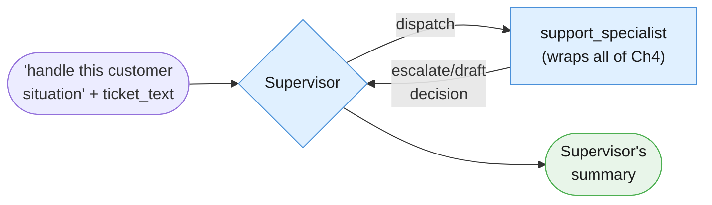
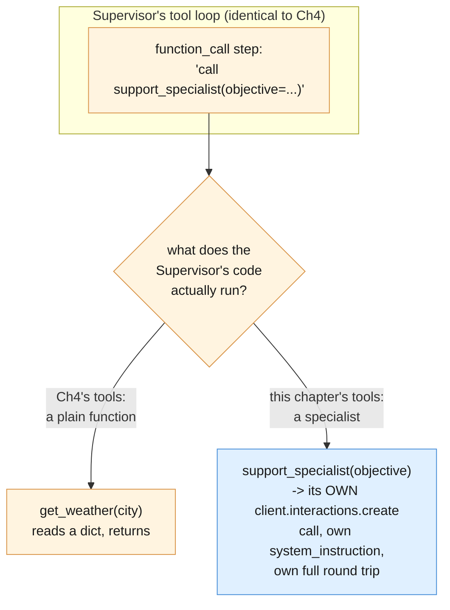
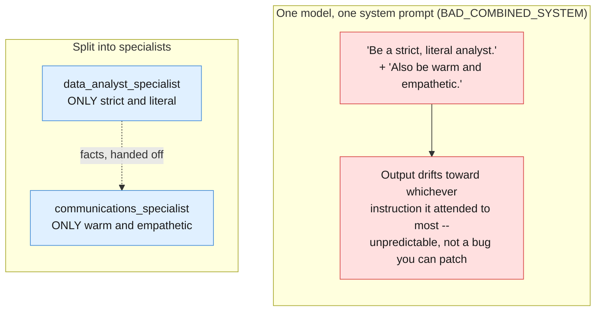

# Part I — Vocabulary of a Specialist Team

Chapter 4 built a single agent that decides its own sequence of tool calls, turn by turn.
This chapter keeps that exact mechanic — nothing about the API changes — and adds one new
question above it: what happens when a single agent's own instructions start fighting
themselves? The answer is not a smarter prompt. It's a team. Same worked example the whole
way through this Part: the article's own **Ops Boardroom**, built as small as it can
possibly be — one Supervisor, one specialist.

---

## 1.1 The worked example

The objective, handed to the Supervisor as `input`, is exactly this:

> A customer situation needs handling: *(the same overcharge ticket Chapters 1–4 have all
> used)*. Get it resolved and summarize the outcome for me.

The Supervisor has exactly one specialist available to it: `support_specialist`, which wraps
Chapter 4's entire Support Ticket Autopilot — classify, check policy and history, decide
escalate-vs-draft — as **one callable unit**. Before decomposing any of this, run it once as
a black box: objective in, Supervisor summary out.

```python
# client, MODEL, ticket_text, document_text, doc_refund_policy, BILLING_ANOMALY_ROWS
# come from the session preamble in 00-index.md.
import json
from dataclasses import dataclass
from typing import Any

SUPPORT_SPECIALIST_SYSTEM = """You are a support ticket specialist. Classify
the ticket, weigh it against refund policy and customer history if relevant,
and decide: DRAFT a reply to the customer, or ESCALATE to a human agent.
State your decision and a one-paragraph summary of why."""

def support_specialist(objective: str) -> str:
    """Wraps Chapter 4's entire Support Ticket Autopilot (classify, ground
    against policy/history, decide escalate-vs-draft) as ONE callable unit.
    This is a simplified, single-call stand-in for that whole multi-turn
    loop -- see Chapter 4's 01-vocabulary.md and 02-foundations.md for the
    full mechanism this wraps. Stateless: store=False, matching Chapters
    1-3's original single-shot convention for one focused job."""
    interaction = client.interactions.create(
        model=MODEL,
        input=objective,
        system_instruction=SUPPORT_SPECIALIST_SYSTEM,
        store=False,
    )
    return interaction.output_text

@dataclass
class Tool:
    """One specialist (or plain function) the Supervisor may dispatch to.
    Same shape as Chapter 4's own Tool dataclass -- the only difference in
    this chapter is that `fn` is just as likely to be a nested
    client.interactions.create call as a plain function touching data."""
    name: str
    declaration: dict[str, Any]
    fn: Any

support_specialist_declaration = {
    "type": "function",
    "name": "support_specialist",
    "description": (
        "Hands a full customer situation to the support specialist, who "
        "classifies it, checks policy and history, and decides escalate "
        "vs. draft on its own."
    ),
    "parameters": {
        "type": "object",
        "properties": {
            "objective": {"type": "string", "description": "The situation to resolve"},
        },
        "required": ["objective"],
    },
}

TOOLS_A = [
    Tool(name="support_specialist", declaration=support_specialist_declaration,
         fn=support_specialist),
]

MAX_TURNS = 4

SUPERVISOR_SYSTEM_A = """You are a Supervisor. Your only job is to decide
which specialist to call and to summarize what comes back for the person who
gave you the objective. You never classify tickets, check policy or history,
or decide escalate-vs-draft yourself -- that is support_specialist's job, not
yours."""

def run_supervisor_loop(
    objective: str,
    tools: list[Tool],
    system_instruction: str,
    max_turns: int = MAX_TURNS,
) -> dict[str, Any]:
    """The Supervisor's own loop -- built exactly like Chapter 4's tool-
    calling loop, except every Tool's fn is itself a full, isolated
    client.interactions.create call to a specialist, not a plain function
    touching a database. Stateful: store=True + previous_interaction_id,
    matching Chapter 4's convention for a multi-turn loop, because the
    Supervisor -- not any one specialist -- is the one holding a
    conversation across several turns."""
    declarations = [tool.declaration for tool in tools]
    tools_by_name = {tool.name: tool for tool in tools}
    dispatch_log: list[dict[str, Any]] = []

    interaction = client.interactions.create(
        model=MODEL,
        input=objective,
        system_instruction=system_instruction,
        tools=declarations,
        store=True,
    )

    for turn in range(1, max_turns + 1):
        fc_step = next((s for s in interaction.steps if s.type == "function_call"), None)
        if fc_step is None:
            return {"status": "done", "answer": interaction.output_text,
                     "dispatch_log": dispatch_log}

        tool = tools_by_name.get(fc_step.name)
        if tool is None:
            dispatch_log.append({"turn": turn, "error": f"{fc_step.name!r} not in allowlist"})
            return {"status": "max_turns_reached", "dispatch_log": dispatch_log}

        print(f"[turn {turn}] Supervisor dispatches -> {fc_step.name}({fc_step.arguments})")
        specialist_result = tool.fn(**fc_step.arguments)
        dispatch_log.append({"turn": turn, "specialist": fc_step.name,
                              "result": specialist_result})

        interaction = client.interactions.create(
            model=MODEL,
            input=[{
                "type": "function_result",
                "name": fc_step.name,
                "call_id": fc_step.id,
                "result": [{"type": "text", "text": json.dumps(specialist_result)}],
            }],
            system_instruction=system_instruction,
            tools=declarations,
            store=True,
            previous_interaction_id=interaction.id,
        )

    print(f"[Supervisor] MAX_TURNS ({max_turns}) reached -- halting, surfacing to a human.")
    return {"status": "max_turns_reached", "dispatch_log": dispatch_log}

objective_a = (
    f"A customer situation needs handling: {ticket_text}\n"
    "Get it resolved and summarize the outcome for me."
)

result_a = run_supervisor_loop(objective_a, TOOLS_A, SUPERVISOR_SYSTEM_A)
print("\nSUPERVISOR SUMMARY:")
print(result_a["answer"])
```

Watch what happens: the Supervisor reads the objective, decides on its own that
`support_specialist` is the right (and only) tool for the job, dispatches to it once, gets
back a full escalate-or-draft decision, and reports a summary. The Supervisor never touched
the ticket's content itself — it only decided *who* handles it and *how to phrase the
summary* of what came back. Everything below decomposes this one block.



---

## 1.2 Specialist

**A specialist is a narrow, disciplined agent with its own `system_instruction`, doing one
kind of job well — nothing more.** `support_specialist` above is the specialist for Example
A. Its signature is deliberately plain:

```python
def support_specialist(objective: str) -> str: ...
```

One string in, one string out. No tools, no loop, no memory of anything outside this one
call. Its internal shape is a single, focused `client.interactions.create` call carrying its
own persona in `system_instruction`:

```python
print(support_specialist_declaration["name"])
print(support_specialist_declaration["description"])
```

That persona — "classify, ground against policy and history, decide escalate-vs-draft" — is
a compressed stand-in for Chapter 4's entire multi-turn Support Ticket Autopilot loop. This
chapter does not rebuild that loop from scratch; it wraps it. In your own systems, a
specialist this narrow might genuinely be a single call like this one, or it might be an
entire Chapter-4-style tool loop hiding behind a one-line function signature — the Supervisor
neither knows nor cares which, and that's the point of wrapping it as "one callable unit."

---

## 1.3 Supervisor

**A supervisor is built exactly like Chapter 4's tool-calling loop, except each registered
"tool" is a specialist dispatch rather than a plain function touching data.** `run_agent_loop`
in Chapter 4 and `run_supervisor_loop` above are the same shape on purpose: inspect
`interaction.steps` for a `function_call`, execute (here: dispatch to a specialist), submit a
`function_result`, repeat until there's no more `function_call` step or `MAX_TURNS` is hit.

The one part worth reading twice is the Supervisor's own persona:

```python
print(SUPERVISOR_SYSTEM_A)
```

Notice what it does *not* say: nothing about classifying tickets, nothing about refund
policy, nothing about tone. It is deliberately restricted to two verbs — *decide* and
*summarize*. If a Supervisor's system instruction starts accumulating domain knowledge about
how to do a specialist's job, that is the exact anti-pattern this chapter exists to prevent,
one level up.

---

## 1.4 No new API for this

Say it plainly, because it is the single most important fact in this chapter: **there is no
"multi-agent" feature anywhere in the Interactions API.** A specialist is just another
`client.interactions.create` call with its own persona in `system_instruction`. A Supervisor
is just Chapter 4's tool loop, where a tool's body happens to make that nested call instead of
reading a dictionary or hitting a simulated API. This whole blueprint is recursion, not a new
primitive — the same one mechanic from Chapter 4, called from inside itself.



A `function_call` step in this chapter's Supervisor loop looks byte-for-byte identical to one
in Chapter 4's loop. The only difference is invisible from the API's point of view: what your
Python code does when it executes the matching function is make a whole second trip to the
model, with a different persona, instead of a dictionary lookup.

---

## 1.5 Why specialists are stateless but the Supervisor isn't

`support_specialist` above passes `store=False`. `run_supervisor_loop` passes `store=True`
plus `previous_interaction_id` on every follow-up call. That split is deliberate, not an
inconsistency:

- A **specialist** does one focused job and returns. It has no "next turn" of its own worth
  remembering server-side — every specialist call in this chapter is a fresh, independent
  interaction, exactly matching Chapters 1–3's single-shot convention.
- The **Supervisor** is the one holding a multi-turn conversation. It might dispatch to one
  specialist, look at the result, and decide to dispatch to another before it's done — that's
  a genuine multi-turn loop, exactly Chapter 4's situation, just with specialist calls
  standing in for Chapter 4's plain-function tools.

Put another way: nothing about *what kind of thing a tool call does* changes whether the
calling loop needs to be stateful. What matters is whether the **caller** — the Supervisor —
needs to remember earlier turns to decide what to do on this one. It does, so it uses Chapter
4's pattern. A specialist doesn't, so it uses Chapters 1–3's.

---

## 1.6 Dispatch vs. synthesis

The Supervisor has exactly two jobs, and only two:

1. **Dispatch** — deciding *who* to call, with *what* objective, and in *what order*. This is
   every `function_call` step it produces.
2. **Synthesis** — combining whatever specialists returned into one coherent final answer.
   This is the turn where `interaction.steps` contains no more `function_call` steps, and
   `interaction.output_text` is what gets returned.

Neither job involves doing a specialist's actual work. `result_a["dispatch_log"]` from §1.1
is exactly the dispatch half, recorded:

```python
for entry in result_a["dispatch_log"]:
    print(entry)
```

`result_a["answer"]` is the synthesis half — the Supervisor's own words, built from what
`support_specialist` handed back, not independently invented.

---

## 1.7 Persona conflict, made concrete

Here is the exact problem Chapter 4's §7.4 named as the promotion signal to this chapter,
written out as one bad system prompt:

```python
BAD_COMBINED_SYSTEM = """You are a strict, literal data analyst who reports
only numbers and never speculates or softens language. You are also a warm,
empathetic customer-support voice who reassures anxious customers and never
sounds cold or clinical."""

def demo_persona_conflict(objective: str) -> str:
    """Deliberately bad: one system prompt asking for two genuinely
    conflicting personas at once. Shown to demonstrate the drift this
    chapter exists to fix -- not a pattern to copy."""
    interaction = client.interactions.create(
        model=MODEL,
        input=objective,
        system_instruction=BAD_COMBINED_SYSTEM,
        store=False,
    )
    return interaction.output_text

conflicted_output = demo_persona_conflict(
    f"Here is the duplicate-charge data: {BILLING_ANOMALY_ROWS}. "
    "Explain what happened to the customer."
)
print(conflicted_output)
```

There is no single guaranteed output for a prompt like this — that instability is exactly the
point. In practice, a combined prompt like `BAD_COMBINED_SYSTEM` tends to visibly favor
whichever instruction it attended to most recently or most strongly: sometimes it produces a
clinical table of percentages with an unconvincing "we're sorry" bolted onto the end;
sometimes it produces a warm, reassuring paragraph that quietly drops the exact numbers a
strict analyst reading would expect. Run it a few times and compare outputs side by side —
the drift is the symptom, not a one-off fluke, and it gets worse as more conflicting
instructions accumulate in one prompt. Splitting `DATA_ANALYST_SYSTEM` and a
customer-facing persona into two separate specialists (Part II builds exactly this) removes
the conflict by removing the *reason* for it: neither specialist is ever asked to be the
other thing.



---

## 1.8 Glossary card

A dense, printable page — everything this Part introduced.

| Term | One line |
|---|---|
| **Specialist** | A narrow agent with its own `system_instruction`, doing one kind of job well; `store=False`, stateless |
| **Supervisor** | Chapter 4's tool-calling loop, where each tool's body dispatches to a specialist; `store=True` + `previous_interaction_id`, stateful |
| **Dispatch** | The Supervisor deciding who to call, with what objective, in what order — every `function_call` step it produces |
| **Synthesis** | The Supervisor's final turn (no more `function_call` steps), combining specialist outputs into one answer |
| **Persona conflict** | Two genuinely different reasoning styles/personas crammed into one `system_instruction`; the model drifts toward whichever it attended to most recently |
| **No new API primitive** | A "specialist" is just another `client.interactions.create` call; a "Supervisor" is Chapter 4's loop, applied recursively |
| **Dispatch log** | This chapter's record of every specialist call the Supervisor made, in order — the analogue of Chapter 4's loop transcript |
| **`MAX_TURNS`** | Same hard iteration cap as Chapter 4, now capping how many specialist dispatches one Supervisor run may make |

---

**Next:** [Part II — Foundations](./02-foundations.md)
