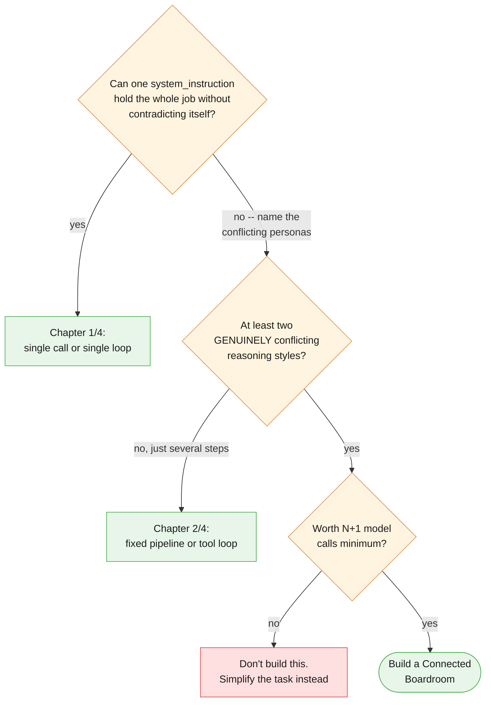
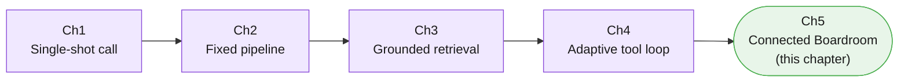
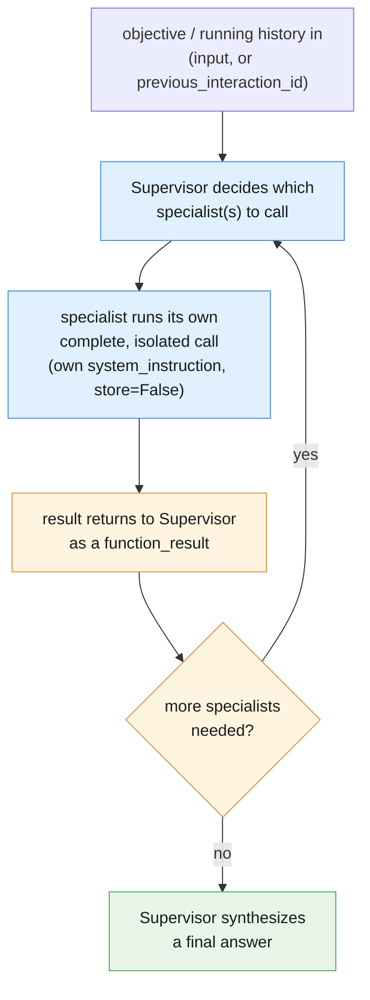

# Part II — Foundations

## 2.1 What the Connected Boardroom actually is

Every prior blueprint in this series kept one model doing all the reasoning, whether that
reasoning was a single shot (Chapter 1), a fixed sequence (Chapter 2), one grounded retrieval
(Chapter 3), or a self-directed tool loop (Chapter 4). The Connected Boardroom is the first
blueprint that splits the *reasoning itself* across more than one model call with more than
one persona, coordinated by a Supervisor that does none of that reasoning on its own account.

State plainly what this is not: **it is not "more powerful."** It is the same underlying
model, called several times, organized differently. A specialist is not smarter than a
single-shot call to the same model would be — it is *narrower*, with a `system_instruction`
that only has to hold one job's worth of instructions instead of several conflicting ones.
The value this chapter adds is entirely organizational: fewer conflicting instructions per
call, not new capability per call.

---

## 2.2 Best used for / avoid when — made testable

The article's own boundary:

> **Best used for:** Advanced, multi-domain automation systems where individual tools or
> extensive prompting rules would conflict if stuffed into one model.
>
> **Avoid when:** Tackling small, straightforward tasks where the operational communication
> overhead isn't worth it.

Every prior chapter in this series said some version of "you might not need this." This one
means it more than any of them, because a boardroom is the most expensive pattern in the
series to run. Turn the article's line into a rule of thumb you can actually apply:

> **If you cannot name two genuinely conflicting personas or skill sets your task needs, you
> probably don't need a boardroom.** You need Chapter 4's single loop — or, if the sequence
> is even fixed and known, Chapter 1's single call.

A checklist to run against a real task before reaching for this chapter:

| Question | If "yes" | If "no" |
|---|---|---|
| Can one well-scoped `system_instruction` describe the whole job without contradicting itself? | Use Chapter 4's single loop, or Chapter 1's single call | Keep reading |
| Do at least two of the reasoning styles the task needs genuinely conflict (strict vs. warm, literal vs. persuasive, terse vs. exploratory)? | This chapter's pattern earns its keep | You likely have one job with several steps, not several jobs — Chapter 2 or 4 |
| Is the extra cost of N+1 model calls (Supervisor's own turns, plus one call per specialist) actually worth it here? | Proceed, but budget for it explicitly | Don't — a boardroom's overhead is real money and real latency, not a hypothetical |
| Would a single agent doing this job produce visibly unstable output today, drifting between personas depending on phrasing? | That instability *is* the signal — split it | Not yet a boardroom problem |

The cost math is worth stating in real numbers, because it compounds differently than
anything earlier in this series. A fixed pipeline's (Chapter 2) cost is the sum of N known
stages. A tool loop's (Chapter 4) cost depends on how many turns the model takes. A
boardroom's cost is **the Supervisor's own turns, plus every specialist call it dispatches —
and a specialist that is itself a multi-turn loop (Example A's `support_specialist`, wrapping
all of Chapter 4) compounds further still.** Example B below, worked through: one initial
Supervisor turn, three specialist dispatches (one call each, since each specialist here is a
single-shot design), and at least one more Supervisor turn to synthesize — five model calls
at minimum, for a task Chapter 1 could answer in one call if the personas didn't genuinely
conflict.



One honest caveat this pattern adds that no earlier chapter had to: splitting personas into
specialists does not make persona conflict disappear from the system — it removes it from
*within one prompt*, but hands the Supervisor a new job that a single model never had:
reconciling specialist outputs that may not perfectly agree. That is a real tradeoff, not a
solved problem, and it is the price of this pattern even when it's the right call.

---

## 2.3 The five-blueprint recap

This is the last chapter of the series, so before going further, here is what each of the
five blueprints actually solved, one line each:

- **Chapter 1 — The Instant Reflex (single-shot call):** one objective, one model call, one
  answer — no steps, no state, no tools. The floor every other blueprint is measured against.
- **Chapter 2 — The Fixed Assembly Line (deterministic pipeline):** a known, fixed sequence
  of stages run in the same order every time, because the *shape* of the work never changes,
  only its content.
- **Chapter 3 — The Intelligent Library (grounded retrieval):** one retrieval lookup feeding
  one generation call, so the model answers from a specific document instead of its own
  memory — the sequence is still fixed, only the content found is not.
- **Chapter 4 — The Autopilot Worker (adaptive tool loop):** the model decides the sequence
  and count of its own actions, turn by turn, based on what earlier actions returned — the
  first blueprint where *you* stop deciding the shape of the run in advance.
- **Chapter 5 — The Connected Boardroom (this chapter):** what to reach for when a single
  loop's *persona*, not its steps, is the problem — when the reasoning styles a task needs
  genuinely conflict inside one `system_instruction`.



Note what did *not* change across all five: the same `client.interactions.create` call is at
the bottom of every single one. What changed, chapter over chapter, is only how many times you
call it, in what order, decided by whom, and — as of this chapter — with how many distinct
personas.

---

## 2.4 Anatomy of one dispatch

Zooming into a single Supervisor → specialist round trip, regardless of which specialist:



The Supervisor's own final answer must be traceable back to what its specialists actually
returned — not independently invented. If the Supervisor's synthesis states a number the data
analyst never reported, or cites a policy clause the policy specialist never quoted, that is
a bug in the same family as a single agent hallucinating a fact: the seam moved, the
discipline required of it didn't.

---

## 2.5 The whole thing, end to end

Example B, the article's own scenario, built literally: an isolated data analyst, a policy
researcher, and a customer-communications specialist — three genuinely conflicting personas,
coordinated by one Supervisor, never merged into one prompt.

```python
# Builds on Tool, run_supervisor_loop, ticket_text, doc_refund_policy, and
# BILLING_ANOMALY_ROWS from 00-index.md and 01-vocabulary.md.

DATA_ANALYST_SYSTEM = """You are a strict, literal data analyst. Report only
what the numbers show. Never speculate about cause, never soften language,
never add reassurance -- that is not your job."""

def data_analyst_specialist(objective: str) -> str:
    """The 'isolated SQL analyst' from the article, simplified to a small
    in-memory table instead of a real SQL engine. Stateless, single-shot."""
    rows_text = "\n".join(
        f"{row['date']}: {row['duplicate_charges']} duplicate charges out of "
        f"{row['total_charge_attempts']} attempts "
        f"({row['duplicate_charges'] / row['total_charge_attempts']:.2%})"
        for row in BILLING_ANOMALY_ROWS
    )
    interaction = client.interactions.create(
        model=MODEL,
        input=f"{objective}\n\nData:\n{rows_text}",
        system_instruction=DATA_ANALYST_SYSTEM,
        store=False,
    )
    return interaction.output_text

POLICY_SPECIALIST_SYSTEM = """You are a grounded policy researcher. Answer
only from the policy text you are given below. If the answer is not in the
text, say so explicitly rather than guessing. Cite the section you used.
This reuses Chapter 3's grounded-answer discipline, simplified here to a
direct text lookup instead of a retrieval index over many documents."""

def policy_specialist(objective: str) -> str:
    """The 'document researcher' from the article."""
    interaction = client.interactions.create(
        model=MODEL,
        input=f"{objective}\n\nPolicy document:\n{doc_refund_policy}",
        system_instruction=POLICY_SPECIALIST_SYSTEM,
        store=False,
    )
    return interaction.output_text

COMMS_SPECIALIST_SYSTEM = """You are a warm, empathetic customer-facing
writer. Using the facts and policy citation you are given, draft a clear,
human explanation for the customer. Never claim to send anything -- you only
ever draft. This is deliberately the opposite persona from the data
analyst."""

def communications_specialist(objective: str) -> str:
    interaction = client.interactions.create(
        model=MODEL,
        input=objective,
        system_instruction=COMMS_SPECIALIST_SYSTEM,
        store=False,
    )
    return interaction.output_text

data_analyst_declaration = {
    "type": "function",
    "name": "data_analyst_specialist",
    "description": "Strict, literal analysis of the billing anomaly dataset. Numbers only, no speculation.",
    "parameters": {
        "type": "object",
        "properties": {"objective": {"type": "string", "description": "What to analyze"}},
        "required": ["objective"],
    },
}

policy_specialist_declaration = {
    "type": "function",
    "name": "policy_specialist",
    "description": "Grounded lookup against the refund and duplicate-charge policy document.",
    "parameters": {
        "type": "object",
        "properties": {"objective": {"type": "string", "description": "What to look up"}},
        "required": ["objective"],
    },
}

communications_specialist_declaration = {
    "type": "function",
    "name": "communications_specialist",
    "description": "Drafts (never sends) a warm, customer-facing explanation from given facts and policy.",
    "parameters": {
        "type": "object",
        "properties": {"objective": {"type": "string", "description": "What to draft, and from what facts"}},
        "required": ["objective"],
    },
}

TOOLS_B = [
    Tool(name="data_analyst_specialist", declaration=data_analyst_declaration,
         fn=data_analyst_specialist),
    Tool(name="policy_specialist", declaration=policy_specialist_declaration,
         fn=policy_specialist),
    Tool(name="communications_specialist", declaration=communications_specialist_declaration,
         fn=communications_specialist),
]

SUPERVISOR_SYSTEM_B = """You are a Supervisor coordinating three specialists:
data_analyst_specialist, policy_specialist, and communications_specialist.
Your only job is deciding which specialist(s) to call, in what order, and
assembling what comes back into one coherent report. You never compute a
statistic yourself, never recite policy from memory, and never draft
customer-facing language yourself -- each of those is a specialist's job,
not yours."""

def anti_pattern_supervisor_does_the_work_itself(objective: str) -> str:
    """NAMED ANTI-PATTERN -- do not copy this. A Supervisor that skips
    dispatch and answers from its own memory instead: no data_analyst_
    specialist call means no cited rows, so any number here is invented,
    not read off BILLING_ANOMALY_ROWS. Included only to show what
    violating SUPERVISOR_SYSTEM_B's restriction looks like."""
    interaction = client.interactions.create(
        model=MODEL,
        input=objective,
        system_instruction=(
            "Just answer the billing question yourself, using whatever "
            "numbers and policy language seem plausible."
        ),
        store=False,
    )
    return interaction.output_text

objective_b = (
    "We had a spike in duplicate charges this quarter. Get the facts, check "
    "what policy says, and draft a customer-facing explanation."
)

result_b = run_supervisor_loop(objective_b, TOOLS_B, SUPERVISOR_SYSTEM_B, max_turns=6)

print("\nDISPATCH LOG:")
for entry in result_b["dispatch_log"]:
    print(entry)

print("\nSUPERVISOR FINAL REPORT:")
print(result_b["answer"])
```

Run this and count the calls: one initial Supervisor turn, one dispatch each to
`data_analyst_specialist`, `policy_specialist`, and `communications_specialist` (three
specialist calls, each stateless and independent of each other), and at least one final
Supervisor turn to synthesize — five model calls at minimum for this one objective, exactly
the cost-stacking math from §2.2. Compare that against
`anti_pattern_supervisor_does_the_work_itself`: one call, no citations, numbers and policy
language the Supervisor made up on the spot — cheaper, faster, and untrustworthy in exactly
the way a real billing review cannot afford to be. Nothing in either version sends a real
email or issues a real refund; `communications_specialist`'s output is a draft, full stop.

---

**Next:** [Part III — Core Techniques](./03-core-techniques.md)
