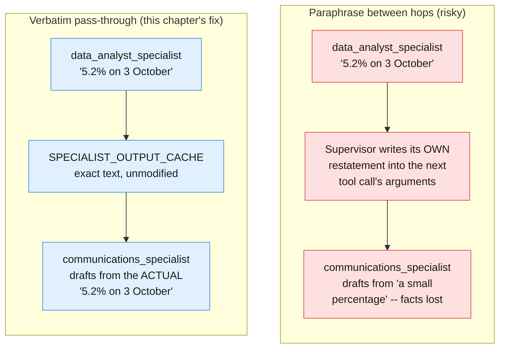
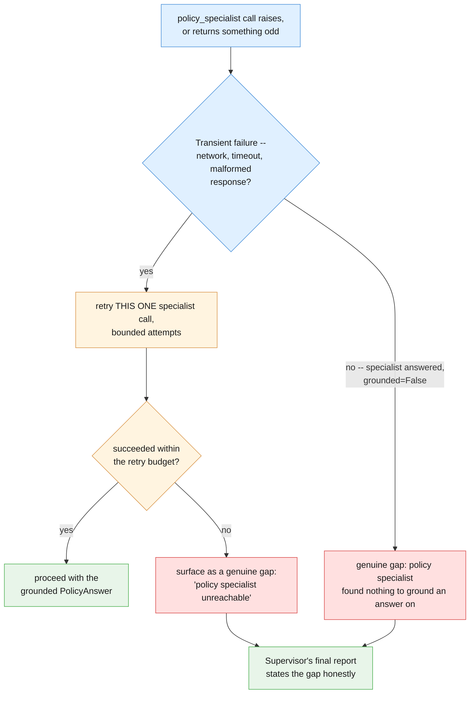

# Part IV — Reliability

Part III built a boardroom that works when every specialist answers cleanly and the
Supervisor dispatches in the right order. This part is about the three ways that
isn't guaranteed: a hop between specialists quietly corrupts the facts, a specialist
call itself fails, and a Supervisor's final report claims more than the transcript
actually supports. None of these three failure modes existed in Chapter 4's single
loop — they are new here, precisely because coordination between agents is new here.

---

## 4.1 When specialists disagree — the paraphrase-between-hops problem

`communications_specialist` never reads `BILLING_ANOMALY_ROWS` or
`doc_refund_policy` itself. Its only view of the facts is whatever text lands in the
`facts_text` and `policy_citation_text` arguments when the Supervisor decides to call
`call_communications_specialist`. §3.3 wired those arguments to carry the other two
specialists' exact returned text — but "wired to carry" and "actually carries" are
not the same guarantee, and this is the seam where they can quietly diverge.

Here is the failure mode, concretely. `data_analyst_specialist` returns something
like: *"3 October had 96 duplicate charges out of 1,842 attempts, a rate of 5.2%;
this fell to 11 on 4 October and 2 on 5 October."* That text becomes the
`function_result` for turn one. On the next turn, the Supervisor model decides to
call `call_communications_specialist` — and because it is the *model itself* that
writes the JSON arguments for that call, nothing stops it from writing its own
restated version of what it just read instead of the literal string: *"there was a
small percentage of duplicate charges recently."* That sentence is not false, but it
has silently dropped the actual numbers, the dates, and the decline pattern — and if
`communications_specialist` drafts from it, the customer-facing message will imply a
softer, vaguer picture than the data analyst actually reported. This is a genuine new
failure mode this pattern introduces: **a single model has no seam where it can
misquote itself; a boardroom has one at every hop, because the model composing a
tool call's arguments is not mechanically forced to reproduce a previous turn's
result verbatim.**

The mitigation is to stop trusting the model's own restatement whenever the exact
text is already available in your own code — cache each specialist's real output at
the moment it is produced, and substitute the cached, verbatim text for whatever the
Supervisor's tool-call arguments contain before executing the next specialist:

```python
SPECIALIST_OUTPUT_CACHE: dict[str, str] = {}


def call_data_analyst_tool_cached(objective: str) -> dict:
    report = data_analyst_specialist(objective)
    SPECIALIST_OUTPUT_CACHE["facts_text"] = report
    return {"report": report}


def call_policy_specialist_tool_cached(question: str) -> dict:
    policy_answer = policy_specialist(question)
    citation_text = f"{policy_answer.answer} (citation: {policy_answer.citation})"
    SPECIALIST_OUTPUT_CACHE["policy_citation_text"] = citation_text
    return {
        "answer": policy_answer.answer,
        "citation": policy_answer.citation,
        "grounded": policy_answer.grounded,
    }


def call_communications_specialist_tool_verbatim(facts_text: str, policy_citation_text: str) -> dict:
    """Ignores the model-supplied facts_text/policy_citation_text arguments in
    favor of the actual cached specialist output. The Supervisor's own
    restated copy of a previous turn's result is not trustworthy input, even
    though nothing in the API stops it from writing whatever string it wants
    into a tool argument."""
    verbatim_facts = SPECIALIST_OUTPUT_CACHE.get("facts_text", facts_text)
    verbatim_citation = SPECIALIST_OUTPUT_CACHE.get("policy_citation_text", policy_citation_text)
    if verbatim_facts != facts_text or verbatim_citation != policy_citation_text:
        print(
            "[WARNING] Supervisor's tool-call arguments diverged from the actual "
            "specialist output; using the verbatim cached text instead."
        )
    draft = communications_specialist(verbatim_facts, verbatim_citation)
    return {"draft": draft, "sent": False}


BOARDROOM_FUNCTIONS_VERBATIM_SAFE = {
    "call_data_analyst": call_data_analyst_tool_cached,
    "call_policy_specialist": call_policy_specialist_tool_cached,
    "call_communications_specialist": call_communications_specialist_tool_verbatim,
}


def run_boardroom_loop_verbatim_safe(objective: str) -> tuple[str | None, list[ToolCallRecord]]:
    """Same loop shape as run_boardroom_loop (§3.4), wired to the
    verbatim-safe function registry above instead of trusting whatever text
    the Supervisor's own model turn wrote into a tool call's arguments."""
    transcript: list[ToolCallRecord] = []

    interaction = client.interactions.create(
        model=MODEL,
        system_instruction=SUPERVISOR_SYSTEM,
        input=objective,
        tools=BOARDROOM_TOOLS,
        store=True,
    )

    for turn in range(1, MAX_TURNS + 1):
        fc_step = next((s for s in interaction.steps if s.type == "function_call"), None)
        if fc_step is None:
            return interaction.output_text, transcript

        function = BOARDROOM_FUNCTIONS_VERBATIM_SAFE[fc_step.name]
        result = function(**fc_step.arguments)
        transcript.append(ToolCallRecord(turn=turn, name=fc_step.name,
                                          arguments=fc_step.arguments, result=result))
        print(f"turn {turn}: {fc_step.name}({fc_step.arguments}) -> {result}")

        interaction = client.interactions.create(
            model=MODEL,
            input=[{
                "type": "function_result",
                "name": fc_step.name,
                "call_id": fc_step.id,
                "result": [{"type": "text", "text": json.dumps(result)}],
            }],
            tools=BOARDROOM_TOOLS,
            previous_interaction_id=interaction.id,
            store=True,
        )

    return None, transcript
```

Paraphrasing between hops is the riskier alternative precisely because it *looks*
fine — the Supervisor still produces fluent, plausible-sounding tool arguments, the
loop still terminates normally, and nothing raises an exception anywhere. The
corruption is silent by construction: it is a fact quietly softened in translation,
not a crash. Verbatim pass-through trades a small amount of code (a cache, an
equality check, a warning print) for removing that entire class of silent drift.



---

## 4.2 A specialist that fails or times out

`policy_specialist`'s own `client.interactions.create` call can fail the same way
any model call can — a dropped connection, a timeout, a 429. Chapter 2 §4.2 already
drew the line that matters here: a model call, on its own, mutates nothing outside
the response it returns, so retrying *that one call* is safe. The new question this
chapter adds is what to do with a specialist call that comes back *successfully* but
still can't help — `policy_specialist` returning `grounded=False` because none of the
retrieved passages actually address the question. Those are two entirely different
outcomes, and conflating them is exactly the mistake to avoid.

```python
class TransientSpecialistError(Exception):
    """Raised when a specialist's own call failed for reasons unrelated to the
    question asked -- a dropped connection, a timeout, a 429. Retrying THIS
    ONE specialist call is safe, per Chapter 2 §4.2's own reasoning."""


def call_policy_specialist_with_retry(question: str, max_attempts: int = 2) -> PolicyAnswer:
    last_exc: Exception | None = None
    for attempt in range(max_attempts):
        try:
            return policy_specialist(question)
        except Exception as exc:
            last_exc = exc
            print(f"[RETRY] policy_specialist call failed (attempt {attempt + 1}/{max_attempts}): {exc}")
    raise TransientSpecialistError(
        f"policy_specialist unreachable after {max_attempts} attempts"
    ) from last_exc


def call_policy_specialist_tool_safe(question: str) -> dict:
    """Distinguishes a transient failure (retried, bounded) from a genuine
    "the policy specialist cannot answer this" gap (never retried -- retrying
    the same ungrounded question will not ground it). Either outcome is
    surfaced to the Supervisor honestly, not silently papered over with a
    confident-sounding citation that isn't there."""
    try:
        policy_answer = call_policy_specialist_with_retry(question)
    except TransientSpecialistError as exc:
        return {
            "answer": "Data unavailable",
            "citation": "Data unavailable",
            "grounded": False,
            "gap_reason": f"policy specialist unreachable: {exc}",
        }

    if not policy_answer.grounded:
        return {
            "answer": policy_answer.answer,
            "citation": policy_answer.citation,
            "grounded": False,
            "gap_reason": "policy specialist found no passage grounding this question",
        }

    return {
        "answer": policy_answer.answer,
        "citation": policy_answer.citation,
        "grounded": True,
        "gap_reason": None,
    }
```

The distinction earns its keep at the Supervisor's synthesis step: a `gap_reason`
of `"policy specialist unreachable"` means try again later, or escalate to a human
who can check policy by hand; a `gap_reason` of `"policy specialist found no passage
grounding this question"` means the question itself may be outside what
`doc_refund_policy` covers, and no amount of retrying the same call fixes that. A
final report that quietly drops either kind of gap — presenting a placeholder
citation as if it were a real one — is worse than a report that says plainly "policy
could not be confirmed on this point."



---

## 4.3 Auditing which specialists were actually consulted

Chapter 4 §3.5 audited a single loop's *terminal action* — was it preceded by the
lookups that justify it? This chapter has to audit one level higher: before the
Supervisor's final synthesis is accepted, check that the specialists whose input the
final answer implicitly relies on were actually called, and that their real output
is traceable in the transcript — not invented by the Supervisor itself in violation
of its own §3.2 restriction.

```python
REQUIRED_SPECIALISTS_FOR_REPORT = {"call_data_analyst", "call_policy_specialist"}


def audit_boardroom_run(transcript: list[ToolCallRecord], final_text: str) -> tuple[bool, str]:
    """Extends Chapter 4 §3.5's audit_run one level up: instead of checking
    that a single loop's terminal action was preceded by the right lookups,
    this checks that the specialists a FINAL REPORT implicitly relies on were
    actually dispatched, and their output is traceable in the transcript --
    the direct check against the §3.2 anti-pattern."""
    called_names = {record.name for record in transcript}
    missing = REQUIRED_SPECIALISTS_FOR_REPORT - called_names
    if missing:
        return False, (
            f"final report relies on facts and policy, but these specialists "
            f"were never called: {sorted(missing)}"
        )

    has_digit = any(char.isdigit() for char in final_text) if final_text else False
    if has_digit and "call_data_analyst" not in called_names:
        return False, (
            "final report contains a figure but call_data_analyst was never "
            "called -- likely a fabricated statistic (see §3.2's anti-pattern)"
        )

    return True, "every specialist the final report relies on is traceable in the transcript"


accepted, audit_note = audit_boardroom_run(transcript, final_text or "")
print(f"[AUDIT] accepted={accepted}: {audit_note}")
```

This audit is deliberately blunt — a set-membership check and a digit scan, not a
semantic verification that every number in `final_text` actually came from
`data_analyst_specialist`'s real output. That is an honest limitation, not an
oversight: catching the §3.2 anti-pattern with certainty would require re-deriving
every claim in the final report back to a specific transcript entry, which this
audit does not attempt. What it does reliably catch is the coarse, cheap case —
a report with numbers in it and no data-analyst call anywhere in the transcript —
which is exactly the shape the anti-pattern in §3.2 takes.

---

## 4.4 Persona conflict inside one specialist

Splitting three conflicting personas across three agents does not retire the
underlying problem — it only moves the boundary where it has to be enforced. Give
`data_analyst_specialist` itself a vague, overly broad `system_instruction`, and the
exact conflict from Chapter 4 §7.4 reappears one level down, inside that single
specialist:

```python
BAD_DATA_ANALYST_SYSTEM_ANTIPATTERN = """You are a billing analyst. Be accurate, but also make the customer feel
reassured, and feel free to mention anything else relevant you can think of.
"""
```

Read that against `DATA_ANALYST_SYSTEM` from §3.1: "be accurate" and "make the
customer feel reassured" are the same two forces that were fighting inside one
prompt back in Chapter 4 §7.4 — a strict, literal register pulling one way, a
warm, softening register pulling the other. Putting both instructions inside
`data_analyst_specialist`'s own `system_instruction` reintroduces exactly that
fight, just at a smaller scale than a Supervisor holding all three personas at once.
"Reassuring" is `communications_specialist`'s job, deliberately, and "anything else
relevant you can think of" is an open invitation to speculate about cause — the
exact behavior `DATA_ANALYST_SYSTEM`'s boundaries section explicitly forbids.

The teaching point generalizes past this one specialist: **splitting agents apart
is not a substitute for writing each one a properly scoped, disciplined prompt.** A
boardroom of three specialists, each given a vague, do-everything instruction, is
not meaningfully better than one model with a vague, do-everything instruction — it
is the same failure mode, paid for three times over in extra model calls, instead of
once.

---

**Next:** [Part V — Reusable Artifacts](./05-reusable-artifacts.md)
