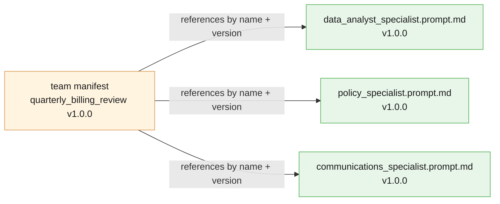

# Part V — Reusable Artifacts

Chapter 2's Part V asked what you save from a fixed pipeline. Chapter 3's asked the same
question for a retrieval corpus. Chapter 4's asked it for a tool-using loop — a `Tool`,
an `AgentLoop`, a transcript, a declaration worth reviewing like a prompt. This part asks
it one more time, for a team of specialists, and the honest answer is the shortest one in
the series: almost nothing here is a new kind of object. A specialist is a `Tool` whose
body happens to be another whole agent. A Supervisor is Chapter 4's `AgentLoop`,
unmodified in shape. What's new is one layer of naming around ideas Chapter 4 already
built — because naming the layer is what makes it reviewable, versionable, and reusable
across objectives, the same reason `Stage`, `Corpus`, and `Tool` earned their keep in
Chapters 2 through 4.

---

## 5.1 Chapter 4's shapes, reused, plus one abstraction: `Specialist`

Before defining anything new, recall the two objects Chapter 4's Part V built, because
this chapter's Supervisor is built from them without modification:

```mermaid
flowchart LR
    Tool["**Tool** &#40;Ch4 §5.1, unchanged&#41;<br/>declaration: dict[str, Any]<br/>fn: Any<br/>requires_human_review: bool<br/>.name -&gt; declaration['name']"]
    Loop["**AgentLoop** &#40;Ch4 §5.2, one new field&#41;<br/>tools: list[Tool]<br/>max_turns: int<br/>system_instruction: str | None<br/>.run&#40;objective&#41; -&gt; LoopResult"]
    Tool <-->|"1..N, dispatched<br/>by fc_step.name"| Loop

    classDef modelCall fill:#e0f0ff,stroke:#4a90d9,color:#1a1a1a
    class Tool,Loop modelCall
```



The only delta from Chapter 4's own `Tool`/`AgentLoop`: `AgentLoop` gains an optional
`system_instruction`, because a Supervisor (and a specialist that runs its own internal
loop, below) needs a persona the way every specialist's single-shot call already has one
— Chapter 4's own loop never needed this, since it ran one undifferentiated worker
identity throughout.

```python
from dataclasses import dataclass
from typing import Any
import json
import time
import uuid


@dataclass(frozen=True)
class Tool:
    """One capability an AgentLoop MAY invoke — never automatically (Ch4 §1.5, §5.1).
    Identical shape to Chapter 4's Tool; nothing about this chapter changes it."""
    declaration: dict[str, Any]
    fn: Any
    requires_human_review: bool = False

    @property
    def name(self) -> str:
        return self.declaration["name"]


@dataclass
class TranscriptEntry:
    run_id: str
    turn: int
    step_type: str  # "function_call" | "function_result" | "final_answer" | "cap_reached"
    name: str | None
    payload: Any
    elapsed_ms: float


@dataclass
class LoopResult:
    run_id: str
    transcript: list[TranscriptEntry]
    final_answer: str | None
    hit_cap: bool


DEFAULT_MAX_TURNS = 6


class AgentLoop:
    """Chapter 4's tool-calling loop (§5.2), reused without a new orchestration
    concept: create an interaction with tools -> check for a function_call step ->
    execute it locally -> submit a function_result with previous_interaction_id ->
    repeat, until a turn has no function_call step or max_turns is reached.

    The only addition over Ch4's version is `system_instruction`, because this
    chapter uses AgentLoop for two roles Ch4 didn't need to distinguish: a
    specialist that runs its own internal loop (§5.1, support_specialist below),
    and the Supervisor itself (§5.2), both of which need a stated persona."""

    def __init__(
        self,
        tools: list[Tool],
        max_turns: int = DEFAULT_MAX_TURNS,
        system_instruction: str | None = None,
    ):
        self.tools_by_name = {tool.name: tool for tool in tools}
        self.declarations = [tool.declaration for tool in tools]
        self.max_turns = max_turns
        self.system_instruction = system_instruction

    def run(self, objective: str) -> LoopResult:
        run_id = str(uuid.uuid4())
        transcript: list[TranscriptEntry] = []

        interaction = client.interactions.create(
            model=MODEL,
            input=objective,
            system_instruction=self.system_instruction,
            tools=self.declarations,
            store=True,
        )

        for turn in range(1, self.max_turns + 1):
            fc_step = next((s for s in interaction.steps if s.type == "function_call"), None)
            if fc_step is None:
                transcript.append(TranscriptEntry(
                    run_id=run_id, turn=turn, step_type="final_answer",
                    name=None, payload=interaction.output_text, elapsed_ms=0.0,
                ))
                return LoopResult(run_id, transcript, interaction.output_text, hit_cap=False)

            transcript.append(TranscriptEntry(
                run_id=run_id, turn=turn, step_type="function_call",
                name=fc_step.name, payload=fc_step.arguments, elapsed_ms=0.0,
            ))

            tool = self.tools_by_name[fc_step.name]
            started = time.perf_counter()
            result = tool.fn(**fc_step.arguments)
            elapsed_ms = (time.perf_counter() - started) * 1000

            transcript.append(TranscriptEntry(
                run_id=run_id, turn=turn, step_type="function_result",
                name=fc_step.name, payload=result, elapsed_ms=elapsed_ms,
            ))

            interaction = client.interactions.create(
                model=MODEL,
                input=[{
                    "type": "function_result",
                    "name": fc_step.name,
                    "call_id": fc_step.id,
                    "result": [{"type": "text", "text": json.dumps(result)}],
                }],
                tools=self.declarations,
                previous_interaction_id=interaction.id,
                store=True,
            )

        transcript.append(TranscriptEntry(
            run_id=run_id, turn=self.max_turns, step_type="cap_reached",
            name=None, payload="MAX_TURNS reached without a final answer", elapsed_ms=0.0,
        ))
        return LoopResult(run_id, transcript, final_answer=None, hit_cap=True)
```

Now the one genuinely new abstraction. A `Specialist` is a name, a persona
(`system_instruction`), and — this is the detail worth stating plainly, because
Example A depends on it — an *optional* list of its own `Tool`s. When that list is
present, a specialist is not one call; it is itself a full Chapter-4-style loop, wrapped
so the outside world only ever sees `.run(input_text) -> str`.

```python
@dataclass(frozen=True)
class Specialist:
    """One narrowly-scoped agent identity: a name, its own system_instruction
    (persona), and — optionally — its own list of Tools if it needs to run a full
    Chapter-4-style loop internally rather than answer in one shot. Either way,
    `.run` is the only thing a Supervisor (§5.2) ever calls; it never sees whether
    a specialist answered in one call or ran an internal loop to get there."""
    name: str
    system_instruction: str
    tools: list[Tool] | None = None
    max_turns: int = DEFAULT_MAX_TURNS

    def run(self, input_text: str) -> str:
        if self.tools:
            loop = AgentLoop(
                tools=self.tools,
                max_turns=self.max_turns,
                system_instruction=self.system_instruction,
            )
            result = loop.run(input_text)
            return result.final_answer or "(specialist's internal loop hit MAX_TURNS)"

        interaction = client.interactions.create(
            model=MODEL,
            input=input_text,
            system_instruction=self.system_instruction,
            store=False,
        )
        return interaction.output_text
```

Every specialist call defaults to `store=False` — a stateless, single-shot interaction,
matching Chapters 1-3's original convention. Only when `tools` is set does a specialist
delegate to an `AgentLoop`, which (per Chapter 4) uses `store=True` internally for its own
multi-turn bookkeeping; that internal statefulness is private to the specialist and never
leaks to the Supervisor, which only ever sees the returned string.

### The three single-shot specialists for Example B

```python
data_analyst_specialist = Specialist(
    name="data_analyst_specialist",
    system_instruction=(
        "You are a strict, literal data analyst. Given rows of billing data, report "
        "ONLY what the numbers show: counts, rates, and the trend across dates. Never "
        "speculate about cause, never soften language, never recommend an action. If "
        "asked for anything beyond what the data shows, say plainly that it is outside "
        "your scope."
    ),
)

policy_specialist = Specialist(
    name="policy_specialist",
    system_instruction=(
        "You are a grounded policy researcher, following Blueprint 3's verification "
        "discipline: answer ONLY from the policy text you are given, quote the exact "
        "clause you are relying on, and say so plainly if the policy does not cover "
        "the situation described. Never state a policy detail you cannot point to in "
        "the source text."
    ),
)

communications_specialist = Specialist(
    name="communications_specialist",
    system_instruction=(
        "You are a warm, empathetic customer-communications writer — the deliberate "
        "opposite persona from the data analyst. Given facts and a policy citation "
        "supplied to you by someone else, draft a customer-facing explanation. Never "
        "send anything; you only ever produce a draft. Never invent a fact or policy "
        "detail that was not given to you in your input."
    ),
)
```

### Example A's specialist — a full Chapter-4 loop, wrapped

`support_specialist` is Chapter 4's entire Support Ticket Autopilot — look up policy,
decide escalate-or-draft, act — collapsed into one callable unit. This is the concrete
case the `Specialist.tools` field exists for.

```python
def lookup_refund_policy(query: str) -> dict[str, Any]:
    """A deliberately simplified keyword lookup over doc_refund_policy — the same
    simplification Chapter 4 used, standing in for Chapter 3's real retrieval."""
    hits = [
        line for line in doc_refund_policy.splitlines()
        if line.strip() and any(word.lower() in line.lower() for word in query.split())
    ]
    return {"query": query, "matches": hits[:5] or ["no matching policy lines found"]}


def escalate_to_human(reason: str) -> dict[str, Any]:
    """SIMULATED — never files a real ticket."""
    print(f"[SIMULATED ESCALATION] reason={reason!r}")
    return {"status": "simulated_escalation_filed", "reason": reason}


def draft_customer_reply(explanation: str) -> dict[str, Any]:
    """SIMULATED — produces a draft awaiting a separate human send. Never sends."""
    print(f"[SIMULATED DRAFT REPLY, NOT SENT]\n{explanation}")
    return {"status": "draft_only", "text": explanation}


LOOKUP_REFUND_POLICY_DECL = {
    "type": "function",
    "name": "lookup_refund_policy",
    "description": "Search the refund and duplicate-charge policy for text relevant to a query.",
    "parameters": {
        "type": "object",
        "properties": {"query": {"type": "string"}},
        "required": ["query"],
    },
}

ESCALATE_TO_HUMAN_DECL = {
    "type": "function",
    "name": "escalate_to_human",
    "description": (
        "Escalate this ticket to a human reviewer with a stated reason. SIMULATED — "
        "never files a real ticket."
    ),
    "parameters": {
        "type": "object",
        "properties": {"reason": {"type": "string"}},
        "required": ["reason"],
    },
}

DRAFT_CUSTOMER_REPLY_DECL = {
    "type": "function",
    "name": "draft_customer_reply",
    "description": "Draft a customer-facing reply. SIMULATED — never sends anything.",
    "parameters": {
        "type": "object",
        "properties": {"explanation": {"type": "string"}},
        "required": ["explanation"],
    },
}

lookup_refund_policy_tool = Tool(LOOKUP_REFUND_POLICY_DECL, lookup_refund_policy)
escalate_to_human_tool = Tool(ESCALATE_TO_HUMAN_DECL, escalate_to_human, requires_human_review=True)
draft_customer_reply_tool = Tool(DRAFT_CUSTOMER_REPLY_DECL, draft_customer_reply, requires_human_review=True)

support_specialist = Specialist(
    name="support_specialist",
    system_instruction=(
        "You are the Support Ticket Autopilot from Blueprint 4: look up whatever "
        "policy you need, decide whether this should be escalated to a human or "
        "handled with a drafted reply, and produce that outcome. Never invent a "
        "policy detail you did not look up."
    ),
    tools=[lookup_refund_policy_tool, escalate_to_human_tool, draft_customer_reply_tool],
    max_turns=8,
)
```

`support_specialist.run(...)` triggers a full internal loop — several
`client.interactions.create` calls, not one — every time a Supervisor dispatches to it.
Nothing about `Specialist` hides that cost; §6.2 makes it explicit.

---

## 5.2 The Supervisor is Chapter 4's `AgentLoop` — no new class

This is the section to read slowly, because it is this chapter's whole idea stated as
code rather than as prose: **a Supervisor is not a new kind of object.** It is an
`AgentLoop` instance, exactly as defined above, where each registered `Tool.fn` happens
to be a `Specialist.run` call instead of plain code or a data lookup. Nothing about
`AgentLoop.run` changes to make this work — it already treats `tool.fn` as `Any`
callable, and a bound method is just another callable.

```mermaid
flowchart TD
    subgraph CH2["Ch2 — a tool body is..."]
        direction LR
        C2["plain code, or<br/>one model call"]
    end
    subgraph CH3["Ch3 — a tool body is..."]
        direction LR
        C3["a retrieval call"]
    end
    subgraph CH4["Ch4 — a tool body is..."]
        direction LR
        C4["a real external action,<br/>simulated"]
    end
    subgraph CH5["Ch5 — a tool body is..."]
        direction LR
        C5["another whole agent<br/>&#40;Specialist.run&#41;"]
    end
    CH2 --> CH3 --> CH4 --> CH5

    classDef modelCall fill:#e0f0ff,stroke:#4a90d9,color:#1a1a1a
    classDef noModelCall fill:#fff4e0,stroke:#d9954a,color:#1a1a1a
    class C2,C3 noModelCall
    class C4,C5 modelCall
```



Four chapters, four extensions of what a "tool" is allowed to contain — the
orchestration mechanic (`Tool` + `AgentLoop`, propose-then-execute, `MAX_TURNS`) has not
changed once since Chapter 4 introduced it. This chapter adds a fourth *tool body*, not a
fifth orchestration concept.

### Wrapping each specialist as a dispatch tool

```python
def call_support_specialist(input_text: str) -> dict[str, Any]:
    return {"specialist": "support_specialist", "output": support_specialist.run(input_text)}


CALL_SUPPORT_SPECIALIST_DECL = {
    "type": "function",
    "name": "call_support_specialist",
    "description": (
        "Dispatch a customer situation to support_specialist, Blueprint 4's whole "
        "Support Ticket Autopilot wrapped as one callable unit. Use this instead of "
        "handling a support ticket yourself."
    ),
    "parameters": {
        "type": "object",
        "properties": {"input_text": {"type": "string"}},
        "required": ["input_text"],
    },
}

call_support_specialist_tool = Tool(CALL_SUPPORT_SPECIALIST_DECL, call_support_specialist)


def call_data_analyst_specialist(input_text: str) -> dict[str, Any]:
    return {"specialist": "data_analyst_specialist", "output": data_analyst_specialist.run(input_text)}


def call_policy_specialist(input_text: str) -> dict[str, Any]:
    return {"specialist": "policy_specialist", "output": policy_specialist.run(input_text)}


def call_communications_specialist(input_text: str) -> dict[str, Any]:
    return {"specialist": "communications_specialist", "output": communications_specialist.run(input_text)}


CALL_DATA_ANALYST_DECL = {
    "type": "function",
    "name": "call_data_analyst_specialist",
    "description": (
        "Dispatch raw billing data to data_analyst_specialist for a strict, "
        "numbers-only read. Never compute or summarize the numbers yourself."
    ),
    "parameters": {
        "type": "object",
        "properties": {"input_text": {"type": "string"}},
        "required": ["input_text"],
    },
}

CALL_POLICY_SPECIALIST_DECL = {
    "type": "function",
    "name": "call_policy_specialist",
    "description": (
        "Dispatch a policy question to policy_specialist for a grounded, cited "
        "answer. Never recite policy from your own memory."
    ),
    "parameters": {
        "type": "object",
        "properties": {"input_text": {"type": "string"}},
        "required": ["input_text"],
    },
}

CALL_COMMUNICATIONS_SPECIALIST_DECL = {
    "type": "function",
    "name": "call_communications_specialist",
    "description": (
        "Dispatch confirmed facts and a policy citation to communications_specialist "
        "to draft (never send) a customer-facing explanation. Never draft this "
        "yourself."
    ),
    "parameters": {
        "type": "object",
        "properties": {"input_text": {"type": "string"}},
        "required": ["input_text"],
    },
}

call_data_analyst_specialist_tool = Tool(CALL_DATA_ANALYST_DECL, call_data_analyst_specialist)
call_policy_specialist_tool = Tool(CALL_POLICY_SPECIALIST_DECL, call_policy_specialist)
call_communications_specialist_tool = Tool(CALL_COMMUNICATIONS_SPECIALIST_DECL, call_communications_specialist)
```

### Example A — the Ops Boardroom, run end to end

```python
ops_boardroom_supervisor = AgentLoop(
    tools=[call_support_specialist_tool],
    system_instruction=(
        "You are the Supervisor of the Ops Boardroom. You never handle a customer "
        "situation yourself — you only decide whether to dispatch to "
        "call_support_specialist, then summarize what it returns."
    ),
)

OPS_BOARDROOM_OBJECTIVE = (
    f"A customer situation needs handling: {ticket_text}\n\n"
    "Get it resolved and summarize the outcome for me."
)

ops_boardroom_result = ops_boardroom_supervisor.run(OPS_BOARDROOM_OBJECTIVE)
print(ops_boardroom_result.hit_cap, "|", ops_boardroom_result.final_answer)
```

### Example B — the Quarterly Billing Review, run end to end

```python
quarterly_billing_review_supervisor = AgentLoop(
    tools=[
        call_data_analyst_specialist_tool,
        call_policy_specialist_tool,
        call_communications_specialist_tool,
    ],
    system_instruction=(
        "You are the Supervisor of the Quarterly Billing Review. You NEVER compute a "
        "statistic, recite policy from memory, or draft customer language yourself — "
        "your only job is deciding which specialists to call, in what order, and "
        "assembling their outputs into one final report that is traceable back to "
        "what each specialist actually said."
    ),
    max_turns=8,
)

QUARTERLY_BILLING_OBJECTIVE = (
    "We had a spike in duplicate charges this quarter. Here is the raw data: "
    f"{BILLING_ANOMALY_ROWS}. Get the facts from data_analyst_specialist, check what "
    "policy says via policy_specialist, and then have communications_specialist draft "
    "a customer-facing explanation (never sent) once you have both."
)

quarterly_billing_result = quarterly_billing_review_supervisor.run(QUARTERLY_BILLING_OBJECTIVE)
print(quarterly_billing_result.hit_cap, "|", quarterly_billing_result.final_answer)
```

### The named anti-pattern: a Supervisor that does the work itself

A Supervisor whose system_instruction is silent on this point can drift into answering
directly from `interaction.output_text` on turn one, without a single `function_call`
step — computing "roughly 5% of October 3rd's charges duplicated" from its own read of
`BILLING_ANOMALY_ROWS`, without ever citing a row, and drafting customer language in the
same breath. That output can look identical in shape to the real thing while being
untraceable to any specialist. It is worth checking for directly:

```python
def supervisor_did_its_own_work(result: LoopResult) -> bool:
    """True if the Supervisor produced a final_answer without ever calling a
    specialist — the named anti-pattern this section warns about. A healthy
    Example B run always has at least one function_call entry before its
    final_answer."""
    called_any = any(entry.step_type == "function_call" for entry in result.transcript)
    return not called_any and result.final_answer is not None


print(supervisor_did_its_own_work(quarterly_billing_result))
```

A Supervisor that fails this check did not save you a specialist call — it quietly
became a single, badly-scoped model with three conflicting personas' worth of
responsibility again, which is exactly the failure mode this whole chapter exists to
avoid.

---

## 5.3 A team manifest

Chapter 4 §5.4 treated a tool's declaration as a reviewable artifact. A team needs one
level above that: which specialists exist, which prompt version each one is pinned to,
and — the part unique to this chapter — which specialists a Supervisor is even allowed
to call for a given objective type. An objective-type restriction matters because nothing
in `AgentLoop` itself stops a Supervisor built for one team from being handed a `tools`
list that includes a specialist it was never designed to reason about.

```python
quarterly_billing_review_manifest = {
    "team": "quarterly_billing_review",
    "version": "1.0.0",
    "supervisor_max_turns": 8,
    "specialists": [
        {"name": "data_analyst_specialist", "prompt_version": "1.0.0"},
        {"name": "policy_specialist", "prompt_version": "1.0.0"},
        {"name": "communications_specialist", "prompt_version": "1.0.0"},
    ],
    "allowed_for": {
        "quarterly_billing_review": [
            "data_analyst_specialist",
            "policy_specialist",
            "communications_specialist",
        ],
        "single_ticket_escalation": ["support_specialist"],
    },
}

print(quarterly_billing_review_manifest["allowed_for"]["quarterly_billing_review"])
```

`allowed_for` is the part with no direct Chapter 4 analogue: a tool loop had one fixed
allowlist per loop instance (Ch4 §6.1's `support_ticket_allowlist`). A team manifest
instead maps *objective types* to allowed specialists, because the same Supervisor
identity might legitimately serve more than one kind of objective — but never with a
wider specialist roster than the objective type calls for.

---

## 5.4 Specialist prompts as files

Chapters 1-4 externalized every prompt into a versioned file with the same frontmatter
convention, because a prompt is where behavior actually lives. A specialist's
`system_instruction` is a prompt in every sense that matters, so it gets the same
treatment — one file per specialist, referenced by the team manifest by name and
version, exactly as Chapter 2's pipeline manifest referenced each stage's own prompt
file.

```markdown
---
name: data_analyst_specialist
version: 1.0.0
persona: strict, literal, numbers-only
owner: billing-eng
updated: 2026-09-01
---
You are a strict, literal data analyst. Given rows of billing data, report ONLY what
the numbers show: counts, rates, and the trend across dates. Never speculate about
cause, never soften language, never recommend an action. If asked for anything beyond
what the data shows, say plainly that it is outside your scope.
```

```markdown
---
name: communications_specialist
version: 1.0.0
persona: warm, empathetic, customer-facing
owner: billing-eng
updated: 2026-09-01
---
You are a warm, empathetic customer-communications writer — the deliberate opposite
persona from the data analyst. Given facts and a policy citation supplied to you by
someone else, draft a customer-facing explanation. Never send anything; you only ever
produce a draft. Never invent a fact or policy detail that was not given to you in
your input.
```

In production this loads the same way Chapter 1's `promptkit.load()` loads any other
prompt file, and the manifest's `prompt_version` field is what a code review actually
checks against — a specialist's persona changing without its `prompt_version` bumping is
the exact drift Chapter 2 §6.1 refused to allow for a stage:

```python
import promptkit

data_analyst_prompt_doc = promptkit.load("blueprint5/data_analyst_specialist.prompt.md")
print(data_analyst_prompt_doc.version, "|", data_analyst_prompt_doc.meta.get("persona"))
```



`ESCALATE_TO_HUMAN_DECL` and its sibling dicts above are inlined as plain Python purely
so this chapter's examples run standalone — the loader call is the shape a real project
takes, exactly as Chapter 2 §5.4 and Chapter 4 §5.4 both noted for their own externalized
files.

---

## 5.5 Reference layout

```
connected-boardroom/
│
├── prompts/                                # ── §5.4: one file per specialist persona ──
│   ├── data_analyst_specialist.prompt.md
│   ├── policy_specialist.prompt.md
│   ├── communications_specialist.prompt.md
│   └── support_specialist.prompt.md        # wraps all of Blueprint 4's own prompts/tools
│
├── tools/                                  # ── Ch4 §5.4 shape, unchanged ──
│   ├── lookup_refund_policy.tool.md
│   ├── escalate_to_human.tool.md           # requires_human_review: true
│   └── draft_customer_reply.tool.md        # requires_human_review: true
│
├── teams/                                  # ── §5.3: team manifests ──
│   ├── quarterly_billing_review.yaml       # 3 specialists, allowed_for map
│   └── ops_boardroom.yaml                  # 1 specialist (support_specialist)
│
├── src/
│   ├── tool.py                             # Tool, TranscriptEntry, LoopResult (§5.1)
│   ├── agent_loop.py                       # AgentLoop (§5.1)
│   ├── specialist.py                       # Specialist (§5.1)
│   ├── ops_boardroom.py                    # Example A: supervisor + support_specialist
│   └── quarterly_billing_review.py         # Example B: supervisor + 3 specialists
│
├── evals/                                  # ── §6.3 ──
│   ├── golden/
│   │   └── quarterly_billing_review.jsonl  # (objective, expected_specialists, ...)
│   └── run_team_evals.py
│
└── logs/                                   # gitignored; one JSON line per TranscriptEntry (§6.4)
```

Two ideas that did not exist in Chapter 4's own layout: a `teams/` directory (which
specialists a named Supervisor may call, per objective type — §5.3) and a `prompts/`
directory that now holds full personas, not just task instructions, because a
specialist's persona *is* its entire behavioral contract in a way a single stage's prompt
in Chapter 2 never had to be.

---

## 5.6 What this chapter's artifacts are NOT

Two honest boundaries, matching the callouts every prior chapter made about its own core
objects:

- **A `Specialist` is not a fundamentally new abstraction.** It is a `Tool` whose body
  happens to be a model call — or, when it carries its own `tools`, a nested
  `AgentLoop`. Nothing about `Specialist.run`'s contract (`str -> str`) differs from any
  other `Tool.fn` Chapter 4 already accepted. The name exists for readability, not
  because the underlying mechanic changed.
- **Splitting into specialists is not a substitute for a well-scoped prompt within each
  one.** Giving `data_analyst_specialist` a vague, broad `system_instruction` —
  "help with billing questions," say — reintroduces the exact persona-conflict problem
  this chapter exists to solve, just one level down, inside a single specialist that now
  quietly does the data analyst's job, the policy researcher's job, and half the
  communications job at once. A boardroom of loosely-scoped specialists is no better than
  one loosely-scoped model with a longer prompt; it's usually worse, because now there
  are more places for that vagueness to hide.

---

## Five things worth actually remembering

1. **`Tool` and `AgentLoop` are unchanged from Chapter 4.** The only addition is an
   optional `system_instruction` on `AgentLoop`, needed because this chapter uses it for
   two personas (specialist-internal loops and the Supervisor) Chapter 4 never had to
   distinguish.
2. **A `Specialist` is a name, a persona, and an optional internal tool list.** When
   `tools` is set, `.run` delegates to a full `AgentLoop` — Example A's
   `support_specialist` is the concrete case.
3. **A Supervisor is an `AgentLoop` instance, not a new class.** Its "tools" are
   `Specialist.run` calls wrapped as plain functions — the fourth kind of tool body this
   series has built (Ch2: code/model call; Ch3: retrieval; Ch4: simulated action; Ch5:
   nested agent).
4. **A team manifest maps objective types to allowed specialists**, and references each
   specialist's own prompt file by name and version — the same discipline Chapter 2's
   pipeline manifest applied to stage prompts, one layer up.
5. **A `Specialist` is not a safety net for a lazy prompt.** Splitting personas into
   separate agents only helps if each one still gets a narrow, well-scoped
   `system_instruction` of its own.

---

**Next:** [Part VI — Production Discipline](./06-production.md)
