# Part VI — Production Discipline

Part V was what you save from a specialist team. This part is what you do with it once a
Supervisor is dispatching against real objectives — versioning a team's roster the way
Chapter 2 versioned a stage sequence, reasoning honestly about a cost that now stacks
three ways instead of two, building the eval this chapter's own failure mode requires,
and logging enough that a bad final report can be traced back to the exact specialist
call, or absence of one, that caused it.

---

## 6.1 Teams as code

Chapter 2 §6.1 established the rule for a pipeline: a stage's prompt version is part of
the pipeline's own identity. Chapter 4 §6.1 extended it: a loop's identity is its tool
allowlist AND every tool's declaration, together. This chapter's version needs the same
kind of pairing, one layer up: a team's entire behavior is defined by **the Supervisor's
allowed specialist roster** (§5.3's `allowed_for` map) **and each specialist's own prompt
version**, together. Change either one and you change what the team can do, even if
nothing else moves:

- Add `escalate_to_human` capability to `communications_specialist` by widening its
  prompt, and the team can now do something no manifest reviewer signed off on — the
  Supervisor's own `allowed_for` list never changed, but the team's real behavior did.
- Bump `data_analyst_specialist`'s prompt to "also suggest likely root causes" and the
  Supervisor may start treating speculation as fact in its final synthesis, without a
  single line of `quarterly_billing_review_supervisor`'s own code changing.

Both are behavior changes to the team, not to any one piece of code. That is why the
manifest's own `version` has to bump whenever either moving part changes — exactly the
discipline Chapter 2 §6.1 and Chapter 4 §6.1 each enforced one layer down.

```python
def bump_team_version(manifest: dict[str, Any], changed_specialist: str, new_prompt_version: str) -> dict[str, Any]:
    """A specialist's prompt version is part of the TEAM's own identity — changing it
    always bumps the manifest's version too, exactly as Ch2 §6.1 bumped a pipeline's
    manifest whenever one stage's prompt changed, and Ch4 §6.1 bumped a loop's
    allowlist whenever one tool's declaration changed."""
    for entry in manifest["specialists"]:
        if entry["name"] == changed_specialist:
            entry["prompt_version"] = new_prompt_version
    major, minor, patch = (int(part) for part in manifest["version"].split("."))
    manifest["version"] = f"{major}.{minor + 1}.0"
    return manifest


quarterly_billing_review_manifest = bump_team_version(
    quarterly_billing_review_manifest, "data_analyst_specialist", "1.1.0"
)
print(quarterly_billing_review_manifest["version"])
```

### Code review for a team change

- [ ] Does adding, removing, or rewording a specialist's `system_instruction` change what
      the TEAM can now do — not just how well one specialist performs the job it already
      had?
- [ ] Does `allowed_for` still list only the specialists a given objective type actually
      needs, per §5.3 — has scope crept in through a prompt change instead of a roster
      change?
- [ ] Did the team eval (§6.3) rerun against the new manifest, not just whichever
      specialist's own single-shot behavior changed?

---

## 6.2 The cost of a team, stacked three ways

Chapter 2 gave the cost of a fixed pipeline: the sum of N known stages, computed once,
true on every run. Chapter 4 gave the cost of a tool loop: bounded only by `MAX_TURNS`,
with no known sum to compute in advance. This chapter's cost model stacks a third way,
and it is the sharpest lesson in the whole series: **a team's cost is the Supervisor's
own turns, PLUS every specialist call it makes — and a specialist that is itself a full
loop compounds further still.**

```mermaid
flowchart TD
    subgraph P["Ch2 — fixed pipeline"]
        direction LR
        P1["cost = sum of N<br/>KNOWN stages"]
    end
    subgraph L["Ch4 — tool loop"]
        direction LR
        L1["cost = turns taken,<br/>bounded only by MAX_TURNS"]
    end
    subgraph T["Ch5 — team &#40;this chapter&#41;"]
        direction LR
        T1["cost = Supervisor's own turns<br/>+ every specialist call"]
        T2["a specialist that is itself a<br/>loop &#40;support_specialist&#41;<br/>compounds further still"]
        T1 --> T2
    end
    P --> L --> T

    classDef modelCall fill:#e0f0ff,stroke:#4a90d9,color:#1a1a1a
    classDef errorPath fill:#ffe0e0,stroke:#d94a4a,color:#1a1a1a
    class P1,L1,T1 modelCall
    class T2 errorPath
```



### Working out Example B's actual minimum call count

Part I's opening framing rounded this to "at minimum, four model calls where one might
have done" — Supervisor-as-one-unit plus three specialists. That framing is a fair
intuition pump, but the Supervisor is not one call; per §5.1/§5.2, `AgentLoop.run` makes
one `client.interactions.create` call per turn, and the diagram on this chapter's own
index page shows the Supervisor making three *sequential* dispatch decisions (data
analyst, then policy, then — needing both — communications) before a fourth, final
synthesis turn with no further `function_call` step:

| Call | Who | Why |
|---|---|---|
| 1 | Supervisor | initial turn — decides to dispatch `call_data_analyst_specialist` |
| 2 | `data_analyst_specialist` | its own `store=False` interaction |
| 3 | Supervisor | receives result, decides to dispatch `call_policy_specialist` |
| 4 | `policy_specialist` | its own `store=False` interaction |
| 5 | Supervisor | receives result, decides to dispatch `call_communications_specialist` |
| 6 | `communications_specialist` | its own `store=False` interaction |
| 7 | Supervisor | receives result, produces final synthesis — no more `function_call` |

**Seven model calls, minimum, for one Example B run** — four from the Supervisor's own
loop, three from the specialists it dispatches to — even assuming every specialist
resolves in exactly one shot and the Supervisor never re-checks anything. That is the
honest number the article's own "avoid when" line is warning about: a single well-scoped
call could conceivably have answered a simpler version of this objective in one round
trip. If `data_analyst_specialist` or `policy_specialist` were themselves wrapped as a
full internal loop (the way `support_specialist` already is in Example A), each of those
"specialist" rows above would expand into several calls of its own — compounding a third
time, on top of the Supervisor's own multi-turn overhead.

```python
def minimum_team_call_count(num_sequential_specialists: int) -> int:
    """Supervisor turns for N sequentially-dispatched specialists: one initial turn,
    one turn per specialist result received (which also issues the next dispatch or
    the final synthesis) -- N+1 Supervisor-side calls -- plus one call per
    specialist, assuming each resolves in a single shot."""
    supervisor_calls = num_sequential_specialists + 1
    specialist_calls = num_sequential_specialists
    return supervisor_calls + specialist_calls


print(minimum_team_call_count(3))  # 7, for Example B
```

### Two tradeoffs that don't disappear, they move

- **Persona conflict doesn't vanish — it relocates.** Splitting `data_analyst_specialist`
  and `communications_specialist` apart removes the conflict from WITHIN one prompt, but
  the Supervisor now has a new job neither specialist nor a single model ever had:
  reconciling potentially inconsistent specialist outputs before it can synthesize a
  final report. Name this as a tradeoff, not a solved problem — §6.3 builds the eval for
  exactly this failure mode.
- **A specialist is still only as good as its own scope.** A vaguely-scoped
  `data_analyst_specialist` reintroduces the same conflict one level down, inside that
  one specialist (§5.6).
- **The "avoid when" line matters as much here as in every prior chapter.** For an
  objective one well-scoped single-shot call, or one Chapter-4-style loop, could handle,
  a team is pure communication overhead: more calls, more cost, more places for a
  hand-off to go wrong, for no benefit over a simpler pattern.

---

## 6.3 Evaluating a team

Chapter 4 §6.3 built a loop-trajectory eval: did the loop call the right tools, in a
reasonable order, to reach the right final action. A team needs a further eval on top of
that, because a Supervisor's trajectory alone doesn't catch this chapter's own failure
mode — a Supervisor can dispatch to exactly the right specialists and still produce a
final report that misrepresents what they said.

```mermaid
flowchart TD
    subgraph T1["Ch2 — per-stage / end-to-end"]
        direction LR
        S1["did stage N produce<br/>the right output"]
    end
    subgraph T2["Ch3 — retrieval precision"]
        direction LR
        R1["did the right chunk<br/>get retrieved"]
    end
    subgraph T3["Ch4 — loop trajectory"]
        direction LR
        L1["right final action AND<br/>required tools called first"]
    end
    subgraph T4["Ch5 — team eval &#40;this chapter&#41;"]
        direction LR
        Q1["right specialists called?"]
        Q2["right inputs, verbatim,<br/>per Part IV?"]
        Q3["faithful synthesis — reflects<br/>what specialists said,<br/>not invented, per §4.3?"]
    end
    T1 --> T2 --> T3 --> T4

    classDef modelCall fill:#e0f0ff,stroke:#4a90d9,color:#1a1a1a
    classDef terminal fill:#e8f5e9,stroke:#4caf50,color:#1a1a1a
    class S1,R1,L1 modelCall
    class Q1,Q2,Q3 terminal
```



Three questions, scored separately, because a team can pass any one of them while
failing another: the right specialists called in the wrong order with garbled inputs
still "called the right specialists"; a faithful summary of a specialist that was fed the
wrong input is faithful to the wrong thing.

```python
def specialists_called(result: LoopResult) -> set[str]:
    return {entry.name for entry in result.transcript if entry.step_type == "function_call"}


def specialist_inputs(result: LoopResult) -> dict[str, str]:
    """Maps each dispatch tool name to the input_text the Supervisor actually passed
    it -- the verbatim hand-off check Part IV named for a two-hop chain, applied here
    to every dispatch in one team run."""
    return {
        entry.name: entry.payload.get("input_text", "")
        for entry in result.transcript
        if entry.step_type == "function_call"
    }


def synthesis_is_faithful(result: LoopResult) -> bool:
    """A crude but honest check: every number data_analyst_specialist reported must
    also appear somewhere in the Supervisor's final synthesis -- catching the named
    anti-pattern (§5.2) of a Supervisor inventing a figure it never actually
    received. This is Part IV §4.3's audit discipline, applied to the FINAL answer
    rather than to a single tool call."""
    da_results = [
        entry.payload for entry in result.transcript
        if entry.step_type == "function_result" and entry.name == "call_data_analyst_specialist"
    ]
    if not da_results or result.final_answer is None:
        return False
    da_text = str(da_results[0].get("output", ""))
    reported_numbers = {tok for tok in da_text.replace(",", " ").split() if tok.isdigit()}
    if not reported_numbers:
        return True
    return any(number in result.final_answer for number in reported_numbers)


QUARTERLY_BILLING_GOLDEN = [
    {
        "id": "qbr-001",
        "objective": QUARTERLY_BILLING_OBJECTIVE,
        "expected_specialists": {
            "call_data_analyst_specialist",
            "call_policy_specialist",
            "call_communications_specialist",
        },
        "input_must_mention": {
            "call_data_analyst_specialist": "1842",
            "call_policy_specialist": "refund",
        },
    },
]


def run_quarterly_billing_eval(supervisor: AgentLoop) -> float:
    """A team eval: checks right specialists, right (verbatim) inputs, and faithful
    synthesis as THREE separate pass/fail checks, not one combined score -- a run
    that fails only one of the three still fails the case, and the printed line says
    which."""
    passed = 0
    for case in QUARTERLY_BILLING_GOLDEN:
        result = supervisor.run(case["objective"])
        called = specialists_called(result)
        inputs = specialist_inputs(result)

        right_specialists = case["expected_specialists"].issubset(called)
        right_inputs = all(
            expected_word in inputs.get(name, "")
            for name, expected_word in case["input_must_mention"].items()
        )
        faithful = synthesis_is_faithful(result)

        ok = right_specialists and right_inputs and faithful
        passed += ok
        if not ok:
            print(
                f"FAIL {case['id']}: right_specialists={right_specialists} "
                f"right_inputs={right_inputs} faithful={faithful}"
            )
    print(f"quarterly_billing_review team eval: {passed}/{len(QUARTERLY_BILLING_GOLDEN)}")
    return passed / len(QUARTERLY_BILLING_GOLDEN)


run_quarterly_billing_eval(quarterly_billing_review_supervisor)
```

A single golden case here is illustrative, not sufficient — a real golden set needs cases
that deliberately probe each failure mode separately: an objective where the Supervisor
is tempted to skip `policy_specialist` (fails `right_specialists`), one where it
paraphrases instead of passing the ticket text verbatim (fails `right_inputs`), and one
where it's tempted to add a number no specialist reported (fails `faithful`).

---

## 6.4 Observability for a team

Chapter 2 §6.4 logged one JSON line per stage; Chapter 4 §6.4 logged one line per
`TranscriptEntry`, correlated by `run_id`. A team needs the same correlation key, applied
to the same richer log — the Supervisor's own dispatch decisions, each specialist's
inputs and outputs, and the final synthesis, all tied to one `run_id` — because a bad
final report in this chapter has three genuinely different root causes, and only a full
transcript can tell them apart:

- **"Wrong specialist called"** — a missing `function_call` entry for a specialist the
  objective clearly needed (§6.3's `right_specialists` check).
- **"Right specialist, garbled hand-off"** — the `function_call` entry exists, but its
  `payload["input_text"]` doesn't match what the specialist actually needed to see
  (§6.3's `right_inputs` check).
- **"Supervisor synthesized something the specialists didn't actually say"** — every
  dispatch and hand-off is clean, but the final `output_text` still contains a claim no
  `function_result` supports (§6.3's `faithful` check).

```python
import logging

log = logging.getLogger("boardroom")


def log_team_run(result: LoopResult, team_name: str) -> None:
    for entry in result.transcript:
        record = {
            "team": team_name,
            "run_id": entry.run_id,
            "turn": entry.turn,
            "step_type": entry.step_type,
            "specialist": entry.name,
            "elapsed_ms": round(entry.elapsed_ms, 1),
        }
        log.info("team_turn", extra=record)
        print(json.dumps(record, default=str))  # illustrative here; production emits via `log` only


log_team_run(quarterly_billing_result, "quarterly_billing_review")
```

Redact ticket, billing, and customer text from `payload` before logging in a real
deployment, exactly as Chapter 1 §5.7 required and Chapter 4 §6.4 restated — the fields
above are the metadata worth keeping in a general-purpose log stream; the raw specialist
inputs and outputs belong in the run's own transcript artifact (§5.1's
`TranscriptEntry.payload`), access-controlled separately.

```mermaid
flowchart TD
    subgraph LOG["logs/boardroom.jsonl — unordered, append-only, many runs interleaved"]
        L1["run_id=7a2f... turn=1 function_call call_data_analyst_specialist"]
        L2["run_id=9b01... turn=1 function_call call_support_specialist"]
        L3["run_id=7a2f... turn=1 function_result call_data_analyst_specialist"]
        L4["run_id=7a2f... turn=2 function_call call_policy_specialist"]
        L5["run_id=7a2f... turn=2 function_result call_policy_specialist"]
        L6["run_id=7a2f... turn=3 function_call call_communications_specialist"]
        L7["run_id=7a2f... turn=3 function_result call_communications_specialist"]
        L8["run_id=7a2f... turn=4 final_answer"]
    end
    L1 & L2 & L3 & L4 & L5 & L6 & L7 & L8 --> F["filter run_id = 7a2f...<br/>sort by turn"]
    F --> D["data_analyst -> policy -> communications -> synthesis<br/>one full, ordered trace of a single team run,<br/>reconstructed from independent log.info&#40;&#41; calls<br/>across every Supervisor turn and every specialist call"]

    classDef terminal fill:#e8f5e9,stroke:#4caf50,color:#1a1a1a
    class D terminal
```



Same payoff Chapter 2 and Chapter 4 each found for `run_id`, one layer richer: nothing
about `log_team_run` needs to know whether a given `TranscriptEntry` came from the
Supervisor's own dispatch turn or from deep inside a specialist's internal loop —
`run_id` and `turn` together are still the only correlation keys a review, an incident,
or a failed team eval (§6.3) ever needs.

---

## Five things worth actually remembering

1. **A team's identity is the specialist roster AND every specialist's own prompt
   version, together.** Changing either one changes what the team can do — version them
   as one unit, the same discipline Chapters 2 and 4 each enforced one layer down.
2. **A team's cost is the Supervisor's own turns plus every specialist call — at least
   seven for Example B**, not the "four calls" Part I's opening intuition suggested; a
   specialist that is itself a loop compounds further still.
3. **Persona conflict doesn't disappear when you split personas apart — it relocates
   into the Supervisor's synthesis step.** Name this as a tradeoff a team accepts, not a
   problem a team solves.
4. **A team eval checks three things separately: right specialists, right (verbatim)
   inputs, faithful synthesis.** A run can pass any two of these and still fail the
   third — score them independently, not as one combined pass/fail.
5. **Log every `TranscriptEntry`, correlated by `run_id` and `turn`, across both the
   Supervisor and every specialist it calls.** Only the full trace can distinguish "wrong
   specialist called" from "garbled hand-off" from "Supervisor invented the final
   report" — three genuinely different failures a single final-answer log line cannot
   tell apart.

---

**Next:** [Part VII — Advanced](./07-advanced.md)
